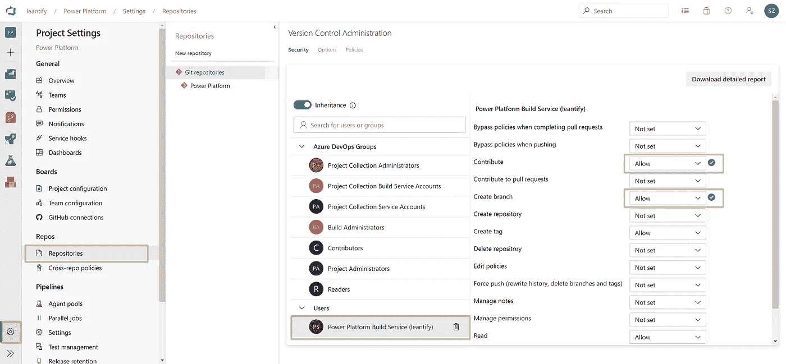
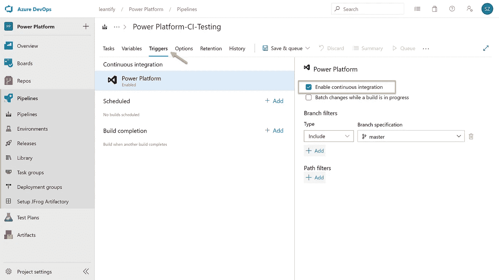

# 有什么变化？微软 Power 平台中无代码解决方案的持续交付方法

> 原文：<https://towardsdatascience.com/what-has-changed-ba0f5ccf2f73?source=collection_archive---------6----------------------->

## 微软 POWER 平台解决方案

## 关于使用微软的 Power 平台和 Azure DevOps 持续交付 AI 模型、Power 应用程序和流程的分步指南。


杰西·拉米雷斯在 [Unsplash](https://unsplash.com?utm_source=medium&utm_medium=referral) 上的照片

在我最近的[故事](/what-will-happen-predict-future-business-using-a-no-code-ai-model-and-microsofts-ai-builder-52996a13243c)中，我解释了如何使用微软 Power 平台创建一个无代码的人工智能预测模型，来预测虚拟自行车共享服务的未来租金。

无代码解决方案很棒，这些平台支持的场景也在不断增长。但我们都知道，权力越大，责任越大。

当你的无代码解决方案变得富有成效，并且许多人依赖它时，那么是时候引入更专业的规程了，比如源代码控制和持续交付。

这是一个转折点，因为您现在面临的问题是用 pro-code 重新开发您的解决方案并将其移交给 DevOps 团队，或者说服您的组织即使使用无代码解决方案也可以遵循这些最佳实践。

这是公民开发者会见 DevOps 实践者的地方。

这个故事解释了如何将一个无代码的**解决方案**自动签入到源代码控制中，并使用连续交付的方法来部署它。这一切都是在 Azure DevOps 的帮助下完成的。

在我们的案例中，这样的解决方案包含人工智能预测模型、底层实体、可视化数据的应用程序以及在新数据到达时调用预测模型的工作流。

所有这些组件都是使用 Microsoft Power 平台构建的。使用以下产品:

*   高级应用程序
*   电力自动化(又称流程)
*   人工智能生成器
*   公共数据服务

该分步指南解释了以下内容:

*   将解决方案导出并签入到 git 存储库中。
*   将解决方案部署到不同的环境中。

## 在 Power Platform 中组装解决方案

如果你遵循我以前的[文章](/what-will-happen-predict-future-business-using-a-no-code-ai-model-and-microsofts-ai-builder-52996a13243c)，你可以简单地重用人工智能模型和自行车共享实体来创建你的第一个解决方案。

要构建这样的解决方案，请转到[make.powerapps.com](http://make.powerapps.com)，选择**解决方案**，并点击**新建解决方案**。填写详细信息并点击**创建。**


在新创建的**解决方案中，**点击**添加现有的**，添加我在上一篇文章中创建的 AI 模型和实体。请随意向您的解决方案添加任何其他现有组件，如 Flows 或 Power 应用程序。


现在，我们有了一个解决方案，它包含了我们希望置于源代码控制之下的所有内容，并使其可部署到其他环境中。

## 创建签入管道

接下来，我们创建我们的签入管道，它的唯一目的是从它的源环境中导出先前创建的解决方案，并将其放入我们的 git 存储库。

在 [Azure DevOps](http://dev.azure.com) 中创建一个**新项目**。


将其命名为**动力平台**，点击**创建**。


作为第一步，我们必须在这个新项目中初始化 git 存储库。为此，我们转到 **Repos >文件**并点击下面的**初始化**按钮。这只是将一个漂亮的`README.md`提交到存储库中。请随意更新文件并解释这个项目是做什么的。


现在我们可以创建签入管道。为此，转到**管道**并点击**创建管道**。


点击下面的**使用经典编辑器**链接。


选择您的项目 **Azure Git Repo** 作为源，然后单击**继续。**


点击 **Empty job** 模板，我们就完成了空管道的创建。


## 添加高级应用程序构建步骤

在接下来的几个步骤中，我们将使用来自 Visual Studio Marketplace 的 Azure DevOps 扩展来与我们的 Power 平台进行通信和交互。

在空管道内，点击 **+** 图标，搜索**动力平台**。从市场结果中，选择 **PowerApps 构建工具**并点击**免费获取**。


您将被重定向到 Visual Studio 市场。点击**免费获取**并**为您的 Azure DevOps 组织安装**它。


仅此而已。现在我们可以通过这个扩展来处理一些新任务。

## 导出并签入解决方案

回到我们的空管道，点击 **+** 图标，搜索 **PowerApps 工具**安装程序**。**这必须是每个管道的第一步，因为它在运行时下载必要的资源。这一步不需要任何配置。


第二步，我们添加 **PowerApps 导出解决方案，**它从我们的源 Power 平台环境中导出解决方案。


这一步需要几个参数才能正常工作。首先，我们创建一个到 Power 平台环境的服务连接。

为此，点击 **PowerApps 环境 URL** 旁边的**管理**链接。


点击**创建服务连接**并选择**通用**作为连接类型。


输入您的 Power 平台环境的**服务器 URL** 。您可以在[管理门户](https://admin.powerplatform.microsoft.com/environments)的环境详细信息中找到它。

输入对该环境拥有完全访问权限的任何用户的邮件地址和密码。将连接命名为类似**电源平台开发**的名称。

点击**保存**完成。


> 注意:很快就会有一种更安全、更现代的方法来使用服务原则连接到您的环境。GitHub 已经有一期了，你可以订阅，以便在它发布时得到通知。

回到您的管道，从下拉列表中选择新创建的连接。

接下来，我们必须为这一步配置一些构建变量，这些变量将在运行时自动解析。

**解决方案名称**

```
$(PowerPlatform.SolutionName)
```

**解决方案输出文件**

```
$(Build.ArtifactStagingDirectory)\$(PowerPlatform.SolutionName).zip
```


现在我们再次使用 **+** 图标添加第三个构建步骤。搜索 **PowerApps 解包解决方案**并将其添加到管道中。

这一步将解包解决方案 zip 文件，以获得其原始的`.json`或`.xml`文件。这样，我们可以使用 git 跟踪所有的更改。


同样，我们必须配置一些构建变量。

**解决方案输入文件**

```
$(Build.ArtifactStagingDirectory)\$(PowerPlatform.SolutionName).zip
```

**解包解决方案的目标文件夹**

```
$(PowerPlatform.SolutionName)
```


作为最后的构建步骤，我们向管道添加一个简单的**命令行**任务。


我们使用这个步骤将下载并解压缩的解决方案存储在我们的 git 存储库中。更准确地说，我们签出我们的存储库的主分支，并将所有的变更提交给它。

```
echo Commit Power Platform Solution
git config user.email "[build.pipeline@xxx.com](mailto:build.pipeline@leantify.com)"
git config user.name "Build Pipeline"
git checkout master
git pull origin
git add --all
git commit -m "Automatic solution commit"
git -c http.extraheader="AUTHORIZATION: bearer $(System.AccessToken)" push origin master
```


现在我们已经配置了所有的构建步骤，我们对管道进行一些更改。

首先，我们**允许脚本访问 OAuth** **令牌**。我们在前面的**命令行脚本**中使用了这个令牌。


接下来，我们创建在构建步骤中使用的`PowerPlatform.SolutionName`变量。我们将这个变量设置为我们在 Power 平台中的解决方案的名称，例如`BikeSharing`。


现在点击**保存，**但是不要排队。


作为最后一步，我们必须允许管道对 git 存储库进行修改。

我们用左下方的**项目设置**来做这件事。点击**仓库**，从列表中找到您的**构建服务**用户。**允许**参与和**创建分支**。



## 首次运行管道

随着我们的解决方案到位，我们的管道准备就绪，我们现在可以第一次运行它了。这将下载解决方案并将其置于源代码控制之下。

转到**管道**并选择先前创建的管道。


点击**运行管道**按钮并检查设置。


成功运行后，我们可以在 git 存储库中看到解包的解决方案。


## 建立一个持续的输送管道

既然一切都在源代码控制之下，我们可以开始将解决方案推广到其他测试、试运行或生产环境。

为此，我们像前面一样创建第二个管道。给它起个名字，比如**Power Platform-CI-Testing**或者其他任何能反映你目的的名字。


再次，添加 **PowerApps 工具** **安装程序**作为第一步。第二步，添加 **PowerApps Pack 解决方案**，并配置其参数如下:

**要打包的解决方案的源文件夹**

```
$(PowerPlatform.SolutionName)
```

**解决方案输出文件**

```
$(Build.ArtifactStagingDirectory)\$(PowerPlatform.SolutionName).zip
```


这一步只是将解决方案打包成一个 zip 文件，这样就可以将它导入到目标环境中。

第三步，我们添加了 **PowerApps 导入解决方案。**为了使这一步有效并连接到您的目标环境，我们创建了另一个通用服务连接。


我们像以前一样配置它，但是指向另一个**服务器 URL** 。同样，这可以是任何其他 Power 平台环境，比如您的开发环境、您的团队环境或者您的生产/客户环境。


对于**解决方案输入文件**，我们放入以下内容:

```
$(Build.ArtifactStagingDirectory)\$(PowerPlatform.SolutionName).zip
```


现在我们已经准备好了管道，我们再做两个配置。我们添加`PowerPlatform.SolutionName`作为变量，并且我们**在**触发器**面板上启用持续集成**。

后者强制管道在每次有东西提交到存储库的主分支时运行。



保存您的管道，但不要将其排队。


要测试整个流程，请对您的 Power Platform 解决方案进行任何更改，并手动触发签入管道。当第一个管道完成时，第二个管道会自动启动。


在一切运行成功之后，转到您的目标环境并检查要创建的解决方案。任何后续运行都将更新目标环境中的解决方案。你不需要做任何事。


**恭喜恭喜！**这是无代码解决方案的持续交付。

万事如意！

👉，
塞巴斯蒂安

## 额外收获:使用 git 命令行跟踪。

现在我们已经将一切置于源代码控制之下，您可以使用 git 命令行来跟踪所有的更改。克隆存储库并使用类似于`git log -p`的命令来查看最近的更改。

