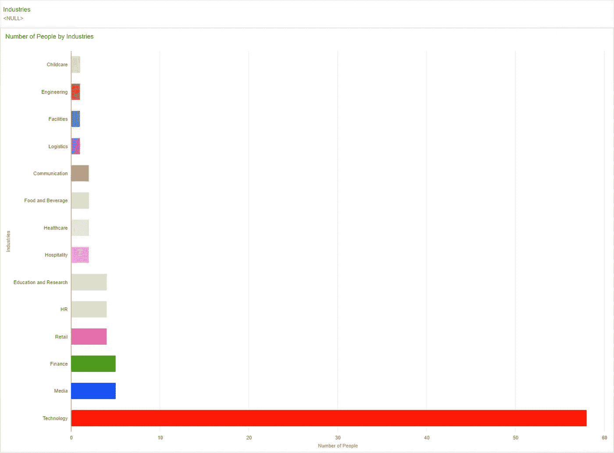
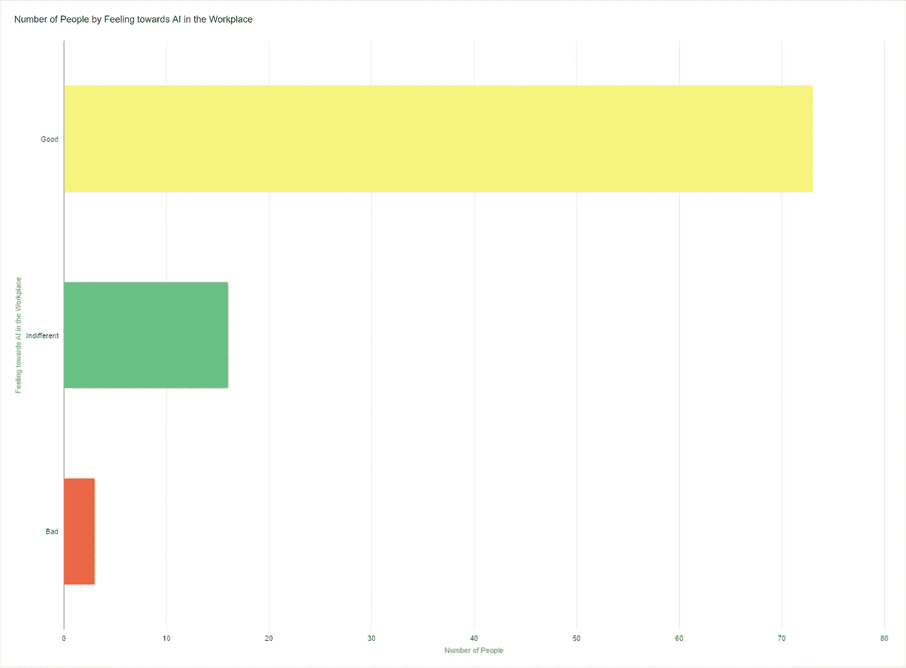

# 10 个月来我对人工智能的了解

> 原文：<https://towardsdatascience.com/what-i-have-learned-about-artificial-intelligence-in-10-months-dd47ede28273?source=collection_archive---------59----------------------->

**图像:使用 Canva** 创建

*总结我在过去十个月里所学到的关于人工智能的一切，包括为了支持我的发现而完成的初步研究。*

## 介绍

在过去的十个月里，我作为一名数字倡导者在实习期间有机会研究和推广新的和新兴的技术。我主要关注工作场所中的人工智能和自主过程，以及它们如何提高生产率。我观察了广泛的行业，以从更广阔的视角增加我的理解。我了解到人工智能将被用来增强人类，而不一定会取代人类。当我们将人类智能和计算智能结合起来时，我们得到了被称为“放大智能”的东西。我也开始了解到，人工智能可以在可持续发展方面为地球带来很多好处，它给了我对未来的很多希望。

我通过撰写关于许多不同行业(如法律、金融、医疗保健、时尚和音乐)的文章完成了许多次要研究，但我决定开展一个主要研究项目，以得出关于我的发现的明确结论。我进行了一项调查，旨在研究人们对进一步将人工智能应用到工作场所的想法和感受。这项调查是由来自不同行业、不同年龄的 92 名 T4 人进行的。这在我研究的时候真的很有帮助，因为我从许多不同的角度获得了意见。我决定使用[甲骨文的数据可视化桌面](https://www.oracle.com/ie/solutions/business-analytics/analytics-desktop/oracle-analytics-desktop.html)来可视化我的结果，让数据更容易理解。

## 主要研究:职场的未来是什么？

*   **每个行业的人数**

**每个行业的人数**

我想看的这项研究的第一个要素是每个行业的人数细分，因为这将极大地影响这项研究涵盖的行业范围的结果。我很幸运有 92 个人参与了调查，涵盖了 14 个不同的行业。最受欢迎的行业是技术，这是我在一家“技术”公司工作时所期望的。我还让来自媒体、金融、医疗保健、零售、教育、酒店、餐饮、通信、物流、设施、工程、儿童保育和人力资源等各行各业的人参与了我的调查。

*   **按性别细分的技术行业**

**按性别划分的技术行业**

按性别划分结果也很重要，因为它不仅能让我们了解有多少男性和女性参与了我的调查，还能让我们了解每个行业中有多少女性。开始时，结果一度是 50/50 的比例，但参与我的调查的男女比例是男性 **48.9%** 和女性 **51.1%** 。当我按性别对科技行业进行细分时，情况稍微有些不均衡，男性占该行业的 54.9% (紫色)，女性占 43.1%**(淡紫色)。众所周知，科技行业缺少女性，但这些数字相差 10%，这是我很高兴看到的。**

*   ****按年龄细分的科技行业:****

****

****技术行业和年龄范围****

**年龄是我感兴趣研究的另一个因素，因为技术行业通常被认为是由非常年轻的人主导的领域，但我想表明这个行业中有所有年龄的人。我还想探究老一代人对新技术犹豫不决的观点，因为这是一个我不同意的概括。最受欢迎的年龄范围是 25-34 岁，其次是 35-44 岁。根据经济合作与发展组织的数据，25-54 岁的人被认为处于“最佳职业生涯”，这是可以预测的。**

*   ****人们对艾的感情:****

****

****人们对更多 AI 进入职场的可能性的感受****

**令我惊讶的是，完成这项调查的人 100%知道什么是人工智能。我预计会有一些人不知道什么是人工智能，但我很高兴看到每个人似乎都知道它是什么。然而，在让更多的人工智能技术进入工作场所方面，似乎确实存在一些怀疑。大多数人对更多人工智能进入工作场所的可能性持积极态度，79.3%的人持积极态度。相当比例的人( **17.4%** )对人工智能进入职场的可能性感到无所谓，既不是好也不是坏，只有 **3.3%** 的人对此感到负面。**

*   ****AI 提升生活:****

****

**你相信人工智能能改善我们的生活吗？**

**当问人们是否相信人工智能会改善他们的生活时，也有类似的结果。我理解当问人们他们是否相信一台机器能让他们的生活变得更好时的怀疑态度。仔细想想，洗衣机和洗碗机被带进来的时候，他们大概也有同样的怀疑态度。不到三分之二( **63%** )的人相信人工智能可以改善他们的生活，超过三分之一( **33.7%** )的人选择了“也许”，这确实传达了一定程度的不确定性。然而，只有 3.3%的人选择了“不”，这是对人们及其对人工智能的信任的积极评价。**

*   ****人工智能取代乔布斯:****

****

****你担心你现在的工作被 AI 取代吗？****

**当问及人们是否担心他们目前的工作被人工智能取代时，普遍的共识是 **85.71%** 不。正如所料，有一定比例的人确实担心人工智能会取代他们的工作，准确地说是 **14.29%** 。诚然，人工智能将被用于提高工作场所的生产率，因此它很可能取代重复性工作或那些可以自动化的工作。未来人类需要的工作将是那些需要创造力、同情心和同理心的工作。**

****总结****

**我研究新技术和新兴技术的时间进一步激励我继续在技术领域工作。这也让我有机会认识到，如果你热爱技术，你可以进入无限多的行业。我的主要研究项目支持我在过去十个月里完成的次要研究，人工智能将被用来增强人，而不一定取代人。正如丹尼尔·贝尔所说:*“像艺术一样的技术是人类想象力的一次飞跃。”***

****所有观点和意见都是我个人的，与甲骨文无关。****