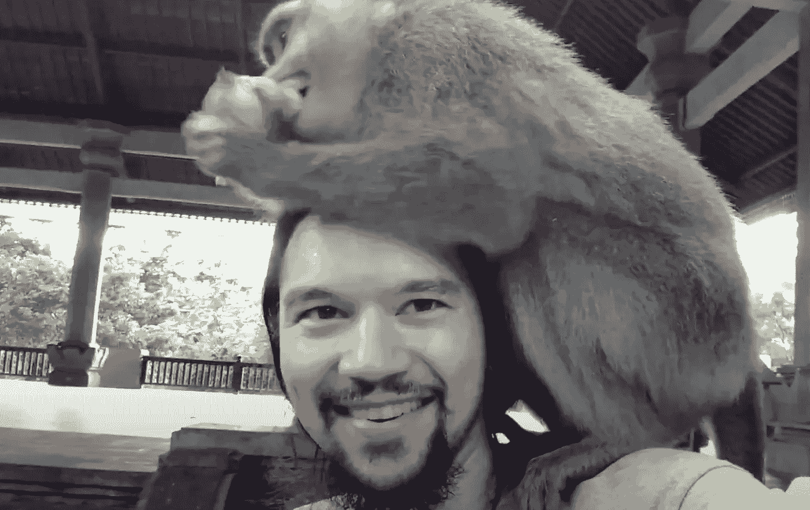
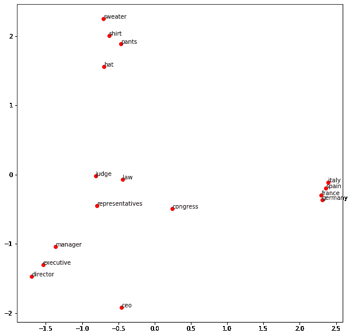
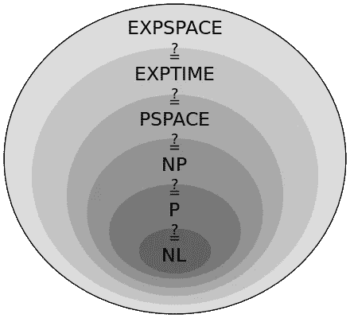
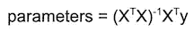

# 我从机器学习中学到的人类学习。

> 原文：<https://towardsdatascience.com/what-i-learned-about-human-learning-from-machine-learning-40ae4fcb747b?source=collection_archive---------49----------------------->

## 机器学习的原则使我成为更好的学习者。从成为房地产投资者到学习印尼语。

来自[皮克斯拜](https://pixabay.com/?utm_source=link-attribution&amp;utm_medium=referral&amp;utm_campaign=image&amp;utm_content=2175285)的[格尔德·奥特曼](https://pixabay.com/users/geralt-9301/?utm_source=link-attribution&amp;utm_medium=referral&amp;utm_campaign=image&amp;utm_content=2175285)的照片

*(书籍的外部链接都是附属链接，谢谢支持！)*

# 介绍

任何涉足多个领域的人都会注意到，一个领域的原则和元叙事是如何以惊人的频率传播到其他领域的。例如，塞特亚·纳德拉(微软首席执行官)经常在他关于扭转微软的 [autoethnography](https://amzn.to/2YM6ibC) 中比较从板球运动到商业战略的策略。在《有意识的商业》一书中，弗雷德·考夫曼交叉运用了许多布德主义原则到企业领导中。史蒂夫·柯维在《高效人士的七个习惯》中也做了类似的事情，并不时反思他的摩门教信仰。在《被随机性愚弄》一书中，纳西姆·塔勒布将他在金融市场观察到的随机性原则与生活的其他方面进行了对比，包括商业。

这篇论文属于这一类型。我大半辈子都是自学成才的。但在我开始在机器学习领域工作后，我开始理解人类学习和机器学习之间一些有趣但有用的相似之处。现在承认，尽管有关于机器学习(在流行媒体中以“人工智能”的绰号更为人所知)的所有宣传，机器并不像人类那样学习。最近成为头条新闻的大多数令人印象深刻的“人工智能”壮举，当人们拉开《绿野仙踪》风格的帷幕时，只不过是受控环境中的统计客厅把戏——与我们认为的“智能”相去甚远。不，机器不能像人类那样“思考”或“学习”。尽管是人工智能从业者，我仍然是人工智能怀疑论者。

尽管如此，我从机器学习中学到的一些原则帮助我进行了与该领域完全不同的探索，我想在这里分享其中的一部分。这篇文章面向广泛的读者，但也夹杂了一些技术性的阐述。鼓励非技术读者快速浏览这些部分；整个信息有望保持完整。

# 1.递归神经网络与房地产投资

2018 年初，我决定成为一名房地产投资者。作为一个完全的新手，我知道无知地支付大笔现金会导致不稳定的风险。为了成功，我需要明智地掏出大笔现金，而不是无知地掏出。

我的一个朋友问道:“你怎么知道，你知道的足够了？”就一个主题读一本书肯定是不够的——没有任何背景知识，我无法判断这本书是否有指导意义或过于简单。读两本书也是一样的道理。但是三个呢？需要读多少书？

这是一个合理的问题。没有任何好的方法让小时间的房地产投资者客观地自我衡量他们的能力。鉴于人类倾向于高估自己在某一学科的能力(例如，虚幻的优越感或高于平均水平的效果[2])，这些天生的心理陷阱加剧了这种危险。

这并不是我第一次对一个话题神经过敏，深入阅读，之后至少看起来掌握了一些。我不担心我获取知识的能力。我担心会欺骗自己，以为自己比实际情况更有知识，但仍会不知不觉地投资于危险的盲点。

令人欣慰的是，我能够提出一个跨领域的见解，这被证明是非常有用的，这也是我想在本节中分享的内容。

## 生成假莎士比亚

我对现代自然语言处理(NLP)的第一次尝试是一个玩具递归神经网络，它可以生成听起来像莎士比亚的文本。它通过处理大量的莎士比亚文本([https://OCW . MIT . edu/ans 7870/6/6.006/s08/lecture notes/files/t8 . Shakespeare . txt](https://ocw.mit.edu/ans7870/6/6.006/s08/lecturenotes/files/t8.shakespeare.txt))并最终学会模仿它来实现这一点。到目前为止，这个玩具示例已经广为人知，它出现在 Tensorflow 文档中，所以我不会重复代码。感兴趣的程序员可以在这里找到:【https://www.tensorflow.org/tutorials/text/text_generation

这是该页中的一些合成莎士比亚:

来自 [Pixabay](https://pixabay.com/?utm_source=link-attribution&amp;utm_medium=referral&amp;utm_campaign=image&amp;utm_content=67764) 的[维基图片](https://pixabay.com/users/WikiImages-1897/?utm_source=link-attribution&amp;utm_medium=referral&amp;utm_campaign=image&amp;utm_content=67764)的照片

*科米纽斯:我会把他抬进去的。*

格雷米奥:她有很多。上帝是一个病人。我会给你打电话。告诉你的奴隶，在那里！哦，亲爱的凯文斯，别再来了！

护士:快乐，又来了；一个反对我；他们生活发誓，但栅栏，我有鱼

对于熟悉作者的人来说，这很容易被嘲笑为具有古英语的特征，但显然是假的。然而，该模型显然对莎士比亚戏剧的倾向有一些“理解”。它是怎么做到的？它在自动完成的背后使用了类似的技术:给定一串单词，最有可能跟随哪个单词？如果我给你一个莎士比亚的字符串作为“我恳求 __ ”,你可能会猜到接下来是“你”或其他专有名词，如“Horatio”或“Lucento”。能够用一个有意义的词来“填空”表明对这门学科的熟练程度。

另一方面，如果我们进入一个完全陌生的领域，比如血液肿瘤学，看到这样一句话

*免疫受损患者的术后伤口愈合期延长。通常不能等待完全愈合，因为化疗的强度需要细胞毒性 ______。*

我不知道下一个空白是什么。(我从 Google scholar 上的一篇随机论文中复制了我没有领域知识的 blurb)。这是一个明显的迹象，表明我在血液肿瘤学方面不够熟练。

如果没有对该领域的一些“理解”，机器学习算法将无法令人信服地填补空白。

因此，我可以说，如果机器能够预测单词序列中的下一个单词，而不仅仅是单个单词，而是整个句子和思想描述，它就对某个主题有一定程度的“理解”。这种对文本的“把握”有一个被称为“困惑”的可量化的度量，感兴趣的读者可以在这里的[进行更多的调查。](https://www.coursera.org/lecture/language-processing/perplexity-is-our-model-surprised-with-a-real-text-hw9ZI)

这是我研究房地产的方法。继续看书，直到我能预测作者接下来要说什么。

不用说，这是一个相当昂贵和耗时的过程。在买第一套投资房产之前，我至少看了 20 本书。值得吗？吹嘘投资成功是不礼貌的，所以我就不告诉读者了。但可以说，今天我仍然热情、积极、有能力去努力。

在这个过程中，我还能更有效率吗？坦率地说，我不这样认为，因为我将在这篇文章的最后一节讨论。同时，我们来谈谈单词嵌入。

# 2.词汇嵌入与外语学习

作者照片。在巴厘岛，马侃已经去世。你真正的巴厘岛，一只猴子在我头上吃香蕉。

让我们快进到 2020 年，再讲一个故事。几个月前，我决定学印尼语。不出所料，我下载了 Duo Lingo，并开始记忆应用程序教给我的简单短语。

*赛亚裙 minum air* (我喝水)

*塞拉马特·马拉姆，桑帕伊·jumpa lagi*(晚上好，再次见到你！)

*Kamu mau nasi dengan ayam goreng？*(要不要炸鸡饭？)

## 然后变得很难

诸如此类。我觉得我学得很快，直到我遇到一个障碍。一开始，该应用程序有效地教你短语，而不是单个单词。

大约在第十课的时候，它决定教我一些动词:

*伯哈西尔=成功*

*伯迪里=站起来*

*Bersaign = compete*

*Berkunjung = visit*

*Bekerja = work*

*Bermain = play*

…

该应用程序将通过提供类似于*我 ________* *和他一起*的句子来教这个单词，除了印度尼西亚语，所以它将是 *saya ______ dengan dia。*

但是上下文中几乎没有任何东西表明“访问”、“工作”或“竞争”是更好的选择。这比通过闪存卡学习一个单词好不了多少。由于所有这些单词看起来和听起来都与我未经语言训练的眼睛和耳朵相似，这是一种具有挑战性的学习方法。

当你孤立地学习一个单词时，你不会比死记硬背做得更好，而且你不是在为你真正关心的任务而学习。使用一种语言时，你通常说出短语，而不是单个单词。你不能通过翻转抽认卡与你的外国对话者交谈。因此，跳过背单词，直接学习短语是非常有意义的，印度尼西亚语的 Duo Lingo 在开始时做得很好。学习短语有助于你学习单词。但是如果这个短语过于笼统，你实际上又是在孤立地学习单词。短语赋予单词意义，就像单词赋予短语意义一样。[4]

事实上，这正是语言学家约翰·弗斯指出的:

> 你可以从一个人交的朋友那里知道一个词——(约翰·鲁珀特·弗斯)

啊，但我不是因为学过语言学才学会这个概念的(我没有)，我学会这个概念是因为我从机器学习中学习了*单词嵌入*。

## 单词嵌入

人类通过单词与现实世界物体或现象的关系来理解单词，以及这些单词如何与其他单词相关联地使用。机器学习，至少在这个时间点上，只理解与其他单词相关的单词。尽管有这种障碍，计算机仍然可以用文字做有用和有趣的事情，这是任何与聊天机器人或数字助理互动过的人都知道的。

打个比方，想象你生来就没有视力。你仍然可以理解“气球是红色的”是一个有效的句子，而“红色是气球”是胡言乱语。同样，在听了足够多的文学作品后，尽管缺乏蓝色的视觉概念，你还是会把“蓝色”和“海洋”联系在一起。为了进一步说明，我们知道人类能够理解像“尽管有上述规定，仍应规定……”这样的短语倾向于出现在法律文件中，尽管我们不能在感官上体验该短语。单词不需要物理具体化才能被理解。

那么机器如何理解文字呢？让我们从最终结果开始，反向工作。考虑下面的图像。

作者照片

看这个情节是有道理的——机器似乎对这些词有一些理解(后面提供代码)。出现在相同上下文中的单词看起来彼此更接近。机器是如何理解单词的，从而能够明智地将它们聚集在一起的？

机器学习中单词之间的关系是通过*嵌入来完成的，*最著名的算法是 *word2vec* 。

在 word2vec 中，每个单词被表示为 300 维空间中的一个点(尽管 300 在某种程度上是任意选择的)。上面的图是 300 维空间“投影”到二维空间。孤立来看，300 维空间中的某个点几乎没有解释，基本上是无用的。

没有 300 维的界标来把这个词放在上下文中。然而，如果计算机学习单词如何相互联系，它将能够把单词放入与它们的相互上下文相对应的簇中。正如语言学家所说，机器将通过它所保持的伙伴来认识这个单词。单词被循环定义对机器来说并不比对人来说更困难。

如果机器正确地学习了这些单词，类似的上下文单词将会彼此靠近出现，就像它们在上面的情节中一样。在机器开始学习之前，每个单词本质上都处于随机位置，当机器阅读大量文本时，它必须在 300 维空间中迭代地重新排列单词。经过足够的重新排列，这些点将以有意义的方式相对于彼此定位，即使它们的绝对位置仍然毫无意义。

确切的实现细节可以在其他地方找到，但粗略地说，该算法接受大量文本并随机删除句子中的一个单词。然后，算法会尝试猜测缺失的单词。它一遍又一遍地这样做，并且随着每一次连续的猜测，它更新隐藏单词的 300 维位置。它对语料库中的所有单词都这样做。当单词在 300 维空间中移动时，它们最终汇聚成簇和结构，模仿它们出现的上下文。

机器(或人类)无法从一个单词孤立的 300 维点表示中理解。它只知道它与其他单词的关系。因此，当你作为一个人学习一门语言时，你不应该太在意这个单词在思维空间中的确切位置，而是它如何与这个空间中的其他单词相关联。

下面是生成上图的代码:

作者照片(Github Gist)

剩下的就在这个链接里:[https://github . com/jeffreyscholz/Blog-word 2 vec/blob/master/Blog-word 2 vec . ipynb](https://github.com/jeffreyscholz/Blog-word2vec/blob/master/Blog-Word2Vec.ipynb)

## 应用单词嵌入

如果你想知道我是如何绕过这个应用程序已经演变成的闪存卡教育的，我的一个印度尼西亚朋友介入了，给了我印度尼西亚民歌和童谣让我记忆。音乐可以帮助记忆是一个单独的话题，但是这种方法让我了解了单词所保持的上下文。

谢天谢地，我的室友不懂印尼语，所以他不知道我在唱一只坐在窗户上的鹦鹉，或者爆裂的绿色气球，或者其他幼稚的傻事。事实上，我确定我在他听起来很老练。果然，我发现从令人难忘的句子中回忆单词比从像*我和他在一起*这样没有上下文的短语中回忆要容易得多。

将这种方法进行逻辑总结，我试图在尽可能多的不同上下文中看到印尼语单词，这样我就可以通过他们保存的公司来学习单词——或者非常书呆子，在我的脑海中反复形成印尼语单词的 300 维表示。实际上，这意味着与导师互动，听该语言的音乐，阅读关于该主题的不同教学书籍，等等。当然，一个通晓多种语言的人不会觉得这个结论有什么了不起——当然，一个人应该沉浸在一门语言中才能有效地学习。啊，但是作为一个有经验的语言学家，我并没有发现现象，我通过从机器学习中引入它的类似物重新发现了这个原理。

# 3.人类和机器的学习有不可简化的复杂性吗？

图片来自维基百科，[公共领域](https://en.wikipedia.org/wiki/Complexity_class#/media/File:Complexity_subsets_pspace.svg)

回到我学习房地产的旅程——除了阅读所有这些书之外，有没有一种不那么费力的方式来开始这项努力？说到痛苦的学习，如果学习一门语言时没有那么多重复、精神紧张和社交尴尬就好了。

但当我们考虑机器如何学习时，它同样野蛮，如果不是更野蛮的话。实践中的机器学习包括购买一堆昂贵的硬件，收集大量数据，消耗大量电力，然后砰——算法学习数据中的模式。当然，令人印象深刻的结果有时会成为一个很好的标题，但在看过香肠是如何制作的之后，这些结果似乎并不神秘。正如我在介绍中提到的，我认为许多“人工智能”是受控环境中的统计游戏。

在各种情况下，我都在思考是否有某种方法可以将海量数据输入到一个聪明的算法中，并直接跳到模型的参数上，使模型能够做出有用的预测。

## 关于计算复杂性的技术讨论

例如，在线性回归中,“理解”一个数据集所需的参数通常可以用下面的公式“一次性”解决:[5]

这里，X 是您的数据集，其中每一行是一个数据点，y 是该条目的标签。矩阵求逆相当快，可以在 O(n^2.376 时间内完成。[6]然而，能够产生令人印象深刻的文章的“令人印象深刻的”神经网络(GPT3、威震天等)是在大约 40 千兆字节大的数据集上训练的，因此 X 乘以它的转置将远远超过千兆字节的平方——这肯定不适合任何计算机的内存。另外，我们这里讨论的是线性回归，神经网络不是线性的。尽管解析求解线性回归的算法在时间和空间上都是多项式，但人工智能中使用的数据集的庞大规模使得解析或“好”解决方案不可行。

非常技术性的讨论:如果一个问题是“np-hard”或“polytime ”,这并不太相关。人们可以找到 np-hard 问题的相当好的近似解决方案——尽管旅行推销员问题是 np-hard，但 USPS 可以有效地递送包裹。同样，当 n 很大时，一个需要 O(n)时间精确解决的问题是不容易处理的。即使在相对无害的 O(n)空间需求的情况下，上述问题也表明，如果数据很大，数据甚至不适合计算机。在这两种情况下，都需要考虑现实世界资源约束的近似解决方案，但这必然会造成计算瓶颈。

这个线性回归的例子说明了手头更大的问题。

## 计算复杂性的含义

我不会在这里深入研究计算学习理论，因为我认为这将不必要地分散我想表达的观点。但是仅仅看一下数学、计算复杂性和统计学，我们就可以发现许多类问题没有学习统计模式的“好”方法。也就是说，给定一个我们希望机器理解的数据集，我们可以从数学上证明，不存在一种让机器发现模式的优雅或有效的方法。发现这种模式的唯一方法是从胡乱猜测开始，然后通过一次又一次地反复迭代数据，慢慢地改进这种猜测。当有大量数据时，这将成为一个非常缓慢且昂贵的过程。

如果我们可以证明，没有数学上优雅而有效的方法让计算机从大型数据集学习，那么当我们花很长时间学习感兴趣的主题时，我们不应该对自己感到沮丧。阅读大量房地产书籍或试图理解一门外语的痛苦涌上心头。

似乎有一条基本定律被编码到宇宙中(正如我们目前理解的数学所定义的)，即将大量信息提取为简洁的可描述模式需要花费与数据大小成比例的最小量的能量——无论是机器的计算周期还是人类的学习时间。对于相当大的“数据集”，如房地产或语言学习，最小能量可能相当大。这是无法回避的。正如不可能在少于 O(n log n)的时间内对一个无界整数数组进行排序一样，不花费一定的精力也不可能“理解”一个数据集。

这当然提出了一些哲学问题，关于人类能获得多少知识的极限。但实际上，我觉得这很令人欣慰。当我遇到一个要花很长时间才能学会的题目时，我不需要把困难完全归因于我迟钝的才智，也要归因于宇宙神秘的形而上学属性:在数学意义上，学习通常是可证明的困难。

# 结论

同样，这并不是说机器学习和人类学习有什么相似之处。具有传奇色彩的计算机科学家埃德格·迪克斯特拉(Edsger Dijkstra)指出，“计算机能否思考的问题，并不比潜艇能否游泳的问题更有趣。”正如我在引言中指出的，作者们已经写了大量关于体育、宗教、概率和商业等不同领域之间的相似之处。我相信机器学习和人类学习之间的相似之处就在于此。完全不同，但有时有趣且有启发性。

你见过机器学习和人类学习之间的其他相似之处吗？请在评论中分享！

另外，我计划接着写一篇关于知识升华的文章。那原本是这个里面的一部分，但是它让整个作品变得太长了。敬请期待！

## 脚注

[1]链接为附属链接，谢谢支持！

【2】虚幻的优越感。访问 2020 年[https://en.wikipedia.org/wiki/Illusory_superiority](https://en.wikipedia.org/wiki/Illusory_superiority#:~:text=In%20the%20field%20of%20social,and%20abilities%20of%20other%20people.&text=The%20term%20illusory%20superiority%20was,Yperen%20and%20Buunk%2C%20in%201991.)

3 阿恩·西蒙等人。艾尔。用抗菌蜂蜜护理伤口。[https://www . research gate . net/profile/Kai _ Santos 2/publication/7684399 _ Wound _ care _ with _ antibility _ honey _ medi honey _ in _ pediatric _ hematology-oncology/links/564c 74d 008 aeab 8 ed 5 e 990 b 6 . pdf](https://www.researchgate.net/profile/Kai_Santos2/publication/7684399_Wound_care_with_antibacterial_honey_Medihoney_in_pediatric_hematology-oncology/links/564c74d008aeab8ed5e990b6.pdf)

[4]我在这里忍住讨论维特根斯坦语言游戏的冲动，但有兴趣的可以在这里进一步阅读:[https://en . Wikipedia . org/wiki/Language _ game _(哲学)](https://en.wikipedia.org/wiki/Language_game_(philosophy))

[5]我想在这里感谢我从[https://stats . stack exchange . com/questions/23128/solving-for-regression-parameters-in-closed-form-vs-gradient-descent](https://stats.stackexchange.com/questions/23128/solving-for-regression-parameters-in-closed-form-vs-gradient-descent)中得出这个插图的帖子

[6]数学博士。矩阵求逆的复杂性。2020 年访问了[http://mathforum.org/library/drmath/view/51908.html](http://mathforum.org/library/drmath/view/51908.html)