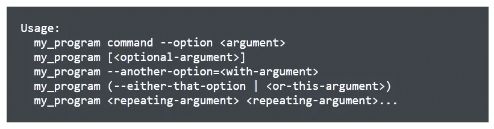
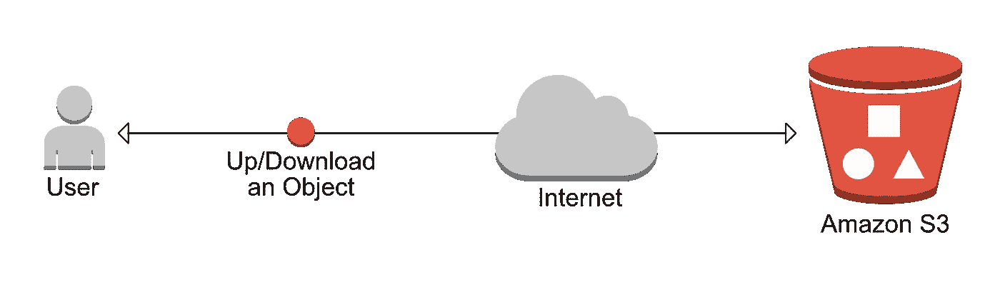
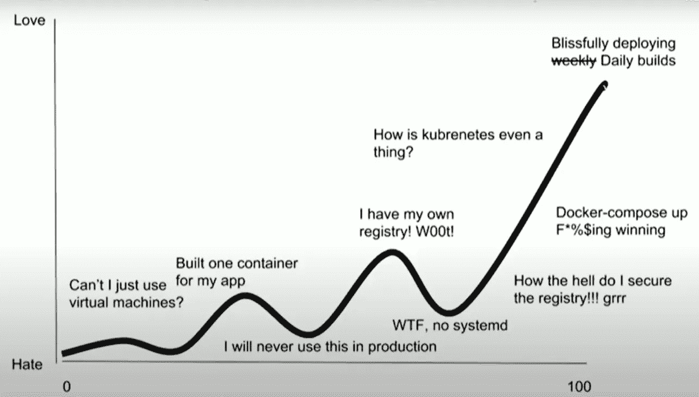

# 作为一名数据科学家工作一年后，我学到了什么

> 原文：<https://towardsdatascience.com/what-i-learned-after-one-year-working-as-a-data-scientist-99773296de25?source=collection_archive---------36----------------------->

## [商业科学](https://medium.com/tag/business-science)

## 原来有很多事情我希望我以前就知道…


照片由[鲁斯兰·布拉卡](https://www.pexels.com/@ruslan-burlaka-40570?utm_content=attributionCopyText&utm_medium=referral&utm_source=pexels)从[派克斯](https://www.pexels.com/photo/black-and-gray-photo-of-person-in-front-of-computer-monitor-140945/?utm_content=attributionCopyText&utm_medium=referral&utm_source=pexels)拍摄

# 介绍

2019 年 10 月开始了我作为数据科学家的旅程。在这里，我想分享我的经验，技巧，以及我希望我以前知道的事情，以避免你被烧伤。

10 月初，我在 [Evo](https://evopricing.com/) 担任数据科学家将满一年。利用应用于零售和供应链行业的尖端技术，创造出令人惊叹的工具。

今年是不可思议的**过山车**，我学到了很多东西，我认为自己非常幸运能够成为**令人敬畏的团队**的一员，这个团队力求完美，同时**乐于助人**，激励人心**并且能够胜任**。

> 你是和你相处时间最长的 5 个人的平均值。

嗯，我不知道这是真的还是假的，但如果是真的，我肯定会去争取。

最让我害怕的事情之一是当**疫情**(以及**封锁**来袭时:我**害怕**我将无法**像以前那样**交付，因为缺乏办公环境、同事，以及向你旁边的同事寻求帮助的可能性**就这样一天天地消失了。**


照片由 [Pexels](https://www.pexels.com/photo/boy-in-white-t-shirt-sitting-on-chair-in-front-of-computer-4709285/?utm_content=attributionCopyText&utm_medium=referral&utm_source=pexels) 的 [cottonbro](https://www.pexels.com/@cottonbro?utm_content=attributionCopyText&utm_medium=referral&utm_source=pexels) 拍摄

幸运的是，和往常一样，这只是一个**习惯的问题。我们通常天生害怕新事物，然而，一旦我们落入水中，要么我们(试图)游泳，要么我们下沉。**

# 我希望我以前就知道

在*学术界*之外，或者更明确地说，在专业环境中从事数据科学有许多不同之处，这些不同之处并不总是被教授或解释:

*   在专业环境中，你不是专注于单一技术(如 Python)的**而不是**，而是处于不同技术(SQL、Docker、R、Python、Bash……)的**集合体 T10 中。**
*   有时候旧的**电子表格**就是这样:管理者并不总是熟悉开发工具，比如`pandas`、`dplyr`或`matplotlib`。


照片由[energepic.com](https://www.pexels.com/@energepic-com-27411?utm_content=attributionCopyText&utm_medium=referral&utm_source=pexels)从[像素](https://www.pexels.com/photo/tool-set-on-plank-175039/?utm_content=attributionCopyText&utm_medium=referral&utm_source=pexels)拍摄

*   你必须能够**展示**和**衡量**一切:有时你需要独自完成任务，而你的队友对任务了解不多，甚至不知道你参与解决任务的技术。准备好写下结果，并能够提交衡量工作影响的报告。
*   机器学习**不是黑箱**:如果交付一个解决方案，其中包括一些在后台运行的机器学习，你必须能够**解释**和**理解**模型创建的每个预测。
*   每个人都有自己的看法和观点:能够**倾听**并尊重他人的观点，并且**永远**准备好改变你的想法。
*   通常你需要后退**一步**:当开发一个产品的单一特性时，很容易让**不知所措**，从而失去对项目的关注。这是非常危险的。永远记住你为什么在做一件特定的事情，并把它当作拼图中的一块。不是独立的实体。


来自 [Pexels](https://www.pexels.com/photo/neon-signage-2681319/?utm_content=attributionCopyText&utm_medium=referral&utm_source=pexels) 的[伊万·贝尔托拉齐](https://www.pexels.com/@ibertola?utm_content=attributionCopyText&utm_medium=referral&utm_source=pexels)的照片

*   不要成为**的粉丝**:我们都有自己喜欢的技术、库、云提供商或框架，然而有时候，我们没有可能使用我们喜爱的工具，因此**准备好**并接受你需要使用(和**从头开始学习**不同的**堆栈的情况。**

> 记住，作为一个大三学生，你不必什么都懂一点，而是什么都懂一点！

*   你将经常需要使用**电子表格**进行不同的操作，最后但同样重要的是:电子表格(仍然)经常是随身携带的**报告**工具。熟悉诸如**透视**表格、`VLOOKUP`、`IF`、创建(和格式化)**图表**等操作。
*   SQL:我无法提及(至少)了解 SQL 的基础知识有多重要。数据通常存储在数据库中，这意味着熟悉 SQL 是必须的。熟悉**联接**、**选择**语句、**分组依据**至少一种 SQL 风格(MySQL、MSSQL、Redshift)。


来源:维基百科

*   了解不同的技术如何相互通信。在处理一项任务时，您可能需要连接到数据库以获取数据，请使用您的 to-go 语言轻松连接到数据库。
*   Bash/Powershell 脚本:你很有可能会遇到像`CRON`乔布斯这样的事情。**让**熟悉 **Linux** 和 bash 环境，并学习如何从终端使用参数启动**脚本**，这是脚本启动的频率。



你总有一天会听说的…

*   另一个非常常见的情况是，当数据来自一个 **API** 时，有必要了解 API**如何工作**，更具体的概念，如令牌认证、JSON 和 HTTP 代码。
*   如果数据没有存储在数据库中，或者来自 API，那么您很有可能会使用**存储桶**，存储桶是由 **AWS** 提供的简单存储服务，用户可以在其中存储不同的文件，例如`.csv`，图像等等。



如何使用 S3 铲斗的示例。

*   处理**大**数据:在学习或大学期间，我们被教导如何从`.csv`等文件中读取数据，我们调用`.read_csv`等小函数，自动准备好数据进行操作。在现实生活中，通常情况下，你**根本无法**完成这样的事情。数据收集太大而不适合内存，以及不同的策略，例如以块的形式读取文件，使用像 T2 这样的技术，或者处理更小的数据样本。
*   Docker:为了让整个**团队**走上正轨，避免开发和生产环境之间的依赖**问题**，或者简单地避免臭名昭著的短语*“它在我的机器上工作”*，Docker 提供和**基础设施**来**管理**环境(称为容器)。我建议你熟悉 Docker 及其基本命令，如`docker-compose`和`docker-build`，并了解什么是注册表。这会节省你很多时间。



来源:RSAConference 2019

# 结论

正如前面提到的，很多时候，这只是一个习惯的问题。不要害怕**学习**新事物或者弄脏自己的**双手**，记住永远**接受批评**和**倾听别人的**，最后:不要害怕“打破东西”。

最后，我知道学习新事物时很容易不知所措，有成千上万的资源、文章、视频、课程，当菜单太长时，选择变得越来越难，然而:

> 记住，你不需要把它做对，你只需要让它开始。

```
**I have a newsletter 📩.**Every week I’ll send you a brief findings of articles, links, tutorials, and cool things that caught my attention. If tis sounds cool to you subscribe.*That means* ***a lot*** *for me.*
```

 [## 米尔斯形式

### 编辑描述

无情-创造者-2481.ck.page](https://relentless-creator-2481.ck.page/68d9def351)