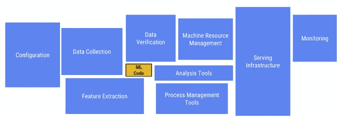
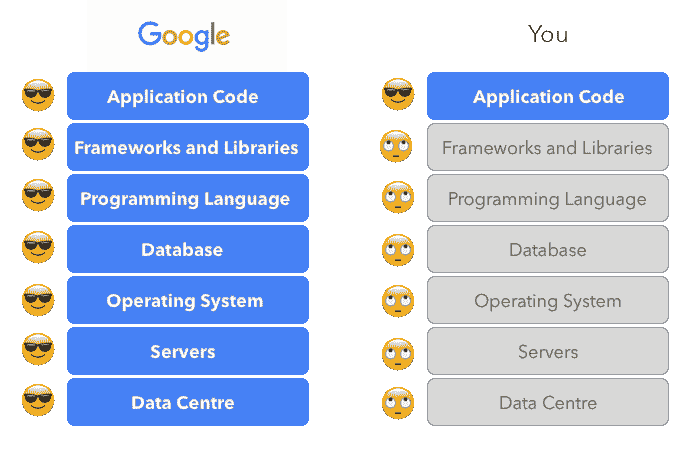
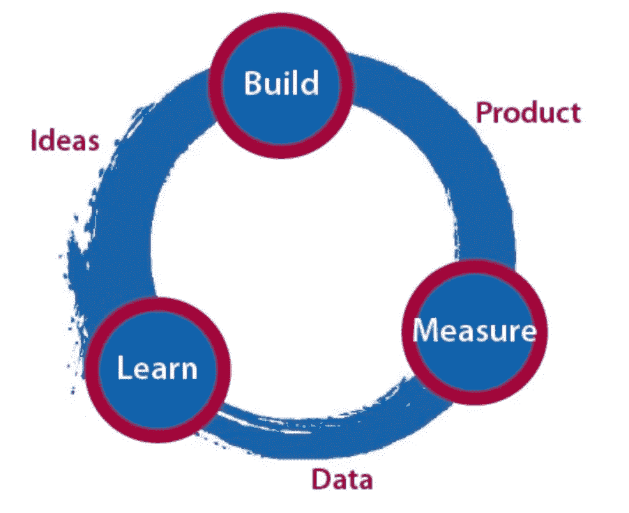

# 作为人工智能初创公司的联合创始人兼首席技术官，我学到了什么

> 原文：<https://towardsdatascience.com/what-i-learned-from-being-an-ai-startup-co-founder-and-cto-285854f3a1ae?source=collection_archive---------22----------------------->

由 [Unsplash](https://unsplash.com/)

## 全栈 AI/ML

## 你如何在现实世界中应用你的数据科学，并构建一个如此规模的人工智能产品？

他的文章在我的草稿文件夹里已经有一段时间了，但我相信现在是完成它的时候了。作为一个渴望开发真实世界人工智能产品的数据驱动型个人，我从我最近的两次创业中获得了宝贵的见解，并希望与你分享。

人们经常忽略的一点是，在人工智能产品的开发中，机器学习模型只是技术栈的一小部分。虽然技术熟练是科技联合创始人的一个重要属性，但它只是成功企业所需贡献的一小部分。

由[隐藏在机器学习系统中的技术债务](https://papers.nips.cc/paper/5656-hidden-technical-debt-in-machine-learning-systems.pdf)

许多创始人认为，任何有能力编写代码或创建 MVP 的人都是初创公司 CTO 的理想人选。对于人工智能初创公司来说尤其如此，拥有一名拥有人工智能专业知识的首席技术官可以转化为更有效的知识产权管理协议，并能够节省在早期阶段寻找人工智能专家的时间和资源，这可能是昂贵的。

# 选择正确的技术

在着手开发创新的人工智能算法之前，每个技术联合创始人都会遇到的最初挑战是技术选择过程。这包括就要利用的基础设施、框架和技术堆栈做出决策。

## 基础设施

建立基础设施是将你的产品推向市场的关键一步。对于那些具有 AI/ML 或数据科学背景并且工程经验有限的人来说，这可能是一个未知的领域。有几种选择，包括传统的内部服务或利用云平台即服务( [PaaS](https://en.wikipedia.org/wiki/Platform_as_a_service) )或基础设施即服务( [IaaS](https://en.wikipedia.org/wiki/Infrastructure_as_a_service) )提供商。

利用云服务的好处是巨大的，包括:

1.  **受管服务**带有服务水平协议([SLA](https://en.wikipedia.org/wiki/Service-level_agreement))，最大限度地减少开发团队的工作量。
2.  **随用随付**定价，消除了在服务器上的大量前期资本投资，释放了营销和招聘工作的预算。(需要注意的是，云服务可能并不总是比内部成本便宜。)
3.  **可扩展性&灵活性**，大多数云提供商都提供随时扩展到任何规模的能力。
4.  **创业信贷和其他福利**，如创业信贷(符合条件的创业公司最高可获得 10 万美元)、接触风险投资公司和合作伙伴以及免费的技术支持和咨询服务。—一些云提供商提供创业信贷([对符合条件的创业公司最高可达 10 万美元](https://www.quora.com/How-can-I-get-100-000-credit-on-Google-Cloud-for-my-startup-without-participating-on-any-accelerator))、接触风投/合作伙伴以及免费的技术支持和咨询。

云服务市场的三大玩家是亚马逊网络服务(AWS)、谷歌云平台(GCP)和微软 Azure。基于个人经验，作者使用了 AWS 和 GCP，并将在下面的讨论中使用它们作为例子。

虽然不同云提供商提供的基础设施大体相似，但与 GCP 相比，AWS 更成熟，在某些行业被广泛采用。我多次被问到，为什么我们选择 GCP 作为主要的云服务提供商。

伊万·刘

*   **可预编译的服务器** —GCP 提供了一种被称为可抢占实例的计算资源，与标准实例相比，可节省 60–80%的成本。尽管这些资源不附带 GCP 的正常 SLA，但保证每台服务器最多运行 24 小时。鉴于我们平台的性质，其核心组件是人工智能培训和产品管道，需要大量使用服务器， ***我们选择了可抢占的资源，以平衡成本效益和足够的计算资源。***
*   **集成分析** —我们的平台严重依赖 Google Analytics、Firebase 和其他事件收集工具。GCP 的 Bigquery 作为一个托管数据仓库解决方案，提供了与这些工具的无缝集成，使分析仪表板上的数据可视化变得容易。
*   **其他服务** —目前，GCP 提供稳定的 Kubernetes 解决方案(GKE)和人工智能服务，这两项服务都被我们的实时系统所利用。

然而，每一个决定都需要权衡:

*   **数据库** —虽然 GCP 提供了一系列数据库，但它目前不支持 MariaDB，并且缺乏用于 CloudSQL 读取副本的集成负载平衡器。
*   **人才的可用性** —与 AWS 相比，在 GCP 寻找有技能的工程师可能更具挑战性。

值得注意的是，每个初创企业都是独特的，技术选择应该基于特定的业务主张和用例。技术联合创始人必须做出明智的决定，为他们的业务选择合适的技术。

## 体系结构

一旦基础设施就位，下一个关键步骤就是平台架构的设计。考虑诸如安全性、可伸缩性、可靠性等各种高级方面是至关重要的。从我在两家创业公司的经历中，我学到了在架构中保持简单的重要性。

在设计架构时，只包含满足平台需求所必需的组件是非常重要的。

> 如果 MySQL + VMs 可以满足平台需求，就不要在设计中添加 Redis 或 Memcached 之类的缓存层。如果数据库读取副本可以解决并发瓶颈，那么就不要设计 MQ。

过度复杂的架构需要大量的开发工作，初创公司必须不断迭代和发展他们的产品，使设计中任何冗余和过时的组件都成为问题。人们很容易被最新、最大的技术进步所吸引，但作为一家初创公司，采取务实的方法并只实施业务所需的东西至关重要。

目标应该是以简单明了的方式实现预期的结果，而不是试图模仿大公司复杂的解决方案。

> 不要羡慕谷歌正在做的很酷的事情，实现一些不太酷的事情，直到你成为一个谷歌。

伊万·刘

## 发展

作为一家初创公司的技术联合创始人，**必须全面了解技术的各个方面，包括人工智能模型和 iOS 应用**。AI/ML 专家的角色不仅仅局限于简单的培训模型，因为它需要亲自参与整个代码库，尤其是在与离岸团队合作时。

为了确保初创公司技术的成功，消除代码库中的任何盲点至关重要，这些盲点可能会在未来导致灾难性的后果。

为了实现这一目标，这位技术联合创始人需要:

*   **准备好学习任何语言**——尽管你可能不直接负责日常开发，但对跨多个平台的编码技能的深刻理解是至关重要的。例如，在没有 iOS 开发人员的情况下，首席技术官必须有能力排除故障并发布新版本的应用程序。在 IT 预算削减或海外团队流失时，确保产品对第三方开发团队的依赖性最小以保持无缝运营至关重要。
*   **尽早建立开发流程** —这包括发布流程、持续集成/持续交付管道和其他关键元素的实现。尽管这些过程不一定是完美的，或者遵守严格的工程最佳实践，但是将它们放置在适当的位置以避免混乱并确保最佳的团队生产力是很重要的。
*   **不要仅仅依靠测试人员来保证质量**——虽然测试是开发过程的一个重要组成部分，但是测试人员在一个冲刺阶段或者在一个版本发布之前完全覆盖一个特性的每一个方面可能是不可行的。考虑到测试需要额外的时间，可能会有这样的情况，工程团队在一个紧张的期限内构建不完整的特性，期望测试人员识别并解决任何问题。为了避免这种情况，除了依靠测试之外，建议鼓励工程师进行自检。这种方法有助于简化开发过程，避免交付前不必要的来回奔波。
*   **采用灵活的语言选择方法**——选择您和您的团队最熟悉、最舒适的语言或工具。避免只受受欢迎程度的影响。

由 [xkcd](https://xkcd.com/378/)

*   **技术债务并不是不可接受的**——认识到承担技术债务是创业旅程的自然组成部分是很重要的。重点应该是快速构建一个功能性产品并测试业务假设，为未来的融资和扩展工作做准备。关键是要保持一种心态，即一些技术债务可以在下一轮融资获得担保时得到解决。

# 组

作为一名领导者，有效地建立和管理团队至关重要。一个团队的成功不仅依赖于熟练的工程师，还依赖于定义良好的工作流程、开发过程、明确的目标、有效的领导和激励性的激励结构。忽视这些因素会导致混乱，最终导致失败。

由 [ZIA](https://lgp500.wordpress.com/2011/05/19/best-android-wallpapers/)

作为一名技术领导者，我学到的第一课是，拥有足够的开发人员比拥有过多的开发人员更好。

> 需求每小时每天都在出现，我需要更多的开发人员来完成任务，这样我们才能交付更多。

上述信念可能会导致一些挑战，包括:

1.  IT 预算的大幅增加
2.  在团队管理中投入大量时间和精力
3.  最有可能的是团队速度和生产力的边际改进

以下是解决上述问题的一些经验:

*   **保持团队内部的简单性** —避免不必要的技术角色使团队结构复杂化，这些技术角色在项目的当前阶段可能并不需要。例如，在 MVP 的开发过程中，像站点可靠性工程师或渗透测试员这样的职位可能是不必要的。类似地，在生成足够的用户数据之前，可能不需要为数据分析师建立一个角色来支持数据驱动的上市策略。
*   **一个负责任的开发人员总是比一个有经验的开发人员更好**——虽然经验当然是一笔宝贵的财富，但它不一定等同于强烈的职业道德和对分配任务的主人翁意识。另一方面，一个缺乏经验但高度负责任的开发人员不仅能为团队做出积极的贡献，还能与团队一起成长和发展。重要的是要避免雇用那些表现出逃避责任和义务倾向的开发人员，因为这样的行为会破坏利益相关者的信任，并导致有害的工作环境。
*   **毫不犹豫地更换不合适的团队成员**——保持一个合适且高效的团队构成对于确保创业公司的成功至关重要。替换那些表现不尽如人意或不符合团队文化、动机和责任的团队成员势在必行。如果做不到这一点，可能会导致团队士气低落、生产力下降和错过最后期限。在团队成员表现不佳的情况下，最好及时解决问题，以避免对团队的进展产生长期的负面影响。团队的成功取决于每个成员的集体努力和承诺，确保每个人都与公司的目标和价值观保持一致是至关重要的。
*   **找到你的得力助手**——作为一名首席执行官，拥有一个值得信赖的得力助手对创业公司的成功至关重要。在你的团队中找到一个可以作为你的“左臂”或导师的人是很重要的。拥有这个人可以提供额外的支持和帮助，以确保组织的有效运作。
*   **与你的团队进行技术交流** —对于技术联合创始人来说，与他们的开发团队进行有效的交流是非常重要的。这需要清晰简洁地交付技术指令，将复杂的业务需求分解成可操作的任务。展示技术专长可以赢得团队的尊重，并提高整体生产力。然而，技术联合创始人还必须能够以投资者和其他非技术利益相关者可以理解的方式阐明业务需求。
*   **学会为你的团队过滤噪音**—培养选择性过滤外部输入的能力至关重要，虽然这些输入可能看起来很有创意和令人兴奋，但它们很快就会成为分散注意力的来源，阻碍团队专注于核心任务。在这些输入和开发计划之间实现一个过滤机制，可以确保与产品路线图的一致性和一致性，减少不确定性和分歧。这将为团队营造一个高效且专注的工作环境。
*   **更换整个开发团队时要小心**——更换整个团队会导致项目交付的重大中断，导致长时间的无绩效，通常以周或更长时间来衡量。建议尽可能避免这种激烈的行动，而是寻求替代解决方案，帮助解决手头的问题，同时尽量减少对项目进度的影响。
*   **关心、欣赏和尊重你的团队成员**——特别是在第一个团队的情况下，他们可能不具备最先进的技术技能，但他们在产品的成长和发展中起着至关重要的作用。他们拥有对企业成功至关重要的宝贵的业务和技术洞察力。失去一名团队成员会对组织产生重大影响，因此，营造一个积极和支持性的工作环境以留住有价值的团队成员至关重要。
*   **人脉**——当务之急是积极参与人脉，以发现并吸引创业行业中稀缺的有才华的开发人员。建立和扩大职业关系可以提供宝贵的机会，在未来适当的时候接触潜在的候选人。即使开发人员不能立即加入团队，他们仍然可以通过这些关系提供有价值的见解和建议。

# 产品

作为首席技术官，积极参与产品开发是确保产品成功开发和交付的关键。你的角色包括决定最有效地利用技术来制造产品，并确保其技术可行性。这方面的主要考虑因素包括:

精益创业

*   **专注于你想要为产品测试的关键假设** —初创公司的资源有限，通过专注于关键目标和测试假设来避免分散这些资源至关重要。随着产品在市场中获得牵引力，可能会有新的想法和建议涌入，但提供指导并做出符合团队能力和产品路线图的明智决策是 CTO 的责任。通过保持对团队能力和产品战略的清晰认识，CTO 可以有效地优先考虑和分配资源，以推动成功的产品开发。
*   **在提交特性请求时要小心**——提交每个请求会导致开发团队负担过重，并对他们及时交付可靠产品的能力产生负面影响。技术联合创始人应该充当把关人，与开发和产品团队密切合作，评估、优先考虑和管理利益相关者的期望，以确保团队专注于与整体业务目标和产品路线图相一致的最重要和最有影响力的任务。考虑非技术性的解决方案并随着时间的推移不断评估请求的相关性和重要性也很重要。
*   **专利保护—** 专利作为一种商业保护形式，有效地增加了竞争者的进入壁垒。此外，专利在风险投资家对初创企业的估值中扮演着重要角色。为了最大化专利的好处，建议在业务发展的早期就开始专利程序。虽然最终的专利不需要立即申请，但跟踪进展和建立时间表是必不可少的。与其只专注于为人工智能算法申请专利，不如专注于整个解决方案，这涉及到技术、工程努力、端到端管道、商业主张和模型等各个方面。专利应该足够通用，以保护大多数企业，但又足够具体，以满足专利的标准。

# 摘要

作为 CTO，理解技术、团队和产品之间的相互依赖是很重要的。这些元素中的每一个都在推动创业成功的过程中扮演着至关重要的角色。为了提高效率，保持热情并致力于通过工作对社会产生积极影响是非常重要的。

**技术**的关键方面是保持精简和简单，允许快速迭代和测试产品假设。

就**团队**管理而言，重要的是优先考虑团队成员的福祉，建立网络并扩大你的职业关系以识别潜在的人才，并过滤掉噪音以保持团队关注的一致环境。

就**产品**开发而言，积极参与产品团队并专注于测试关键假设至关重要。作为看门人，CTO 必须管理利益相关者的期望，并确保团队正在做与产品路线图和业务目标一致的正确的事情。申请专利的过程也应尽早启动，重点关注具体到足以申请专利的通用解决方案。

总的来说，关键是不断平衡和整合技术、团队和产品，以推动创业公司的成功。

# 关于我

作为一名终身学习者和技术专家，我专攻软件工程、机器学习和云工程领域。

我作为工程和产品领导者拥有丰富的经验，在定义机器学习战略、建立全栈数据科学和工程团队以及大规模交付端到端机器学习解决方案方面有着良好的记录。

*   领英:[https://www.linkedin.com/in/ivanliu1989/](https://www.linkedin.com/in/ivanliu1989/)
*   **Github**:[https://github.com/ivanliu1989](https://github.com/ivanliu1989)