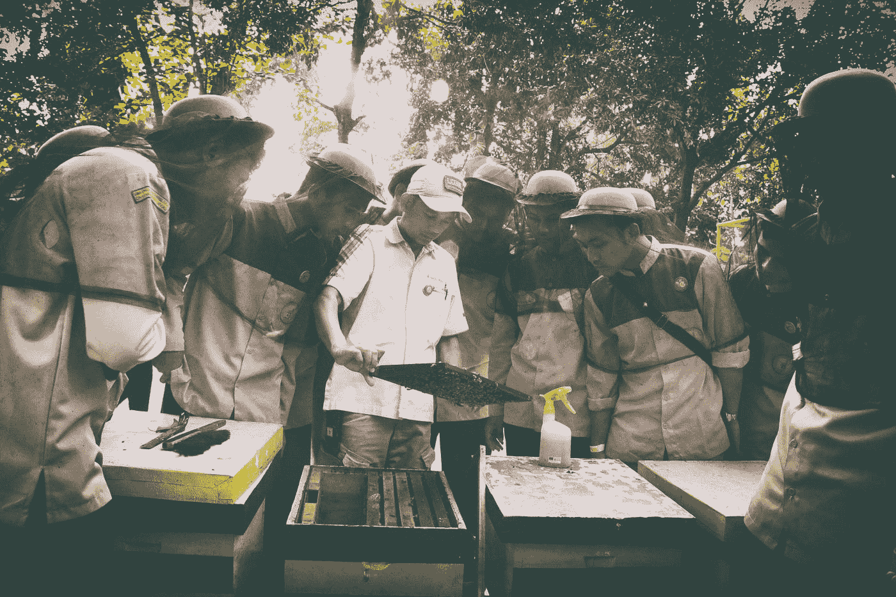
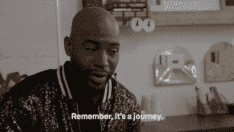
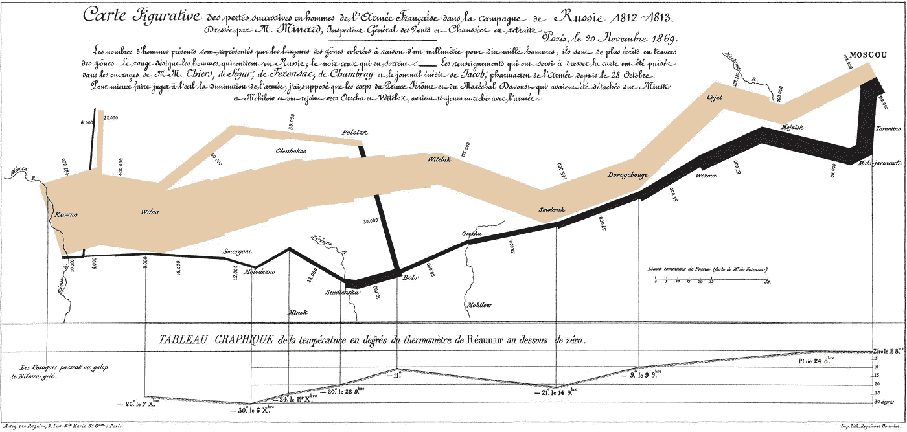
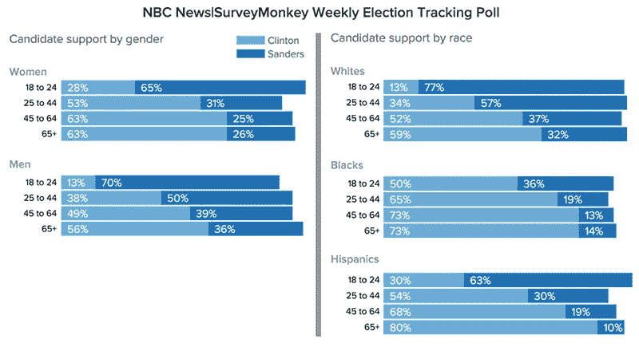
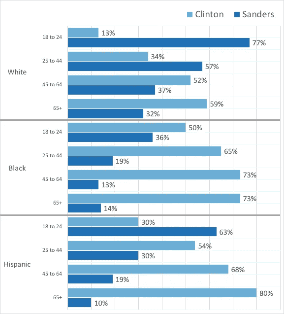
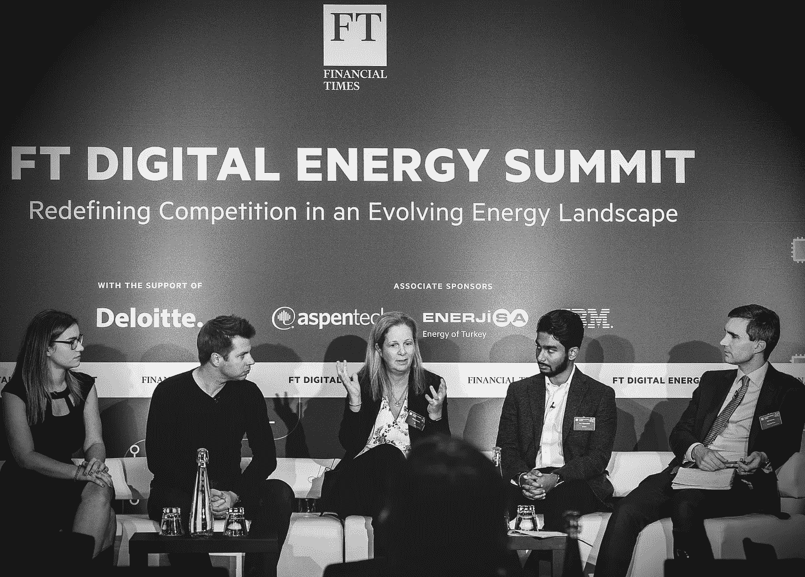

# 我从 120 多次数据科学演讲中学到了什么

> 原文：<https://towardsdatascience.com/what-i-learnt-from-giving-120-data-science-presentations-ce18b16cf334?source=collection_archive---------35----------------------->

## [办公时间](https://towardsdatascience.com/tagged/office-hours)

## 帮助驾驭世界和日常技术实践的 6 点，成为更好的数据沟通者

在 [Unsplash](https://unsplash.com?utm_source=medium&utm_medium=referral) 上 [Anggi Nurjaman](https://unsplash.com/@angginj?utm_source=medium&utm_medium=referral) 拍摄的照片

回想我在数据科学团队中担任的各种角色，我突然意识到我是少数几个经常被邀请参加演示的人之一。

从一大堆会议邀请，到各种团队频道的幻灯片和我笔记本电脑上无数版本的演示文稿，我意识到在过去的六年里，我已经演示了 18 个项目的 120 多个版本——大约每三周一次演示！通过这一点，我可以有把握地说，我已经耐着性子听完了各种听众不喜欢的演讲。

有人可能会说，在一个数据素养的组织中，这么多的演示对于技术相关的利益相关者来说是不必要的，但在我工作的地方，这样的人少之又少。

吉菲——过来，卡拉莫👏🏽👏🏽👏🏽

我的许多演示文稿准备起来既费时又麻烦，但它们对我成为一名更好的数据科学交流者的努力非常有价值。不管怎样，我感谢我的自省时刻，它让我对自己的内容和沟通技巧充满信心。

迄今为止，在英国《金融时报》能源峰会上，作为主题演讲人并参加能源行业 ML 专题讨论小组一直是一大亮点。虽然我还有很多东西要学，但我现在知道我可以和那些倾听的人展开有趣的对话。

所以，这里有我认为有价值的六点，以及我在考虑展示我的项目时使用的一些资源。

# 1.创造一个故事

无论你正在陈述的项目是探索性的、生产就绪的解决方案还是研究性的，叙述都是连贯地表达所取得的进展所必需的。虽然有许多方法，但有两个关键要素是必须的。

## 语境

很多时候，我们的项目落地到我们面前就没有意义了。我们必须从平庸的数据中煞费苦心地构建模型、见解和结果。为了有意义，我们一遍又一遍地剖析和探索部分数据，以在更大的画面中找到*的含义。本质上，我们成为了科学家。*

对我们的观众来说幸运的是，我们能够在一个更大的画面中框定我们的数据，并成为故事讲述者。我们可以包括历史，类似的趋势和其他人可能采取的方法。我们可以用探索阶段的视觉化来描述潜在的挑战、一线希望和我们的灵感。

无论你是向非常具体的团队还是更大的、多样化的团队进行演示，一个包含更多相关事实和背景的定制演示都是有益的。我倾向于按照相当高层次的叙述来组织我的幻灯片，并在必要时将注意力吸引到详细的幻灯片上。这样做可以让观众专注于挑战和解决方案，同时我也可以帮助他们欣赏我取得的进步。

## 时间表

坚持清晰有序的时间表(最好是线性的)非常重要，数据科学故事不应该像克里斯托弗·诺兰电影一样。

[吉菲](https://gph.is/g/aRLm8xg)

我经常看到演讲一开始就有一个结果和解决方案。虽然这些很有影响力，但它们也引发了很多“这是什么意思？”时刻，这可能会疏远你的观众。

一个强有力的*开始*本质上是你的背景和你提供的情境。一个有价值的*中间*部分将包括对你的方法、发现、见解和必要信息的简明解释，以帮助听众理解所做的事情。在*结束*时，您应该总结模型结果、潜在的改进、数据的使用和挑战、生产策略以及项目是否继续的更广泛影响。

如果可以的话，留出提问的空间。这让观众有机会“更深入地”了解他们特别感兴趣的内容和任何事情。

# 2.不要让观众边听边读。

把你自己放在一个利益相关者的位置上，坐在一张 ML 幻灯片上，试图*倾听*专家的观点，*阅读*他们在幻灯片上的简介，*理解*他们的工作对商业领域的价值。这是很多杂耍。

[吉菲](http://gph.is/VwFRjU)——是啊，令人困惑…🤷🏽‍♂️

相反，应该限制每张幻灯片的文字量，尽量减少要点和陈述，以避免填鸭式的文字。你可以采取许多步骤来表达简洁明了的观点，盖伊·川崎 10/20/30 法则很好地阐明了这一点，它为推销提供了一个极好的模板。虽然它不能直接翻译为 ML 演示，但它的大部分内容是适用的。

# 3.观想很重要。如果你在制作图表，使用正确的视觉工具。

这对我来说可能是最重要的一点，然而，也是最难做到的一点。这些原则可能很容易讨论，但执行起来要困难得多，始终如一。

> **TL；视觉上的博士-**
> 
> —带有标尺的图表帮助我们更准确地解释它们，减少我们的感知偏差。
> 
> —不要使用图表，因为它们不容易让人理解要点。
> 
> —通过调整对比度和亮度来突出重要内容，而不删除不重要的内容，从而为演示挑选或制作一致的调色板。

观想不仅仅是为了美学。事实上，它们有一个更高的目的，即帮助我们的大脑更容易地处理模式识别，因为它们将放大镜对准了更大数据集中已经存在的*。*

1812 年拿破仑的俄罗斯战役——查尔斯·密纳德，维基百科。这免费存在于我的脑海里。

1869 年，法国土木工程师查尔斯·密纳德预见了 1812 年拿破仑的俄国战役。虽然即使现在也很难构建这样的图表，但这是一个非常简单的图表，在一个 2D 图中表达了六个变量！(温度、部队人数、行进距离、行进方向、纬度/经度以及相对于特定日期的位置)。它从字面上讲述了通过数据征服的悲伤故事。

整理您的见解，不仅要展示数据，还要便于阅读。我在演讲中发现的两个基本但又反复出现的主题是:缺乏比较手段和正确使用颜色。

## 尺子和天平

我觉得有必要用一些背景来解释为什么我们的视觉能力经常失灵。

人类的大脑善于发现相似事物的差异，但前提是它们明显不同于其他事物。如果没有共同的方法来发现多个项目之间的差异，我们很容易误解或低估大型图表(条形图或折线图)中的某些数据点。

这大概是一个琐碎的解释，但是*实际差异* vs *感知或主观差异*的关系在**韦伯定律**中陈述。

此外，**史蒂文幂定律**加剧了我们感知偏差的这种差异，因为每个人都有一个独特的比例系统，这个系统在长度、面积和体积上都是非线性的。

2016 美国 Dem 总统候选人， [NBC 新闻](https://www.nbcnews.com/politics/2016-election/where-sanders-clinton-are-dominating-n505381) —克林顿台词可以比较，但是桑德斯怎么样？

例如，当任何两个人估计条形图中两个条形之间的差异(即比率)时，他们会得出不同的估计值。虽然这在大多数情况下可能非常小，但在非结构化图形中比较多个条形会产生复合效应。这适用于长度、面积、体积、亮度、声音强度(响度)和重量。

为了解决这个问题，我们可以使用周期标尺(或作为标尺的公共边缘)，因为它们提供了图表中最好的比较工具。这对于建立一个*基线*来比较两个或多个项目是非常宝贵的。

虽然这个修复看起来很琐碎，但是我们经常忘记考虑它。这些错误在堆积图和面积图中最为突出，因为使用标尺要困难得多。因此，我避免使用这些图表，坚持使用更简单的图表。

我花了 15 分钟重新制作了上面图表的右侧(在 Excel 中)。我现在可以分辨出候选人 & **种族**之间的**差异。没有上面那么干净，但是现在可以**研究一下**！**

## 对比

色彩的运用，尤其是对比的差异，是吸引注意力的关键。我们通常使用颜色来区分多个变量，使用 Python 和 r 制作的图表中使用的各种顺序、发散和定性调色板。

重要的是要问清楚什么是相关的显示，一个变量*对*所有或多个变量。前者更容易解释，需要很少的颜色变化，因此只用两种对比就能做出有影响力的区分。后者在阐明变量的变化和复杂性，描述多方面的问题和见解方面是理想的。变量越少越好。如果你真的想走得更远，就按照重要性和与观众的相关性对它们进行分组。

在[科学上有一个关于我们如何识别模式并解释它们的详细帖子](/tell-stories-with-data-communication-in-data-science-5266f7671d7)——我强烈推荐它！

# 4.把它变成你自己的，充满激情。

我们的大多数项目最终会耗尽我们的热情。无论我们花多少时间清理数据和热情地优化，最终所有的利益相关者都关心我们代码的目的和结果。从全局来看，这并不有趣，至少对于那些能够资助进一步工作的非技术观众来说是如此。

[Giphy](https://gph.is/g/4V6KdbR) —当有人问我“那又怎样？”，我听到钱德的声音。

我不得不提醒自己把注意力放在相关的事情上，是什么让解决令人沮丧的挑战变得有趣，以及我在这个过程中学到了什么有趣的东西。

我在演示过程中加入了不同的图表以增加参与度，包括生产模型的长期目标，制定策略以获得其他项目的额外收益，甚至花时间寻找组织良好的动画模板。

最糟糕的情况是，你的热情和真正的兴趣会让你的利益相关者和听众为你感到兴奋，你会从经历中学到一些有趣的东西，然后继续前进。*在最好的情况下*，他们会支持你，传播你的言论，召集合适的人和你一起做出正确的决定。

# 5.与你的观众互动。

演示开始时的互动可以让你的观众踏实下来，让他们专注于你想要吸引他们注意的东西。如果他们不得不在你起床前听完多个演示文稿，这一点尤其正确！关于这个项目的一个有趣的事实，一个有趣的统计数据，一个“举手表决…”的问题都是与你的观众互动的好方法。

总的来说，你也可以利用这个机会来了解他们所拥有的先验知识水平以及他们所熟悉的复杂程度。

当然，他们可能会撒谎或不参与，但通过与他们互动，观众有机会建立信任，并在向演讲者提问时打破任何尴尬的障碍。

# 6.帮助观众理解成功标准和模型评估。

如果某人对我们的世界是陌生的，那么用准确度、精确度/召回率和 AUC 等术语来衡量进展可能会让事情变得更加混乱。

[具体说明你是如何评估模特的表现的](/metrics-to-evaluate-your-machine-learning-algorithm-f10ba6e38234)。花时间回顾或向观众提供如何解释结果的悬崖笔记。如果是 AUC，解释为什么你会使用这种方法，结果和它对项目的意义。始终链接到更大的图片和它提供的价值。

如果结果不乐观，或者你认为需要更多的努力来改进，那么就要透明，并证明一种潜在的方法是合理的。如果这是一个死胡同，你已经用尽了所有的方法，同样适用。

[FT 数字能源峰会 2019，Flickr](https://www.flickr.com/photos/45442848@N05/albums/72157711027000412) —公用事业面板数据。

我们并不总是有时间来做好演示。在工程任务之间，很难找到时间来真正制作幻灯片，创作故事，并进行很好的可视化。努力是值得的！

简单而引人入胜的故事让少数产品所有者和常客对我们的项目更感兴趣。他们努力掌握基本概念。我们的站立会议和冲刺计划会议涉及了更多的抽象思维，能够减轻利益相关者的预算，更好地控制最后期限，并为我们尝试创造空间。

我愿意相信这些是我们为了成为更好的沟通者而逐渐学习和养成的习惯。我也希望我们工作的团队获得更多的赞赏，并投入时间进行沟通。我很幸运有一个思想开放的团队。

感谢您的阅读，如有任何建议，请在下方留言！