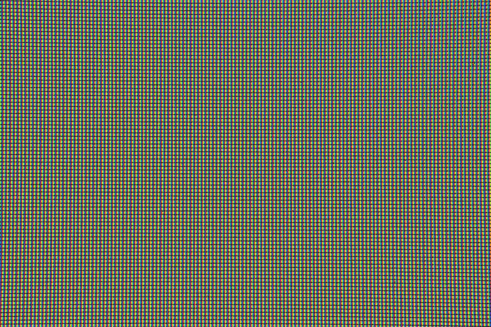
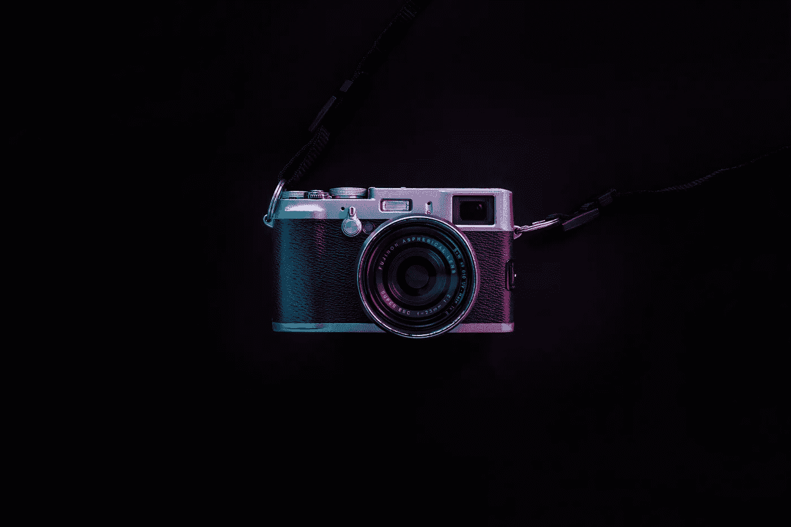
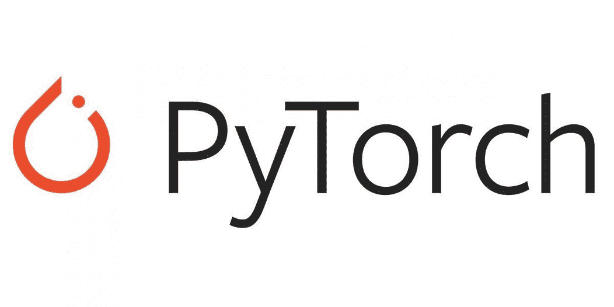
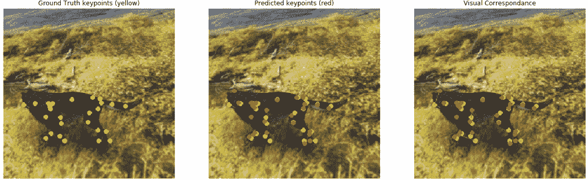

# 我从攻读计算机视觉和机器学习硕士学位中学到了什么

> 原文：<https://towardsdatascience.com/what-i-learnt-from-taking-a-masters-in-computer-vision-and-machine-learning-69f0c6dfe9df?source=collection_archive---------5----------------------->

## 经验

## 如果你打算在计算机视觉或机器学习方面进行任何形式的高级研究，请阅读本文。你可能会发现一两件有用的东西。

约瑟夫·陈在 Unsplash 上的照片

我写这篇文章是为了反思我在攻读机器学习硕士学位时学到的东西。我不得不承认，我的研究有些部分有用，有些部分没用。

他的文章涵盖了我的经历和课程内容，但我相信其他大学的课程不会有太大的不同。因此，一些**的读者可以将这篇文章作为一个窗口，了解机器学习和计算机视觉**的硕士学位会带来什么。

除了我在学习期间学到的信息，我还将包括所获得的学术知识与我目前作为计算机视觉工程师的工作角色的相关性。

# 先决条件

机器学习的高级学位有几个选择的主题，反映了机器学习领域的发展方向。

机器学习的任何一门课程都有太多的内容要涵盖。因此，我攻读的理学硕士学位确保了学生在接受该课程之前具备以下先决条件。

*   很好地理解线性代数和微积分(微分/最优化)
*   基础水平统计和概率研究
*   编程语言背景
*   本科学习计算机科学、数学、物理或电子和机械工程

## 现在谈谈我从我的机器学习硕士那里学到的关键信息。

# 1.计算机视觉

让我从本课程中我最擅长的模块开始。

计算机视觉和深度学习研究是我真正感兴趣的机器学习领域。也许我被吸引到这个领域是因为技术发展的直接影响。

媒体对计算机视觉技术在过去几十年里取得的进步大加赞赏。面部识别系统的快速出现是不容错过的。在主要的国际机场、银行和政府机构很难找到面部识别系统。

我硕士期间的计算机视觉研究非常有条理。我们不期望你直接跳到实现和分析最先进的技术。

事实上，你后退了好几步。您从了解基本的图像处理技术开始，这些技术是在我们今天看到和使用的计算机视觉高级技术出现之前开发的。

在 [Unsplash](/s/photos/machine-learning?utm_source=unsplash&utm_medium=referral&utm_content=creditCopyText) 上由 [Gery Wibowo](https://unsplash.com/@gergilgad?utm_source=unsplash&utm_medium=referral&utm_content=creditCopyText) 拍摄的照片

在深度学习中，我们知道卷积神经网络的较低层从输入图像中学习低级模式，如线条和边缘。

但在卷积神经网络(CNN)引入计算机视觉之前，有基于启发式的技术用于检测感兴趣的区域和从图像中提取特征。

我的计算机视觉研究确保了我理解该领域的基础，获得了一些关于这些启发式技术如何工作以及在实际应用中如何使用的知识。

计算机视觉研究为我提供了传统机器学习技术的知识，以处理图像，提取特征并对从图像中获得的描述符进行分类。

以下是我在计算机视觉研究期间引入的几个关键主题和术语:

*随意跳过定义。我把这些放在这里是为了给好奇的人提供一些信息…*

*   **(尺度不变特征变换)SIFT** :这是一种计算机视觉技术，用于生成图像关键点描述符(特征向量)。生成的描述符包含关于诸如边、角和斑点的特征的信息。该描述符可用于检测不同比例和失真的图像中的对象。SIFT 被用在诸如对象识别、手势识别和跟踪的应用中。这里有一个介绍这项技术的原始研究论文的链接。SIFT 的关键在于它的检测特征对于任何仿射变换都是不变的，例如缩放、平移和旋转。
*   **(梯度方向直方图)HOG** :这是一种用于从图像中提取特征的技术。所提取的特征是从通过图像内的边缘和拐角提供的信息中导出的，更具体地说，是从图像内的对象中导出的。对这些技术的简单描述是，它识别图像内的边缘(梯度)、角和线的位置，并且还获得关于边缘方向的信息。HOG 描述符生成直方图，该直方图包含从图像中检测到的边缘分布信息和方向信息。这种技术可以在计算机视觉应用和图像处理中找到。这里有一个[链接](https://www.learnopencv.com/histogram-of-oriented-gradients/)提供更多信息
*   **主成分分析(PCA):** 对特征丰富的数据集进行降维的算法。降维是通过将数据点从较高维度投影到较低平面来实现的，但仍然保持信息并使信息损失最小化。

*其他值得一提的话题如下:*

*   *线性插补*
*   *无监督聚类(K 均值)*
*   *视觉单词包(视觉搜索系统)*

在我学习的早期，我被期望开始开发基于计算机视觉的应用程序。对象分类是一个热门话题，也是一个相对容易获得一些基本知识和实现的话题。

在我的研究中，我的任务是在 Matlab 中开发一个视觉搜索系统。

*Matlab 是一种为高效数值计算和矩阵操作而开发的编程语言，Matlab 库配备了一套算法和可视化工具。*

过去在 JavaScript、Java 和 Python 方面的编程经验帮助我轻松掌握了 Matlab 编程语法，这样我就可以全心全意地专注于计算机视觉方面的研究。

## 更多信息…

要实现的视觉系统相当简单，它的工作方式是通过系统传递查询图像，然后系统产生一组与传递到系统中的查询图像相似的图像结果。

我应该提到，该系统包含一个存储图像的数据库，用于从中提取结果图像(q *查询图像，然后输出结果图像*)。

视觉系统没有使用任何花哨的深度学习技术，而是前面提到的一些传统的机器学习技术。

您只需传递一个转换为灰度的 RGB 图像，然后对该图像应用一个特征提取器；此后，提取图像描述符并将其表示在 N 维特征空间上。

在这个特征空间中，通过计算两个 N 维点之间的欧几里德距离，可以计算出相似的图像。

## 事情开始变得严重…

理解计算机视觉不仅仅局限于处理图像；你被期望在视频上利用算法和技术。

请记住，视频只是图像序列，因此在输入数据的准备和处理方面，您并没有学到任何新东西。

如果你使用一个物体检测框架，比如 [YOLO](https://pjreddie.com/darknet/yolo/) 、 [RCNN](https://arxiv.org/abs/1311.2524) 等，那么在一系列图像中的物体跟踪似乎是非常琐碎的。但是要认识到，研究计算机视觉不是使用预先训练好的网络和微调。它是关于理解这个领域本身是如何在这些年中发展的，获得坚实理解的最好方法是通过调查随着时间的推移而发展的各种传统技术。

*因此对于目标跟踪的任务，引入了以下主题:*

*   *斑点跟踪器*
*   *卡尔曼滤波器*
*   *粒子过滤器*
*   *马尔可夫过程*

## 作为计算机视觉工程师的相关性

老实说，在我目前的角色中，我还没有使用过任何传统的机器学习分类器，我也不认为我会很快使用。

但是，为了让您了解所提到的一些技术的相关性，有必要说明一下，自动驾驶汽车、车牌阅读器和车道检测器结合了前面讨论的一两种方法。

左图:布拉姆·范·奥斯特在 Unsplash 上拍摄的照片。右图: [Trent Szmolnik](https://unsplash.com/@ts_imagery?utm_source=unsplash&utm_medium=referral&utm_content=creditCopyText) 在 [Unsplash](/s/photos/lanes?utm_source=unsplash&utm_medium=referral&utm_content=creditCopyText) 上拍摄的照片

# 2.深度学习

深度学习是计算机视觉研究的自然进展。

一些深度学习主题已经包含在计算机视觉模块中，而深度学习的其他主题是传统计算机视觉技术的扩展或改进。

深度学习主题的教学采取了与我的计算机视觉研究相似的道路，即在转向高级主题和应用程序开发之前，创建对该领域基础的坚实理解。

图片来自 kisina/Getty Images

深度学习研究始于对图像基本组成部分像素的理解。

您很快就会知道，数字图像是包含像素集合的网格。

在理解了图像的原子基础之后，您将继续学习图像是如何存储在系统内存中的。

framebuffer 是系统内存中像素存储位置的名称(*没有多少 MOOCS 会教你这个*)。

照片由[盖瑞·维博沃](https://unsplash.com/@gergilgad?utm_source=unsplash&utm_medium=referral&utm_content=creditCopyText)在 [Unsplash](/s/photos/machine-learning?utm_source=unsplash&utm_medium=referral&utm_content=creditCopyText) 上拍摄

我也了解了照相设备是如何捕捉数字图像的。

我不得不承认，对智能手机相机如何捕捉图像有一些直觉是很棒的。

让我们快进到一些更酷的东西。

不了解卷积神经网络(CNN)就无法学习深度学习，它们是齐头并进的。

我的研究介绍了过去 20 年中 CNN 的引入和发展时间表(从 [LeNet-5](http://yann.lecun.com/exdb/publis/pdf/lecun-01a.pdf) 到 RCNNs)以及它们在取代传统管道以完成典型计算机视觉任务(如对象识别)中的作用。

在我的研究中，介绍了在深度学习早期出现的不同 CNN 架构的探索。 [AlexNet](https://papers.nips.cc/paper/4824-imagenet-classification-with-deep-convolutional-neural-networks.pdf) 、 [LeNet](http://yann.lecun.com/exdb/publis/pdf/lecun-01a.pdf) 和 [GoogLeNet](https://static.googleusercontent.com/media/research.google.com/en//pubs/archive/43022.pdf) 是案例研究，用于了解卷积神经网络的内部结构及其在解决目标检测、识别和分类等任务中的应用。

我学到的一项重要技能是如何阅读研究论文。

阅读研究论文不是你直接学到的技能。如果你对深度学习和一般的学习很认真，去信息和研究的来源总是一个好主意。利用深度学习框架提供的预训练模型相当容易。不过，高级研究希望您了解所呈现的每种架构的技术和组件的内在细节，这些信息只在研究论文中呈现。

以下是深度学习模块中涵盖的主题摘要:

请随意跳过这些定义。我把这些放在这里是为了给好奇的人提供一些信息…

*   **多层感知器(MLP)** :多层感知器(MLP)是几层感知器一个接一个地连续堆叠。MLP 由一个输入层、一个或多个称为隐藏层的 TLU 层以及一个称为输出层的最终层组成。
*   **神经风格转移(NST):** 利用深度卷积神经网络和算法从一幅图像中提取内容信息，从另一幅参考图像中提取风格信息的技术。在提取样式和内容之后，生成组合图像，其中所得图像的内容和样式源自不同的图像。
*   **递归神经网络(RNN)和 LSTM** :神经网络架构的一种变体，可以接受任意大小的输入，并产生随机大小的输出数据。RNN 神经网络结构学习时间关系。
*   **人脸检测**:这个术语指的是实现可以自动识别和定位图像和视频中人脸的系统的任务。面部检测存在于与面部识别、摄影和动作捕捉相关联的应用中。
*   **姿势估计**:从提供的数字资产，如图像、视频或图像序列中推断身体主要关节位置的过程。姿态估计的形式存在于诸如动作识别、人类交互、虚拟现实和 3D 图形游戏的资产创建、机器人等应用中。
*   **物体识别:**识别与 a 类目标物体相关的过程。对象识别和检测是具有相似最终结果和实现方法的技术。尽管在各种系统和算法中识别过程先于检测步骤。
*   **跟踪:**一种在一段时间内在一系列图像中识别、检测和跟踪感兴趣对象的方法。在许多监控摄像机和交通监控设备中可以找到系统内跟踪的应用。
*   **目标检测**:目标检测与计算机视觉相关联，描述了一种能够识别图像中期望的目标或身体的存在和位置的系统。请注意，要检测的对象可能出现一次或多次。

*其他值得注意的主题和子主题包括神经网络、反向传播、CNN 网络架构、超分辨率、手势识别、语义分割等。*

## 作为计算机视觉工程师的相关性

这基本上是我的面包和黄油。

迄今为止，我已经在边缘设备上集成了人脸检测、手势识别、姿势估计和语义分割模型，用于游戏目的。

在我目前的角色中，我实施、训练和评估了许多深度学习模型。如果你想在先进的公司里与许多前沿算法、工具一起工作，那么深度学习是一个可以让你处于人工智能实际商业发展前沿的领域。

# 3.论文

硕士论文的目的是使你能够利用你在研究中获得的所有技能、知识和直觉来设计一个基于现实生活的问题的解决方案。

我的论文是基于利用计算机视觉技术对四足动物(四条腿的动物)进行运动分析。我用来进行运动分析的关键计算机视觉技术是姿态估计。

这是我第一次接触深度学习框架的世界。我已经决定，我的运动分析解决方案将是一个基于深度学习的解决方案，利用卷积神经网络。

对于框架的选择，我在 Caffe 和 Keras 之间来回选择，但是我选择了 PyTorch，因为它有与任务相关的现成的预训练模型。Python 是我选择的编程语言。

左: [PyTorch](https://pytorch.org/) 。右: [Python](https://www.python.org/)

## 以下是我通过论文学到的一些东西:

*   迁移学习/微调
*   Python 编程语言
*   C#编程语言
*   姿态估计的理论知识
*   关于如何使用 Unity3D 进行模拟的知识
*   使用谷歌云平台的体验

## 关于运动分析的更多信息

运动分析是一个术语，指从清晰的运动图像或代表运动顺序的图像序列中获取运动信息和细节的过程。

利用运动分析的应用和操作的结果是关于运动检测和关键点定位的最直接的形式细节。复杂的应用程序能够利用连续的相关图像逐帧跟踪对象。

如今，当在时间数据上使用时，运动分析及其各种应用形式提供了显著的益处和丰富的信息。

不同的行业受益于通过运动分析提供的结果和信息，如医疗保健、制造、机械、金融等行业。有各种各样的用例以及应用运动分析的方法来解决问题或者为消费者创造价值。

运动分析在整个行业中使用方式的多样性间接引入了运动分析的各种不同子集，如姿态估计、对象检测、对象跟踪、关键点检测和不同的其他子集。

## 关于论文的更多信息

本论文提出了一种利用计算机视觉和机器学习技术进行运动分析的方法。在所提出的方法中，使用合成四足动物图像的数据集来训练预训练的关键点检测网络。

[*关键点-RCNN*](https://pytorch.org/docs/stable/_modules/torchvision/models/detection/keypoint_rcnn.html#keypointrcnn_resnet50_fpn) 是 Pytorch 库中的一个内置模型，它扩展了原来的 [*Fast-RCNN*](https://arxiv.org/abs/1504.08083) 和[*Fast-RCNN*](https://arxiv.org/abs/1506.01497)的功能。论文中的方法修改了在 *COCO 2017* 对象检测和分割数据集上预先训练的*关键点-RCNN* 神经网络架构，并用合成生成的数据集重新训练最后一层。

通过扩展人体上具有 17 个关节的人的关键点检测的基线框架，我提出了该框架的扩展，以预测具有 26 个关节的几个生成的四足动物的主要关节位置。

论文结果片段

定量和定性评估策略用于显示改进的*关键点-RCNN* 架构在预测人工四足动物关键点时的视觉和度量性能。

> 如果你已经做到了这一步，我为你鼓掌…让我们结束这篇文章吧

# 结论

机器学习领域瞬息万变；我的课程内容与 2018-2019 年相关。在 2020 年，我们已经看到了对机器学习其他几个领域的巨大贡献。因此，如果你参加了机器学习课程，并且正在学习我在本文中没有提到的主题或学科领域，请不要感到惊讶。

别忘了，在人工智能中，不仅仅是你创建的模型需要学习，作为机器学习实践者，你必须跟上新的研究，所以要不断学习。

# 我希望这篇文章对你有用。

要联系我或找到更多类似本文的内容，请执行以下操作:

1.  订阅我的 [**YouTube 频道**](https://www.youtube.com/channel/UCNNYpuGCrihz_YsEpZjo8TA) 即将发布的视频内容 [**这里**](https://www.youtube.com/channel/UCNNYpuGCrihz_YsEpZjo8TA)
2.  跟我上 [**中**](https://medium.com/@richmond.alake)
3.  在 [**LinkedIn**](https://www.linkedin.com/in/richmondalake/) 上连接并联系我

 [## 拿了一个机器学习的硕士学位，我(非常)没有准备

### 我从全职到人工智能硕士生过渡的探索。

towardsdatascience.com](/took-a-masters-in-machine-learning-and-i-was-very-unprepared-7aba95f044a8)  [## 我作为计算机视觉工程师的第一天

### 剧透:我引起轰动

towardsdatascience.com](/my-first-day-as-a-computer-vision-engineer-8b59750c79a0)