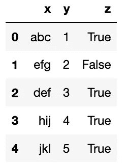
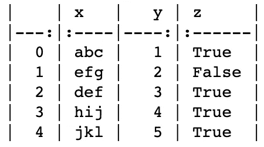
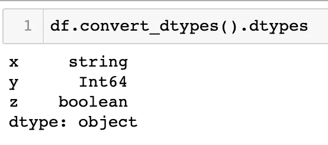
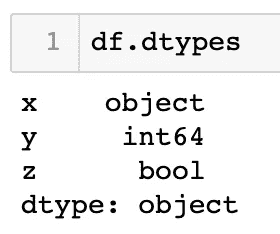
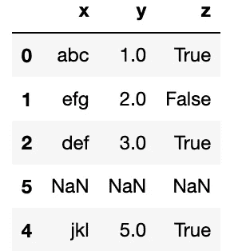
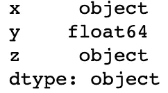
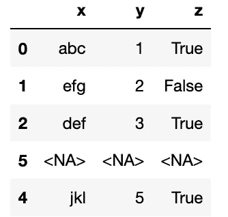
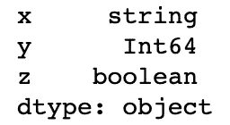
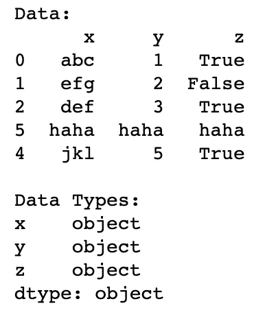

# 我喜欢 V1 熊猫的什么

> 原文：<https://towardsdatascience.com/what-i-like-from-pandas-v1-5d9108d9c176?source=collection_archive---------36----------------------->

## 熊猫 1.0.0 更新简介

来源:[维基百科](https://en.wikipedia.org/wiki/Pandas_(software))

毫无疑问，Pandas 已经成为 Python 社区中数据科学的重要组成部分。几乎所有的数据操作都以熊猫为基本步骤。2020 年，熊猫发布了它的 1.0.0 版本，让我撞见了它们的`Documentation Page`并发现了很酷的功能。在所有的特性中，这里是我最喜欢的

# 将数据帧转换为降价

假设我们有这样一个数据框架(确保您使用的是 1.0.0 版或更高版本)

我每天都在使用 markdown(和 latex)来写报告、文章或手册。和桌子是非常重要的一部分。我几乎所有的作品都包含一个表格。把一个表格剪成`.png` 文件并不是我真正擅长的，而且文件更大。所以我总是以访问[表格生成器](https://www.tablesgenerator.com/markdown_tables)告终。

我发现有一个`DataFrame.to_markdown`方法真的很有帮助。我可以直接从 pandas 打印我的表格到 markdown 支持的文档。这是我最喜欢的。只要做一个`pd.to_markdown()`，我就可以得到它的降价形式。

注意:你需要一个`tabulate`库来完成。使用`$ pip install tabulate`安装

降价格式结果中的 df

# 新数据类型

Pandas 会自动设置数据类型。但是，`string`或除其[扩展类型](https://stackoverflow.com/questions/29245848/what-are-all-the-dtypes-that-pandas-recognizes)之外的任何非基本数据类型都将被转换为`object`。

在熊猫 1.0.0 中，他们为`string`和`boolean`发布了自己专用的数据类型(之前用的是`numpy`)。而且他们还让`DataFrame.convert_dtypes`自动把数据类型改成最合适的。

看看下面的区别

已转换数据帧(左)和未转换数据帧(右)的数据类型

没有什么真正影响到我，因为我不太喜欢优化数据类型的使用。相反，我通常以矢量化或类似的方式结束，并将它们作为张量进行处理。

但是，显式地使用`string`而不是`object`将帮助我快速判断我的数据。

现在，让我们试试另一件事如何使用一些重新索引。观察数据类型是如何变化的。

仔细检查丢失的值。Pandas 默认情况下(在撰写本文时)将缺少的值更改为`np.NaN`。

然而，熊猫 1.0.0 实际上支持`NaN`数据类型，称为`pd.NA`。当我们`convert_dtypes`时，`NaN`值将被转换成`pd.NA`。参见下面的例子

如果您看到了差异，向未转换的数据帧中添加一个缺失值会将数据类型更改为`object`。另一方面，转换后的 datframe dtypes 支持缺失值，因此它们不会更改数据类型。这使数据帧进入**一致性**。这是我长久以来一直在寻找的。

熊猫。那

`Pandas.Na`是缺失值的 pandas 数据类型(通常称为`NaN`)。正如我们之前演示的，默认情况下，pandas 将缺失值设置为 not as `pd.NA`。这是因为 pandas 数据类型是基于 numpy 构建的，所以它是一个`numpy.nan`。为了改变它，我们必须手动将数据类型从`numpy`改变为`pandas`(您可以使用`convert_dtypes`)。

当我想选择`pandas`数据类型而不是`numpy`时，我想向您展示一个场景。比方说，我们有缺失的值。如果我们要通过一些特定的值来使用`fillna`，那么`NaN`发生了变化，而且还改变了数据类型。

现在，最重要的是，pandas 数据类型(在`convert_dtypes()`之后)在某种程度上不能被改变。与前面的示例不同，用 string 填充整数缺失值可能会导致错误。这种稳健性正是我们在数据中所需要的。看看下面出现的错误

# 结论

Pandas 新的专用数据类型带来了与以前版本的对比差异。尽管在某些情况下使用不合适，但这些新类型是一个很大的进步。

将`DataFrame`转换为 markdown 格式的新方法也对作者产生了很大的影响，尤其是在处理大量数据时。

熊猫 v1 更新还有很大的使用潜力。请看一下它的[文档页面](https://pandas.pydata.org/docs/whatsnew/v1.0.0.html)