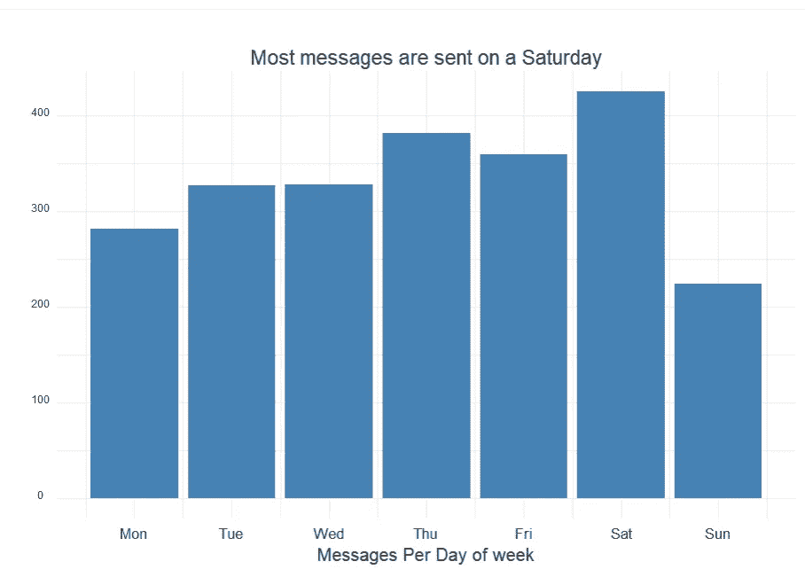
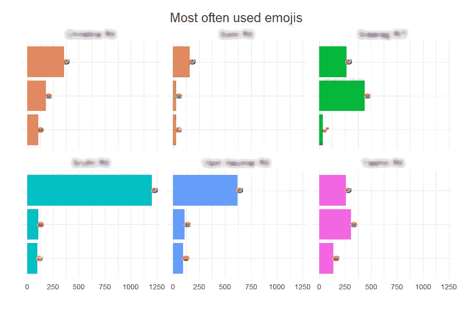
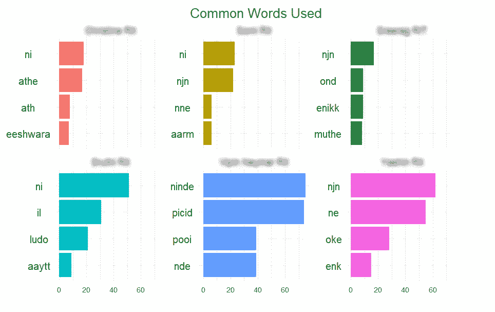
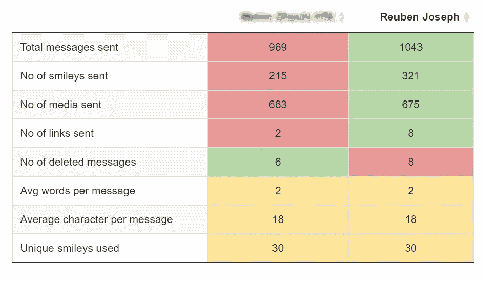
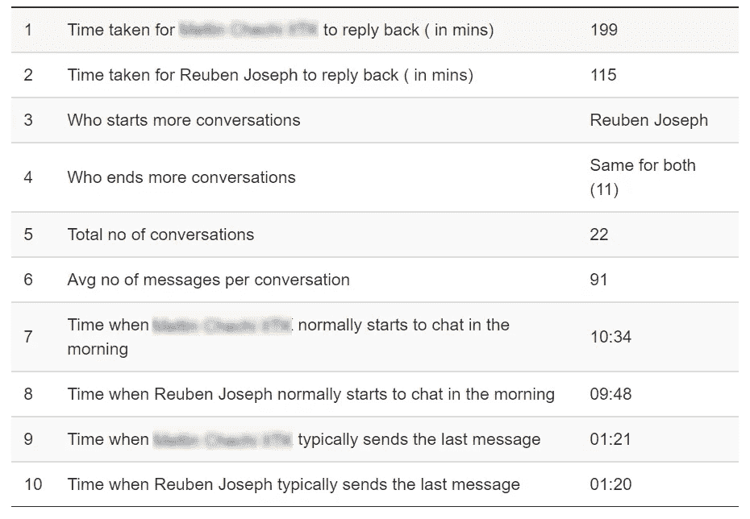
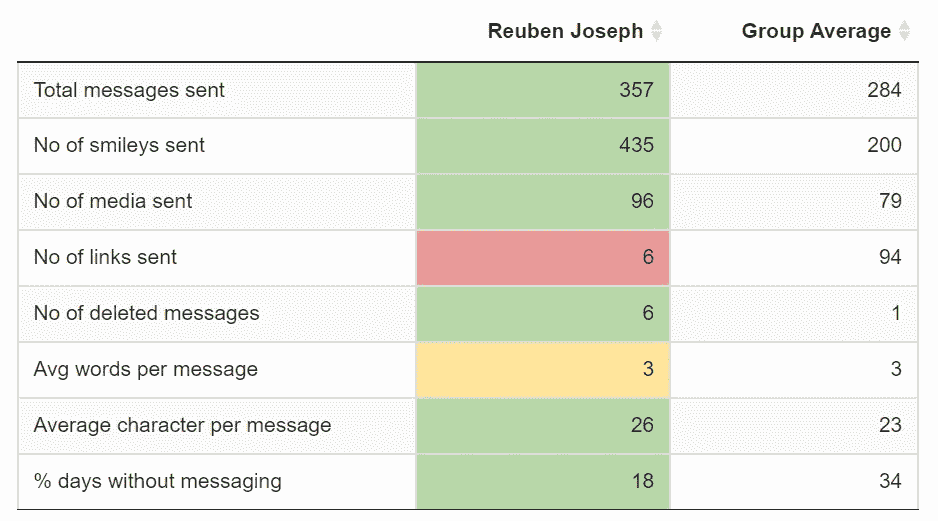
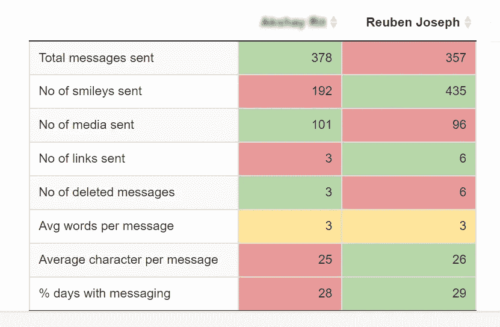
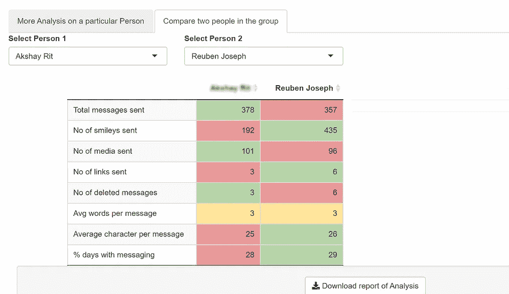
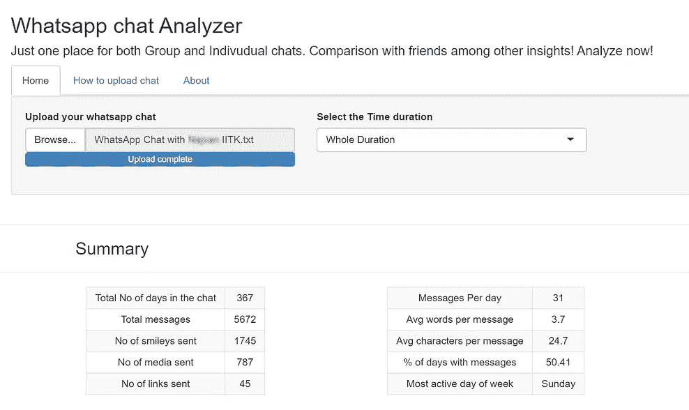

# 通过分析 WhatsApp 聊天，我了解到

> 原文：<https://towardsdatascience.com/what-i-understood-by-analyzing-whatsapp-chats-816a62b1aeee?source=collection_archive---------35----------------------->

## 我们在日常 WhatsApp 聊天中留下的数据轨迹如何揭示深刻的见解

确实很难想象我们生活中有一天不使用 WhatsApp 至少一次。这就是这个应用在我们日常生活中的重要性。Whatsapp 为有朋友、家人和同事的群体提供了一个共存的绝佳平台。多年来，我们已经在应用程序中发出了数千条信息，阅读了数百万条信息。因此，我觉得分析这些信息会产生非常令人惊讶的结果，并给出我们生活中许多方面的细节，而且确实如此！！

简单的谷歌搜索让我找到了一些允许人们分析 Whatsapp 聊天记录的网站。我尝试了大部分的应用程序，我想建立一个小的应用程序，它将提供比现有的应用程序更多的分析，以及用户想要看到的东西。

1.  该应用程序应该能够自动检测上传的聊天是否是一个群体，或者是否是两个人之间的聊天，并相应地显示相关的可视化效果，而不必单击任何其他按钮。用户只需上传聊天。
2.  从用户的角度来看，消息、表情符号、媒体等的绝对数量几乎没有任何意义。因此，我的重点是在两个人的统计数据之间或与平均值之间提供良好的比较，这样更容易理解和可视化，也增加了使用这个分析器的兴奋感。
3.  在用户想要放大到某个特定时间段的情况下，可以指定要分析的聊天持续时间。有这样一个输入帮助我理解了新冠肺炎对信息的频率和影响。
4.  能够下载分析和可视化的报告，可以很容易地与他人分享。

考虑到这些，我用 shiny 和 R-Markdown 创建了一个仪表板。

**你可以在这里找到我创建的仪表盘:**[**【https://reubenjoseph13.shinyapps.io/Whatsapp_Analyzer/】**](https://reubenjoseph13.shinyapps.io/Whatsapp_Analyzer/)

通过这篇文章，我想向你展示从一次聊天中可以提取的信息的深度。请随意浏览文章中的不同图片，这些图片大多不言自明。如果你想了解这个项目技术方面的更多细节，你可以在这里阅读。但是别忘了看这篇文章的结论部分。

# 1.通用图和图形—个人聊天和群聊都通用

**基本求和**

这些只是一些非常基本的对话总结，如消息总数、表情符号等，以及一些使用这些信息计算的平均值。收到消息的天数百分比可用于了解聊天的活跃程度。如果是个人聊天，此表会稍有变化，因为活动成员数量、名称更改次数等项目不适用。

群组聊天的汇总表

个别聊天的汇总表

## 基本可视化

和你朋友的小组在周末或工作日有更多的消息吗？你倾向于在一天中的什么时候发送更多的信息？谁是小组中最活跃的人？下面的观想将帮助我们回答这些问题。下面的图表显示，星期六是大多数邮件发送的时间，大多数邮件在晚上 10 点发送。

在单独聊天的情况下，还会进行词汇分析，并比较一个人使用的独特单词的数量。您可以将这些数据展示给总是回复“mm”或“k”的人:)

“最常用的表情符号”和“常用词”的图表显示了在小组中最活跃的 6 个人，只是为了了解聊天中发生了什么。为特定的个人寻找最常用的单词和表情符号的选项也在后面的阶段给出。

***字云*** 也显示在个人聊天和群聊中(既针对一般的群组，也针对群组内的特定人)。这有助于描述正在发送的文本。云这个词在不同的群体和不同的人之间有很大的不同。

# 2.个别聊天的具体分析

如前所述，我试图提供这两个人之间各种统计数据的大量比较。对于个人聊天，有两个表—一个用于比较琐碎的数据，另一个用于非常有见地和更具分析性的数据。

这个表格非常简单明了。绿色用于突出显示较高的值，红色用于突出显示较低的值。如果两个人的值相同，则使用黄色。现在让我们看下一个有更深入分析的表格。

回复的时间是我们希望在朋友中检查的一个主要因素。回复的时间也是两人关系水平的一个指标，不同的人和某人聊天的时间会有很大的不同。这个值可能有点偏高，因为很多时候，晚上发送的消息的回复要到第二天才收到。

我们总是想知道自己是不是那个总是先发信息开始谈话的人。聊天数据可以告诉我们谁是对话的发起者，谁是对话的结束者。为了找到这一点，我不得不思考 WhatsApp 中的对话通常是如何发生的。当有人开始对话时，我们会在接下来的两天里不停地给对方发信息。有时，对话在那一刻就结束了，只交换了几条信息。几天甚至几周后，当其中一方开始发信息时，下一次对话就开始了。因此，当两个连续消息之间的间隔超过 2 天时，将开始新的对话。这就是信息如何被分组到不同的对话中。

找到夜晚和早晨发送信息的平均时间将会模糊地给出一个人的睡眠模式的概念。这里很明显我一般比我的朋友醒得早(或者至少我早上比她早查看我的 WhatsApp！)

# 3.群聊的具体分析

# 报表生成

仪表板还可以选择将分析结果导出为 HTML 文件，以便与朋友分享。这里的可以看到导出文件的示例[。](https://drive.google.com/file/d/1k0PCsNa7wlv7UfPtyCnMeK99TyPuznNM/view?usp=sharing)

# 结论

整个项目只是让我自己对数据分析和可视化有了更多的了解，帮助我理解了很多错综复杂的细节。这绝对是一个伟大的学习周期。我鼓励任何开始从事数据分析的人从事这样的项目。

与你的朋友比较各种统计数据，并就谁开始发送更多的消息和发送更多的消息与他们友好地开玩笑，这很有趣。其他朋友也跟我说，看看所有的对比表，挺有意思的。

这让我意识到，仅仅一次聊天就能挖掘出很多真知灼见。在分析一个人的几次聊天时，通过检查他通常在早上和晚上发送信息的时间以及他们的睡眠模式，了解他/她是否是对话的发起者，很容易找出这个人的信息模式？了解他们在特定群体中的活跃程度，这个列表是无止境的。这些见解将有助于描绘一幅人的本质的图画。

尽管 WhatsApp 坚称自己无法“阅读”我们的信息，但他们可以轻易获得信息发送时间、发送对象、阅读时间等数据。仅仅是一个人的这些数据就足以得到这个人的完整轮廓。如果我发现 WhatsApp 会将这些数据用于某些用途，那就不足为奇了。当你有一个非常有代表性的样本的如此丰富的数据的时候，不能得到信息的内容几乎不会是一个因素。这些见解肯定会被用于产品的开发，我希望它能保持下去。其他没有吹嘘端到端消息加密的消息平台将能够获得更丰富的数据集，天知道他们会用这些做什么！

研究这些数据让我意识到，当我们使用这些公司的产品时，我们向它们提供的数据是多么有价值。

# 仪表盘

希望你喜欢这个小项目，如果你想了解这个项目技术方面的更多细节，你可以在这里阅读。