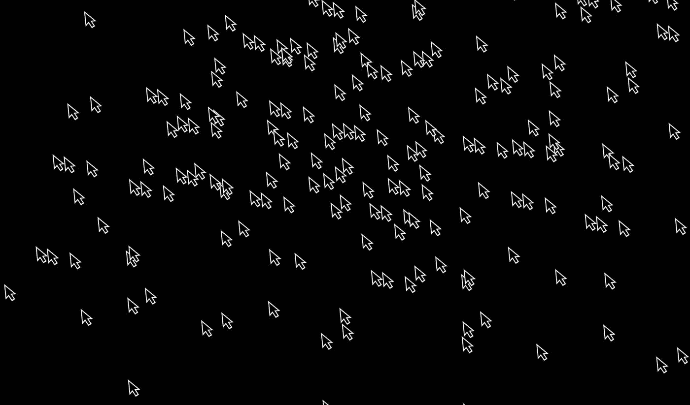
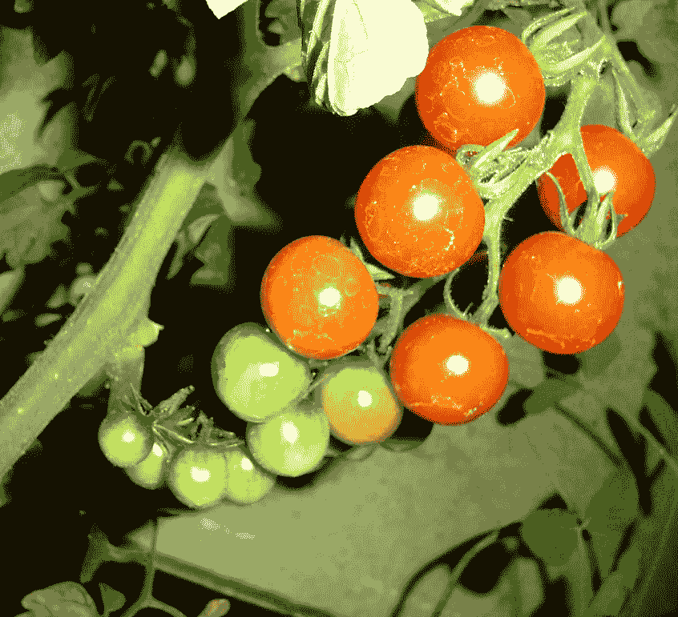

# 如果数据自己可视化会怎样？

> 原文：<https://towardsdatascience.com/what-if-data-visualized-itself-fd2e5dc1d744?source=collection_archive---------54----------------------->

## 大自然如何组织隐藏的信息层

作者图片

> “在这种复杂的多维数据环境中，可视化的作用将是提供识别这些(自然)现象的涌现模式和过程的能力的关键。可视化本身将变得有机，因为它需要适应模拟来自广泛来源的信息，从微观/有机到宏观/行星状态。”[1]

在将计算和算法设计方法应用于当代设计实践的过程中，计算机已经成为一种能够将设计者的逻辑转化为计算逻辑，从而实现抽象自动化的媒介。这种应用的例子包括生成印刷系统和参数化建筑实践，其中形式由参数值的自适应和模块化范围来指定，这些变量通过输入的数据流量来定义它们自己。计算允许规则的自动化和响应这些数据的表格的实时生成，从而在许多情况下挑战了先前持有的过程和产品之间的区别。

生成的抽象允许设计师超越任意的社会形式惯例。使用模拟复杂系统的模型导致模式的产生，这些模式是超越文化和社会影响的自然发生过程的结果。生成过程帮助我们理解世界，并提醒我们宇宙本身就是一个生成系统，千变万化，千变万化。因此，从自然中寻找不仅是描述性的，也是组织性的灵感是有意义的。

> 在我们对熟悉的解释模型的热切渴望中，我们冒着没有注意到我们自己的倾向和自然现象中固有的可能性之间的差异的风险[2]

大自然似乎留下了它的努力的证据，我们是这些努力的见证人，却忘记了这样一个事实:每一种模式都仅仅是运动中更长时间运作的快照，一种信息交换的快照。

演职员表:利根在[的免费图片](https://www.freeimages.com/photo/tree-ring-1578583)

时间的流逝被记录下来，例如，树木每年都会长出一个新的保护套。树的横截面以年轮的形式揭示了这些数据层，年轮是由于四季生长速度的变化而产生的。树木年轮在有明显冷热季节的环境中更明显。典型地，一个年轮记录了树生命中一年的流逝。年轮的宽度与特定年份的降雨量成正比。因此，一棵老树的年轮可以告诉我们古代的气候，不同大陆的年轮可以进行比较，以推断不同的气候条件。在某些贝壳和珊瑚上也可以看到类似的年轮。

对于一个信息设计师来说，这种按树序的 *(dendron = tree，Chronos = time，logos = the science of)* 现象可以被视为一种数据可视化，因为:
1。**它通过视觉或经验传达量化信息**，即树龄、当地气候条件等。
2。**它以某种示意形式**提取信息，包括信息单元的属性或变量，即环的数量、环的宽度等。

具有再生能力的自然似乎拥有一种类似于某些生殖艺术和设计实践的智能。树木在这方面的作用是作为数据收集*文化探针*，通过与环境的复杂互动，不仅包含而且传达留在树木上的印记。

类似地，例如一堆西红柿或草莓，虽然形状相似，但通过其可观察到的特征来指示成熟度。它们可以放在一个可见光谱上，在这种情况下，从硬到软，或从绿色到红色。由于它们的形状相同，信息容器被忽略，而里面的内容成为焦点。以这种方式比较一个西红柿和另一个西红柿，让人想起一种可视化技术，叫做“小倍数”，由爱德华·塔夫特推广。小倍数指的是许多具有相同比例和轴的图表，这些图表彼此相邻放置，因此易于相互比较。

([左-Rod Miles at FreeImages](https://www.freeimages.com/photo/natural-gradient-1498307))([右-Simone Dalmeri at Unsplash](https://unsplash.com/photos/qVjIBN1P-co) )绣球花的颜色从蓝色到粉色不等，取决于它们生长的土壤类型，直接映射到土壤的 pH 值水平。

([左图 Unsplash 的 Adam niecioruk](https://unsplash.com/photos/0wmvMaoLCSg))一些地衣品种的颜色和纹理表明了空气污染的程度(右图- *作者的图片*)这些铅笔看起来非常像直方图。

这样的例子本身就是独立的系统，它为我们提供了查询信息如何在交换时自动可视化的方法，而不需要外部的干预。当我想到这个想法时，我很快发现一个类似的主题已经被 Dietmar Offenhuber】理论化了，被称为“自记”或“索引可视化”。自记可视化肯定会根据数据的物理性和物质过程对数据进行重新想象，并为此勾勒出清晰的方法。物体留下的痕迹 ***变成了*** 可视化，而不是将数据抽象成隐喻。

Autographic vis 也植根于查尔斯·桑德斯·皮尔士的符号学，它将索引定义为"*一个对象与其在现实世界中的影响之间的因果联系:培养皿中染色的细菌培养物，环境中污染物的化学特征，书页上的磨损。索引将抽象的信息领域与身体经验联系起来。**【3】*然而，它们往往是反馈回路的符号，而不是整个系统本身的符号。另一方面，我提到的例子，建议将自动签名方法引向系统框架。正如 Tufte 将“数据-墨水”的最大化理论化，这一有机过程推测了“数据-能量”的最大化。数据既不会从一个集中的位置出现，也不会被可视化，而是随着时间的推移从许多因果循环的相互作用中出现。这种关于大数据的讨论方法可能会减少少数科技巨头对信息的垄断。

[国内数据串流公司](https://domesticstreamers.com/projects/)是一家数据可视化工作室，将这种技术应用于他们交流信息的方式。他们的项目经常使用人类作为一种手段来产生集体和参与性的数据可视化体验，这可能采取以数字为媒介的物理环境的形式。通过将图形和图表从它们熟悉的数字环境中取出，并放置在这些独特的物理环境中，信息呈现出一种雕塑或面向对象的结构。人们也更有可能分享他们的故事，一旦他们在个人电脑的“个人领域”之外经历过，在那里他们可以更容易地比较不同的有形价值。

例如，在一个名为情绪测试的项目中，他们只建立了一套简单的规则，即数据将由个人贡献者进行物理颜色编码。新兴的可视化是一个人口统计叙事的新兴地图，可以很容易地阅读，同时仍然保持其复杂性。数据及其抽象只有在人们的参与下才会具体化。随着每一次互动，作品吸收了更多的层次，并在某一点上跨越了从过程到实际产品的门槛，这可以被称为可视化。尽管如此，即使在那之后，它也不会停止成为一个*过程*。

它可以被描述为空间中的数据语言，而不是图表。这种数据空间的概念仍未被探索，其中一个图可以被放置在物理或数字世界中，以便它在空间和时间上展示自己。只有当人们意识到他们希望在受控环境中处于什么位置以及如何处于受控环境中时，信息才会出现，并且可视化是特定位置和参与者部分所独有的。在不同的背景下，艺术品会以不同的方式出现，从而展示模块化和短暂性的主题。这类项目提出了一个问题——数据生成者和数据设计者的角色必须是互斥的吗？

信息研究员[韦斯利·威利特想象到 2033 年，自主智能体](http://www.wjwillett.net/content/cetonia/)将如何被使用，以实时捕捉和可视化复杂的模式，从而真正模仿自然。他的设想是采用“Cetonia scarabs”的形式，可以部署成无人机群。每个机械昆虫都配备了嵌入式摄像头和传感器，显然可以调查、计算和记录几乎任何事情。据说，该集群还能够进行内部协调，以形成交互式图表、图形和可视化图表来显示数据。

如果处理得当，这种分散的设计过程可以成为可视化多样性和粒度的一种方式，否则很难做到这一点。它还可以减少将复杂莫测的事物可视化的劳动，比如互联网、加密货币或其他形式的超文本。

> “如果数据的视觉表示与数字表示一致，则图形不会变形。那么数据的“视觉表现”是什么呢？在图形表面进行物理测量？还是感知的视觉效果？我们怎么知道视觉图像代表了潜在的数字？”[4]

我收集的更多例子:[https://in . Pinterest . com/vivek m2/self-visualizing-information/](https://in.pinterest.com/vivekm2/self-visualising-information/)

**引文:**

*[1]利马·曼努埃尔，视觉复杂性:信息的映射模式(纽约:普林斯顿建筑出版社，2011)*

*【2】凯勒(1985)于米切尔·雷斯尼克，《了解生命》(麻省理工学院媒体实验室，剑桥:发表于《人工生命》第 1 卷，第 1-2 期，1994 年春)*[*【https://web.media.mit.edu/~mres/papers/ALife/ALife.html*](https://web.media.mit.edu/~mres/papers/ALife/ALife.html)

*【3】奥芬胡伯，迪特尔马&奥尔坎·特尔汉，索引可视化——无数据信息显示(2015)*

*[4]塔夫特，爱德华·r .数量信息的视觉显示(切希尔:图形出版社，1983)*

**其他参考:**

*Anderson，Mally，探索去中心化:区块链技术和复杂协调，《设计与科学杂志》(麻省理工学院出版社，2019 年 2 月)*[【https://jods.mitpress.mit.edu/pub/7vxemtm3】T21](https://jods.mitpress.mit.edu/pub/7vxemtm3)*(2019 年 5 月 20 日访问)*

格兰特·大卫·博尔默，《数字文化的理论化》(纽约:塞奇出版有限公司；1 版 2018)

*本杰明·布拉顿，《堆栈:论软件和主权》(伦敦:麻省理工学院出版社，2016 年)*

*本杰明·布拉顿，“后人类世的一些痕迹效应:加速论地缘政治美学”，《e-flux》，46 (2013)* [*后人类世的 https://www.e-flux.com/journal/46/60076/some-trace-effects-——加速论地缘政治美学/*](https://www.e-flux.com/journal/46/60076/some-trace-effects- of-the-postanthropocene-on-accelerationist- geopolitical-aesthetics/)*(2019 年 6 月 19 日获取)*

*Burnett，Kathleen，《走向超文本设计理论》(后现代文化 3.2，1993 年 1 月)*[http://PMC . iath . Virginia . edu/text-only/issue . 193/Burnett . 193](http://pmc.iath.virginia.edu/text-only/issue.193/burnett.193)*(2019 年 6 月 19 日访问)*

*http://www.dataphys.org/list**[*&伊冯·詹森《物理可视化列表》(2012 年 7 月 6 日访问)*](http://www.dataphys.org/list)*

**加兰特，菲利普&埃伦·k·列维，《复杂性》(列奥纳多，第 36 卷，第 4 期，2003)页 259–267，JSTOR*[*www.jstor.org/stable/1577312*](http://www.jstor.org/stable/1577312)*

**加兰特菲利普什么是生成艺术？作为艺术理论语境的复杂性理论(第六届生成艺术会议，2003)**

**汉拉汉，帕特，《自我阐释现象》(斯坦福图形，2004 年 11 月)*[*http://www . Graphics . Stanford . edu/~汉拉汉/talks/Self diagrating/*](http://www.graphics.stanford.edu/~hanrahan/talks/selfillustrating/)*(2019 年 6 月 28 日访问)**

**奥芬胡伯，迪特马尔，“自动签名可视化——在谷歌剑桥/波士顿奇演讲”(2019 年 3 月)*[*https://www.youtube.com/watch?v=4_YNpx1R8i8*](https://www.youtube.com/watch?v=4_YNpx1R8i8)*(2019 年 6 月 28 日访问)**

**塔夫特，爱德华·r·展望信息(柴郡:图形出版社，1990)**

**沃尔多普，米契尔，《复杂性:在秩序和混乱边缘的新兴科学》(纽约:西蒙和舒斯特，1992)**

**维纳·诺伯特，《人类对人类的利用:控制论与社会》(伦敦:自由协会图书，1989)**