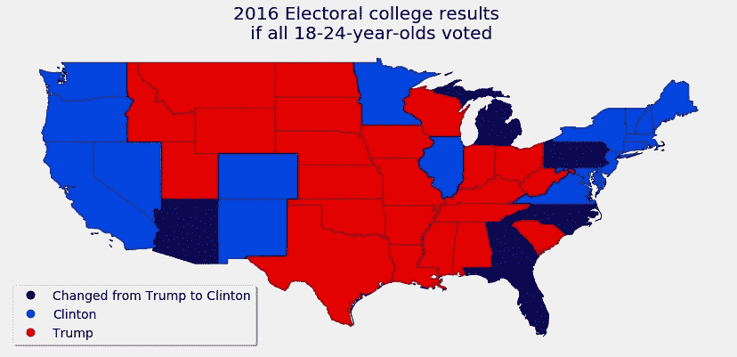
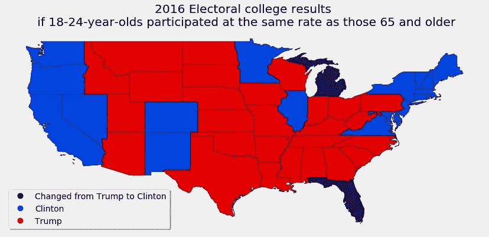
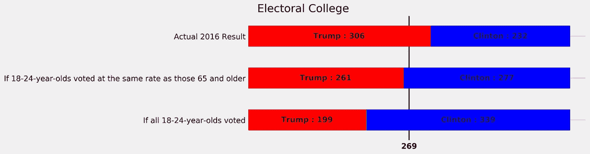

# 如果 2016 年有更多年轻人投票会怎样？

> 原文：<https://towardsdatascience.com/what-if-more-young-people-had-voted-in-2016-7242f251f8e6?source=collection_archive---------24----------------------->

## 如果 18-24 岁的年轻人参加了更多的投票，他们能改变选举结果吗？

几十年来，投票的年轻美国人(无论如何定义年轻)远远少于年长的美国人。这导致人们猜测，年轻人仅仅通过大量投票就可以改变美国大选的结果。考虑到这一点，我开始观察 2016 年是否会出现这种情况。具体来说，如果 18-24 岁的年轻人中有更多人投票，他们会改变选举结果吗？

众所周知，美国总统选举不使用民众投票，因此仅凭全国民调结果不一定能很好地预测结果会如何变化。选举人团意味着年轻选民的地理分布和他们的地区政治偏好都是相关的，而这两者都被国家数据所忽略。因此，我决定弄清楚如果更多的年轻人投票，各州的投票总数会有怎样的变化。

## 如果所有 18-24 岁的人都在 2016 年投票了会怎样？

利用各州的参与率，我能够计算出每个州 18-24 岁没有投票的人数。然后，利用每个州的投票后调查数据，我计算了每个州的每个候选人会有多少新选票。结果显示，希拉里·克林顿(Hillary Clinton)将赢得六个州，而不是唐纳德·特朗普(Donald Trump):亚利桑那州、佛罗里达州、佐治亚州、密歇根州、北卡罗来纳州和宾夕法尼亚州。这将使克林顿多获得 107 张选举人票，并以令人信服的 339 票对 199 票赢得选举团的胜利。

## 如果 18-24 岁的选民和 65 岁及以上的选民投票率相同会怎样？

当然，期望每个 18-24 岁的人都去投票是非常不现实的——没有哪个人口统计数据的投票率达到 90%,更不用说 100%了。也许一个更好的问题应该是——如果 18-24 岁的人和 65 岁及以上的人一样投票，会发生什么？

虽然结果不太引人注目，只是改变了两个州的结果，但这足以改变选举的结果。在这种情况下，佛罗里达州和密歇根州将由希拉里·克林顿而不是唐纳德·特朗普赢得。有了 45 张新的选举人票，希拉里将获得 277 票对 261 票的选举人团胜利。

## 结论

我们可以看到，如果每个 18-24 岁的人都投票，希拉里·克林顿会轻松获胜。也许这并不奇怪，因为没有人 100%参与。更有趣的结论是，18 至 24 岁的选民本可以通过与 65 岁及以上选民相同的投票率来改变选举结果，这是一个更现实的投票率。

这个最终图显示了上述每个场景中的胜利幅度，以及实际的 2016 年选举人团结果。

## 数据来源和假设

为了进行这项分析，我收集了投票后的民意调查数据，以及选民参与率和人口统计数据，全部按年龄分类。出口民调数据来自爱迪生研究公司，该公司为包括美国广播公司、美联社、哥伦比亚广播公司、美国有线电视新闻网、福克斯和全国广播公司在内的媒体财团进行出口民调。选民参与率和人口数据取自美国人口普查。数据操作和绘图是使用 python 中的 Pandas 和 Geopandas 完成的。我的笔记本和数据集可以在 Github [这里](https://github.com/chowell2000/Election_2016)找到。

爱迪生收集了 29 个州的人口统计投票数据，以及全国人口统计投票偏好。他们收集了三个州 18-29 岁选民的投票数据，但没有收集 18-24 岁选民的数据。在这些州，我使用了 18-29 岁的数据。对于其余的 21 个州，我使用了全国 18-24 岁的投票偏好来代替州一级的数据。然而，值得注意的是，在这些没有州级 18-24 岁出口民调的州中，没有一个州是接近的——胜利的幅度从 12%(特拉华州，克林顿获胜)到 91%，平均胜利幅度为 29%。此外，当我添加额外的年轻选民时，这些州都没有改变获胜者，所以在这里使用全国数据应该不会影响结果。

此分析中的大假设是出口投票数据是准确的，因为在出口投票情况下很难实现代表性采样。如果那些愿意回答投票后调查的人和那些不想回答调查的人投了不同的票，结果可能会有偏差。此外，不清楚爱迪生使用了什么统计方法，所以不可能知道他们做了什么假设。幸运的是，人口普查数据非常全面，包含了所有 50 个州的大量选民参与和人口统计数据。此外，已经表明，如果选民投票率信息是错误的，那么它往往会高估投票，所以如果有什么，这种分析低估了年轻选民的潜在影响。