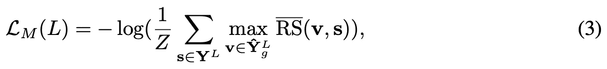

# 如果使用多个感受野进行图像修复会怎样？

> 原文：<https://towardsdatascience.com/what-if-multiple-receptive-fields-are-used-for-image-inpainting-ea44003ea7e9?source=collection_archive---------35----------------------->

## 综述:基于生成多列卷积神经网络的图像修复

大家好。好久不见！今天，我们将讨论另一篇名为“通过生成式多列 CNN(GM CNN)进行图像修复”的修复论文。本文使用的网络架构类似于我们在之前介绍过的那些论文[。本文的主要贡献是对损失函数的一些修正。](/a-breakthrough-in-deep-image-inpainting-review-generative-image-inpainting-with-contextual-1099c195f3f0)

# 简短回忆

正如我在[之前的文章](/a-breakthrough-in-deep-image-inpainting-review-generative-image-inpainting-with-contextual-1099c195f3f0)中提到的，如何利用图像中剩余像素给出的信息对于高质量的图像修复至关重要。图像修复的一个非常直接的意义是直接复制图像本身中找到的最相似的图像补丁，并粘贴在缺失的区域上。有趣的是，我们应该认识到 ***对于实践中的缺失区域*** 并没有“正确”的答案。在现实中，给定一个损坏/屏蔽的图像，您无法知道原始图像(地面真相)进行比较。于是，我们就有了这么 ***许多答案中缺失的领域*** 。

# 简介和动机

从以前的修复论文中，我们知道感受野对于图像修复是非常重要的。对于一个 3×3 的核，我们可以通过 ***调整扩张率来控制它的*** 感受野。如果扩张率是 1，我们就有一个 3×3 的感受野。如果扩张率是 2，我们通过跳过一个相邻像素得到一个 5×5 的感受野，依此类推。你可以参考我以前的帖子来了解更多的细节。这里， ***如果我们采用 3×3、5×5 和 7×7 个具有扩展卷积的内核会怎么样？本文将其定义为多栏式结构。***

在我之前的[关于上下文注意力层的帖子](/a-breakthrough-in-deep-image-inpainting-review-generative-image-inpainting-with-contextual-1099c195f3f0)中，搜索与缺失区域最相似的图像补片的过程被嵌入到生成器网络中(即，这个过程被用在训练和测试阶段)。在这项工作中，这一过程仅通过设计一个新的损失项在训练中使用。

由于对缺失区域没有“正确”答案的事实，逐像素重建精度损失项(即 *L* 1 损失)似乎不适用于图像修复。作者提出 ***基于丢失像素的空间位置对 L1 损失项进行加权。*** 靠近有效(剩余)像素的空间位置对于 *L* 1 损失应该具有更高的权重，因为它们对于重建具有更合理的参考，反之亦然。

# 解决方案(简而言之)和贡献

图一。该方法给出了一些修复结果。图片来自王怡等人的[论文](https://arxiv.org/pdf/1810.08771.pdf) [1]

在我看来，这篇论文遵循了我们之前讨论过的图像修复的趋势。首先，作者采用了具有扩张卷积的多分支细胞神经网络，而不是单分支细胞神经网络。 ***在三个不同的分支中使用三种不同的核大小，用于实现不同的感受野和提取不同分辨率的特征。***

其次， ***引入两个新的损失项来训练网络*** ，即置信度驱动的重建损失和隐式多样化马尔可夫随机场(ID-MRF)损失。置信度驱动的重建损失是加权的 *L* 1 损失，而 ID-MRF 损失与由预先训练的 VGG 网络计算的特征块比较相关。我们已经谈到了 MRF 的损失。你可以参考它来简单回忆一下。

图 1 显示了所提出的方法的一些修复结果。您可以放大以更好地查看这些高质量的结果。

# 方法

图二。提议的网络架构。图片来自王怡等人的[论文](https://arxiv.org/pdf/1810.08771.pdf) [1]

图 2 显示了提出的生成多列卷积神经网络(GMCNN)的网络架构。如您所见，有一个多列发生器网络、两个鉴别器(全局和局部)和一个用于计算 ID-MRF 损耗的预训练 VGG19。

***发电机网络中有三列，每列使用三种不同尺寸*** 的滤波器，即 3×3、5×5 和 7×7。请注意，这三列的输出被连接起来，馈入另外两个卷积层，以获得完整的图像。

# 一维 MRF 正则化

图 3。使用不同的相似性度量搜索最近的邻居来修复结果。(a)使用余弦相似性的修补结果;( b)使用建议的相对相似性的修补结果;( c)地面真实图像(红色矩形突出显示填充区域)。图片来自王怡等人的[论文](https://arxiv.org/pdf/1810.08771.pdf) [1]

简单地说，对于 MRF 目标，我们希望 ***最小化生成的特征和由预训练网络*** 计算的地面真实值的最近邻特征之间的差异。在大多数以前的工作中，余弦相似性度量被用来搜索最近的邻居(你可以阅读我以前的帖子[ [这里](/a-breakthrough-in-deep-image-inpainting-review-generative-image-inpainting-with-contextual-1099c195f3f0) ]来回顾余弦相似性度量)。然而，这种相似性度量通常为不同的生成特征补丁提供相同的最近邻，并导致模糊的修复结果，如图 3(a)所示。

为了避免使用余弦相似性度量可能导致的模糊完整图像，作者采用了相对距离度量，修复结果如图 3(b)所示。你可以看到完成的图像具有更好的局部精细纹理。

让我们来谈谈他们是如何进行相对距离测量的。设 **Y** (hat)_ *g* 为缺失区域的生成内容，**y**(hat)^*l*_*g*和 **Y** ^ *L* 为预训练网络第 *L* 层的特征。对于分别从**y**(hat)^*l*_*g*和 **Y** ^ *L* 中提取的特征面片 **v** 和 **s** ，计算从 **v** 到 **s** 的相对相似度，

其中 *mu* (。, .)是余弦相似度。 **r** 属于 **Y** ^ *L* 不包括 **v** 。 *h* 和*ε*为正常数。显然，如果 **v** 比其他特征面片与 **s** 更相似，RS( **v** ， **s** )就会大。你也可以考虑一下，如果 **v** 有两个相似的补丁 **s** 和 **r** ，那么 RS( **v** ， **s** )就会小。我们鼓励在缺失区域之外找到类似的补丁。

然后，RS 归一化如下。

最后，计算出**y**(hat)^*l*_*g*和 **Y** ^ *L* 之间的建议 ID-MRF 损耗。

其中参数 max RS(bar)( **v** ， **s** )表示 **s** 是 **v** 的最近邻，而 *Z* 是归一化因子。如果我们考虑所有生成的特征片都接近特定特征片 **s** 的极端情况，那么 max RS(bar) ( **v** ， **r** )将会很小，因此 ID-MRF 损失将会很大。

另一方面，如果 **Y** ^ *L* 中的每个 **r** 在**y**(hat)^*l*_*g*中有自己的最近邻居，那么最大 RS(bar) ( **v** ， **r** )将会很大，因此 ID-MRF 损失将会很大这里， ***的主要思想是强制/引导生成的特征面片具有不同的最近邻，从而生成的特征具有更好的局部纹理*** 。

与[之前的工作](https://medium.com/analytics-vidhya/review-high-resolution-image-inpainting-using-multi-scale-neural-patch-synthesis-4bbda21aa5bc)相同，作者使用预训练的 VGG19 来计算 ID-MRF 损耗。注意，中间层 *conv* 3_2 和 *conv* 4_2 分别代表结构和语义特征。

作者声称，这种损失与最近邻搜索有关，并且仅在训练阶段使用。这不同于在测试阶段搜索最近邻居的方法。

# 空间变化重建损失

所提出的空间变量重建损失实际上是加权的 *L* 1 损失。有许多方法来决定权重，作者使用高斯滤波器来卷积掩模以创建加权掩模，用于计算加权的 *L* 1 损失。感兴趣的读者可以参考[的论文](https://arxiv.org/pdf/1810.08771.pdf)了解详情。加权 *L* 1 损失的主要思想是靠近有效像素的缺失像素比远离有效像素的缺失像素受到更高的约束。因此，位于缺失区域中心的缺失像素应该具有较低的 *L* 1 损失权重(即较少约束)。

# 对抗性损失

与[之前的工作](/a-breakthrough-in-deep-image-inpainting-review-generative-image-inpainting-with-contextual-1099c195f3f0)类似，作者采用了改进的 WGAN 损失以及局部和全局鉴别器。再次强烈推荐感兴趣的读者阅读[论文](https://arxiv.org/pdf/1810.08771.pdf)。

# 最终损失函数

这是用于训练建议模型的最终损失函数。类似于大多数修复纸，加权的 *L* 1 损失(第一损失项)的重要性是 1。*λ*_*mrf*和*λ*_*adv*是控制局部纹理 MRF 正则化和对抗性训练的重要性的参数。

# 实验

作者在 5 个公共数据集上评估了他们的方法，即 Paris StreetView，Places2，ImageNet，CelebA 和 CelebA-HQ 数据集。在训练过程中，所有图像的大小都调整为 256×256，最大的中心孔大小为 128×128。供你参考，他们的发电机网络有 12.562 米的参数。在 GPU 上测试 256×256 和 512×512 大小的图像，每幅图像分别需要 49.37 ms 和 146.11 ms。

图 4。巴黎街景(上)和 ImageNet(下)的定性比较。(a)输入图像(b)上下文编码器(c) MSNPS (d)上下文注意(e)建议方法。图片来自王怡等人的论文

图 4 显示了巴黎街景和 ImageNet 数据集的定性比较。请放大以更好地查看修复结果。显然，所提出的方法 GMCNN 给出了具有最佳视觉质量的修复结果。如果你对更多的修复结果感兴趣，请参考[论文](https://arxiv.org/pdf/1810.08771.pdf)或他们的项目网站。

表 1。五个数据集的定量结果。王怡等人的数据来自他们的[论文](https://arxiv.org/pdf/1810.08771.pdf) [1]

正如我以前的帖子和这篇帖子开头提到的， ***PSNR 与像素重建精度有关，可能不适合评估图像修复*** 。研究人员仍然报告 PSNR 和 SSIM 供读者参考，因为这些数字指标是所有图像处理任务的基础。如表 1 所示，所提出的方法在五个数据集上实现了相当甚至更好的 PSNR 和 SSIM。

# 消融研究

表二。巴黎街景数据集上不同网络结构的定量结果。王怡等人的数据来自他们的论文

图 5。巴黎街景数据集上不同网络结构的定性比较。(a)输入图像(b)单个编码器-解码器(c)粗到细(d)在所有 3 个分支中具有固定感受野的 GMCNN(e)具有变化感受野的 GM CNN。图片来自王怡等人的[论文](https://arxiv.org/pdf/1810.08771.pdf) [1]

作者评估了图像修复任务中使用的不同网络结构的性能。我们已经介绍了[编码器-解码器结构](/a-milestone-in-deep-image-inpainting-review-globally-and-locally-consistent-image-completion-505413c300df)和[粗到细结构](/a-breakthrough-in-deep-image-inpainting-review-generative-image-inpainting-with-contextual-1099c195f3f0)。对于他们实验中由粗到细的结构，没有使用上下文注意。对于在所有 3 个分支中具有固定感受野的 GMCNN，他们使用 5×5 大小的滤波器。对于具有不同感受野的 GMCNN，在 3 个分支中分别使用 3×3、5×5 和 7×7 滤波器。定量和定性结果分别见表 2 和图 5。显然，具有不同感受野的 GMCNN 提供了最好的修复结果。

除了网络结构的选择和多个感受野的使用，作者还研究了两个提出的损失项的有效性，即置信度驱动的重建损失和 ID-MRF 损失。

图 6。巴黎街景数据集上不同重建损失的定性比较。(a)输入图像(b)空间折扣损失(c)建议的置信度驱动的重建损失。图片来自王怡等人的论文

图 6 显示了不同重建损失的视觉比较，即空间折扣损失和建议的置信度驱动重建损失。注意，空间折扣损失基于丢失像素的空间位置来获得权重掩模，而提出的置信度驱动的重建损失通过用高斯滤波器多次卷积掩模图像来获得权重掩模。作者声称他们的信心驱动重建损失效果更好。从我自己的经历来看，两次重建损失都差不多。也许你可以试一试。

表 3。在巴黎街景数据集上使用不同 lambda_ *mrf* 的量化结果。王怡等人的数据来自他们的[论文](https://arxiv.org/pdf/1810.08771.pdf)【1】

图 7。在巴黎街景数据集上是否使用 ID-MRF 损失的定性比较。(a)输入图像,( b)使用 ID-MRF 损失的修补结果,( c)不使用 ID-MRF 损失的修补结果。图片来自王怡等人的[论文](https://arxiv.org/pdf/1810.08771.pdf) [1]

图 8。在巴黎街景数据集上使用不同 lambda_mrf 的 ID-MRF 损失的定性比较。(a)输入图像(b)λ_ MRF = 2(c)λ_ MRF = 0.2(d)λ_ MRF = 0.02(e)λ_ MRF = 0.002。图片来自王怡等人的[论文](https://arxiv.org/pdf/1810.08771.pdf)

更重要的是，ID-MRF 损失项是本文最有力的主张。因此，作者显示了这一损失项的重要性，定量结果列于表 3。图 7 显示了使用 ID-MRF 损失和不使用 ID-MRF 损失训练的模型之间的差异。我们可以看到，ID-MRF 的使用可以增强所生成像素的局部细节。此外，图 8 显示了使用不同的λ_*MRF*来控制 ID-MRF 损失的重要性的效果。您可以放大以更好地查看结果。个人觉得修复效果差不多。根据表 3，lambda_ *mrf* = 0.02 在 PSNR 和视觉质量之间提供了良好的平衡。

# 结论

总之，本文的主要创新点是 ID-MRF 损失项，以进一步增强生成内容的局部细节。这种丢失的主要思想是引导生成的特征面片在丢失区域之外寻找它们的最近邻作为参考，最近邻应该是多样的，这样可以模拟更多的局部细节。

多个感受野(多列或多分支)的使用是由于感受野的大小对于图像修补任务很重要。由于局部相邻像素缺失，我们不得不借用远处空间位置给出的信息来填充缺失的像素。我想如果你关注过我之前的帖子，你就不难理解这个想法了。

使用加权的 *L* 1 损失也是由于缺少区域没有“正确”答案的事实。对于那些更靠近丢失区域边界的丢失像素，它们相对地受到附近有效像素的约束，因此应该给 *L* 1 损失分配更高的权重。另一方面，对于位于缺失区域中心的缺失像素，它们应该受到较少的 *L* 1 约束。

# 外卖食品

参考我在上面的结论，我希望你能理解提出的 ID-MRF 损失的含义，因为这是本文的核心思想。对于另外两个观点，即多栏结构和加权的 *L* 1 损失。实际上，如果你关注过我以前的帖子，我想你可以很好地理解背后的原因。我会说，多重/各种感受野的概念是深度图像修复中的常见做法。

对于加权的 *L* 1 损失，从我自己的经验来看，我认为并不能带来修复性能的明显提升。当然，实现加权 *L* 1 损失的方法有很多。如果你对这个感兴趣，你可以试一试。我也会继续做这方面的实验！:)

# 下一步是什么？

在我的下一篇文章中，我将谈论如何处理不规则的口罩。到目前为止，我们已经介绍了几种著名的深度图像修复方法。然而，它们主要集中于规则的掩模(通常是一个大的中心矩形掩模或者有时是多个小的矩形掩模)。所以，我们来看看最近研究人员是如何处理不规则口罩的。

如果你对图像修复的深度生成模型感兴趣，我强烈推荐你浏览我以前所有的帖子。希望你们喜欢:)

# 参考

[1]，，，齐，，沈，贾亚亚，[生成多列卷积神经网络图像修复](https://arxiv.org/pdf/1810.08771.pdf)， *Proc .神经信息处理系统*，2018。

再次感谢你阅读我的帖子！如果您有任何问题，请随时给我发电子邮件或在这里留言。欢迎任何建议。系统学习对我们来说极其重要。非常感谢，下次再见！:)