# 考试成绩不呈正态分布怎么办？

> 原文：<https://towardsdatascience.com/what-if-the-exam-marks-are-not-normally-distributed-67e2d2d56286?source=collection_archive---------24----------------------->

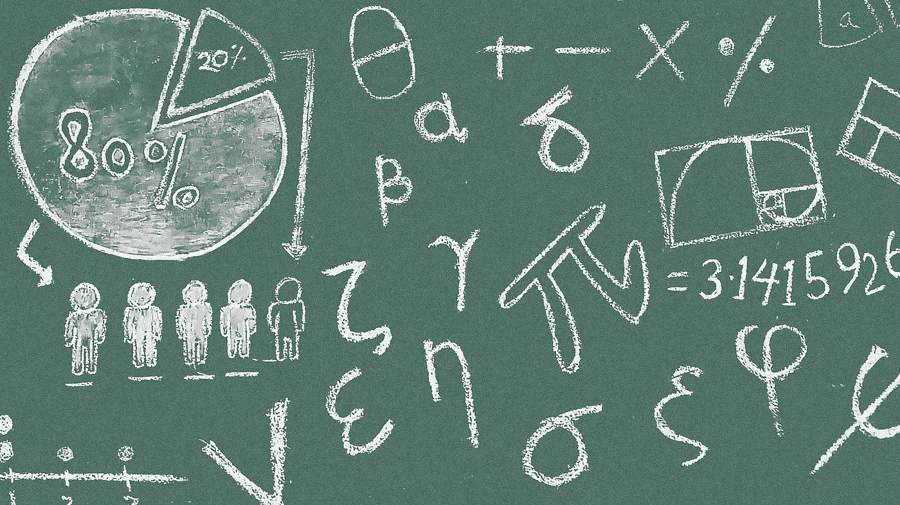

由[皮克斯波茨](https://pixabay.com/users/Pixapopz-2873171/)在[皮克斯贝](https://pixabay.com/illustrations/math-symbols-blackboard-classroom-1500720/)拍摄的照片

## 数据转换-使用 Python Scikit 实现标准化和规范化-学习

通常，当我告诉你一个学生得了 90 分，你会认为这是一个非常好的学生。相反，如果我说分数是 75，这可能意味着这个学生可能是平均水平。然而，作为一名数据科学家/分析师，我们至少需要立即问两个问题:

1.  满分是 100 吗？
2.  这个班的分数分布如何？

第一个问题很重要，也许每个人都会问，因为 90/150 并不比 75/100 好。第二个问题有点微妙，可能只有“数据人”才会有这种敏感性。

事实上，为了确保考试结果在班级中呈正态分布，通常会选择如下试题:

1.  基本和简单的问题— 70%
2.  需要对知识有深刻理解的扩展问题— 20%
3.  需要用足够的知识和一些洞察力来解决的难题——10%

如果我们有 100%容易的题或者 100%难的题呢？如果是这样的话，我们很可能在一个类中得到非正态分布的结果。

# 为什么我们需要标准化数据？


照片由 [SamuelFrancisJohnson](https://pixabay.com/users/SamuelFrancisJohnson-1207793/) 在 [Pixabay](https://pixabay.com/photos/meditation-stone-towers-stone-tower-2262835/) 上拍摄

然后，我们现在有了我们的主要话题。我在一所大学当了 5 年家教。有时不能保证考题完全符合上述比例。为了确保对所有学生都公平，换句话说，没有太多的学生不及格或太多的学生得了 A，有时我们需要将分数归一化，以确保它遵循正态分布。

此外，当我们想要比较来自不同大学的学生，或者我们想要汇总多次考试的结果时，标准化也非常重要。

为了演示的目的，让我们假设我们有 5 个不同的考试。因为我们需要随机生成期望分布，所以需要以下导入。

```
import numpy as np
import pandas as pd
import matplotlib.pyplot as pltfrom scipy.stats import skewnorm  # used to generate skewed dist
```

## 1.满分是 100。太多基本问题

```
ex1 = np.array(skewnorm.rvs(a=-10, loc=95, scale=20, size=200)).astype(int)
```

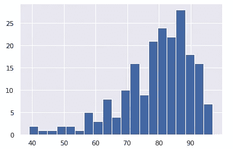

## 2.满分是 100。太多难题了

```
ex2 = np.array(skewnorm.rvs(a=5, loc=30, scale=20, size=200)).astype(int)
```

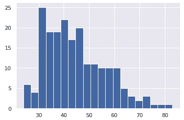

## 3.满分是 100。正态分布

```
ex3 = np.random.normal(70, 15, 200).astype(int)
ex3 = ex3[ex3 <= 100]
```

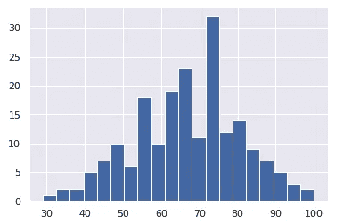

## 4.满分是 50。正态分布

```
ex4 = np.random.normal(25, 7, 200).astype(int)
```

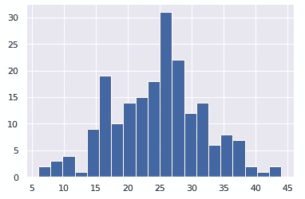

## 5.满分是 200。正态分布

```
ex5 = np.random.normal(120, 30, 200).astype(int)
```

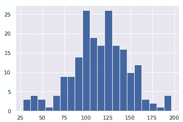

让我们使用 Seaborn `distplot`将它们绘制在一起。

```
plt.figure(figsize=(16,10))
sns.distplot(ex1)
sns.distplot(ex2)
sns.distplot(ex3)
sns.distplot(ex4)
sns.distplot(ex5)
plt.show()
```

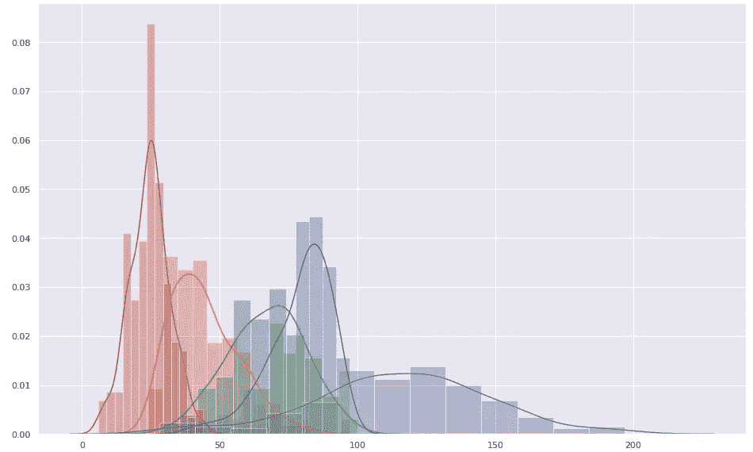

这 5 种不同的考试有完全不同的分布。当我们得到这样一个数据集时，我们无法直接比较它们。

# 最小-最大归一化

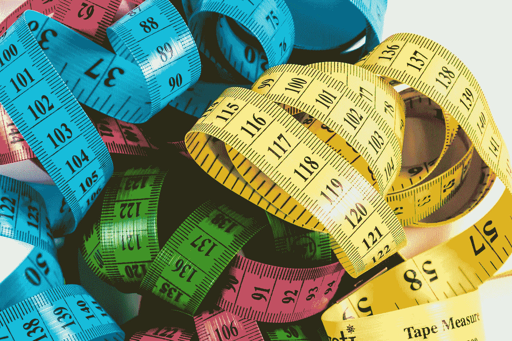

[图片由](https://pixabay.com/users/ReadyElements-8569947/)在[图片栏](https://pixabay.com/photos/carpenter-carpentry-colorful-3509492/)上发布

最小-最大归一化的基本思想是将所有值归一化到区间[0，1]中。做到这一点相当容易。

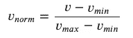

```
from sklearn import preprocessingmin_max_scaler = preprocessing.MinMaxScaler()
ex1_norm_min_max = min_max_scaler.fit_transform(ex1.reshape(-1,1))
ex2_norm_min_max = min_max_scaler.fit_transform(ex2.reshape(-1,1))
ex3_norm_min_max = min_max_scaler.fit_transform(ex3.reshape(-1,1))
ex4_norm_min_max = min_max_scaler.fit_transform(ex4.reshape(-1,1))
ex5_norm_min_max = min_max_scaler.fit_transform(ex5.reshape(-1,1))
```

请注意，我们需要将 NumPy 数组转换成向量，然后才能对它们进行规范化。因此，最简单的方法是将它们重新整形为列向量`reshape(-1, 1)`。

在它们被规格化后，我们不需要把它们转换回一维数组来可视化。下面是归一化后的直方图。现在更有信心把 5 个不同的考试结果放在一起。

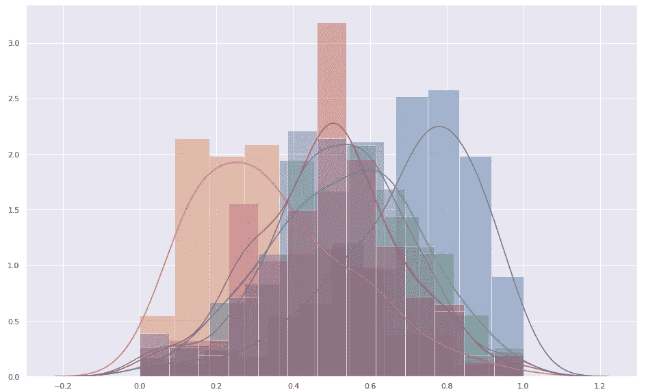

# z 分数标准化


[aitoff](https://pixabay.com/users/aitoff-388338/) 在 [Pixabay](https://pixabay.com/photos/stormtrooper-star-wars-lego-storm-2899993/) 上拍摄的照片

Z-Score 是另一种常用的技术。它被称为标准化而不是规范化，因为它在两个方面“标准化”了数据:

1.  对数据进行去均值处理，使所有标准化数据的均值等于零。
2.  通过除以标准偏差来重新调整数据，以便数据分布根据偏离平均值的程度而“扩大”或“缩小”。

因此，我们可以这样计算。

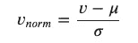

```
from sklearn import preprocessingex1_scaled = preprocessing.scale(ex1)
ex2_scaled = preprocessing.scale(ex2)
ex3_scaled = preprocessing.scale(ex3)
ex4_scaled = preprocessing.scale(ex4)
ex5_scaled = preprocessing.scale(ex5)
```

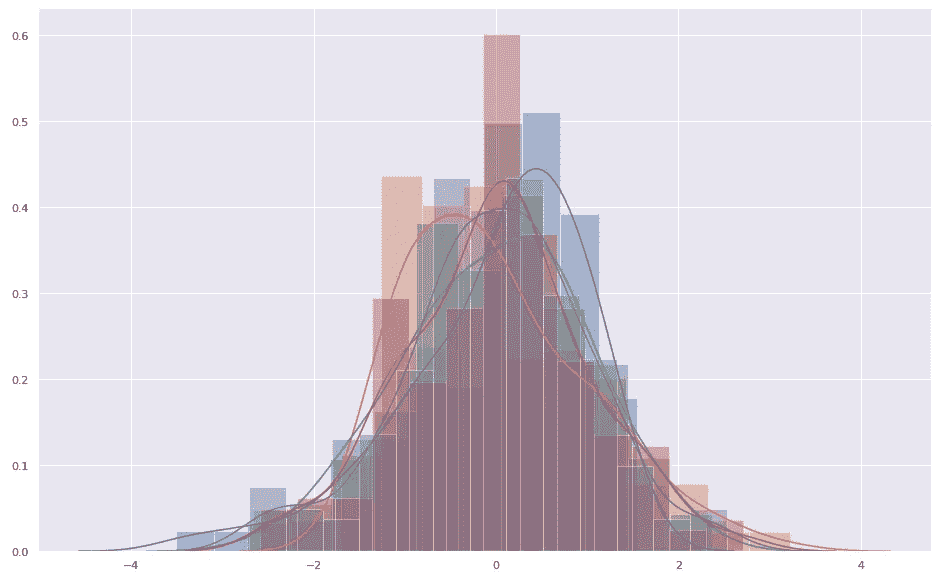

可以看出，Z 分数标准化不仅规范了考试结果，而且重新调整了考试结果。

# 摘要


由 [pasja1000](https://pixabay.com/users/pasja1000-6355831/) 在 [Pixabay](https://pixabay.com/photos/winter-time-pointing-clock-3720072/) 上拍摄的照片

在本文中，考试被用作例子来解释为什么我们需要标准化或规范化数据集。事实上，我见过很多学习者和数据科学的学生是真正的算法爱好者。他们可能知道许多不同类型的数据挖掘和机器学习算法。但是，我要说的是，大多数时候数据转换比选择算法更重要。

因此，我还演示了如何使用 Python Sci-kit Learn 库来轻松地规范化/标准化数据。希望对刚刚进入数据科学和数据分析领域的人有所帮助。

本文中使用的所有代码都可以在这个 Google Colab 笔记本中找到。

[](https://colab.research.google.com/drive/1L9xlldqKKXPrfatlAHDfRGU4Zcmom2fq?usp=sharing) [## 考试成绩不呈正态分布怎么办？

### 最小-最大标准化和 Z 分数标准化

colab.research.google.com](https://colab.research.google.com/drive/1L9xlldqKKXPrfatlAHDfRGU4Zcmom2fq?usp=sharing) [](https://medium.com/@qiuyujx/membership) [## 通过我的推荐链接加入 Medium 克里斯托弗·陶

### 作为一个媒体会员，你的会员费的一部分会给你阅读的作家，你可以完全接触到每一个故事…

medium.com](https://medium.com/@qiuyujx/membership) 

如果你觉得我的文章有帮助，请考虑加入 Medium 会员来支持我和成千上万的其他作者！(点击上面的链接)