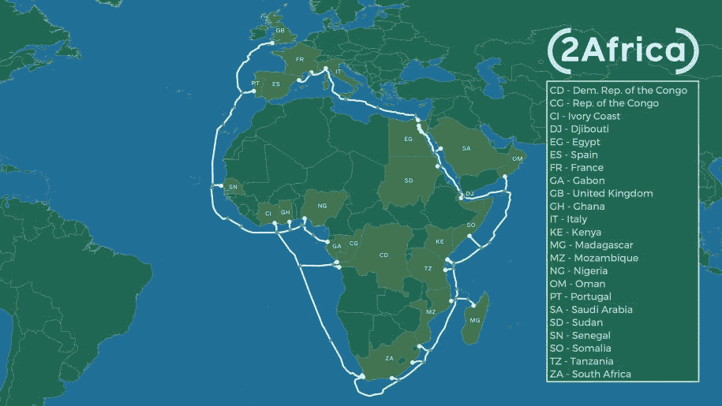
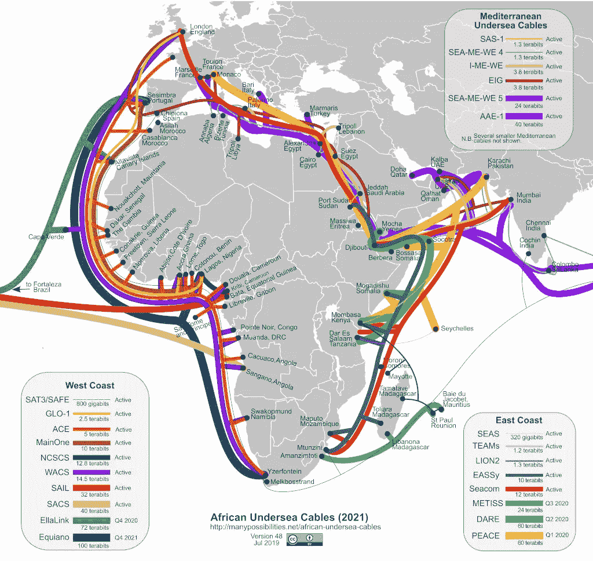
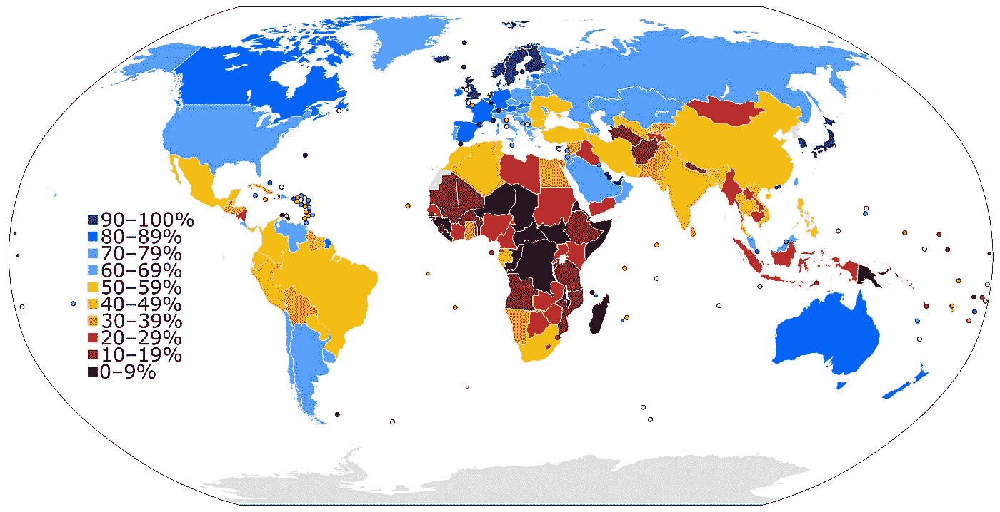

# 脸书新的数据电缆项目将对南部非洲产生什么影响？

> 原文：<https://towardsdatascience.com/what-impact-will-facebooks-new-data-cable-project-have-in-southern-africa-21fd3912f9ea?source=collection_archive---------55----------------------->

南非共和国🇿🇦比勒陀利亚——照片由[雷切尔·马丁](https://unsplash.com/@rmartin_?utm_source=unsplash&utm_medium=referral&utm_content=creditCopyText)在 [Unsplash](https://unsplash.com/s/photos/africa?utm_source=unsplash&utm_medium=referral&utm_content=creditCopyText) 上拍摄

## 赶上南部非洲🌍

F acebook 与合作伙伴如[中国移动国际](https://www.cmi.chinamobile.com/)、 [MTN 全球连接](https://www.mtn.com/mtn-group-adds-globalconnect-to-portfolio-of-operating-companies/)、 [Orange](https://www.orange.com/en/home) 、[埃及电信](https://te.eg/)、[沃达丰](https://www.vodafone.co.uk/)和[西印度洋有线电视公司(WIOCC)](http://wiocc.net/) 最近宣布了 [2Africa 项目。](https://www.datacenterdynamics.com/en/news/china-mobile-and-facebook-joint-project-build-2africa-submarine-cable/)2 Africa 项目有望成为世界上最大的海底电缆之一，连接西非和东非，并将连接大约 23 个国家，起点在英国，终点在西班牙。在 2Africa 登陆的国家，服务提供商将获得运营商中立数据中心的容量，并可以访问有线登陆站。

参与项目的国家— [脸书](https://engineering.fb.com/connectivity/2africa/)提供

在南部非洲发展共同体的国家中，该项目将连接到南非🇿🇦、坦桑尼亚🇹🇿、莫桑比克🇲🇿、刚果民主共和国🇨🇩和马达加斯加🇲🇬获得新的数据链路，对于这些经济体来说，这将是后新冠肺炎时代迫切需要的推动力。

> 37000 公里长的非洲将几乎等于地球的周长。该项目不仅长度令人印象深刻:它将提供几乎三倍于目前服务于非洲的所有海底电缆的总网络容量。完工后，这条新路线将为整个非洲提供急需的互联网容量、冗余和可靠性；补充中东地区快速增长的产能需求；并支持数亿人的 4G、5G 和宽带接入的进一步增长。— [脸书网络工程副总裁 Najam Ahmad](https://engineering.fb.com/connectivity/2africa/)

当我们开始展望后新冠肺炎时代的未来时，我们已经可以断定，能够投资远程解决方案的企业将在这个新世界中繁荣发展。对于非洲企业来说，这是一个挑战，因为员工在家里可能无法获得合适的互联网连接。通常，非洲的非正规市场并不依赖互联网。就移动货币技术而言，短信一直是王者，但随着支持网络连接的基础设施投资的增加，我们可能会开始看到互联网渗透水平的转变，以及更多政府推动数字战略的转变。电信技术是基础设施平台的明显赢家，可以引领非洲领先的新兴经济体。对于像津巴布韦这样地理位置不佳的内陆国家来说，这也创造了对电信枢纽进行更多投资的举措，这些枢纽将边境城镇与邻近的南共体国家的基础设施连接起来。世界银行研究贸易物流问题的三位经济学家说，地处内陆是世界上 31 个内陆发展中国家中有 16 个是世界上最贫穷国家的主要原因，[。](https://www.worldbank.org/en/news/feature/2008/06/16/landlocked-countries-higher-transport-costs-delays-less-trade)

## 数据是新的石油🛢🙆🏾‍♂️

通信是关键，根据联合国的数据，从现在到 2050 年，预计超过一半的全球人口增长将发生在非洲，移动网络将成为连接非洲大陆的桥梁。但随着这种连接也带来了新的数据点，但目前，非洲没有底层基础设施来支持这一点。随着津巴布韦等国家不幸获得了截至 2019 年世界上最昂贵的数据包的头衔，需要做更多的工作来确保数据可访问，这包括价格以及通过对电信基础设施的持续投资来增强信号强度。非洲人是企业家，会创新！随着我们开始适应远程提供更多服务的生活，这也将为散居者创造轻松投资非洲的机会。但不仅仅是海外侨民希望在非洲投资。

目前连接非洲和世界的海底电缆— [提供多种可能性。](https://www.submarinenetworks.com/euro-africa)

根据华盛顿研究公司 [TeleGeography](https://www2.telegeography.com/) 的数据，谷歌、[微软](https://www.microsoft.com/)、[脸书](https://www.facebook.com/)和[亚马逊](https://www.amazon.com/)现在拥有或租用了将近一半的海底带宽。仅谷歌一家就在全球支持了至少 14 条电缆。随着谷歌通过 GCP 提供云服务，亚马逊通过 AWS 提供云服务，微软通过 Azure 提供云服务，在未来 10 年，开始看到更多的数据区域出现在非洲就不足为奇了。华为等中国公司已经开始大举投资非洲的电信项目。[华为在 2018 年底完成了巴西和喀麦隆之间 3750 英里的电缆](https://techcrunch.com/2020/05/14/2africa-africa-middle-east-facebook-subsea-cable/)，去年开始了连接欧洲、亚洲和非洲的 7500 英里电缆的工作。

## 这是否会增加非洲的数据中心区域？

数据中心在非洲还没有真正起飞。需要做更多的工作和投资来提供有竞争力的市场，或者至少在电力和光纤连接方面需要某种类型的多样性。这通常被视为主要的绊脚石之一。地理位置经常发挥作用，微软 Azure 在沿海城市开普敦设立了数据中心，并于 2019 年在约翰内斯堡开设了另一个数据中心。中国的华为目前也计划在南非开设两个数据中心，开普敦被认为是一个可能的地点。亚马逊的 AWS 于 2020 年 4 月开始在开普敦运营数据中心。看到脸书在完成 2Africa 项目后也采用这一战略并不奇怪。寻求采用云战略的非洲企业通常会面临更高的成本，因为跨国云产品在非洲之外拥有数据中心区域，但这种情况很快就会改变。这不仅仅是南共体地区国家的问题，宽带普及率低和延迟差仍然是许多非洲实体面临的重大挑战。

[**2015 年互联网用户占一国人口的比例**](https://en.wikipedia.org/wiki/List_of_countries_by_number_of_Internet_users) **非洲清楚地显示为数字鸿沟背后最大的单一地区。**来源:[国际电信联盟](https://en.wikipedia.org/wiki/International_Telecommunications_Union)

## 南非的下一步是什么？

2020 年 5 月，[非洲大陆自由贸易区](https://www.tralac.org/resources/our-resources/6730-continental-free-trade-area-cfta.html)秘书长， [Wemkele Mene](https://au.int/en/pressreleases/20200418/newly-sworn-afcfta-secretary-general-wamkele-mene-undertakes-serve-africa) 宣布推迟启动 AfCFTA 下的贸易。AfCFTA 下的交易开始日期最初定为 2020 年 7 月 1 日( **AfCFTA 交易日期**)。由于 AfCFTA 没有宣布新的交易日期，根据疫情和 AfCFTA 的目标，考虑延期对南部非洲意味着什么是很重要的。对基础设施的投资必须继续，通过公路连接南部非洲国家，建立贸易路线并确保适合贸易的安全边界必须仍然是南部非洲发展共同体秘书处的重点。运营商和电信公司之间的跨境合作也将有助于这一过渡，确保没有一个国家被落下。

来自脸书的新数据管道不是第一条，也绝对不会是最后一条。非洲的数字革命即将到来！

斯蒂芬·查彭达玛