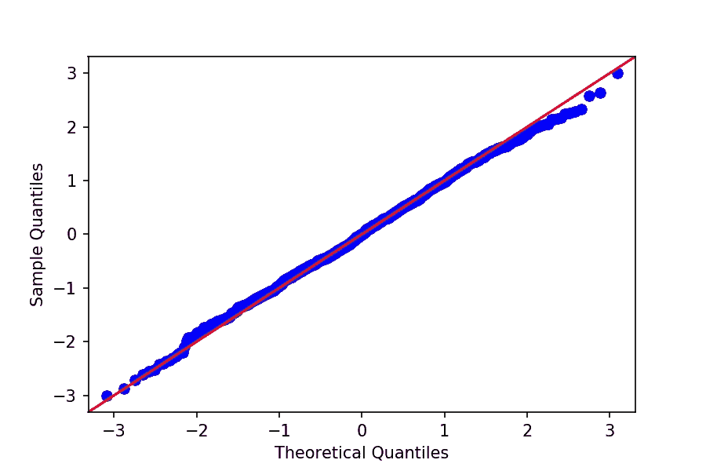

# QQ 剧情到底是什么？

> 原文：<https://towardsdatascience.com/what-in-the-world-are-qq-plots-20d0e41dece1?source=collection_archive---------14----------------------->


亚历山大·安德鲁斯在 [Unsplash](https://unsplash.com?utm_source=medium&utm_medium=referral) 上拍摄的照片

## 了解 QQ 图的功能以及如何从头开始制作

如果你曾经使用过线性回归或者使用过要求数据(或误差)呈正态分布的统计工具，那么你可能以前遇到过 QQ 图。除了知道一个直的 QQ 图(45 度线)很好之外，你可能不太记得他们了。

但是 QQ 图实际上是一种非常漂亮和直观的方式来可视化某个东西是否是正态分布的。让我们来看看它们是如何工作的，为什么它们很酷。

如果你需要复习一下正态分布，我写了这篇文章。

# 正态分布

正态分布的东西很棒。知道某样东西符合正态分布(并且知道它的均值和标准差)，就可以让我们对它做出各种有用的推断。例如，我们可以合理地确定它的值在 95%的情况下会落在哪里(在平均值的-1.96 和+1.96 标准偏差之间)。

但是如果我们的变量实际上不是正态分布的，那么我们的推论就会是错误的，有时是非常错误的。根据应用的不同，我们不准确的推论的后果可能从仅仅是不方便到甚至是危险。

这就是 QQ 剧情的由来。它们是评估一个变量是否正态的快速而直观的方法(我们可以使用 QQ 图来对照任何分布检查我们的数据，而不仅仅是正态分布)。

# QQ 图

让我们虚构一些我们已经知道是正态分布的数据:

```
import numpy as np# Generate some normally distributed random numbers
random_normals = [np.random.normal() for i in range(1000)]
```

我们可以使用 statsmodels 库中的 QQ 绘图功能:

```
import statsmodels.api as sm
from matplotlib import pyplot as plt# Create QQ plot
sm.qqplot(np.array(random_normals), line='45')
plt.show()
```

上面的代码创建了以下情节:



正态分布随机变量的 QQ 图

看到我们的数据(蓝点)是如何清晰地落在红线上的了吗？这意味着我们的数据是正态分布的(我们已经知道了)。仅此而已。如果我们的数据坚持红色 45 度线，这是正常的或接近它，如果它不，那么它是不正常的。

让我们来看看 QQ 剧情中一些不正常的东西:

```
import random# Generate some uniformly distributed random variables
random_uniform = [random.random() for i in range(1000)]# Create QQ plot
sm.qqplot(np.array(random_uniform), line='45')
plt.show()
```

产生了这个图:


非正态分布随机变量的 QQ 图

我们的数据(蓝点)离红线很远，意味着它不是正态分布的(它是均匀分布的)。所以现在我们明白了 QQ 图是做什么的，让我们弄清楚他们是怎么做的。

# QQ 图如何工作

QQ 图中的“QQ”表示分位数-分位数，即**QQ 图将我们数据的分位数与期望分布的分位数进行比较**(默认为正态分布，但也可以是其他分布，只要我们提供适当的分位数)。

**分位数是将我们按数字排序的数据分成相等比例的桶的断点。**例如，您可能听说过百分位数——百分位数是将我们的数据分成 100 个桶(按值排序)的分位数，每个桶包含 1%的观察值。四分位数是将我们的数据分成 4 个桶(0–25%，25–50%，50–75%，75–100%)的分位数。即使是我们的老朋友，中位数也是一个分位数——它将我们的数据分成两个桶，其中一半的观察值低于中位数，另一半高于中位数。

那么比较分位数意味着什么呢？让我们暂时离开 QQ 图，想一个比较两个分布的更简单的方法，直方图。我们如何判断两个分布是否相同？一个不错的第一步是把分布一个接一个的叠加起来，然后盯着看。但是我们应该盯着什么看呢？一个简单的测试是在 X 轴上选择一个点，看看每种分布在它的每一边占多大比例。例如，在金融领域，我们经常关注下行风险(分布的左尾)，或者换句话说，当情况变坏时，我们的投资组合会发生什么。

假设我们关心的是真正可怕的事件，所以我们决定查看位于均值左侧超过 1.65 个标准差(换句话说，低于均值)的结果——我们将把这个点称为我们的阈值。如果我们的数据分布是正态的，那么大约 5%的观察值将位于阈值的左侧:


正态分布(蓝色)和-1.65 SD 阈值(红色)

但是如果我们的数据不正常呢？我们可以进行与上面相同的分析，看看有多少观察值位于阈值的左侧:


正态分布和非正态分布的直观比较

从视觉上，我们可以看到更多的非正态分布(灰色线，这是一个学生的 1 自由度 T 分布)位于阈值的左侧。**因此，如果我们投资组合的分布实际上是灰线，但我们用蓝线建模，我们将大大低估一个可怕结果的频率**(可怕的结果是我们阈值左边的那些，红线)。我们假设只有 5%的可能性会出现可怕的结果，而实际上 17%的灰线下区域(其累积密度函数)位于可怕结果阈值的左侧。

> 因此，我们将一个可怕结果的风险低估了 3 倍！

这就是为什么检查某些东西是否正常很重要。而这才是 QQ 剧情真正出彩的地方。本质上，QQ 图做了我们刚刚用重叠直方图(和阈值)做的事情，但它对我们数据中的每个观察都做了。

# QQ 情节从零开始

如果你对下面的代码感兴趣，也可以[从我的 GitHub 这里](https://github.com/yiuhyuk/qq_plot)抓取。

让我们从头开始制作一个简化的 QQ 图，这样我们就可以从头开始了解它是如何工作的。回想一下，分位数是将我们的数据分成数字有序、大小相等的桶的断点(如百分位数)。**为了计算分位数，我们需要首先将数据从最小到最大排序。**让我们生成一些数据并进行分类:

```
**In:**import numpy as np
import matplotlib.pyplot as plt
import pandas as pd
from scipy.stats import normN = 10
t_dist = sorted(np.random.standard_t(1, size=10))
t_dist**Out:**[-3.078322498951745,
 -0.44257926668743197,
 -0.28442575572329976,
 -0.08391894271348821,
 0.5619567861663247,
 1.0176669779384615,
 1.3448162439504447,
 1.874164646241363,
 2.936477005326059,
 5.340289177069092]
```

酷，我们现在有 10 个数字排序的观察值，它们来自一个随机数生成器，遵循一个学生的 1 自由度 T 分布。这和我们上面的柱状图中的分布是一样的。光是目测数字，就能看出看起来不是很正常。没有经过转换以适应经验数据的正态分布的平均值为 0，标准差为 1。如果我们从正态分布中取样，很难看到比 1 大得多或小得多的值。然而，仅仅从我们的 10 个观察样本中，我们可以看到有一个-3.08 和一个 5.34(超过预期平均值的 5 个巨大的标准偏差)。

## 计算实际分位数

接下来是时候计算我们观察到的数据的分位数了。因为我们有 10 个观察值，所以我们想要 9 个分位数(我们总是想要 N-1 个分位数，或者比我们的观察值少 1)。获得分位数的一个简单方法是计算我们观察值之间的中点:

```
t_dist_quantiles = []
quantiles_percent = []
for i, val in enumerate(t_dist[:-1]):
    t_dist_quantiles.append((val + t_dist[i+1])/2)
    quantiles_percent.append((i+1)/len(t_dist))
```

列表 *t_dist_quantiles* 记录我们计算的中点，列表 *quantiles_percent* 记录位于分位数以下的数据比例。一旦我们看到生成的数据帧，这将变得更加清楚:

```
**In:**qp_array = np.array(quantiles_percent).reshape(-1,1)
tq_array = np.array(t_dist_quantiles).reshape(-1,1)
qq_df = pd.DataFrame(np.concatenate((qp_array, tq_array), axis=1),
                     columns=['percent_below', 'quantile'])
print(qq_df)**Out:** percent_below    quantile
0            0.1   -1.760451
1            0.2   -0.363503
2            0.3   -0.184172
3            0.4    0.239019
4            0.5    0.789812
5            0.6    1.181242
6            0.7    1.609490
7            0.8    2.405321
8            0.9    4.138383
```

请注意，第一个分位数-1.76 位于-3.07 和-0.44 之间。而 *percent_below* 列告诉我们，10%的数据低于-1.76。这是有意义的，因为只有一个观察值-3.07 小于-1.76。所以 10 次观察中有 1 次低于-1.76，换句话说，10%。所以对于每个分位数，我们可以通过将小于它的观察数除以观察总数来计算出它下面的百分比。

## 理论分位数

一旦我们有了实际的分位数，我们需要一些东西来与它们进行比较。QQ 图的基准是我们期望的分布的理论分位数。那么我们如何得到这些理论分位数呢？

实际上我们已经有了所有需要的原料。回想一下，分位数将我们的数据分解成固定的比例。因此，如果我们知道每个桶中的比例，那么对于给定的分位数，我们也知道位于其左右的数据的比例。例如，回头参考我们的数据框架 *qq_df* 中的 *percent_below* 列，我们看到对于第三个分位数，-0.184172，30%的数据位于它的左侧。

因此，为了得到我们的第三个理论分位数，我们只需要找出正态分布上曲线下 30%区域位于其左侧的点。我们可以很容易地用下面的代码行为我们的每个分位数做到这一点:

```
qq_df['theoretical_quantile'] = [norm.ppf(percentage) for percentage in qq_df['percent_below']]
```

现在，我们已经在 *qq_df* : **中获得了我们的 QQ 图所需的所有值，Y 轴的实际分位数**和 X 轴的理论分位数**(来自正态分布)**。我已经把 *qq_df* 的内容打印出来如下:

```
 percent_below    quantile  theoretical_quantile
0            0.1   -1.760451             -1.281552
1            0.2   -0.363503             -0.841621
2            0.3   -0.184172             -0.524401
3            0.4    0.239019             -0.253347
4            0.5    0.789812              0.000000
5            0.6    1.181242              0.253347
6            0.7    1.609490              0.524401
7            0.8    2.405321              0.841621
8            0.9    4.138383              1.281552
```

剩下要做的就是画出我们的 QQ 图:

```
plt.subplots(figsize=(9,7))
plt.scatter(x=qq_df['theoretical_quantile'],
            y=qq_df['quantile'], label='Actual');
plt.scatter(x=qq_df['theoretical_quantile'],
            y=qq_df['theoretical_quantile'], 
            c='red', label='Normal')
plt.xlabel('Theoretical Quantiles')
plt.ylabel('Actual Quantiles')
plt.legend()
plt.savefig('qq_plot', bpi=150);
plt.show()
```


我们的 QQ 情节

# QQ 情节告诉我们什么

如果我没有解释如何阅读 QQ 情节就结束这篇文章，那将是我的失职。我们已经知道，如果我们图中的点落在 45 度线上，那么我们的数据是正态分布的(假设我们使用正态分布的理论分位数)。但是当它们没有落在直线上时，我们仍然可以了解很多关于我们的数据分布的信息。以下是阅读 QQ 情节的一些一般提示:

*   **斜率告诉我们数据中的步长是太大还是太小**(或者刚刚好)。**记住，数据中的每一步(从一个分位数到下一个分位数的一步)遍历一个固定不变的百分比** —例如，如果我们有 N 个观测值，那么每一步遍历 1/(N-1)个数据。因此，我们看到了我们的数据和正态分布之间的步长(也称为分位数)比较。
*   QQ 图的陡峭倾斜部分意味着在我们数据的这一部分，观察值比我们预期的正态分布更分散。导致这种情况的一个例子是异常大量的异常值(就像我们之前用代码画的 QQ 图)。
*   平坦的 QQ 图意味着我们的数据比我们预期的正态分布更加集中。例如，在均匀分布中，我们的数据介于 0 和 1 之间。在这个范围内，每个值都有相同的可能性。因此，该范围的极端值(如 0.01 和 0.99)与中间值(如 0.50)的可能性一样大。这与正态分布(平均值为 0，标准偏差为 1)非常不同，在正态分布中，像-3 或 4 这样的值比 0 更不可能被观察到。因此，均匀分布变量的 QQ 图(其中观察值是等间距的，因此相对于正态分布更集中)将具有非常小的斜率。


均匀分布随机变量的 QQ 图

# 结论

我是 QQ 图的忠实粉丝，因为它们是将我们的数据分布与期望的统计分布进行比较的一种聪明、直观和快速的方式。希望读完这篇文章后，你也会成为他们的粉丝。干杯！

***更多数据科学相关帖子由我:***

[*了解正态分布*](/understanding-the-normal-distribution-with-python-e70bb855b027)

[*熊猫加入 vs 合并*](/pandas-join-vs-merge-c365fd4fbf49)

[*了解 RNNs*](/understanding-rnns-recurrent-neural-networks-479cd0da9760)

[*了解 PCA*](/understanding-pca-fae3e243731d?source=post_page---------------------------)

[*理解贝叶斯定理*](/understanding-bayes-theorem-7e31b8434d4b)