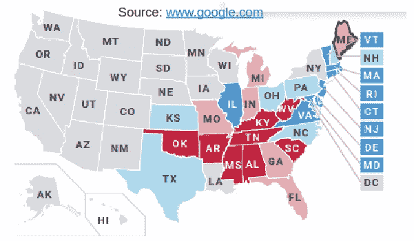
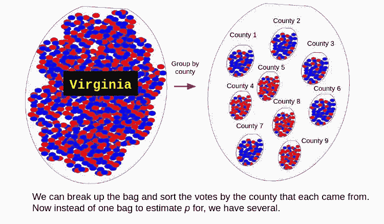
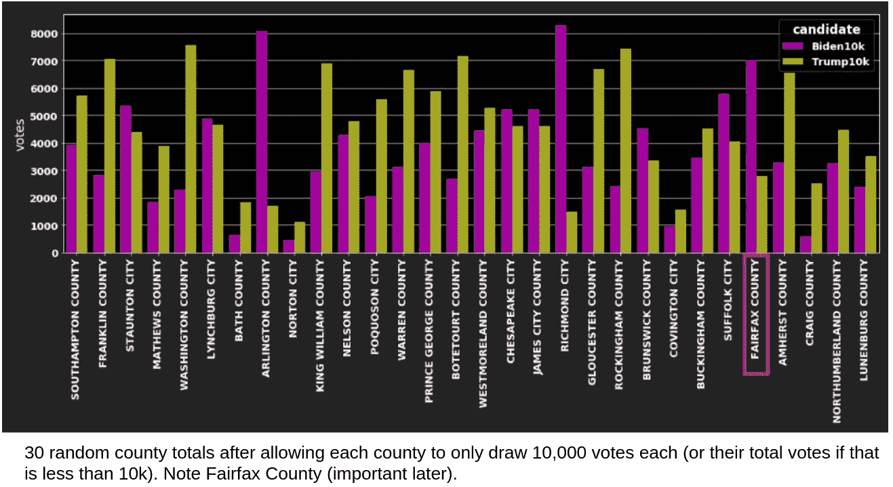
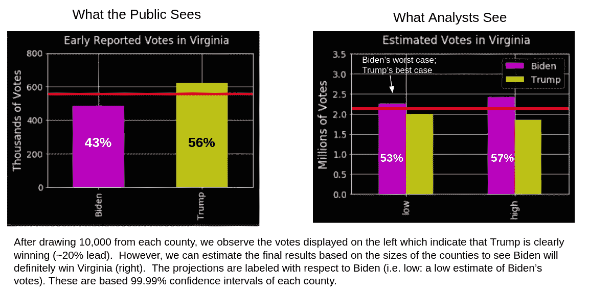
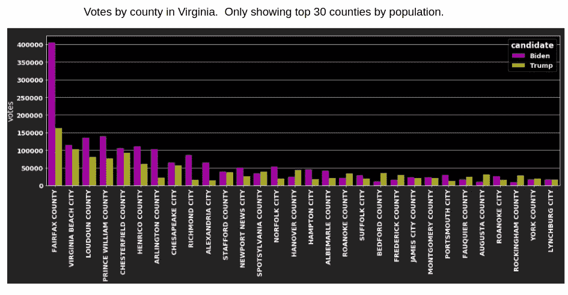

# 周二晚上在弗吉尼亚到底发生了什么？！

> 原文：<https://towardsdatascience.com/what-in-the-world-happened-in-virginia-tuesday-night-117d13cd318b?source=collection_archive---------41----------------------->

## 当你的样本有偏差时，统计数据就失效了

来源:2020 年 11 月 3 日谷歌宏作者截图。[1]

像大多数美国家庭一样，周二晚上，我和妈妈在下午 5 点左右结束工作，加热了一些剩菜，挤在电视机前，开始了漫长的一夜狂欢/“在家玩”选举结果。我们大部分的分析修正都是由 CNN 慷慨提供的(oop，只是用那个把我们自己叫了出来)。但我们不是你们这里的普通绵羊。不，不，我们是一些更精明的点击诱饵信息的消费者。我们也用谷歌！！我们(和许多其他人可能)很早就注意到，谷歌的小宏(由美联社提供支持)和 CNN 的经典美国地图仪表盘(尽管它肯定越来越花哨)之间存在差异。报告的数字是一样的，但是信息传递模式的不同在我们家引起了一点有趣的混乱。请允许我解释…

如果一个州当时有更多的共和党人投票，CNN 会将它涂成红色(或蓝色表示反对)，这给人一种候选人已经赢得或至少“赢得”该州的印象。好吧，有道理。然而，谷歌更进一步。他们提供了两个“等级”的着色！浅色意味着候选人在该州的普选中领先，而深色则意味着[候选人“赢得了】该州](/calling-elections-early-fake-news-or-statistics-dd2e8cc196c5)。添加了这个聪明、直观的可视化功能。

那么问题出在哪里？赢得该州普选的候选人难道不应该是分析之神不可避免地认为是该州“赢家”的那个人吗？不一定。以弗吉尼亚为例。美国东部时间晚上 8:30 左右，拜登的支持率下降了 20%。当 CNN 主播们正为拜登如何需要做出某种英雄般的努力来拯救这个“蓝色”州免于翻转(好像这就是选举之夜的工作方式)而焦躁不安时，谷歌的地图上充满了深蓝色，这表明拜登不仅赢得了弗吉尼亚州……他还赢了！！现在你可以想象这在这里引起了一点混乱，我决定调查一下。

# 设置场景

在美国东部时间晚上 8:30 左右，州政府官员已经统计了 33%的选票，拜登落后 20%。然而，谷歌宏已经将这个州涂成深蓝色，以表示拜登毫无疑问的胜利。好吧，管它呢？我妈妈也有这种感觉，但电视专家们对此也无济于事，他们继续用“希望拜登在弗吉尼亚州撤回”的说辞来保持游戏节目的幻觉。统计学家知道一些我们作为观众没有被告知的事情。

# 又是弹珠？

数学建模就是简化现实世界。在另一篇文章中，我们展示了如果你将模型简化为超几何等价物(一袋弹珠)，你可以多快召集一次选举。我们假装在选举日那天，人们将特定颜色(红色或蓝色)的弹珠放入位于州首府的一个大弹珠袋中，而不是去各个投票站、邮箱等地方投票。我们表明，如果袋子混合得很好，我们只需要画几千个就可以很好地猜出袋子的成分。

然而，你可以看到这是多么的不现实，因为在现实生活中，不止有一袋弹珠。事实上，弗吉尼亚有 133 个县和 2500 多个选区。如果我们使用一个袋子模型，我们会犯一个惊人的错误，即假设我们可以从这些袋子中的任何一个中抽取，并对整个国家做出一个一般性的陈述。

为什么不呢？信息就是这样通过媒体展现给我们的？已经统计了 33%的选票的人！这远远超过了我们数学上认为足够的 10，000 个弹珠的阈值。特朗普赢得了弗吉尼亚州的乡亲们…合上书本！

因此，专业统计学家的真正工作在于:选择有代表性的样本很难。

# 大理石包中的大理石包…太棒了

但是假设我们需要说些什么，即使我们知道我们的样本有偏差。那么，如果我们不假设一袋选票，而是假设每个县都是那袋选票中的一个更小的袋子。没错，州大理石包其实就是一袋县大理石包(兔子洞继续！).

作者图片

但这能解释周二发生的事情吗？好吧，我们来看数据。我在 11 月 5 日的某个时候直接从弗吉尼亚州的官方选举报道网站上获取了一些数字(投票应该在那个时候)。当时的最终计票结果显示，拜登获得了 53%的选票。回想周二晚上，CNN 会让我们相信这是某种英雄式的推动，但我认为统计学家会认为这是不可避免的。让我们看看。

# 询问数据

好了，让我们从做一个快速思维实验开始，看看我们能否重现周二晚上 8:30 我们看到的情景，当时拜登输了 20%，但被宣布获胜。让我们假设从每个县统计 10，000 张选票(即弗吉尼亚州的大约 450 万张总选票中的大约 150 万张)。以下是弗吉尼亚州随机选择的 30 个县的地图，以及他们在计算第一批 10，000 张选票后的样子。(我在费尔法克斯县周围画了一个方框，因为它以后会变得很重要——敬请关注。)

作者图片

# 两个弗吉尼亚的故事

如果我把所有县的选票加起来，我们可以看到特朗普在早期阶段会遥遥领先于拜登(如下图所示)。然而，统计学家看了上面单个县的早期估计，意识到特朗普已经输了。怎么会？

他们可能会做的是，他们拿着已经统计过的选票，猜测拜登的选票在未统计的未来选票中所占的比例。事实上，如果我们认为我们知道有多少人会投票，我们可以使用贝叶斯推断来推断每个县的潜在投票范围([通过推断 *p* 的范围，就像我们对伊利诺伊州](/calling-elections-early-fake-news-or-statistics-dd2e8cc196c5)所做的那样)。然后对每个县重复这一过程，将低估计值和高估计值的总数相加(右图)。由此，你可以看到，即使对拜登来说是难以想象的最坏情况(下面标为“低”)，他仍然远远高于 50%选票的红色“获胜线”。

作者图片

好的，对于那些一直跟踪到现在的人，你可能还会问:这是怎么回事？好吧，让我们看看 30 个人口最多的县的原始结果，我觉得答案应该是显而易见的。看看拜登在费尔法克斯县获得了多少选票。事实上，他赢得了弗吉尼亚州人口最多的 12 个县(在某些情况下以压倒性优势)。

作者图片

当然，投票实际上不是以同样的速度计算的，我在这里展示的小模型实际上不是周二晚上(8:30)的数字。但是……这表明，当公众被灌输一个关于特朗普领先 20%的故事时，统计学家已经意识到他没有赢得弗吉尼亚州的希望。

嗯，这些都很有趣，但是[那些摇摆州](/what-took-so-long-in-the-swing-states-c7ee8d4eb778)呢？而且，这并不能完全说服我，我的投票是否算数。我认为确实如此，但是这篇文章有点长了。我试图在其他帖子中更详细地回答这些问题。

感谢阅读！感谢任何反馈！

## 如果你喜欢这篇文章

> 考虑鼓掌(或者 10？)所以 TDS 会更容易与他人分享

看看我关于选举的其他案例研究:

*   伊利诺伊州(需要多少票才能举行选举)
*   [宾夕法尼亚州](/what-took-so-long-in-the-swing-states-c7ee8d4eb778)(摇摆州戏剧统计解读)
*   [德州](/how-swing-able-is-texas-anyways-83623f0911f3)(真的有多荡？)

图像:

[1]谷歌，美国大选结果(2020)，[https://www.google.com/search?channel=fs&客户端= Ubuntu&q =选举+结果](https://www.google.com/search?channel=fs&client=ubuntu&q=election+results)