# 网络新闻文章中隐藏了哪些信息？

> 原文：<https://towardsdatascience.com/what-information-is-hidden-in-online-news-articles-f5695eae38fd?source=collection_archive---------45----------------------->

## 网络新闻的数据分析

每个工作日在线新闻的长度和数量以及作者的时间/图片

日报在线发布的新闻是一个重要的信息来源。它们不仅包含要传播的声明，还隐含了关于出版商及其员工的其他信息。这种信息流通常不是有意的，发布者甚至没有意识到这一点。

这些不是隐藏在单个信息中的秘密信息，正如一些人认为在甲壳虫乐队的歌曲中找到的秘密信息，而是只有当大量数据被一起查看并正确组合时才显现出来的信息。在这篇文章中，我想用一些例子来说明这一点。

例如，我会在文章中发现，日报“Der Standard”的编辑喜欢在周末睡得更久，并在早上或周末早上写更长的文章。今天剩下的时间似乎都被机构报告占据了。

尤其是报纸《Kronen Zeitung》还要门户网站“oe24.at”刊登，不出意料，几乎不再有**文章**。这里的事实，与“标准”相反，它大约是十倍是有点令人惊讶的。

从被指名的编辑的出版物中，可以获得关于他们的**休假行为**或者他们可能与哪些其他编辑关系密切的信息。

## 数据

作为例子的数据，我选择了三家奥地利日报网络版的新闻文章:
-【sterreich】-[www . oe24 . at](http://www.oe24.at)-
-【kren Zeitung】-[www . krone . at](http://www.krone.at)-
-【Der Standard】-[www . Der Standard . at](http://www.derstandard.at)
前两篇可以分配到林荫大道，后者称为优质报纸。

在 3 个月的时间里(2020 年 8 月 11 日到 2020 年 11 月 9 日)，我收集了新闻文本，以及一些元数据，如出版日期、作者等。这导致数据量:
-来自 derstandard.at 的 10，933 篇文章
-来自 krone.at 的 12，990 篇文章
-来自 oe24.at 的 29.868 篇文章

## 数据的第一个概述

为了对数据有一个初步的了解，我们将看看不同报纸每天发表的文章数量。

所有被考虑的三份报纸都显示了一个周周期，这在《标准报》中最为明显，在周末和假日出版的报纸要少得多。平均写 100 多篇。oe24.at 自 10 月初以来明显偏多。

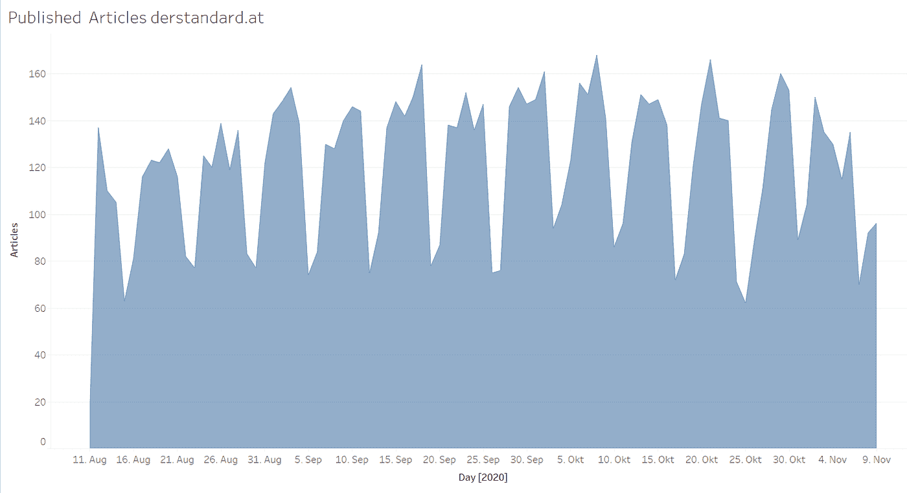

每天在 derstandard.at 上的文章/作者提供的图片

## 文章是什么时候写的，有多长？

现在让我们看看新闻发布的时间和日期。圆点的大小描述了文章的数量。颜色代码还表示每次的平均文本长度(字数)。蓝色圆圈代表短文，红色调越深，文章越长。

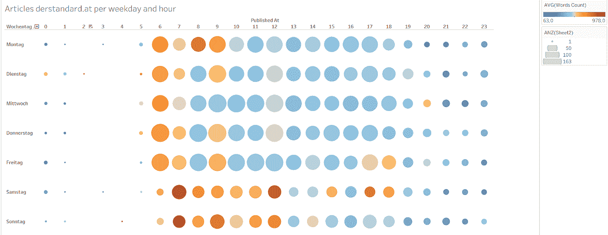

每个工作日和时间的在线新闻长度和数量-der standard . at/按作者分类的图片

出版大多是白天，周末我们开始晚一点。编辑们似乎想多睡一会儿。一般来说，周末出版的比较少。

从颜色可以看出，《标准报》的编辑显然每天早上和周末都花时间写长文章，就像一个“优质媒体”所期望的那样。
主要是在当天晚些时候分发简短的代理报告吗？

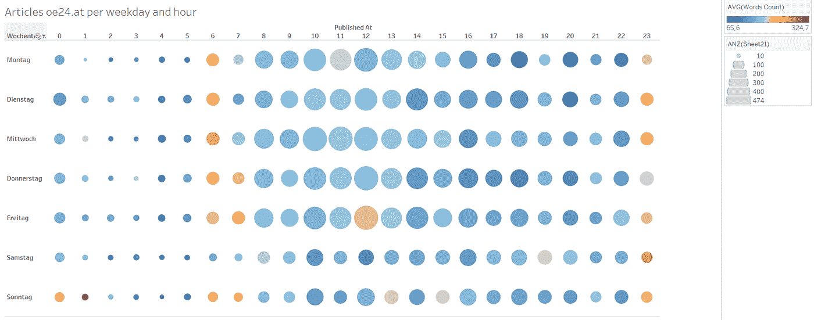

每个工作日和时间的在线新闻长度和数量——oe24 . at/按作者分类的图片

下一张图显示了“sterreich — oe24.at”编辑部略有不同的图片，这里只有少量早上 6 点、午夜前不久和周五中午的较长文章。
这些是什么样的物品？
这里也一样，更多的是在工作日出版。

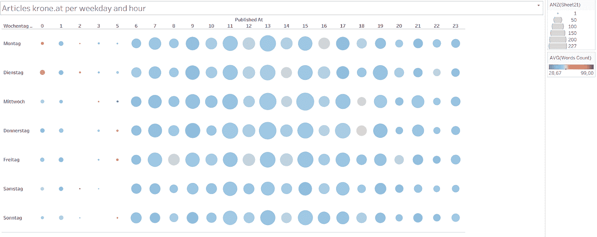

每个工作日和时间在线新闻的长度和数量——krone . at/Image by Author

## 你发表哪些主题的文章？

但我不仅想知道何时以及以何种文本长度出版，还想知道关于哪些主题。为此，我对每篇文章进行了自动主题分配。

分析是通过来自“ [Aylien](https://aylien.com/) ”的“新闻情报平台”完成的，并使用“ [IAB](https://developers.mopub.com/publishers/ui/iab-category-blocking/) ”作为分类。开发这种分类是为了给在线广告分配正确的内容。在我的例子中，只使用了主要类别。

现在让我们看看三个新闻制作人在最重要的类别中发表了多少篇文章。圆圈的大小反映了所考虑期间的总数。

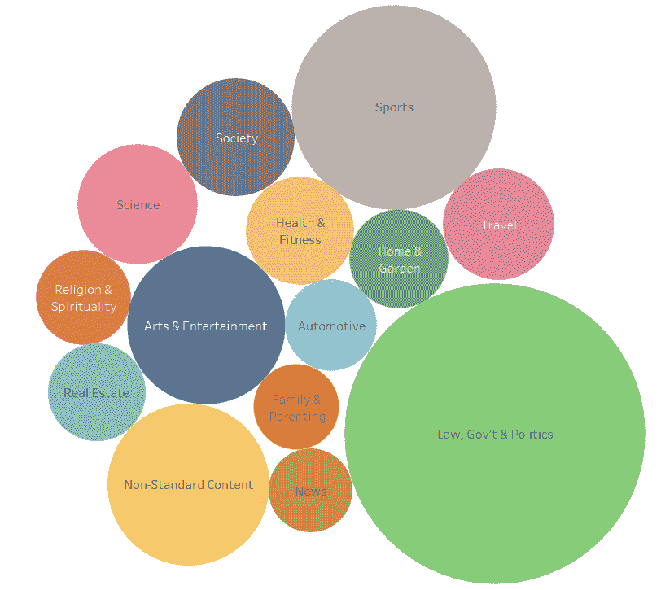

关于 derstandard.at / Image 的主题由作者提供

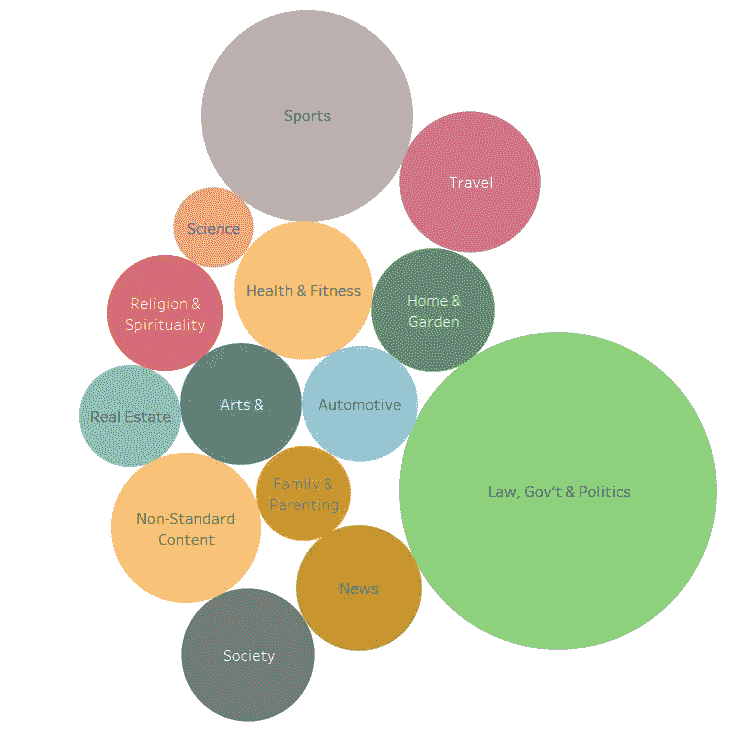

oe24.at 上的主题/作者图片

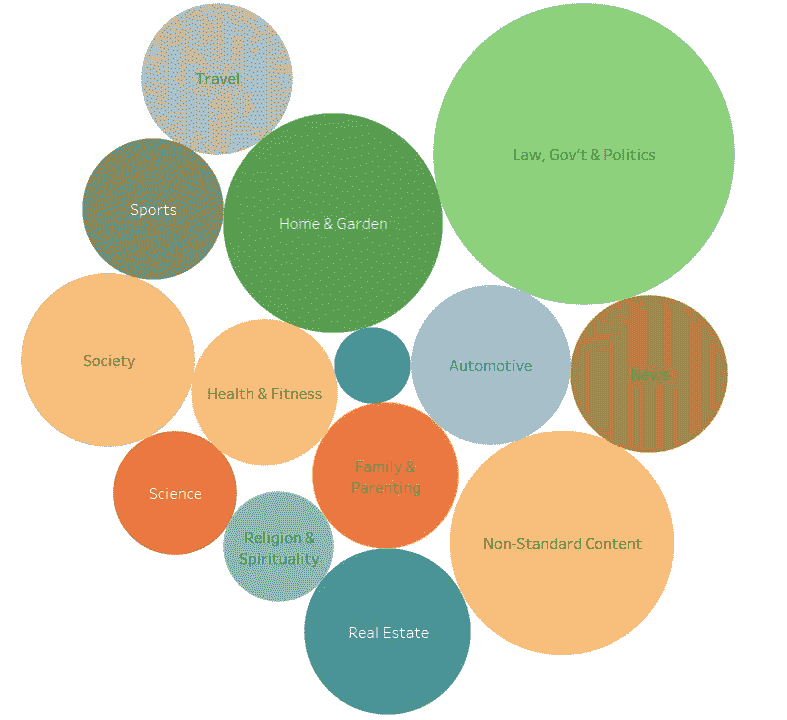

krone.at 上的话题/作者图片

现在，我们将看看在不同主题的文章发表的时间上是否有任何差异。下图显示了《标准》杂志在两个最常见的类别“政治”和“体育”上的出版物分布情况。

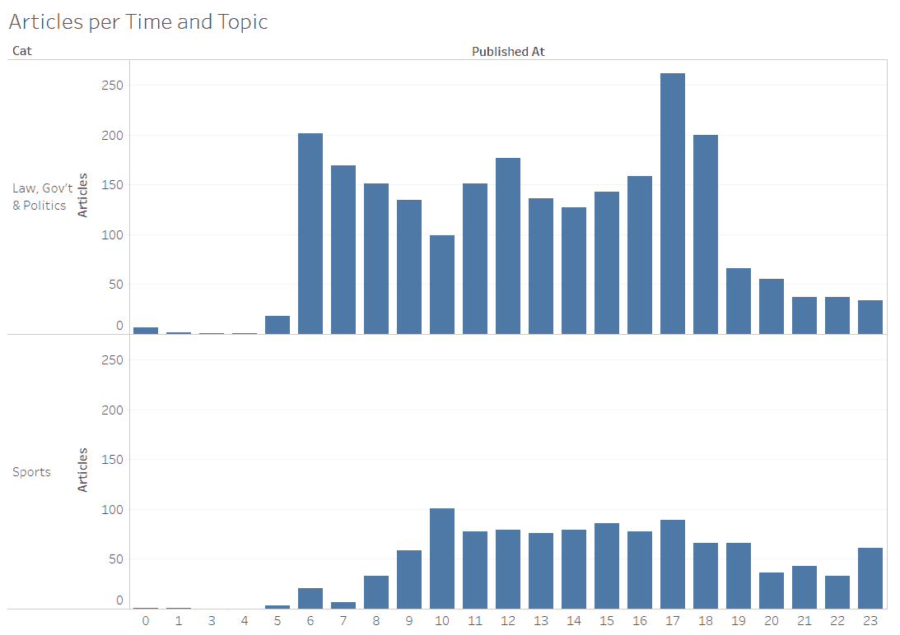

derstandard.at / Image 作者每小时的文章和主题

体育板块的文章数量在早上比政治板块的增长要慢得多。这是因为早上没有太多关于体育的报道，还是因为体育编辑喜欢睡懒觉？

“Krone”和“Oe24.at”文章的数据显示了相同的情况。

如果你也将每篇文章分配到一个“主题地图”，你会看到不同的文章是如何分布的。下图显示了文章的分布以及“标准”的最重要类别。

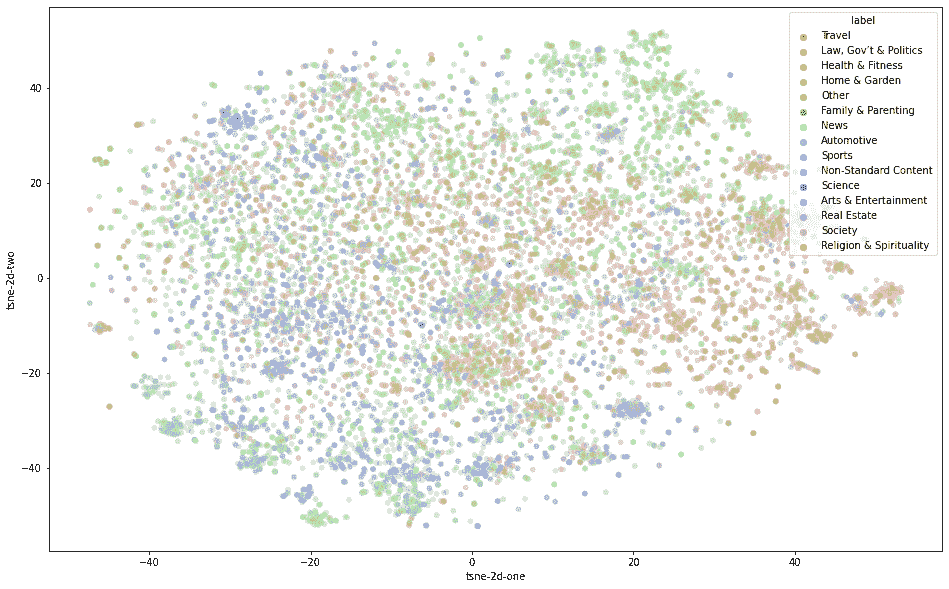

derstandard.at 的文章和主题图/按作者分类的图片

附近的点代表相似的文章，颜色反映了主题。
对于这个例子，为每篇文章的标题计算嵌入的[句子，其编码标题的含义。文章中有更多关于这方面的内容:](https://github.com/UKPLab/sentence-transformers)

 [## 用句子变形库嵌入句子

### 使用伯特/罗伯塔/XLM-罗伯塔公司和 PyTorch 的多语言句子嵌入

medium.com](https://medium.com/towards-artificial-intelligence/sentence-embeddings-with-sentence-transformers-library-7420fc6e3815) 

随后，使用“t-SNE”方法生成维度缩减的 2D 图。文章中有更多关于这方面的内容:

 [## 用 Python 例子介绍 t-SNE

### 介绍

以 Python 为例 Introductiontowardsdatascience.com 的 t-SNE](/an-introduction-to-t-sne-with-python-example-5a3a293108d1) 

## 不同媒体上关于该主题的文章长度如何？

“Kronen Zeitung”的平均文本长度几乎不随主题而变化，也明显短于标准。“Oe24.at”的图片与此类似，只是文章通常稍长，而且“汽车”部分的文章也更长。

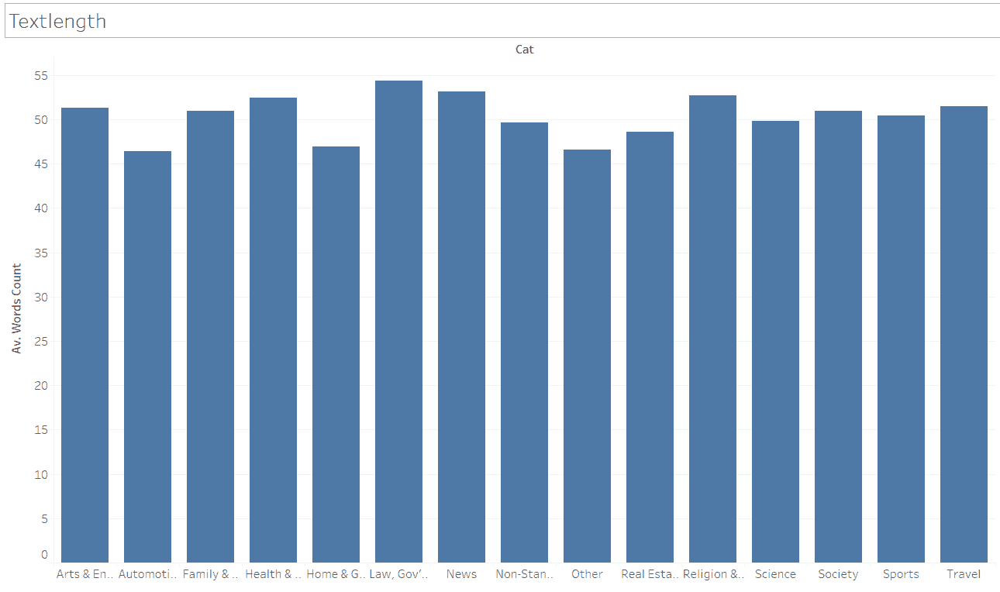

krone.at 的文本长度/作者提供的图片

《标准报》的平均文字长度是《克朗报》的十倍。这些数据证实了小报很少提供文字的偏见。“标准”在主题领域之间的长度也有显著差异。例如，“新闻”文章就比其他文章短得多。

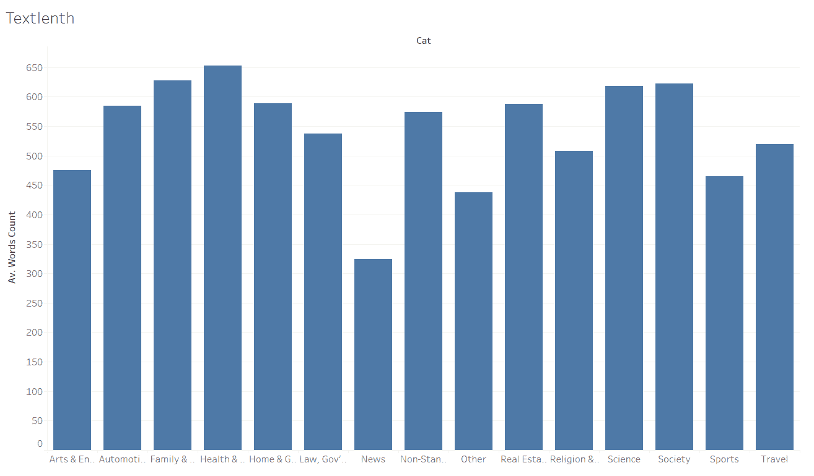

derstandard.at / Image 的文本长度(按作者)

## 我们能谈谈个别人员或部分编辑人员吗？

一些报纸在文章上标明编辑的名字或部分编辑人员的名字。例如，在 Kronenzeitung 的情况下，文章可以分配给各个联邦州的编辑部。这清楚地表明了各个州的编辑有多活跃。

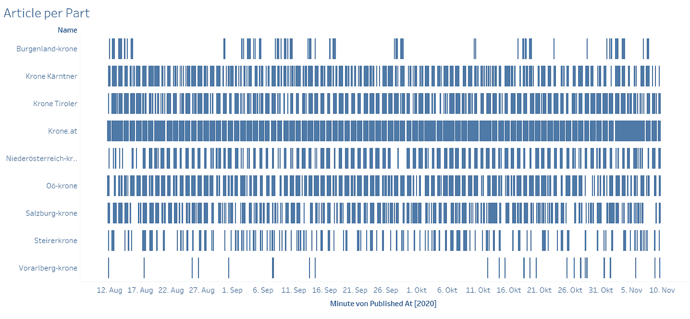

每个州的文章/按作者分类的图片

可以看出，在所考虑的整个时期内，维也纳中央编辑部最为活跃，布尔根兰和福拉尔贝格等省的贡献很小。

如果有人评价显示作者姓名的文章，可以发表个人声明。在下图中，这些名称因此变得无法识别。

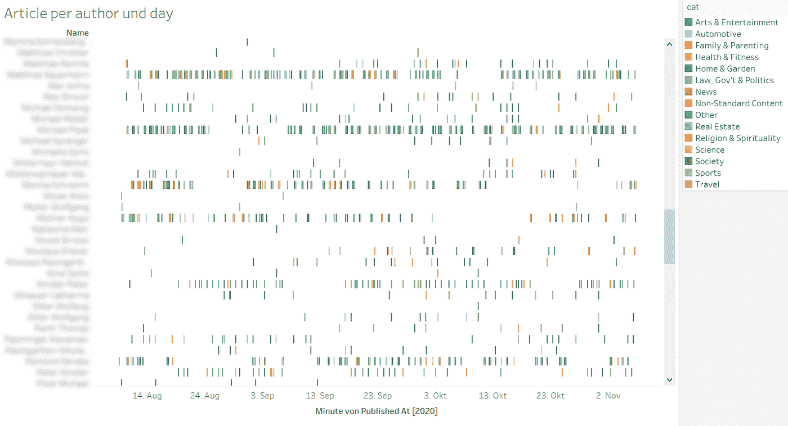

每个作者的文章和作者的日期/图片

从评估中可以获得一些有趣的信息，然后人们可以通过稿件的数量很容易地识别出被雇佣的编辑和自由工作者。颜色代码可用于将人员分配到主题区域，出版物中的间隙可表示假期。这样，也可以从这样的图形中收集编辑部共享假期的指示。这些是否表明这些人之间有更密切的个人关系？

诸如后者的问题和信息表明了评估的危险性。只使用了公开的免费数据。爆炸性只有通过将许多数据聚合和链接在一起并进行适当的可视化才能产生。由于人类强大的模式识别能力，人类能够在此基础上得出结论。

例如，竞争对手可以确定编辑的主题领域，以便招募他们。主管可以窥探员工的私人关系，等等。