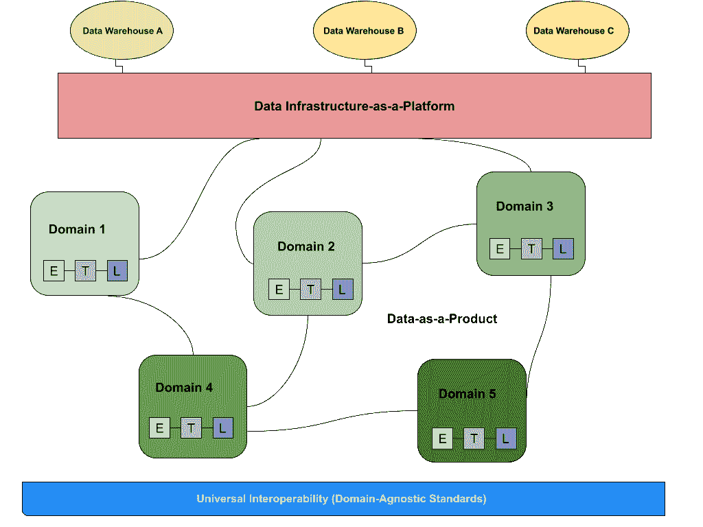
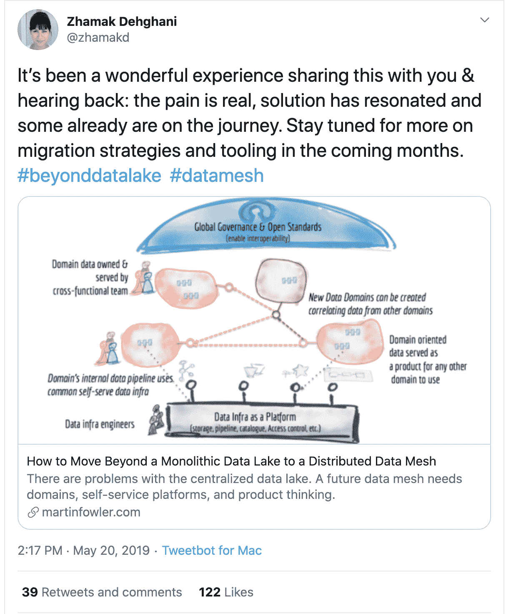

# 什么是数据网格——以及如何不对其进行网格划分

> 原文：<https://towardsdatascience.com/what-is-a-data-mesh-and-how-not-to-mesh-it-up-210710bb41e0?source=collection_archive---------0----------------------->

## 实现最新行业趋势的初学者指南:数据网格。

*图片由* [*罗南古田*](https://unsplash.com/photos/ctBrDi3Cf2Y) *上*[*Unsplash*](https://unsplash.com/)*。*

*问问数据行业的任何人，最近什么是热门话题,“数据网格”很可能会成为热门话题。但是什么是数据网格，为什么要构建数据网格呢？好奇的人想知道。*

在[自助式商业智能](https://searchbusinessanalytics.techtarget.com/definition/self-service-business-intelligence-BI)的时代，几乎每个公司都认为自己是数据第一的公司，但并不是每个公司都以应有的民主化和可扩展性水平对待他们的数据架构。

比如，贵公司将数据视为创新的驱动力。你的老板是业内最早看到雪花和 Looker 潜力的人之一。或者，您的 CDO 领导了一项跨职能计划，向团队传授数据管理最佳实践，而您的 CTO 投资了一个数据工程团队。然而，最重要的是，您的整个数据团队都希望有一种更简单的方法来管理组织不断增长的需求，从处理永无止境的即席查询到通过中央 ETL 管道处理不同的数据源。

支持这种对民主化和可伸缩性的渴望的是认识到您当前的数据架构(在许多情况下，一个孤立的数据仓库或一个具有一些有限实时流能力的数据湖)可能无法满足您的需求。

> 幸运的是，寻找数据新租约的团队只需要看看[数据网](https://martinfowler.com/articles/data-monolith-to-mesh.html#DomainDataAsAProduct)，一种正在席卷行业的架构范式。

# 什么是数据网格？

就像软件工程团队从[单片应用过渡到微服务架构](https://www.mulesoft.com/resources/api/microservices-vs-monolithic)一样，数据网格在许多方面是微服务的数据平台版本。

正如 ThoughtWorks 顾问和该术语最初的设计者 Zhamak Dehghani 首先定义的那样， [**数据网格**](https://martinfowler.com/articles/data-monolith-to-mesh.html#DomainDataAsAProduct) 是一种数据平台架构，它通过利用面向领域的自助式设计来接纳企业中无处不在的数据。借用 Eric Evans 的 [**领域驱动设计**](https://domainlanguage.com/ddd/) 理论，一种将代码的结构和语言与其对应的业务领域相匹配的范式，数据网格被广泛认为是数据领域的下一个重大架构转变。

与在一个中央数据湖中处理数据的消费、存储、转换和输出的传统整体数据基础设施不同，数据网格支持分布式的、特定于域的数据消费者，并将“数据视为产品”，每个域处理自己的数据管道。连接这些域及其相关数据资产的组织是一个通用的互操作性层，它应用相同的语法和数据标准。

**我们将把数据网格的定义归结为几个关键概念，并强调它与传统数据架构的不同，而不是重新发明 Zhamak 精心打造的轮子。**

(如果你还没有，我强烈推荐你阅读她的开创性文章[如何超越单一数据湖到分布式数据网格](https://martinfowler.com/articles/data-monolith-to-mesh.html)，或者观看 Max Schulte 的技术演讲[为什么 Zalando 过渡到数据网格](https://databricks.com/session_na20/data-mesh-in-practice-how-europes-leading-online-platform-for-fashion-goes-beyond-the-data-lake)。你不会后悔的)。

*在高层次上，数据网格由三个独立的组件组成:数据源、数据基础设施和由功能所有者管理的面向领域的数据管道。数据网格架构的底层是一个通用的互操作性层，反映了与领域无关的标准，以及可观察性和治理。(图片由蒙特卡洛数据公司提供。)*

## 面向领域的数据所有者和管道

数据网格联合了负责将数据作为产品提供的领域数据所有者之间的数据所有权，同时也促进了跨不同位置的分布式数据之间的通信。

数据基础架构负责为每个域提供处理数据的解决方案，而域的任务是管理数据的接收、清理和聚合，以生成可由商业智能应用程序使用的资产。每个域负责拥有自己的 ETL 管道，但是一组功能应用于所有域，存储、编目和维护对原始数据的访问控制。一旦数据被提供给给定的域并被其转换，域所有者就可以利用这些数据来满足他们的分析或运营需求。

## 自助功能

> 数据网格利用面向领域的设计原则来提供一个自助式数据平台，允许用户抽象技术复杂性并专注于他们各自的数据用例。

正如 Zhamak 所概述的，面向领域设计的主要关注点之一是维护每个领域中的数据管道和基础设施所需的重复工作和技能。为了解决这一问题，数据网格收集和提取与域无关的数据基础架构功能，并将其放入一个中央平台，该平台处理数据管道引擎、存储和流基础架构。同时，每个域负责利用这些组件来运行定制的 ETL 管道，为它们提供轻松提供数据所需的支持，以及真正拥有流程所需的自主权。

## 通信的互操作性和标准化

每个领域的基础是一组通用的数据标准，有助于在必要时促进领域之间的协作——而且通常如此。不可避免的是，一些数据(原始数据源和经过清理、转换和服务的数据集)对多个领域都有价值。为了支持跨域协作，数据网格必须在格式、治理、可发现性和元数据字段以及其他数据特性上实现标准化。此外，就像单个微服务一样，每个数据域都必须定义并同意它们将向其消费者“保证”的 SLA 和质量措施。

# 为什么要使用数据网格？

直到最近，许多公司还在利用连接到无数商业智能平台的单一数据仓库。这种解决方案由一小群专家维护，并且经常背负着巨大的技术债务。

在 2020 年，当今的架构是一个具有实时数据可用性和流处理的数据湖，其目标是从集中式数据平台接收、丰富、转换和提供数据。对于许多组织来说，这种类型的体系结构在几个方面存在不足:

*   中央 ETL 管道使得团队对不断增长的数据量的控制更少
*   随着每个公司都成为数据公司，不同的数据用例需要不同类型的转换，这给中央平台带来了沉重的负担

这种数据湖会导致数据生产者失去联系、数据消费者失去耐心，更糟糕的是，积压的数据团队难以跟上业务需求的步伐。相反，面向领域的数据架构，比如数据网格，给团队带来了两个世界的好处:一个集中的数据库(或者一个分布式数据湖),域(或者业务区域)负责处理他们自己的管道。正如 Zhamak 所说，数据架构可以通过分解成更小的、面向领域的组件来最容易地扩展。

数据网格为数据所有者提供了更大的自主权和灵活性，促进了更大的数据实验和创新，同时减轻了数据团队通过单一管道满足每个数据消费者需求的负担，从而为数据湖的缺点提供了解决方案。

同时，数据网格的自助式基础设施即平台为数据团队提供了一种通用的、领域无关的、通常是自动化的方法来实现数据标准化、数据产品谱系、数据产品监控、警报、日志记录和数据产品质量指标(换句话说，就是数据收集和共享)。综上所述，与传统的数据架构相比，这些优势提供了一种竞争优势，而传统的数据架构通常会因客户和消费者之间缺乏数据标准化而受阻。

# 啮合还是不啮合:这是一个问题

处理大量数据源并需要试验数据(换句话说，快速转换数据)的团队考虑利用数据网格是明智的。

**我们进行了一个简单的计算，以确定贵组织投资数据网格是否有意义。**请用一个数字回答下面的每个问题，并将它们加在一起，得出一个总数，换句话说，就是您的数据网格分数。

*   **数据来源数量**。你的公司有多少数据源？
*   **数据团队的规模**。您的数据团队中有多少数据分析师、数据工程师和产品经理(如果有)？
*   **数据域的数量**。多少职能团队(营销、销售、运营等。)依靠你的数据源来驱动决策，你的公司有多少产品，有多少数据驱动的功能正在构建？把总数加起来。
*   **数据工程瓶颈。**数据工程团队成为新数据产品实施瓶颈的频率有多高(1 到 10 分，1 表示“从不”，10 表示“总是”)。
*   **数据治理。**在 1 到 10 的范围内，数据治理对您的组织来说有多重要，1 表示“我不在乎”，10 表示“它让我彻夜难眠”？

## 数据网格分数

一般来说，您的得分越高，您公司的数据基础架构要求就越复杂和苛刻，反过来，您的组织就越有可能从数据网格中受益。如果您的得分高于 10，那么实施一些数据网格最佳实践可能对您的公司有意义。如果您的得分高于 30，那么您的组织就处于数据网格的最佳位置，加入数据革命将是明智之举。

以下是如何分解你的分数:

*   **1–15**:鉴于您的数据生态系统的规模和单维性，您可能不需要数据网格。
*   **15–30**:您的组织正在迅速成熟，甚至可能正处于真正能够利用数据的十字路口。我们强烈建议结合一些数据网格最佳实践和概念，以便以后的迁移更加容易。
*   **30 岁或以上**:您的数据组织是您公司的创新驱动力，数据网格将支持任何正在进行或未来的数据民主化计划，并在整个企业中提供自助式分析。

> 随着数据变得越来越普遍，数据消费者的需求不断多样化，我们预计数据网格对于拥有 300 多名员工的基于云的公司来说将变得越来越普遍。

*图片由米姆·Generator.net 提供。*

# 不要忘记可观察性

对于数据行业的许多人来说，使用数据网格架构的巨大潜力既令人兴奋又令人畏惧。事实上，我们的一些客户担心数据网格不可预见的自治和民主化会带来与数据发现和健康以及数据管理相关的新风险。

> 鉴于数据网格的相对新颖性，这是一个合理的关注，但我会鼓励有好奇心的人阅读小字。与其引入这些风险，**数据网格实际上要求** [**可扩展的、自助式的可观察性**](/what-is-data-observability-40b337971e3e) **进入您的数据**。

事实上，如果域没有可观察性，它们就不能真正拥有自己的数据。根据 Zhamak 的说法，任何良好的数据网格所固有的这种自助服务能力包括:

*   静态和动态数据加密
*   数据产品版本化
*   数据产品模式
*   数据产品发现、目录注册和发布
*   数据治理和标准化
*   数据生产谱系
*   数据产品监控、警报和记录
*   数据产品质量指标

当打包在一起时，这些功能和标准化提供了一个健壮的可观察层。数据网格范例还规定了一种标准化的、可扩展的方式，用于各个领域处理这些不同的可观察性租户，允许团队回答这些问题以及更多问题:

*   我的数据是新的吗？
*   我的数据坏了吗？
*   如何跟踪架构更改？
*   我的管道的上游和下游依赖关系是什么？

如果你能回答这些问题，你就可以放心，你的数据是完全可观察的，也是可以信任的。

有兴趣了解更多关于数据网格的信息吗？除了 Zhamak 和 Max 的资源之外，请查看一些我们最喜欢的关于这位数据工程新星的文章:

*   [应用数据网格](/data-mesh-applied-21bed87876f2) —斯文·巴尔诺扬
*   [数据网:重新思考数据整合](https://www.eckerson.com/articles/the-data-mesh-re-thinking-data-integration) —凯文·佩特里
*   [您的应用是否应该考虑数据网格连接](https://www.forbes.com/sites/forbestechcouncil/2020/05/07/should-your-application-consider-data-mesh-connectivity/#4d6052f756d7)？—乔·格林瑟

***你的公司正在构建数据网格吗？伸出*** [***巴尔摩西和利奥加维什***](http://montecarlodata.com?utm_source=blog&utm_medium=medium&utm_campaign=data_mesh) ***带着你的经历、提示、痛点。我们希望收到您的来信！***

*本文由蒙特卡洛首席执行官* [*巴尔·摩西*](https://www.linkedin.com/in/barrmoses/) *和蒙特卡洛首席技术官*[*Lior GAVI sh*](https://www.linkedin.com/in/lgavish/)*撰写。*

*有兴趣加入数据可靠性运动吗？把手伸向* [*蒙特卡洛团队*](https://www.montecarlodata.com/request-a-demo/) *！*

