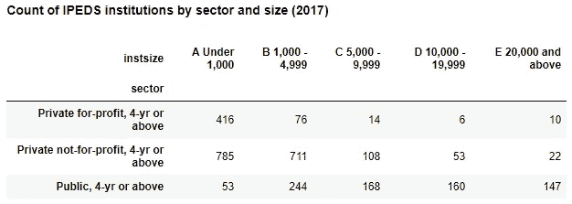
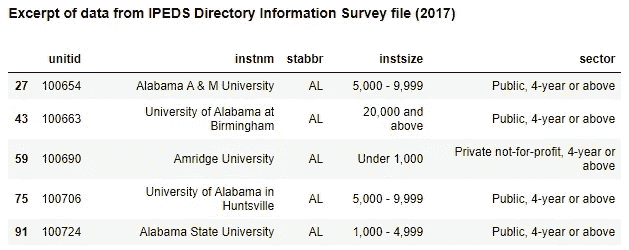

# 什么是数据集？

> 原文：<https://towardsdatascience.com/what-is-a-data-set-9c6e38d33198?source=collection_archive---------17----------------------->

图片来源:“Via Design Pickle”——[更多关于属性](https://adamrossnelson.medium.com/image-credit-attributions-a24efcc730ad)。

## 作为一名研究人员和数据科学家，与您的同事分享您谈论数据集时的意思是富有成效的

# 介绍

T 他的文章以两个专业人士 Sam 和 Pam 的故事开始，他们在数据交流方面有困难，因为他们还没有共享的词汇。也许你会认同萨姆或帕姆。第一个角色 Sam 是一名研究员和数据科学家。第二个角色帕姆也是一个训练有素、技术高超的专业人士。

在这个轶事之后，本文继续定义什么是数据集。数据集的组成部分。数据集是如何构造的。以及研究人员或数据分析师如何应用分析技术生成数据摘要。本文讨论的分析技术被称为交叉列表法。

# 缺乏共同的词汇

研究员兼数据科学家 Sam 遇到了经验丰富的同事 Pam。Sam 和 Pam 需要讨论在几周后到期的季度报告中添加一个部分。Sam 尚未参与此报告，但已同意帮助完成部分分析。

> 萨姆和帕姆感到沮丧的原因是两人还没有共同的词汇。

在会议准备过程中，Sam 要求 Pam 带来一份相关原始数据集的副本。萨姆和帕姆认为他们相互理解。但是他们很快意识到他们没有。在会议上，Sam 提供了类似于下图的打印输出，并将其作为原始数据提供。

图 1:显示了三种四年制校园类型和五种机构规模类别中的机构数量。图片来源:“作者截屏”——[更多关于归属](https://adamrossnelson.medium.com/image-credit-attributions-a24efcc730ad)。

此图(图 1)是教育机构类型和机构规模的交叉列表。它显示了每个规模类别(跨列列出)中存在的每种机构类型(在行中列出)的数量。

事实证明，交叉制表并不是原始数据集。交叉列表可以作为数据集使用。但是交叉列表并不是“原始数据”

交叉制表是一种分析技术。交叉列表产生的表格是应用分析技术的结果。因此，当然，Sam 再次要求原始数据集。当然，Pam 认为她已经提供了数据集，因此很沮丧。

萨姆和帕姆感到沮丧的原因是两人还没有共同的词汇。他们还没有有效地沟通。因为 Sam 和 Pam 没有共享的词汇表，他们不仅感到沮丧，而且他们的数据相关项目也会受到影响。

# 什么是数据集？

数据集大致由两部分组成。这两个组件是行和列。此外，数据集的一个关键特征是它被组织成每行包含一个观察值。

## 行和列

行和列就是它们听起来的样子。这张图片(图 2)是用来制作上述交叉表格的数据摘录。这些数据来自综合中学后教育数据系统。

图 2:来自 IPEDS 目录信息调查文件的数据摘录。图片鸣谢:“作者截屏”——[更多关于归属](https://adamrossnelson.medium.com/image-credit-attributions-a24efcc730ad)。

在本例中，显示的行是机构标识号(united)、机构名称(instm)、州缩写(stabbr)、机构规模(instsize)和机构类型(sector)。研究人员和数据科学家将这些列称为变量，有时也称为维度。

## 观察

一个关键特征是每行对应一个观察值。观察确实与收集信息的过程有关。例如，在上表中，为了在各行之间填充信息，科学家将*观察*第一个机构，并询问“它的名称、州、大小和部门是什么”阿拉巴马 A & M 大学的答案是“阿尔”、“5000-9999”和“公立，4 年或以上”

对于每个机构，有一行。由于每个机构都有一行，因此该数据集适用于以高等教育机构为分析单位的分析。下一节应用一种称为交叉制表的分析技术。

# 运用分析技术

图 1 对图 2 所示的数据应用了一种称为交叉制表的分析技术。交叉列表引用了两个列或变量(sector 和 instsize)。

应用交叉列表技术很简单。首先，研究人员绘制了一个表格，每个机构类型占一行，每个机构规模类别占一行。然后，如图 1 所示，对于左上角的单元格，研究人员将计算并报告私立 4 年制院校和学生注册人数在 1000 人以下的院校的数量。在表格中上下移动，重复该过程，直到所有单元格都填满。

# 结论

在我作为一名研究人员，然后作为一名数据科学家的职业生涯中，我发现自己解释“数据集”的含义的次数多得数不清。建立对数据集等关键术语和短语的共同理解是建立数据驱动文化的一个重要方面。

本文解释并举例说明了一个数据集。具体来说，本文演示了通过观察世界上的某些事物，然后记录被观察事物的特征来填充数据集的过程。因此，数据集保存最基本的数据。

同样，本文还将数据集与交叉制表分析技术的输出进行了比较。填充数据集需要观察世界。与填充数据集相关的过程不同，不直接观察世界就可以填充交叉表格。交叉列表可以通过参考数据集来建立。

当 Sam 向 Pam 解释什么是数据集，以及为什么有必要提供 Pam 所寻求的帮助时，两个人一起学习并成长。下一次这两个人一起工作时，他们更有效地完成了他们的项目，挫折也少了很多。

 [## 加入我的介绍链接媒体-亚当罗斯纳尔逊

### 作为一个媒体会员，你的会员费的一部分会给你阅读的作家，你可以完全接触到每一个故事…

adamrossnelson.medium.com](https://adamrossnelson.medium.com/membership) 

# 感谢阅读

感谢阅读。把你的想法和主意发给我。你可以写信只是为了说声嗨。如果你真的需要告诉我是怎么错的，我期待着尽快和你聊天。推特:[@ adamrossnelson](https://twitter.com/adamrossnelson)LinkedIn:[亚当·罗斯·尼尔森在推特](https://www.linkedin.com/in/arnelson)和脸书:[亚当·罗斯·尼尔森在脸书](https://www.facebook.com/adamrossnelson)。