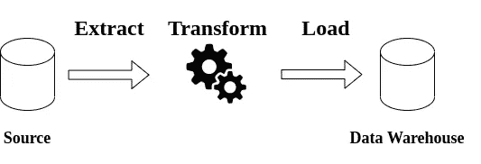

# 什么是数据仓库:基本架构

> 原文：<https://towardsdatascience.com/what-is-a-data-warehouse-basic-architecture-ea2cd12c9bb0?source=collection_archive---------17----------------------->

## 数据仓库主要概念介绍

照片由[金在贤](https://unsplash.com/@xeno_pluxus?utm_source=medium&utm_medium=referral)在 [Unsplash](https://unsplash.com?utm_source=medium&utm_medium=referral) 上拍摄

数据仓库是一个组件，根据组织的需求对数据进行集中、组织和结构化。它用于数据分析和 BI 流程。

数据仓库并不是一个新概念。事实上，这个概念是在 20 世纪 80 年代末[发展起来的。但是，它随着时间的推移而演变。](https://en.wikipedia.org/wiki/Data_warehouse#History)

这篇文章的目的是解释与数据仓库相关的**主要概念及其用例。此外，我们将讨论**数据湖**以及这两个组件如何协同工作。**

> **TL；DR —** 这篇文章包含了关于数据湖和数据仓库的基本信息。所以，如果你熟悉这些主题和它们的基本架构，这篇文章可能不适合你。如果这不是你的情况，请继续享受阅读。

# 为什么需要数据仓库？

一开始，一片混乱。至少这是我到达一个使用旧的电子表格和一堆 CSV 文件进行**数据分析的组织时的观点。没有人不知道文件会从哪里来**。他们只是…在那里。

不一致的衡量标准、不可复制的流程和大量手动复制/粘贴工作在当时很常见。

甚至没有人知道他们跟踪的指标的真正价值是什么。例如，对于月活跃用户(MAU)这样的指标，答案总是取决于你问的是谁。

如果你还和我在一起，这让你想起了什么，你可能知道拥有一个单一的真相来源是很重要的。主要是因为您不想让许多业务用户根据不一致的指标做出决策。

此外，您不希望您的数据工程师/分析师做一堆可以自动化的手动工作。当然，他们可以做比复制/粘贴电子表格更有趣的事情。

如果这是您的组织每天都面临的问题，那么您可能需要一个数据仓库。

那么，现在让我来定义什么是数据仓库…

> 数据仓库是一个组件，根据组织的需求对数据进行集中、组织和结构化。它用于数据分析和 BI 流程。

简而言之，在以下情况下，您可能需要数据仓库:

*   有几个人在处理数据，他们需要数据保持一致，*即*，他们需要一个真实的来源。因此，他们可以做出更明智的决定
*   您有几个数据来源，以手动方式集成它们并不容易
*   您希望自动化需要重复的手动流程
*   您希望基于干净、有组织和结构化的数据进行数据分析
*   您拥有维护数据仓库的资源

# 数据仓库基本概念

现在你知道为什么你需要一个数据仓库，让我们探索一些数据仓库的基本概念。

因此，如果您想集成多个数据源，并以一种可以执行数据分析的方式组织数据，您必须将其集中化。这就是 ETL(提取、转换和加载)过程的用武之地。

基本上，ETL 过程从数据源中提取数据，以一种可用的方式转换数据，并将其加载到数据仓库中。所以，你可以做一些很酷的分析和商业智能流程。

一个经典 ETL 过程的插图——作者制作的插图

但是，**的 ETL 流程被认为是** [***的遗留方式***](https://dataschool.com/data-governance/etl-vs-elt/) 。ETL 过程表现出的一些问题是:

*   没有原始数据形式的注册表，因为转换发生在数据仓库的途中。这使得**转换过程难以重现**。更有甚者，如果你的数据不是一成不变的，*即*，数据源是不断变化的
*   向转换逻辑中引入新的变化可能很困难，因为它可能需要您重新处理已经转换的过去的数据。根据您的要求，如果您没有原始形式的数据，这可能很难实现
*   维护用于支持 ETL 过程的数据架构可能会更加复杂，因为您可能需要投入额外的资源来执行它们

还有另一种类似于 **ETL** 过程的方法: **ELT** 过程。 **ELT** (提取、加载和转换)流程被认为是现代的方法。基本上，它们执行相同的过程，但顺序不同。这种方法的一些主要优势是:

*   数据可以以其原始形式提取，最终以**提取过程中的简单逻辑**结束
*   原始形式的数据可以存储在临时区域中。这样，您可以生成不可变的数据。通过这样做，你可以使**转化过程容易重现**
*   转换过程可以通过使用现代数据仓库的能力来执行，因此**您不必花费额外的资源**来执行这样的过程
*   基于 ELT 的架构可能更容易维护，这取决于您的设置

**集结地**

根据 [Maxime Beauchemin](https://medium.com/u/9f4d525c99e2?source=post_page-----ea2cd12c9bb0--------------------------------) 的说法，理想情况下，数据仓库的暂存区应该是不可变的，*也就是说，*它应该是**一个所有数据都以其原始形式存在的区域**。因此，它可以作为您的数据仓库的*装载平台*。

临时区域允许您获取原始形式的数据，并在其上执行转换过程，而无需实际更改数据。因此，基本上，您将原始形式的数据作为输入，生成新的数据作为输出。

这个概念很重要，因为如果您需要更改转换过程中的一些逻辑，如果您拥有原始形式的数据，那么重新处理数据应该更容易。请记住，这是一个理想的状态，所以实现它有时会很困难。

一个不可变的暂存区应该允许你从零开始重新计算仓库的状态，以防你需要。这可以通过实现功能转换过程和纯任务来实现——更多信息请参见这篇[文章](https://medium.com/@maximebeauchemin/functional-data-engineering-a-modern-paradigm-for-batch-data-processing-2327ec32c42a)。此外，查看这篇[文章](/implementing-the-functional-data-engineering-paradigm-in-data-load-processes-by-using-airflow-61d3bae486b0)，了解功能数据工程概念的实施示例。

 [## 通过使用气流在数据加载过程中实现功能数据工程范例

### 我们在一个包含四十多个应用程序的项目中集成了几个数据源。这些来源由…整合

towardsdatascience.com](/implementing-the-functional-data-engineering-paradigm-in-data-load-processes-by-using-airflow-61d3bae486b0) 

## 数据湖

数据湖可以定义为多个数据源的存储库，其中数据以其原始格式存储。

它类似于一个数据仓库的暂存区——参见这篇[帖子](https://sonra.io/2018/05/22/checklist-for-a-successful-data-lake-implementation)了解更多信息。但是，它们解决了一些数据仓库没有解决的问题。例如，处理半结构化和非结构化数据— JSON 文件、XML 文件等等。

# 数据仓库体系结构

此时，您可能想知道数据仓库和数据湖是如何协同工作的。

因此，简单地说，您可以通过实施 ELT 流程并遵循一些架构原则，在数据湖之上构建一个数据仓库。

查看这篇文章，了解更多关于这些原则的信息。

 [## 构建数据仓库:基本架构原则

### 一种简化数据仓库的方法

towardsdatascience.com](/building-a-data-warehouse-basic-architectural-principles-66bd7059ffd0) 

允许实现前面解释的方法的基本架构可能如下所示:

一个数据管道体系结构的抽象——作者举例说明

这个阶段可以描述如下:

*   **来源:**来自业务运营的数据。这些数据可能来自您组织的生产数据库。此外，它可能来自您组织感兴趣的其他来源，*，例如*，如 CRM、API 等…
*   **数据湖:**应该集中所有数据源的存储库。它可以作为数据仓库的中转区。理想情况下，它应该包含不可变的数据，这样可以很容易地保证过程的再现性。
*   **数据仓库:**一个根据数据分析需要构建所有数据的来源。它建立在数据湖之上。基本上，您将数据湖的数据作为输入，通过应用一些转换逻辑，在数据仓库中生成该数据的新视图。
*   **可视化:**所有的工具和过程允许你通过绘制一些图表来进行酷的分析，*例如*，元数据库，表格等等。这些工具应该允许您可视化数据仓库中的结构化数据。所有与复杂计算相关的繁重工作都应该在数据仓库中执行。

# 结论

在这篇文章中，我们讨论了一些与数据仓库和数据湖相关的基本概念。

此外，我们还讨论了这两个组件如何通过组装正确的架构来实现互补。

你应该知道，关于这个话题，你应该检查更多。

例如，一旦对数据仓库进行了初始设置，就应该实施几个过程来提高其可操作性和性能。更多信息请看这篇文章

 [## 构建数据仓库管道:基本概念和路线图

### 提高数据管道可操作性和性能的五个过程

towardsdatascience.com](/building-a-data-warehouse-pipeline-basic-concepts-roadmap-d14032890ab6) 

如果你想更深入地了解数据仓库的理论，别忘了查看 Ralph Kimball 的数据仓库工具包。这本书是最受认可的关于数据仓库的书籍之一。

我希望这些信息对你有用。

感谢阅读到最后。

下期帖子再见！

*如果你想随时更新我的作品，* ***请加入我的*** [***通迅***](https://metadatacommunity.substack.com/) ***！偶尔，我会和我的读者分享一些东西。如果你加入我会很感激:)***

 [## 对数据仓库感兴趣？

### 我已经写了几篇关于它的文章。这就是如何阅读它们！

ajhenaor.medium.com](https://ajhenaor.medium.com/interested-in-data-warehousing-424b49ec97e4)