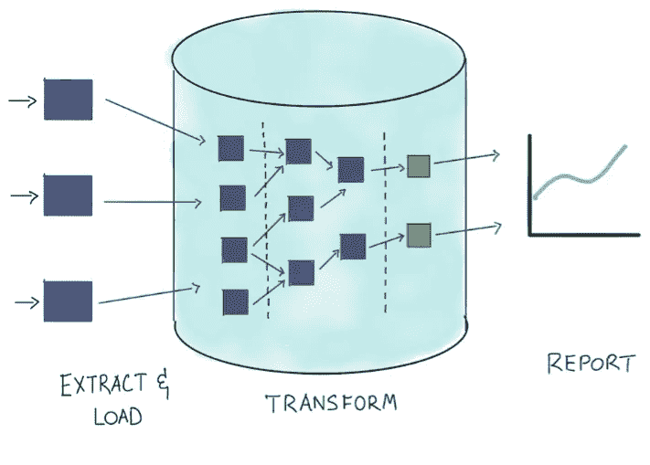
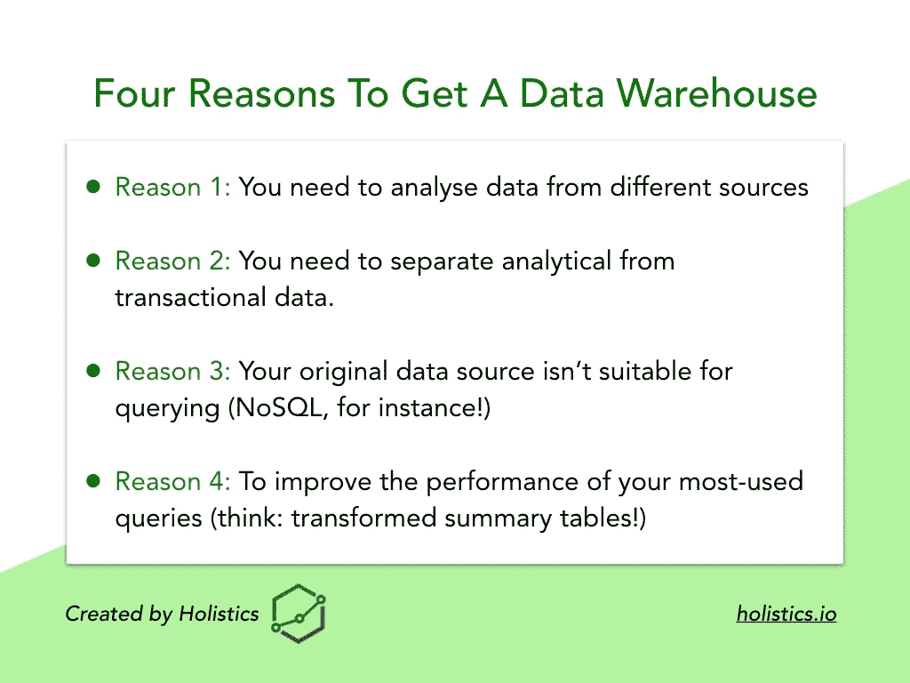
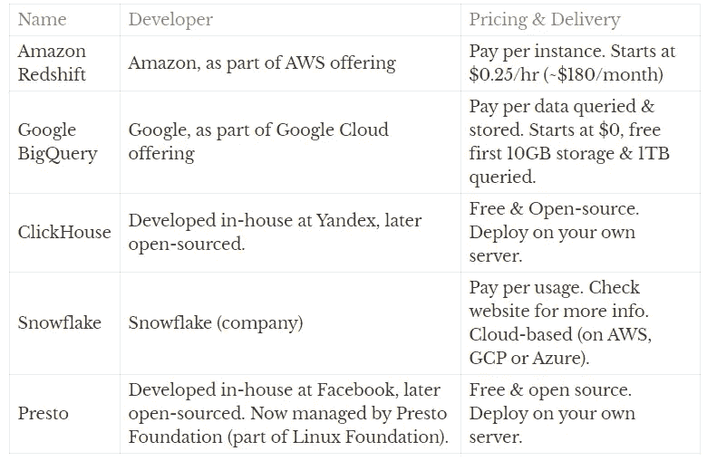
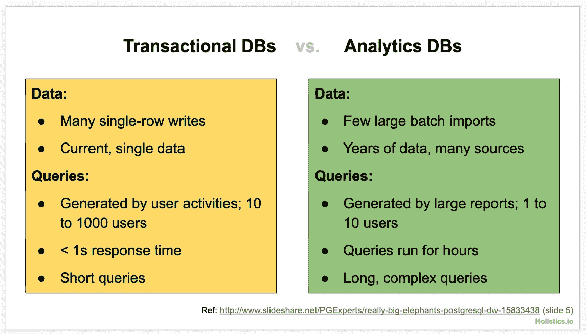

# 什么是数据仓库，何时以及为什么要考虑数据仓库

> 原文：<https://towardsdatascience.com/what-is-a-data-warehouse-when-and-why-to-consider-one-2e826be68e95?source=collection_archive---------32----------------------->

## "什么时候我们应该考虑获得一个数据仓库？"

术语“数据仓库”在数据分析领域被广泛使用，然而，对于数据分析新手来说，问上述问题是很常见的。

这篇文章试图帮助解释数据仓库的定义，何时以及为什么要考虑建立一个数据仓库。

Ps:这是我们团队正在编写的指南的一部分，[分析设置指南](https://www.holistics.io/books/setup-analytics/understanding-the-data-warehouse/)。如果您有兴趣了解更多关于现代 BI 堆栈的高级或最佳实践，请随时查看链接以了解我们的进展。

# 什么是数据仓库？

数据仓库是一种分析数据库，它存储和处理您的数据，以便进行分析。您的数据仓库将处理您的分析的两个主要功能:**存储您的分析数据&处理您的分析数据**。

**你为什么需要一个？**您需要数据仓库有两个主要目的:

1.  首先，如果来自多个业务功能的数据位于不同的来源，您就不能轻松地将它们组合起来。
2.  其次，您的源系统不是为运行繁重的分析而设计的，这样做可能会危及您的业务运营，因为这会增加这些系统的负载。

您的数据仓库是分析管道流程每一步的核心，它有三个主要用途:

*   **存储:**在整合(提取&加载)步骤中，您的数据仓库将**接收来自多个来源的**和**存储数据**。
*   **流程:**在流程(转换&模型)步骤中，您的数据仓库将处理从转换步骤生成的大部分(如果不是全部的话)**密集处理**。
*   **访问:**在报告(可视化&交付)步骤中，报告首先被**收集到数据仓库**中，然后被可视化并交付给最终用户。



目前，大多数数据仓库使用 SQL 作为他们的主要查询语言。

# 什么时候是获得数据仓库的合适时机？

TL；博士的回答是*看情况。*这取决于你公司所处的阶段、你拥有的数据量、你的预算等等。

在早期阶段，您可能可以在没有数据仓库的情况下，将商业智能(BI)工具直接连接到您的生产数据库([对于刚刚起步的人来说，这是一个简单的 BI 设置](https://www.holistics.io/books/setup-analytics/a-simple-setup-for-people-just-starting-out))。

但是，如果您仍然不确定数据仓库是否适合您的公司，请考虑以下几点:

**首先，你需要分析不同来源的数据吗？**

在公司生命中的某个时刻，您可能需要组合来自不同内部工具的数据，以便做出更好、更明智的业务决策。

例如，如果你是一家餐馆，想要分析订单/服务员比率效率(一周中员工最忙和最空闲的时间)，你需要将你的销售数据(来自 POS 系统)和你的员工值班数据(来自 HR 系统)结合起来。

对于这些分析，如果您的数据位于一个中心位置，就容易多了。

**第二，你需要把你的分析数据和交易数据分开吗？**

如前所述，您的事务系统不是为分析目的而设计的。因此，如果你在应用程序中收集活动日志或其他潜在有用的信息，将这些数据存储在应用程序的数据库中并让分析师直接在生产数据库中工作可能不是一个好主意。

相反，更好的办法是购买一个数据仓库——一个*为复杂查询设计的*——并将分析数据转移到那里。这样，你的应用程序的性能就不会受到你的分析工作的影响。

**第三，你的原始数据源是否不适合查询？**

例如，绝大多数 BI 工具不能很好地与 MongoDB 这样的 NoSQL 数据存储一起工作。这意味着在后端使用 MongoDB 的应用程序需要将其分析数据转移到数据仓库，以便数据分析师能够有效地使用它。

**第四，您想提高分析查询的性能吗？**

如果您的事务性数据包含成千上万行，那么创建汇总表将这些数据聚合成更易查询的形式可能是个好主意。不这样做将导致查询变得非常慢——更不用说给数据库带来不必要的负担了。



如果你对以上任何一个问题的回答是肯定的，那么你很有可能会得到一个数据仓库。

也就是说，在我们看来，获得一个数据仓库通常是一个好主意，因为数据仓库在云时代并不昂贵。

# 我应该选择哪个数据仓库？

以下是一些常见的数据仓库，您可以从中挑选:

*   亚马逊红移
*   谷歌大查询
*   雪花
*   点击之家(自托管)
*   Presto(自托管)

如果您刚刚开始，并且没有强烈的偏好，我们建议您使用 Google BigQuery，原因如下:

*   **BigQuery 的第一个 10GB 存储和第一个 1TB 查询是免费的**。之后就是按使用付费了。
*   **BigQuery 是完全托管的(无服务器)**:没有物理(或虚拟)服务器需要启动或管理。
*   **作为其架构的结果，BigQuery 自动伸缩:** BigQuery 将根据查询的复杂性和您扫描的数据量，自动确定分配给每个查询的正确计算资源量，而无需您手动微调。

*(注:我们与谷歌没有任何隶属关系，我们推广 BigQuery 也没有报酬)。*

但是，如果您的数据量快速增长，或者您有复杂/特殊的用例，您将需要仔细评估您的选择。

下面，我们给出了一个最流行的数据仓库表。我们在这里的目的是让您对数据仓库领域中最常见的选择有一个高层次的理解。这绝不是全面的，也不足以帮助你做出明智的决定。

但我们认为这是一个好的开始:



# 什么使得数据仓库不同于普通的 SQL 数据库？

此时，你们中的一些人可能会问:

*“嘿，数据仓库不就像关系数据库一样存储数据以供分析吗？我就不能用 MySQL、PostgreSQL、MSSQL 或者 Oracle 之类的东西作为我的数据仓库吗？”*

简单的回答是:是的，你可以。

最长的答案是:视情况而定。首先，我们需要理解几个概念。

# 事务性工作负载与分析性工作负载

理解两种数据库工作负载之间的区别很重要:事务性工作负载和分析性工作负载。

**事务性工作负载**是服务于正常业务应用程序的查询工作负载。当访问者在 web 应用程序中加载产品页面时，会向数据库发送一个查询来获取该产品，并将结果返回给应用程序进行处理。

```
SELECT * FROM products WHERE id = 123
```

*(上面的查询检索 ID 为 123 的单个产品的信息)*

以下是事务性工作负载的几个常见属性:

*   每个查询**通常检索单个记录或少量记录**(例如，获取一个类别中的前 10 篇博客文章)
*   事务性工作负载通常涉及简单的查询，运行这些查询需要很短的时间(不到 1 秒)
*   **任意时间点的大量并发查询**，受限于应用程序的并发访问者数量。对于大网站来说，这可以达到几千或几十万。
*   通常对**整个数据记录**(例如产品表中的每一列)感兴趣。

**另一方面，分析工作量**指的是用于分析目的的工作量，也就是这本书谈到的那种工作量。运行数据报告时，将向 DB 发送一个查询来计算结果，然后显示给最终用户。

```
SELECT category_name, count(*) as num_products FROM products GROUP BY 1
```

*(上面的查询扫描整个产品表，以计算每个类别中有多少产品)*

另一方面，分析工作负载具有以下属性:

*   每个查询通常**扫描表中的大量行**。
*   每个查询都是**繁重的，需要很长时间**(几分钟，甚至几个小时)才能完成
*   受报告数量或使用分析系统的内部员工数量的限制，并发查询并不多。
*   通常感兴趣的**只是几列**的数据。

下面是事务性与分析性工作负载/数据库之间的比较表。



事务性工作负载有许多简单的查询，而分析性工作负载很少有繁重的查询。

# 分析数据库的后端是不同的

由于上述两种工作负载之间的巨大差异，这两种工作负载的数据库底层后端设计非常不同。事务数据库针对具有高并发量的快速、简短查询进行了优化，而分析数据库针对长时间运行的资源密集型查询进行了优化。

你问的建筑有什么不同？这将需要一个专门的部分来解释，但它的要点是分析数据库使用以下技术来保证卓越的性能:

*   **列存储引擎:**分析数据库不是将数据逐行存储在磁盘上，而是将数据列组合在一起并存储。
*   **列数据的压缩:**每一列中的数据被压缩，以实现更小的存储和更快的检索。
*   **查询执行的并行化:**现代分析数据库通常运行在数千台机器上。因此，每个分析查询都可以分成多个较小的查询，在这些机器上并行执行(分而治之策略)

现在您可能已经猜到，MySQL、PostgreSQL、MSSQL 和 Oracle 数据库旨在处理事务性工作负载，而数据仓库旨在处理分析性工作负载。

# 那么，我可以使用一个普通的 SQL 数据库作为我的数据仓库吗？

就像我们之前说的，是的，你可以，但这要看情况。

如果您刚开始使用少量数据和一些分析用例，选择一个普通的 SQL 数据库作为您的数据仓库是非常好的(最流行的是 MySQL、PostgreSQL、MSSQL 或 Oracle)。如果您相对较大，拥有大量数据，您仍然可以，但是需要适当的调优和配置。

也就是说，随着 BigQuery、Redshift 等低成本数据仓库的出现，我们建议您继续使用数据仓库。

然而，如果您*必须*选择一个普通的基于 SQL 的数据库(例如，您的企业只允许您在自己的网络内托管它),我们**推荐使用 PostgreSQL** ,因为它拥有最多支持分析的特性。我们也写了一篇详细的博文讨论这个话题:[为什么你应该使用 PostgreSQL 而不是 MySQL 来进行分析](https://www.holistics.io/blog/why-you-should-use-postgres-over-mysql-for-analytics-purpose/?utm_campaign=pg_mysql&utm_source=medium)。

# 摘要

在这篇文章中，我们放大到数据仓库，讨论了:

*   数据仓库是中央分析数据库，用于存储和处理您的数据以进行分析
*   您应该获得数据仓库的 4 个触发点
*   可供选择的数据仓库技术的简单列表
*   数据仓库如何针对分析工作负载进行优化，而传统数据库如何针对事务工作负载进行优化。

*最初发表于*[*Holistics 的《分析设置指南:了解数据仓库*](https://www.holistics.io/books/setup-analytics/understanding-the-data-warehouse/) *。*