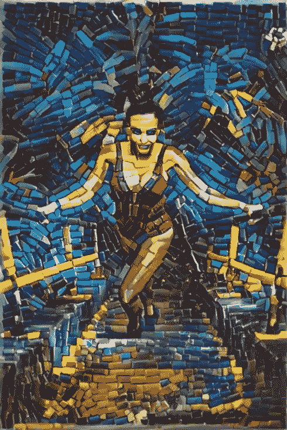

# 什么是甘？

> 原文：<https://towardsdatascience.com/what-is-a-gan-d201752ec615?source=collection_archive---------18----------------------->

左和右:甘斯和 dreamgenerator.com 的作品，中间的照片是由[特拉维斯·科尔伯特](https://unsplash.com/@traviscolbert?utm_source=unsplash&utm_medium=referral&utm_content=creditCopyText)在 [Unsplash](https://unsplash.com/?utm_source=unsplash&utm_medium=referral&utm_content=creditCopyText) 上创作的原作

## 一个怪异的想法如何成为尖端人工智能的基础

  T   *上任何关于机器学习的课程，你都会不可避免地遇到生成性对抗网络(GANs)。理解它们意味着掌握让计算机与自身对抗的惊人力量。*

现在大约五点钟，你刚刚完成作业。

“我不干了！”

太好了！你想玩游戏吗？

耶！今天我们要玩大富翁游戏。

啊，垄断！老实说，我讨厌其中一个玩家得到所有的财产，而另一个玩家不可能赢。

加油！“求你了！”

“那好吧，”

半小时后，你我的财产还是相当平均分配的。

看到了吗？垄断没那么糟糕。

你说得对。我之前说过，因为我正在构建的算法有问题。不知何故，一个选手比另一个选手出色是出了名的。我很难解决这个问题。

用 dreamgenerator.com 上的神经网络制作的图像——原始图片是右上方中间的那张。

啊？“算法中怎么会有玩家呢，”

当你和甘斯打交道时，你就有了对手。

什么？“什么是甘斯，”

让我解释一下。“你知道什么是神经网络吗？”

“呃，不。”

神经网络基本上是一种用来识别模式的算法。例如，面部识别非常依赖神经网络。

你给它一堆无序的数据——比方说人脸的图片——随着时间的推移，它会知道一张人脸是什么样的。我们称之为训练。

“一旦我们训练了神经网络，我们可以给它看一张随机的图像，它会以令人印象深刻的准确度决定这是不是一张人脸。”

 [## 什么是神经网络？

### Rajarshi Bhadra 以一种非常简单的方式描述了神经网络的功能以及它们为什么如此重要。

towardsdatascience.com](/what-is-a-neural-network-a02b3c2fe3fa) 

好吧，神经网络可以告诉你一张脸是不是一张脸。“那么什么是甘？”

GAN 是指我们让两个神经网络互相竞争。就像在游戏中一样。

你让电脑和自己玩？“这多愚蠢啊，”

这并不愚蠢。真是天才，”

“你得给我解释一下……”

第一个神经网络称为生成器。它会生成虚假数据点，并将其传递给对手。那是第二个网络，鉴别器。它的工作就是分辨哪个数据点是真的，哪个是假的。

 [## 50 行代码中的生成性对抗网络

### TL；dr: GANs 比你想象的要简单

medium.com](https://medium.com/@devnag/generative-adversarial-networks-gans-in-50-lines-of-code-pytorch-e81b79659e3f) 

首先，我们在一组真实和虚假的数据点上训练鉴别器。鉴别者猜测什么是真的，什么是假的。之后，我们揭开了真正的解决方案。根据反馈，鉴别者知道什么是假的，什么不是。

就像在警察学院一样，学生们必须区分真钞和假钞。

没错。但是现在发电机开始发挥作用了。他是我们游戏中的伪钞制造者。我们给他真的和假的数据点来训练。基于这些点，它的工作是制造新的数据点来欺骗鉴别器。

但是只给生成器真实的数据点不是更好吗？因为如果你在假货上训练它，那么它会重复那些错误。如果你让我伪造一张 300 美元的钞票，警察会很快抓住它。

用 GAN 在上制作的图像——原图为中间的上图。

你说得对！但是我们不希望发电机变得太好太快。不然鉴别器跟不上。”

哦，就是那个[垄断问题](https://neptune.ai/blog/gan-failure-modes)？在垄断游戏中一个玩家得到了太多的财产。然后就变得无聊了，因为另一个玩家无论如何都赢不了。

没错。我们想时不时地误导生成器。这样歧视者就有机会跟上了。

好吧，假设发电机制造了假数据。现在它可以骗过鉴别器了，对吗？

好吧，它会努力的。鉴别器将有望在区分真实数据点和虚假数据点方面做出合理的工作。然后，它会将自己的决定通知发电机。

比如警察什么时候会告诉一个罪犯他是否被判有罪？

没错。基于这个决定，发电机将再次开始工作。它会制造新的假货，但根据反馈，它会努力让假货变得更好，以便骗过鉴别者。

然后再轮到鉴别者，以此类推。最终，我们使用 GAN 生成了一堆新的数据点！”

好吧酷。“但这有什么用呢，”

你可以用它做各种事情。例如，你可以根据别人的想法，制作漂亮的新图片。

你可能听说过深度假货。这些照片是用甘斯做的。“你听说过可以辨别人脸年龄的应用吗？”

呸。噱头！”

 [## 利用生成性对抗网络生成现代艺术

### 创建一个生成现代艺术的生成对抗网络，并在 Spell 平台的 GPU 上进行训练

towardsdatascience.com](/generating-modern-arts-using-generative-adversarial-network-gan-on-spell-39f67f83c7b4) 

哦，它们可能有用！例如在多年后抓捕罪犯。

甘也被用来对图片进行很好的描述。这对搜索引擎非常有用，对视力受损的人也是如此。你基本上是在教计算机如何看，以及如何解释它看到的东西！

我们还没有到达终点。有太多的应用有待探索。

如果你这么说的话……但你之前说过你的 GAN 有问题。

没错。这是垄断问题——即使我给我的发电机 evough fakes 进行训练，它也变得太好太快了。所以鉴别者一直放弃……”

 [## 理解生成敌对网络(GANs)

### 一步一步地建立导致 GANs 的推理。

towardsdatascience.com](/understanding-generative-adversarial-networks-gans-cd6e4651a29) 

“哦，天哪！”

这是 GANs 的一个常见问题。如何更好地平衡系统的研究仍在进行中。

好吧，那我就让你继续解决你的问题。反正这一轮大富翁我已经赢了。

等等，什么？我一定是因为想我的甘斯而分心了…该死，这一轮你赢了！

耶！我现在就让你继续你的 GAN 垄断生意。

谢谢你。“但是等着瞧吧——明天是我的复仇之轮！”