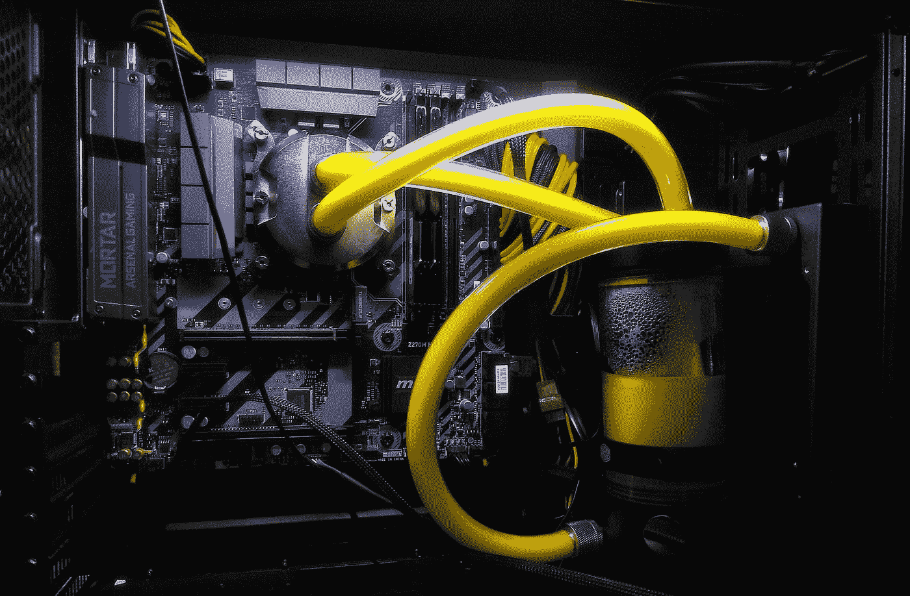
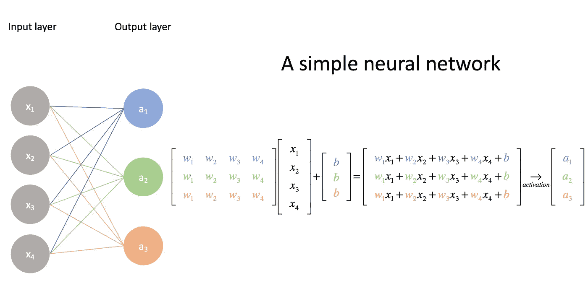
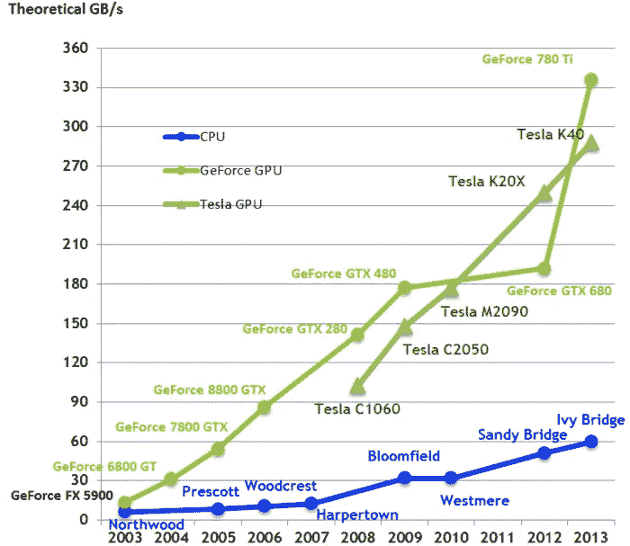

# 什么是 GPU，深度学习需要 GPU 吗？

> 原文：<https://towardsdatascience.com/what-is-a-gpu-and-do-you-need-one-in-deep-learning-718b9597aa0d?source=collection_archive---------1----------------------->

穆基尔·梅农在 [Unsplash](https://unsplash.com?utm_source=medium&utm_medium=referral) 上拍摄的照片

## 在深度学习中，大家似乎都推荐用 GPU。它是什么，没有它你能做什么，它到底是给谁的？

任何试图大规模提高训练模型性能的数据科学家或机器学习爱好者都会在某个时候遇到上限，并开始经历不同程度的处理延迟。当数据集变大时，使用较小的训练集需要几分钟的任务现在可能需要更多的时间，在某些情况下需要几周。

但是什么是 GPU 呢？它们与 CPU 相比如何？我的深度学习项目需要一个吗？

如果你曾经问过自己这些问题，请继续读下去…

> 我最近开源了我的计算机视觉库，它利用 GPU 进行动态图像和视频处理。我会留下 Github 回购的链接，以防你感兴趣:)

 [## 贾斯考斯/卡尔

### 用于高性能人工智能研究的轻量级计算机视觉库。Caer 包含强大的图像和视频处理操作…

github.com](https://github.com/jasmcaus/caer) 

任何数据科学家或机器学习爱好者都会听说，深度学习需要*很多*硬件，至少在他们的一生中会听到一次。一些人在他们的笔记本电脑上训练简单的深度学习模型几天(通常没有 GPU)，这导致了一种印象，即深度学习需要大系统来运行执行。

这创造了一个围绕深度学习的神话，为初学者制造了一个路障。

在过去的几年里，我参考的每本书的作者总是提到以下几点:

> 深度学习需要大量的计算能力来运行。

但是我没有数据中心可供我使用，当我在一台相当大的笔记本电脑上构建我的第一个深度学习模型时，我知道这个共识要么是错误的，要么是用一些真理描绘的。

> 你不必接管谷歌就能成为深度学习专家。

# 为什么深度学习需要更多的硬件？

对于任何神经网络来说，深度学习模型的**训练阶段**是资源最密集的任务

在训练过程中，神经网络接收输入，然后使用在训练过程中调整的*权重*在隐藏层进行处理，然后模型给出预测。调整权重以找到模式，从而做出更好的预测。

这两种操作本质上都是矩阵乘法*。简单的矩阵乘法可以用下图来表示*

**

*来源:jeremyjordan.me*

*在一个神经网络中，我们可以将第一个数组的*输入*到神经网络，而第二个数组形成它的*权重。**

*很简单，对吧？*

*是的，如果你的神经网络有大约 10，100 甚至 100，000 个参数。计算机仍然能够在几分钟内，甚至最多几个小时内处理这个问题。*

*但是如果你的神经网络有[超过 100 亿个参数](https://www.popsci.com/science/article/2013-06/stanfords-artificial-neural-network-biggest-ever/)呢？使用传统方法训练这种系统需要*年*。你的电脑可能在你完成十分之一之前就放弃了。*

> *“一个神经网络接受搜索输入，并从 1 亿个输出或产品中进行预测，通常每个产品会有大约 2000 个参数。所以你把它们相乘，神经网络的最后一层现在是 2000 亿个参数。我没有做过任何复杂的事情。我说的是一个非常非常死简单的神经网络模型。”—莱斯大学的一名博士生*

# *让深度学习模型训练得更快*

*深度学习模型可以通过简单地在*同时*运行所有操作而不是一个接一个地运行来更快地训练。*

*你可以通过使用一个 **GPU** 来训练你的模型来实现。*

> *GPU(图形处理单元)是具有专用存储器的专用处理器，其通常执行渲染图形所需的浮点操作*

*换句话说，它是一个用于大量图形和数学计算的单芯片处理器，可以为其他任务释放 CPU 周期。*

> *GPU 和 CPU 之间的主要区别是，与 CPU 相比，GPU 在算术逻辑单元上投入更多的晶体管，而在缓存和流控制上投入更少的晶体管。*

*虽然 CPU 主要适用于需要*解析*或*解释*代码中复杂逻辑的问题，但 GPU 是为计算机游戏的专用图形渲染工具而设计的，后来得到了增强，以加速其他几何计算(例如，将多边形或垂直旋转到不同的坐标系，如 3D)。*

*GPU 比 CPU 小，但往往比后者有更多的*逻辑*核心(算术逻辑单元或 alu、控制单元和内存缓存)。*

**

*来源:fast.ai*

*在上面的图表中，您可以看到 GPU(红色/绿色)理论上可以完成 CPU(蓝色)的 10-15 倍操作。这种加速在实践中也非常适用。*

> *如果你把 CPU 看成一辆玛莎拉蒂，GPU 可以看成一辆大卡车。*
> 
> *CPU(玛莎拉蒂)可以快速读取 RAM 中的少量包(3 -4 名乘客)，而 GPU(卡车)速度较慢，但可以一次读取大量内存(约 20 名乘客)。*

*该视频进一步概述了这一概念:*

# *为什么选择 GPU 进行深度学习*

*GPU 针对训练人工智能和深度学习模型进行了优化，因为它们可以*同时处理多个计算*。*

*它们拥有大量内核，可以更好地计算多个并行进程。此外，深度学习中的计算需要处理大量数据——这使得 GPU 的内存带宽最合适。*

*有几个**决定参数**决定使用 CPU 还是 GPU 来训练深度学习模型:*

## *内存带宽:*

*带宽是 GPU 比 CPU 计算速度更快的主要原因之一。对于大型数据集，CPU 在训练模型时会占用大量内存。*

*计算巨大而复杂的任务占用了 CPU 中大量的时钟周期——CPU 按顺序*处理任务*,并且拥有比它的对手 GPU 更少的内核数量。*

*另一方面，独立的 GPU 配备了专用的 VRAM(视频 RAM)内存。因此，CPU 的内存可以用于其他任务。*

**

*一段时间内 CPU 和 GPU 带宽的比较*

## *数据集大小*

*在深度学习中训练模型需要大型数据集，因此在内存方面需要大量的计算操作。为了高效地计算数据，GPU 是最佳选择。计算量越大，GPU 相对于 CPU 的优势就越大。*

## *最佳化*

*在 CPU 中优化任务要容易得多。CPU 核虽然少，但比成千上万的 GPU 核更强大。*

*每个 CPU 内核可以执行不同的指令(MIMD 架构)，而 GPU 内核通常由 32 个内核组成，在给定时间并行执行相同的指令(SIMD 架构)。*

*考虑到所需要的努力，密集神经网络中的并行化是非常困难的。因此，复杂的优化技术在 GPU 中比在 CPU 中更难实现。*

**

*照片由[亚历山大·奈特](https://unsplash.com/@agkdesign?utm_source=medium&utm_medium=referral)在 [Unsplash](https://unsplash.com?utm_source=medium&utm_medium=referral) 上拍摄*

# *该不该用 GPU？*

*与任何数据科学项目一样，这取决于具体情况。在速度、可靠性和成本之间需要权衡考虑:*

1.  *如果你的神经网络规模相对**小**，没有 GPU 也可以凑合*
2.  *如果你的神经网络涉及**成吨的计算**涉及成千上万的参数，你可能要考虑投资一个 GPU*

> *一般来说，对于快速机器学习来说，GPU 是一个更安全的赌注，因为在其核心，数据科学模型训练由简单的矩阵数学计算组成，如果并行执行计算，其速度可能会大大提高。*

*参见 Reddit 上关于深度学习投资的[最佳 GPU 的帖子](https://www.reddit.com/r/MachineLearning/comments/b95182/d_which_gpus_to_get_for_deep_learning_my/)*

## *云 GPU 实例*

*你也应该给云 GPU 一个思路。如果你不想买一堆昂贵的 GPU，你可以通过云托管公司按需利用 GPU。它们将使您无需配置硬件，最重要的是，它们并不昂贵，在您使用它时，成本可以低至每小时 0.25 美元。*

> ***一旦你完成了，记得关闭你的云实例。***

*你将租用国外的计算机/服务器，而不是自己运行。仅仅关闭你的浏览器或你的电脑是不够的，这些只会切断你的设备和这个远程服务器之间的连接，而不是关闭你为之付费的东西。否则，你将为它运行的所有时间付费，并得到一个讨厌的账单！*

*CPU 最擅长顺序处理单个更复杂的计算，而 GPU 更擅长并行处理多个但更简单的计算。*

*GPU 计算实例的成本通常是 CPU 计算实例的 2-3 倍，因此除非您在基于 GPU 的培训模型中看到 2-3 倍的性能提升，否则我会建议使用 CPU。*

*一如既往，非常感谢您的阅读！请告诉我你的想法或者希望我接下来在评论中写些什么。我也乐于接受批评！*

*下期帖子再见！😄*