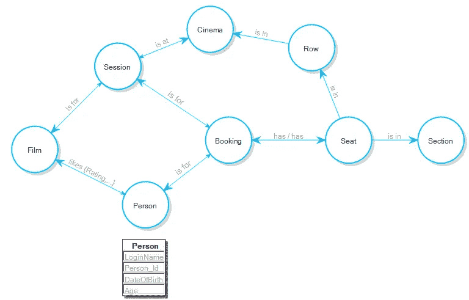
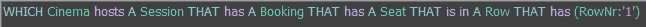
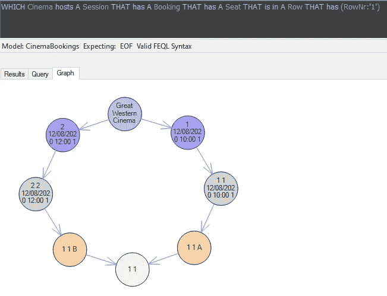
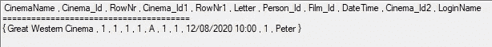
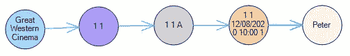

# 什么是图形数据库？

> 原文：<https://towardsdatascience.com/what-is-a-graph-database-249cd7fdf24d?source=collection_archive---------19----------------------->

## 回到第一原则…

在过去的几年中，已经有很多关于图形数据库作为一种独特的数据库类型的文章，并且很容易原谅相信附带的营销材料保证了图形数据库与任何其他数据库的区别。

那么营销材料说了什么，你应该给多少信任呢？

## 图形数据库和图形

图形数据库被描述为在 [*图形*](https://en.wikipedia.org/wiki/Graph_theory) 上操作的数据库，其中事物之间的关系很重要。图形是一种结构，图形数据库的底层图形映射存储在数据库中的数据的结构或*模式*。

下图是一个电影院座位预订数据库解决方案的图表模型。我们将使用这样的模式来预订座位，以便在电影院的特定时段观看电影。我相信可以很容易地说，图模式是一目了然的。

属性图模式

带有一个或多个箭头的每条线或*边*表示所谓的*节点*或*顶点*之间的关系，并形成所谓的*有向图*。模型本身的类型被称为*属性图模式。*属性图模式的属性组件将其名称用于节点和边可以具有*属性*的地方，例如*喜欢*边的*等级*和*人*节点的*年龄*。

**NB** 在数学的图论中，关系不需要用一个或多个箭头来指示，或者有一个读数(例如*喜欢*)所以我们在这里采取许可，在座位和预订之间有一个双向边，因为，让我们面对它，所有的关系都是双向的， 在这个[模式](https://en.wikipedia.org/wiki/Schema)中，我们使用双向映射让我们知道一个预订可以针对许多座位，一个座位可以在许多预订中……这种信息通常不会以这种方式在属性图模式中捕获，因为当涉及到底层模型的更好的语义时，常用的图模式就显得不够了。

带有一个大箭头和一个小箭头的边让我们知道该读数在生成该模式的软件的模式中存储有一个倒数读数。例如*时段* ***在*** *影院*可能有互读*影院* ***主持*** *时段*。

当查询数据库时，这些节点之间的关系用于在数据库中的数据上导航。例如，我们可以编写一个图形查询，如下所示:

图形查询

以图形方式查看数据库模式并以图形方式查询数据库的优势在于，查询结果也可以以图形方式查看。在我们的示例中,“大西部电影院”主持一个会话，该会话有一个座位的预订，该座位位于第 1 行……在下面显示为“1 1 ”,因为该行位于电影院 1，即我们示例数据库中的大西部电影院。类似地，那一行中有座位“A”和“B”的预订，等等。

## 挑战“专门建造”的格言

图形数据库的营销材料通常声称图形数据库是为图形处理而专门构建的。也许是这样，但是在这篇文章中，我们对“*目的建造*的说法提出质疑，并提出有效的问题，

-“所有数据库都是图形数据库吗？”；还有
——“是不是所有的数据库都可以用一种图查询语言来查询？”

也就是我们问，**“什么是图形数据库？”**

## 专用图形数据库

毫无疑问，有专门为图形处理而建立的数据库。让我们称这些为专用图形数据库。在我看来，这些是最没意思的数据库。

如果所有的数据库都可以看作一个图形数据库，为什么要把自己局限于图形处理呢？

还有哪些其他类型的数据库处理？

我们找到了这篇文章的症结所在。图形数据库的供应商经常将他们的产品与被称为“关系数据库”的数据库的主要销售类型区分开来，否则他们就只是在销售一个*数据库*。

## 什么是关系数据库？

顾名思义，关系数据库是一种关系很重要的数据库。与其写一篇关于关系数据库是什么样子的论文，不如让我们把我们例子中的相同模式看作一个*实体关系图(ERD)* ，这是一种用于查看关系数据库关系的模式。

下面的动画在属性图模式(PGS)和实体关系图之间来回切换，显示我们谈论的是同一个模式，只是视角不同。

**NB** 用数学术语来说，属性图模式和实体关系图有一个概念元模型，它带有一个接近于[同构](https://en.wikipedia.org/wiki/Isomorphism)的[同态](https://en.wikipedia.org/wiki/Homomorphism)。

演示属性图模式和实体关系图之间的同态/同构

## 图形查询及其流行原因

因为图数据库很容易为数据库模式中的每个关系存储[谓词信息](https://en.wikipedia.org/wiki/Predicate)，所以可以用利用谓词信息的语言来查询数据库，这有助于易于阅读的查询。

以下是对我们的影院预订模式进行图形查询的示例:

用于图形数据库的图形查询

图形查询的美妙之处不仅在于它们易于阅读，而且易于编写。上面的查询是用知识语言写的(www.factengine.ai)。

这与您如何用通常用于关系数据库的结构化查询语言编写相同的查询形成对比:

> 选择电影院。CinemaName，Row。Cinema_Id，世界其他地区。前排，请坐。Cinema_Id，座位。前排，请坐。信，预订。Person_Id，预订。Film_Id，订票。日期时间，预订。Cinema_Id，Person。登录名
> 从电影院，
> 排，
> 座，
> 订票，
> 人，
> 场次
> ，订票地点
> 在哪排。Cinema_Id =电影院。Cinema_Id
> 和座位。Cinema_Id = Row。Cinema_Id
> 和座位。RowNr =行。RowNr
> 和 BookingHasSeat。Person_Id =预订。Person_Id
> 和 BookingHasSeat。Film_Id =预订。Film_Id
> 和 BookingHasSeat。日期时间=预订。日期时间
> 和 BookingHasSeat。CinemaId =预订。Cinema_Id
> 和 BookingHasSeat。RowNr =座位。RowNr
> 和 BookingHasSeat。Cinema_Id =座位。Cinema_Id
> 和 BookingHasSeat。字母=座位。信函
> 和预订。Person_Id =人员。Person_Id
> 和预订。Film_Id =会话。电影 _Id
> 和预订。日期时间=会话。日期时间
> 和预订。Cinema_Id =会话 Cinema_Id
> 和会话。Cinema_Id =电影院。Cinema_Id
> 和人。登录名= '彼得'

我认为这就是图数据库及其查询语言流行的原因。以图表形式查看结果集也很方便。大多数图形数据库也允许您以表格格式查看结果。

表格格式的图形查询结果

与图表相同的结果

## 到目前为止，一切顺利

我们讨论了图形数据库如何映射数据库的模式，以及如何查询图形数据库中的数据。我们已经看到了如何以表格或图形的方式查看对图形数据库的查询返回的数据。

那么你准备好去买一个图形数据库了吗？

也许没那么快…

事情是这样的。本文中的模式、查询和结果都涉及关系数据库。FactEngine 倡议摒弃了这样一种观念，即你需要一个专用的图形数据库来达到图形数据库的质量。事实上，研究表明许多图查询在关系数据库上执行得更快[1]。

## 多模型数据库

我现在可以写一篇文章，“什么是关系数据库？”，但反之亦然…每个关系数据库都是一个图形数据库。因此，如果您喜欢图形和图形查询的外观和感觉，这篇文章就足够了。

支持关系和图形处理的数据库称为*多模型数据库*。FactEngine 的主题是“[所有的数据库都是多模型的…](https://medium.com/@victormorgante/all-databases-are-multi-model-169ce22e4593) ”并回答问题“什么是图形数据库？”“所有的数据库都是图形数据库，除了思维不同”。

这可能会让一些人感到震惊，但不应该有争议。使用正确的工具，所有的数据库都是多模型的。也就是说，所有的数据库可以同时被视为一个图形数据库和一个关系数据库。

## 什么是图形数据库？

您来这里是为了了解什么是图形数据库，所以让我们现实地定义它，以避免混淆。

“图形数据库是可以在其上编写图形模式和图形查询的任何数据库”。简单。

*专用的*图形数据库可能不利于你的企业、商业或个人应用。关系数据库可以提供关系数据库特有的好处，而这些好处是专用图形数据库所没有的。

作为一个产品和信息的消费者，我觉得我们需要意识到大多数图形数据库的定义来自那些想要卖给我们一个专用的图形数据库的人。我的工作是让人们意识到图形数据库的定义是数据库有什么属性，而不是谁把什么卖给谁。如果您已经有了一个图表数据库，为什么还要跑出去买呢？

感谢您的阅读。如果时间允许，我会写更多关于图形数据库、关系数据库和多模型数据库的文章。我希望这有助于理解什么是图形数据库，什么是专用图形数据库。

**附录**:自从这篇文章发表以来，术语“关系知识图”已经浮出水面，许多图形数据库供应商正致力于提供关系数据库的特性，反之亦然。参见[什么是关系知识图？](https://medium.com/p/bb747b27ff3f)

— — — — — — — — — — — — — — — — — — — — — — — — — — —

**NB** 本文表达的模型原始版本版权归 Clifford Heath 和 Data Constellation 所有，在 GitHub 上的 ActiveFacts 项目下共享:[https://github.com/cjheath/activefacts](https://github.com/cjheath/activefacts)。示例和许可证位于:[https://github.com/cjheath/activefacts-examples](https://github.com/cjheath/activefacts-examples)

1.  Rawlani，p .等人，“关系数据库的图形分析”，麻省理工学院，[https://dspace.mit.edu/handle/1721.1/100670](https://dspace.mit.edu/handle/1721.1/100670)，于 2020 年 8 月 24 日获取

**附录:**另请参见 Jindal，a .等人的“关系数据库上的图形分析”，麻省理工学院。