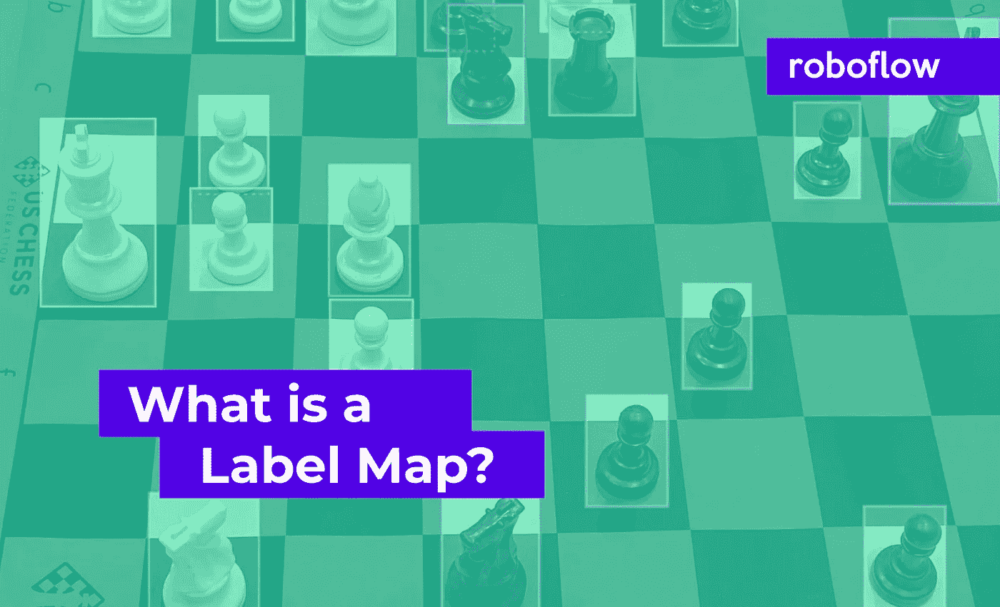

# 什么是标签地图？

> 原文：<https://towardsdatascience.com/what-is-a-label-map-f1066af6df70?source=collection_archive---------34----------------------->

## 注意:我们也在博客上发布了[什么是标签图](https://blog.roboflow.com/label-map/)。在本帖中，我们将通过讨论标签图在计算机视觉注释过程中的作用来揭开标签图的神秘面纱。然后，我们将使用标签地图实际操作一些真实的例子。

作者图片

在计算机视觉数据集中，这个问题很普遍——什么是标签地图？

在本帖中，我们将通过讨论标签图在计算机视觉注释过程中的作用来揭开标签图的神秘面纱。然后，我们将使用标签地图实际操作一些真实的例子。

# 需要标注图的常见错误

*   缺少类名
*   类名显示为整数
*   类名与我的数据集的类名不匹配
*   无法识别类别标签
*   类别标签是数字

# 标签地图的作用

计算机视觉数据集有各种格式。Roboflow 支持超过 [30 种计算机视觉格式](https://roboflow.com/formats)的注入、转换和输出。虽然[计算机视觉数据集](https://roboflow.com/formats)的自动转换很方便，但了解数据集结构以便在导出后使用还是很有用的。

在计算机视觉数据集中，通常有引用类标签的注释。在上面的图像中，我们的类标签包括棋子的不同颜色和形状。为了注释图像，图像注释文件通常会定义特定于特定图像的注释。该注释文件可能包含也可能不包含特定于相关注释的类标签。

在注释文件没有指定类标签的情况下，**参考标签映射来查找类名**。标签映射是类注释的单独记录源。

# 手动操作标签地图

需要注意的是，并非所有的计算机视觉数据集格式都使用标签图。利用标注图进行分类标注的计算机视觉数据集包括:

让我们来看一个 YOLO 暗网格式的上图`f9a9a175f26d4b26bca3a5338cc1405e.jpg`的注释例子。相应的`f9a9a175f26d4b26bca3a5338cc1405e.txt`文件包含图像中对象的注释。

`1 0.23563218390804597 0.13218390804597702 0.27586206896551724 0.14080459770114942 0 0.09051724137931035 0.28304597701149425 0.1810344827586207 0.10057471264367816 5 0.03879310344827586 0.27873563218390807 0.07758620689655173 0.10344827586206896 5 0.1896551724137931 0.40804597701149425 0.16666666666666666 0.10632183908045977 2 0.1997126436781609 0.5014367816091954 0.1781609195402299 0.10057471264367816 3 0.1221264367816092 0.4942528735632184 0.14367816091954022 0.08908045977011494 3 0.2916666666666667 0.2471264367816092 0.14655172413793102 0.08620689655172414 3 0.5387931034482759 0.4224137931034483 0.15517241379310345 0.08908045977011494 3 0.8204022988505747 0.3620689655172414 0.16091954022988506 0.10632183908045977 3 0.6925287356321839 0.5488505747126436 0.16954022988505746 0.10632183908045977 2 0.8362068965517241 0.7126436781609196 0.22413793103448276 0.12643678160919541 7 0.40948275862068967 0.8951149425287356 0.28160919540229884 0.14367816091954022 11 0.05459770114942529 0.7183908045977011 0.10919540229885058 0.11494252873563218 8 0.860632183908046 0.9425287356321839 0.22701149425287356 0.10919540229885058 10 0.10488505747126436 0.5775862068965517 0.20977011494252873 0.1206896551724138 6 0.10057471264367816 0.7586206896551724 0.1925287356321839 0.10057471264367816 6 0.4209770114942529 0.6724137931034483 0.19540229885057472 0.10344827586206896 9 0.09051724137931035 0.3864942528735632 0.14942528735632185 0.08908045977011494 9 0.11494252873563218 0.6623563218390804 0.15517241379310345 0.09770114942528736 9 0.3175287356321839 0.7514367816091954 0.14942528735632185 0.08908045977011494 9 0.4367816091954023 0.7931034482758621 0.15229885057471265 0.10344827586206896 9 0.5804597701149425 0.7212643678160919 0.16379310344827586 0.10632183908045977`

引用标签映射的图像标注

在这里，你会注意到类名不见了。相反，每行的第一个条目是映射到标签映射中正确类名的整数！

我们来看看标签图`_darknet.labels`。

`black-bishop black-king black-knight black-pawn black-queen black-rook white-bishop white-king white-knight white-pawn white-queen white-rook`

YOLO 暗网中的标签映射将整数映射到标签映射中指定的类别列表

上面的每个整数映射到这个列表中的一个位置，这就是数据集在注释中表示类标签的方式。

这就是标签地图在实践中的工作方式！

需要注意的是，不同的标签映射在格式之间的作用略有不同。例如，TensofFlow TFRecord 格式的数据集的`.pbtxt`标签映射如下所示:

`item { name: "black-bishop", id: 1, display_name: "black-bishop" } item { name: "black-king", id: 2, display_name: "black-king" } item { name: "black-knight", id: 3, display_name: "black-knight" } item { name: "black-pawn", id: 4, display_name: "black-pawn" } item { name: "black-queen", id: 5, display_name: "black-queen" } item { name: "black-rook", id: 6, display_name: "black-rook" } item { name: "white-bishop", id: 7, display_name: "white-bishop" } item { name: "white-king", id: 8, display_name: "white-king" } item { name: "white-knight", id: 9, display_name: "white-knight" } item { name: "white-pawn", id: 10, display_name: "white-pawn" } item { name: "white-queen", id: 11, display_name: "white-queen" } item { name: "white-rook", id: 12, display_name: "white-rook" }`

TensorFlow TFRecord 格式的数据集标注图

在这里，您可以看到标签映射是以稍微不同的方式指定的，标签显示在一系列小字典条目中。此外，引用类名的整数以 1 开始，而不是 0！

# 结论

我们已经讨论了标签映射在注释计算机视觉数据集时所扮演的角色。我们还接触了一些真实的标签地图，看看标签地图在实践中是如何工作的。

# 后续步骤

*   [将您的数据集转换到任何目的地](https://roboflow.com/formats)
*   [训练最先进的计算机视觉模型](https://blog.roboflow.com/how-to-train-yolov5-on-a-custom-dataset/)

*原载于 2020 年 10 月 2 日***。**