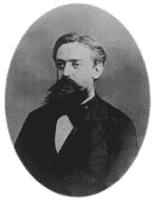
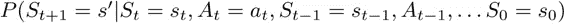
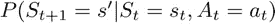
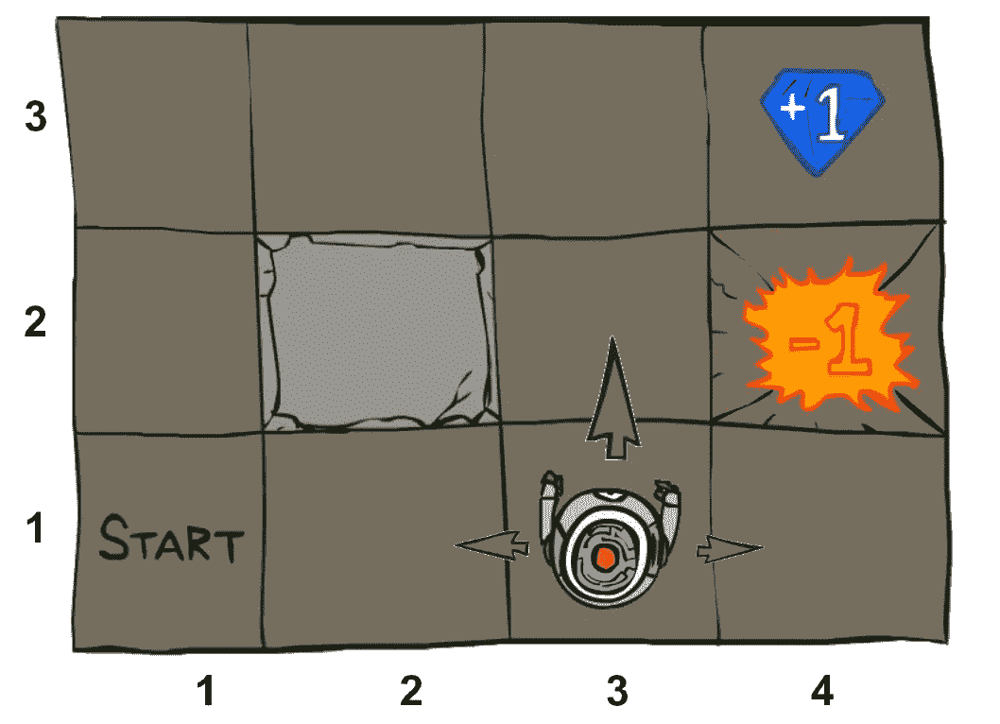
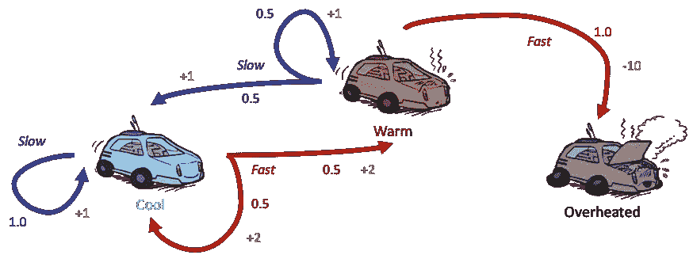

# 到底什么是马尔可夫决策过程？

> 原文：<https://towardsdatascience.com/what-is-a-markov-decision-process-anyways-bdab65fd310c?source=collection_archive---------14----------------------->

## 了解大多数强化学习问题中使用的模型。

# 我为什么要关心马尔可夫决策过程？

任何对强化学习的发展感兴趣的人都应该知道他们建立的模型——马尔可夫决策过程。他们建立了一个具有不确定性的世界结构，行动将带你去哪里，代理人需要学习如何行动。

## 非确定性搜索

搜索是人工智能和智能代理的中心问题。通过规划未来，搜索允许代理解决游戏和后勤问题——但它们依赖于知道某个动作会把你带到哪里。在传统的基于**树的方法**中，一个动作把你带到下一个状态，没有下一个状态的分布。这意味着，如果你有足够的存储空间，你可以规划**集，确定性轨迹**到未来。马尔可夫决策过程使得这种规划**具有随机性、**或不确定性。与本文相关的搜索主题列表很长——[图搜索](https://en.wikipedia.org/wiki/Graph_traversal)、[博弈树](https://en.wikipedia.org/wiki/Game_tree)、 [alpha-beta 剪枝](https://en.wikipedia.org/wiki/Alpha%E2%80%93beta_pruning)、 [minimax 搜索](https://en.wikipedia.org/wiki/Minimax)、 [expectimax 搜索](https://en.wikipedia.org/wiki/Expectiminimax)等。

在现实世界中，这是一个更好的代理行为模型。我们采取的每一个简单的行动——倒咖啡、寄信、移动关节——都有预期的结果，但是生活中有一种随机性。马尔可夫决策过程是让计划捕捉这种不确定性的工具。

日常决策。照片由 [mhtoori 拍摄。com](https://www.pexels.com/@mhtoori?utm_content=attributionCopyText&utm_medium=referral&utm_source=pexels) from [Pexels](https://www.pexels.com/photo/aerial-photography-of-concrete-road-1646164/?utm_content=attributionCopyText&utm_medium=referral&utm_source=pexels) 。

# 马尔可夫决策过程的马尔可夫性是什么？

Markov 是关于 Andrey Markov 的，Andrey Markov 是一位著名的俄罗斯数学家，以他在随机过程方面的工作而闻名。

> “马尔可夫”一般是指给定现在的状态，未来和过去是独立的。

安德烈·马尔科夫(1856-1922)。

制造*马尔可夫*系统的关键思想是**无记忆**。无记忆是指系统的历史不会影响当前状态。在概率符号中，**无记忆性**翻译成这个。考虑一系列的行动产生一个轨迹，我们正在看当前的行动会把我们带到哪里。长条件概率可能看起来像:

现在——如果系统是马尔可夫的，历史是 ***全部包含在当前状态*** 中。所以，我们的一步分布要简单得多。

这一步改变了计算效率的游戏规则。*马尔可夫属性支撑了所有现代强化学习算法的存在和成功。*

# 马尔可夫决策过程

MDP 由以下量定义:

*   一组状态 **s ∈ S** 。这些状态代表了世界上所有可能的构型。在下面的示例中，是机器人位置。
*   一组动作 **a ∈ A** 。动作是代理可以采取的所有可能动作的集合。动作下面是{北，东，南，西}。
*   一个转移函数 **T(s，a，s’)**。T(s，a，s’)持有 MDP 的**不确定性**。给定当前位置和提供的动作，T 决定下一个状态跟随的频率。在下面的例子中，转移函数可以是下一个状态在 80%的时间里是在动作的方向上，但是在另外 20%的时间里偏离 90 度。这对规划有什么影响？在下面的例子中，机器人选择了北方，但有 10%的可能性是向东或向西。
*   一个奖励函数 **R(s，a，s’)。任何代理人的目标都是回报总和最大化。**这个函数说的是每一步获得多少奖励。一般来说，在每一步都会有一个小的负奖励(成本)来鼓励快速解决问题，在最终状态会有大的正(目标)或负(失败的任务)奖励。下面，宝石和火坑是终端状态。
*   起始状态 **s0** ，也可能是终止状态。

MDP 就是一个例子。来源——我在 CS188 做的一次讲座。

## 这给了我们什么？

这个定义给了我们一个有限的世界，我们一套向前的动力学模型。我们知道每个转变的确切概率，以及每个行动有多好。最终，这个模型是一个**场景**——在这个场景中，我们将计划如何行动，知道我们的行动可能会有点偏差。

如果机器人在火坑旁边，机器人应该总是选择北方吗？知道北方有机会把它送到东方吗？

不，最佳政策是向西。撞墙最终会(20%几率)北上，将机器人送上通往目标的轨道。

# 政策

学习如何在未知的环境中行动是了解环境的最终目标。在 MDP 中，这被称为**策略**。

> 策略是一种功能，它从一个状态给你一个动作。π*: S → A。

获得策略的方法有很多，但核心思想是价值和策略迭代。这两种方法**迭代地建立一个状态的总效用**的估计，也许是一个动作。

> 一个国家的效用是(贴现)奖励的总和。

一旦每个州都有一个效用，高层次的规划和政策制定**就会遵循效用最大化的路线**。

在 MDP 和其他学习方法中，模型增加了一个**折扣因子** r γ，以区分短期和长期奖励的优先级。贴现因子直观上是有意义的——人类和生物现在比以后更能创造手中的货币(或食物)价值。折扣因子还通过将奖励的总和变成几何级数，带来了巨大的计算收敛帮助。(*如果你有兴趣，* [*这里有一个关于 MDP 解的收敛性的讲座*](https://inst.eecs.berkeley.edu/~cs188/sp20/assets/lecture/lec12.pdf) )。

来源——我在 CS188 做的一个[讲座](https://inst.eecs.berkeley.edu/~cs188/sp20/assets/lecture/lec10.pdf)。

我把它作为一个练习留给读者，让他们为这个例子找出最优策略——想想最终状态会是什么。我们能避免它吗？学习如何获得这些策略留待另一篇文章来讨论。

更多关于强化学习的介绍——你也可以在这里或者这里找到课程材料[。下面是我的几篇文章。](https://inst.eecs.berkeley.edu/~cs188/sp20/)

 [## 强化学习的隐藏线性代数

### 线性代数的基础如何支持深度强化学习的顶点？

towardsdatascience.com](/the-hidden-linear-algebra-of-reinforcement-learning-406efdf066a)  [## 强化学习算法的收敛性

### 有什么简单的收敛界限吗？

towardsdatascience.com](/convergence-of-reinforcement-learning-algorithms-3d917f66b3b7)  [## 强化学习的基本迭代方法

### 学习价值和策略迭代能掌握多少强化学习？很多。

towardsdatascience.com](/fundamental-iterative-methods-of-reinforcement-learning-df8ff078652a) 

更多？订阅我关于机器人、人工智能和社会的时事通讯！

 [## 自动化大众化

### 一个关于机器人和人工智能的博客，让它们对每个人都有益，以及即将到来的自动化浪潮…

robotic.substack.com](https://robotic.substack.com/)