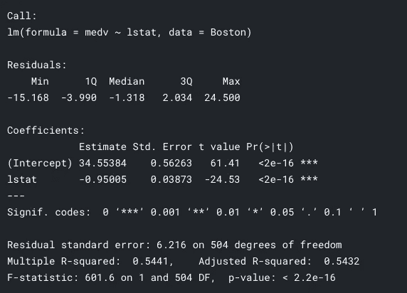

# 什么是 P 值？

> 原文：<https://towardsdatascience.com/what-is-a-p-value-2cd0b1898e6f?source=collection_archive---------18----------------------->

## 约翰·霍普斯金 DS 专业化系列

## p 值和显著性测试的介绍，p-hacking，以及 R 中 p 值的例子


由 [Unsplash](https://unsplash.com?utm_source=medium&utm_medium=referral) 上 [Greg Rakozy](https://unsplash.com/@grakozy?utm_source=medium&utm_medium=referral) 拍摄的照片

```
[Full series](https://towardsdatascience.com/tagged/ds-toolbox)[**Part 1**](/the-data-scientists-toolbox-part-1-c214adcc859f) - What is Data Science, Big data and the Data Science process[**Part 2**](/how-to-learn-r-for-data-science-3a7c8326f969) - The origin of R, why use R, R vs Python and resources to learn[**Part 3**](/a-crash-course-on-version-control-and-git-github-5d04e7933070) - Version Control, Git & GitHub and best practices for sharing code.[**Part 4**](/the-six-types-of-data-analysis-75517ba7ea61) - The 6 types of data analysis[**Part 5**](/designing-experiments-in-data-science-23360d2ddf84) - The ability to design experiments to answer your Ds questions[**Part 6**](/what-is-a-p-value-2cd0b1898e6f) - P-value & P-hacking[**Part 7**](/what-is-a-p-value-2cd0b1898e6f) - Big Data, it's benefits, challenges, and future
```

*本系列基于约翰·霍普斯金大学在 Coursera 上提供的* [*数据科学专业*](https://www.coursera.org/specializations/jhu-data-science) *。本系列中的文章是基于课程的笔记，以及出于我自己学习目的的额外研究和主题。第一门课，* [*数据科学家工具箱*](https://www.coursera.org/learn/data-scientists-tools) *，笔记会分成 7 个部分。关于这个系列的注释还可以在这里找到*[](http://sux13.github.io/DataScienceSpCourseNotes/)**。**

# *介绍*

*科学领域的一个重要原则是不存在不可证伪的理论，换句话说，没有所谓的科学证据。规范和评价一个科学理论的，是一个 ***证据*** *。更多+更好的证据=更好的科学理论，反之亦然。也就是说，我们今天拥有的所有科学知识都是试验性的，这意味着它们是有待证实的，是推测的(我们尽最大努力理解我们周围的世界，并形成关于它们的理论，但它们不是最终的，可以被证伪。)**

*在统计学中，情况也是如此。你不能 100%确定地证明，比如明天下午 1 点会下雨，或者谁会赢得选举。所有的统计测试都是为手头的数据分配一定的概率，并指出结果来自抽样中随机波动的可能性([参考](https://webstat.une.edu.au/unit_materials/c5_inferential_statistics/probability_and_proof.html))。*

*也就是说，本文将重点关注显著性测试，通过示例解释什么是 p 值，以及它如何在研究领域中被利用(p-hacking)，这就是所谓的再现性危机。*

# *什么是 P 值？*

**

*[p 值 xkcd](https://xkcd.com/1478/)*

> *p 值告诉你一个结果发生的概率可能是随机的**。***

*为了更具体地了解 p 值是什么，我们将从研究的角度来看它，这就是它在统计分析或测试中的应用——显著性测试。*

*但首先，你必须知道的术语是:*

*   *p 值*
*   *零假设(如果被拒绝，耶)*
*   *替代假设*

## *现在举个例子:古典音乐和聚焦*

*假设进行了一个实验来推断听古典音乐是否能提高注意力。为此，他们让 100 个人坐在一个房间里，要求他们戴着耳机听古典音乐，同时进行注意力测试。然后，他们让另外 100 个人在没有任何音乐的情况下参与测试。然后比较这两组的结果。*

*在上面的实验中:*

*零假设=古典音乐和非古典音乐没有区别*

**另类假设* =基本相反，有区别…*

*为了证明听古典音乐可以提高注意力，实验者必须能够拒绝零信号，这通常是研究人员必须清除的一大障碍。如果他们不能这样做，也就是说，没有足够的证据或数据来否定它。*

*在这种情况下，假设实验者对数据进行了统计分析，并得出了一个非常小的 p 值，他们很高兴并就该主题发表了论文。*

*那么小(显著)的 p 值又意味着什么呢？这里有几个要点*

*   *它告诉你结果是多么罕见*
*   *这意味着你得到的数字很少会偶然出现*
*   *例如，p 值= 0.01，这意味着如果你重复实验(在相同的条件下)100 次，并且假设零假设为真，你将只看到一次结果。或者在零假设为真的情况下，只有 1%的机会看到结果。*

*如果你想一想，如果实现小于 0.05 的 p 值意味着验证一个人的研究，并允许他们在论文上发表它，这是非常诱人的，为了自己的利益故意攻击这个值，这正是所发生的事情。*

# *可复制性危机*

*简而言之，这场危机是关于科学领域的研究和实验必须达到<0.05, which incentivized people to intentionally tweak certain conditions in their favor. This is called p-hacking.*

## *P-hacking*

*   *exhaustively search data sets to find patterns and correlations that appear statistically significant by virtue of the sheer number of tests performed*
*   *AKA [数据挖掘](https://en.wikipedia.org/wiki/Data_dredging)的黄金数字*
*   *如果你做了足够多的测试，你可以找到你想要的数据集和分析*

*P-hacking 也可能与大数据和我们今天拥有的更好的技术有关，这使得这些测试可以快速完成。*

*要查看 P-hacking 的实际例子，请查看 [FiveThirtyEight](https://fivethirtyeight.com/features/science-isnt-broken/#part1) 的精彩文章，其中有一个您可以使用的实际例子。*

# *R 中的 P 值示例*

*这只是一个您可能会遇到 p 值的简单示例这是一个使用波士顿数据集的线性回归模型示例，以及包含 p 值的模型的 F 统计。*

## *密码*

```
*library(MASS) # library for loading datasetsfit = lm(medv ~ lstat, data = Boston) # regression model medv against lstatsummary(fit) # shows you summary about your model*
```

## *输出*

**

*线性回归模型中汇总函数的输出*

*上图显示了使用`summary()`函数进行显著性检验的 F 统计量。*

> *该显著性检验的前提条件包括模型中的误差项 *ϵ* 与 x 无关，且正态分布，均值为零，方差恒定。并将显著性水平设置为 0.05*

*简单来说，如果你看右下方，你会看到`p-value < 2.2e-16`。这意味着 p 值远小于 0.05，这意味着我们可以拒绝零假设 *β* = 0。因此，在线性回归模型中，变量`lstat`和`mdev`之间存在显著的关系。*

*同样，p 值也有助于确定在样本中观察到的关系是否也存在于更大的人群中。因此，如果 p 值具有统计学意义，则有证据表明这种影响也存在于人群水平。*

*当然，p 值只是告诉你有相关性。为了说明模型与数据的吻合程度，这就是 R 平方值的用处。此外，残差是模型中的“误差”(回归线和数据点之间的距离)，F 统计只是比较变量的联合效应(越高越好)。所有这些都是解释你的假设检验的关键因素。*

*更多关于以上回归的内容在我的 [kaggle 笔记本](https://www.kaggle.com/benthecoder/regression-in-r#Simple-Linear-Regression)中。如果你想要一个完整的介绍，看看这篇文章。另一篇关于解释回归分析中的 P 值和系数的文章[在这里](https://statisticsbyjim.com/regression/interpret-coefficients-p-values-regression/)。*

# *摘要*

**

*唐纳德·詹纳蒂在 [Unsplash](https://unsplash.com?utm_source=medium&utm_medium=referral) 上的照片*

*C [意识](https://www.scientificamerican.com/article/what-is-consciousness/)——我们大脑中 860 亿个神经元之间电信号传输的神秘、不可言喻的机制的产物——赋予人类对我们周围环境的主观体验，思考过去、现在和未来，质疑世界，探索深不可测的事物的能力。*

*我们不可思议的头脑产生了许多惊人的发现和突破，我们对世界的许多推理方式帮助我们简化了我们周围的复杂事物。但是，随着信息和技术的兴起，加速了连通性，将世界连接在一起，随之而来的是对真理的牺牲和错误信息的困扰。因此，我们必须明白，我们所有人都有偏见，我们倾向于根据激励采取行动，我们在这个现代世界的注意力不断被技术利用。*

*为了克服这一点，我们必须认真对待我们的行为，反思它们，并从我们的错误中吸取教训。我们必须学会把注意力放在重要的事情上，追求有意义的事情，而不是权宜之计，让我们周围都是好人，行动不是出于自私，而是为了社会和世界的更大利益。*

## *术语摘要*

*   *p 值——当我们说零假设是错误的时，承认我们是错误的风险的一种方式(查看 p 值的另一种方式)*
*   *零假设——两个样本之间的差异只是由于偶然*
*   *p-hacking——有意识地搜索数据集，寻找模式和相关性，通过大量的测试获得有统计意义的值*

## *需要记住的几件关键事情是:*

*   *显著的 p 值并不代表工作的质量*
*   *p 值不会告诉你一个结果为真的概率，它仅仅是一个统计测试的结果。*
*   *人们无法证明/反驳假设，只能拒绝无效假设，并为替代假设提供支持*

*《如何不犯错:数学思维的力量》一书的作者 Jordan Ellenberg 对显著性测试有着深刻的见解:*

> *显著性检验是侦探，而不是法官。这一具有挑衅性和统计学意义的发现并不是科学过程的结论，而是一个开端。*

*以及无效假设的总结:*

1.  *进行实验*
2.  *假设零假设为真，设 p 为(在该假设下)得到与观察到的结果一样极端的结果的概率。*
3.  *数字 p 称为 p 值。*
4.  *如果很小，欢喜；你可以说你的结果有统计学意义。*
5.  *如果它很大，承认没有排除零假设。*

*作为这篇文章的结尾，这里有一些关于什么是统计的真相。*

> *统计学的目的不是告诉我们该相信什么，而是告诉我们该做什么。统计是做决策，不是回答问题。—乔丹·埃伦伯格*

*感谢阅读，并保持安全。*

## *更多关于 P 值和统计学意义的文章*

*   *[统计显著性由](/statistical-significance-hypothesis-testing-the-normal-curve-and-p-values-93274fa32687)[威尔·科尔森](https://medium.com/u/e2f299e30cb9?source=post_page-----2cd0b1898e6f--------------------------------)解释*
*   *[数据科学家解释的 P 值](/p-values-explained-by-data-scientist-f40a746cfc8)阿德蒙德李[解释的 P 值](https://medium.com/u/7cfb1b8791bb?source=post_page-----2cd0b1898e6f--------------------------------)*
*   *意义有什么重要的*

## *如果您对学习数据科学感兴趣，请查看“超学习”数据科学系列！*

*[](https://medium.com/better-programming/how-to-ultralearn-data-science-part-1-92e143b7257b) [## 如何“超级学习”数据科学—第 1 部分

### 这是一个简短的指南，基于《超学习》一书，应用于数据科学

medium.com](https://medium.com/better-programming/how-to-ultralearn-data-science-part-1-92e143b7257b) 

## 查看这些关于数据科学资源的文章。

[](/top-20-youtube-channels-for-data-science-in-2020-2ef4fb0d3d5) [## 2020 年你应该订阅的 25 大数据科学 YouTube 频道

### 以下是你应该关注的学习编程、机器学习和人工智能、数学和数据的最佳 YouTubers

towardsdatascience.com](/top-20-youtube-channels-for-data-science-in-2020-2ef4fb0d3d5) [](/top-20-free-data-science-ml-and-ai-moocs-on-the-internet-4036bd0aac12) [## 互联网上 20 大免费数据科学、ML 和 AI MOOCs

### 以下是关于数据科学、机器学习、深度学习和人工智能的最佳在线课程列表

towardsdatascience.com](/top-20-free-data-science-ml-and-ai-moocs-on-the-internet-4036bd0aac12) [](https://medium.com/swlh/top-20-websites-for-machine-learning-and-data-science-d0b113130068) [## 机器学习和数据科学的 20 大网站

### 这里是我列出的最好的 ML 和数据科学网站，可以提供有价值的资源和新闻。

medium.com](https://medium.com/swlh/top-20-websites-for-machine-learning-and-data-science-d0b113130068) [](/the-best-book-to-start-your-data-science-journey-f457b0994160) [## 开始数据科学之旅的最佳书籍

### 这是你从头开始学习数据科学应该读的书。

towardsdatascience.com](/the-best-book-to-start-your-data-science-journey-f457b0994160) 

# 联系人

如果你想了解我的最新文章[，请关注我的媒体](https://medium.com/@benthecoder07)。

也关注我的其他社交资料！

*   [领英](https://www.linkedin.com/in/benthecoder/)
*   [推特](https://twitter.com/benthecoder1)
*   [GitHub](https://github.com/benthecoder)
*   [Reddit](https://www.reddit.com/user/benthecoderX)

请关注我的下一篇文章，记得**保持安全**！*