# 什么是感知器？–神经网络基础

> 原文：<https://towardsdatascience.com/what-is-a-perceptron-basics-of-neural-networks-c4cfea20c590?source=collection_archive---------0----------------------->

## 感知器的历史及其工作原理概述

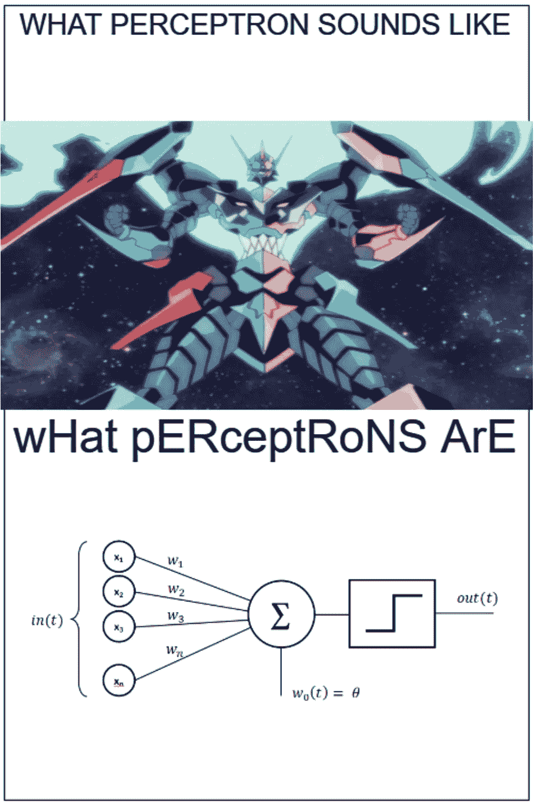

作者图片

> 单层感知器是神经网络的基本单元。感知器由输入值、权重和偏差、加权和以及激活函数组成。

在过去十年，我们见证了机器学习技术的爆炸式发展。从个性化的社交媒体反馈到可以从视频中移除对象的算法。像许多其他自学者一样，我已经决定该是我涉足人工智能世界的时候了。最近，我决定开始我的旅程，在 Udacity 上参加一个名为[的课程，用 PyTorch 进行深度学习](https://www.udacity.com/course/deep-learning-pytorch--ud188)。当然，这篇文章是由课程启发的，我强烈推荐你去看看！

如果你上过这门课，或者读过任何关于神经网络的东西，你可能会听到的第一个概念就是感知器。但是什么是感知器，为什么要用它呢？它是如何工作的？背后有什么历史？在本帖中，我们将简要回答这些问题。

# **一点历史**

感知机是由美国心理学家弗兰克·罗森布拉特于 1957 年在康奈尔航空实验室首次提出的(如果你感兴趣，可以点击原文链接)。罗森布拉特深受生物神经元及其学习能力的启发。罗森布拉特的感知器由一个或多个输入、一个处理器和一个输出组成。

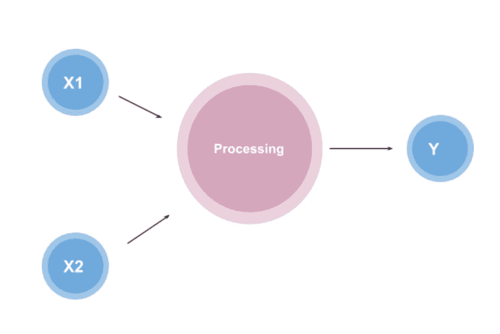

作者图片

最初，Rosenblatt 的想法是创建一个像神经元一样运行的物理机器，然而，它的第一个实现是在 IBM 704 上测试的软件。Rosenblatt 最终在定制的硬件中实现了该软件，目的是将其用于图像识别。

图片来自[维基共享资源](https://commons.wikimedia.org/wiki/File:Rosenblatt_21.jpg)

虽然最初，Rosenblatt 和 AI 社区对这项技术持乐观态度，但后来表明，这项技术只是[线性分离](https://en.wikipedia.org/wiki/Linear_separability)，换句话说，感知机只能与数据点的线性分离一起工作。这导致该技术对不同模式的识别较差。

当时，糟糕的分类(以及其他一些负面报道)导致公众对这项技术失去了兴趣。然而今天，我们已经围绕这个线性分离问题开发了一种方法，叫做**激活函数**。

让我们看看今天感知机是如何工作的。

# **感知器 101**

感知器通过接受一些数字输入以及所谓的[权重和偏差](https://medium.com/fintechexplained/neural-networks-bias-and-weights-10b53e6285da)来工作。然后，它将这些输入乘以各自的权重(这就是所谓的加权和)。然后将这些乘积与偏差相加。激活函数将加权和与偏差作为输入，并返回最终输出。

哇，这太令人困惑了…让我们通过构建一个感知机来打破这种困惑。

感知器由四部分组成:输入值、权重和偏差、加权和以及激活函数。

假设我们有单个**神经元**和三个输入 ***x1，x2*** ， **x3** 分别乘以权重 **w1，w2，w3**如下图所示，

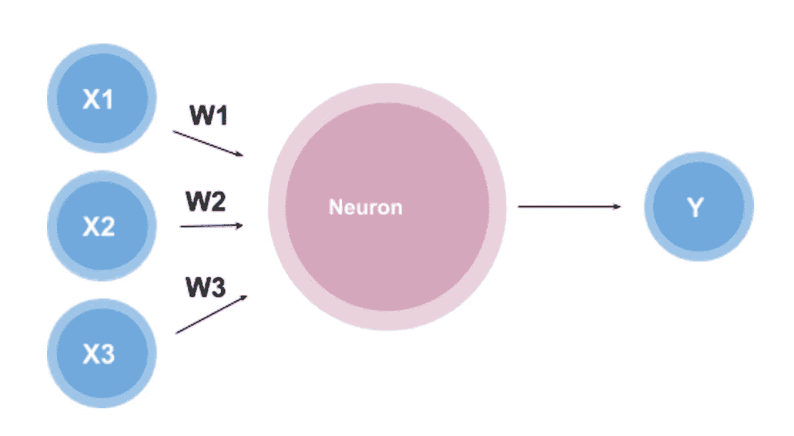

作者图片

这个想法很简单，给定输入的数值和权重，在神经元内部有一个函数，它会产生一个输出。现在的问题是，这个函数是什么？

一个函数可能看起来像

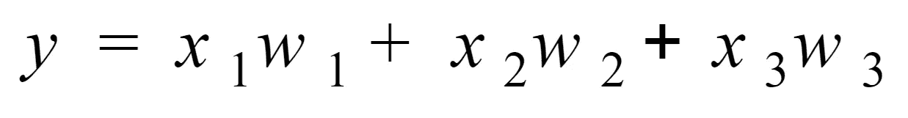

作者图片

这个函数被称为加权和，因为它是权重和输入的和。这看起来是一个很好的函数，但如果我们希望输出落在某个范围内，比如 0 到 1，该怎么办呢？

我们可以通过使用激活函数来做到这一点。激活函数是基于一组规则将给定的输入(在这种情况下，输入将是加权和)转换成某个输出的函数。

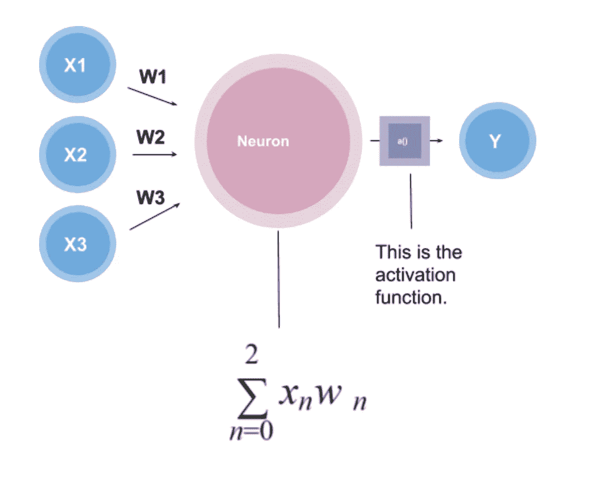

作者图片

存在不同种类的激活功能，例如:

1.  **双曲正切:**用于输出一个从-1 到 1 的数。
2.  **逻辑函数:**用于输出一个从 0 到 1 的数。

等等。

*注意:激活功能也允许非线性分类。如果你有兴趣了解更多关于激活函数的信息，我推荐你看看* [*这个*](https://medium.com/the-theory-of-everything/understanding-activation-functions-in-neural-networks-9491262884e0) *或者* [*这个*](/activation-functions-neural-networks-1cbd9f8d91d6) *。*

因为我们要寻找的范围在 0 到 1 之间，所以我们将使用一个逻辑函数来实现这个目标。

**物流功能**

后勤职能的公式如下:

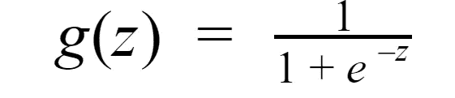

作者图片

图表看起来是这样的，

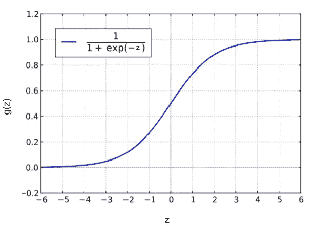

图片来自[维基共享资源](https://commons.wikimedia.org/wiki/Main_Page)。对 x 和 y 轴及功能进行更改后重新发布。

注意 g(z)位于点 0 和 1 之间，并且这个图不是线性的。这将允许我们输出介于 0 和 1 之间的数字，这正是我们构建感知机所需要的。

现在，我们已经拥有*几乎*制造感知机所需的一切。我们最不缺的就是偏见。偏差是感知器在产生输出之前必须达到的阈值。所以最终的神经元方程看起来像:

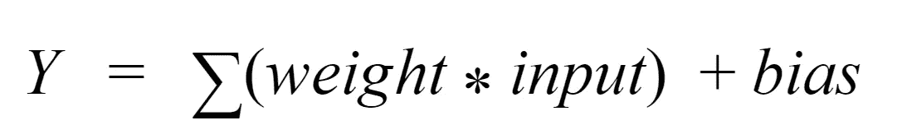

作者图片

我们可以看到(通常偏差出现在输入端附近)，

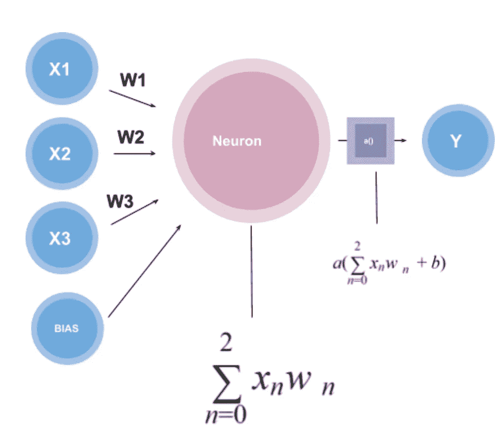

作者图片

请注意，激活函数将加权和加上偏差作为输入，以创建单个输出。使用逻辑函数，该输出将在 0 和 1 之间。

## 为什么使用感知器？

感知器是神经网络的构建模块。它通常用于二元分类器的监督学习。这可以通过一个例子得到最好的解释。我们拿一个简单的感知器来说。在这个感知器中，我们有一个输入 **x** 和 **y，**分别乘以权重 **wx** 和 **wy** ，它还包含一个偏差。

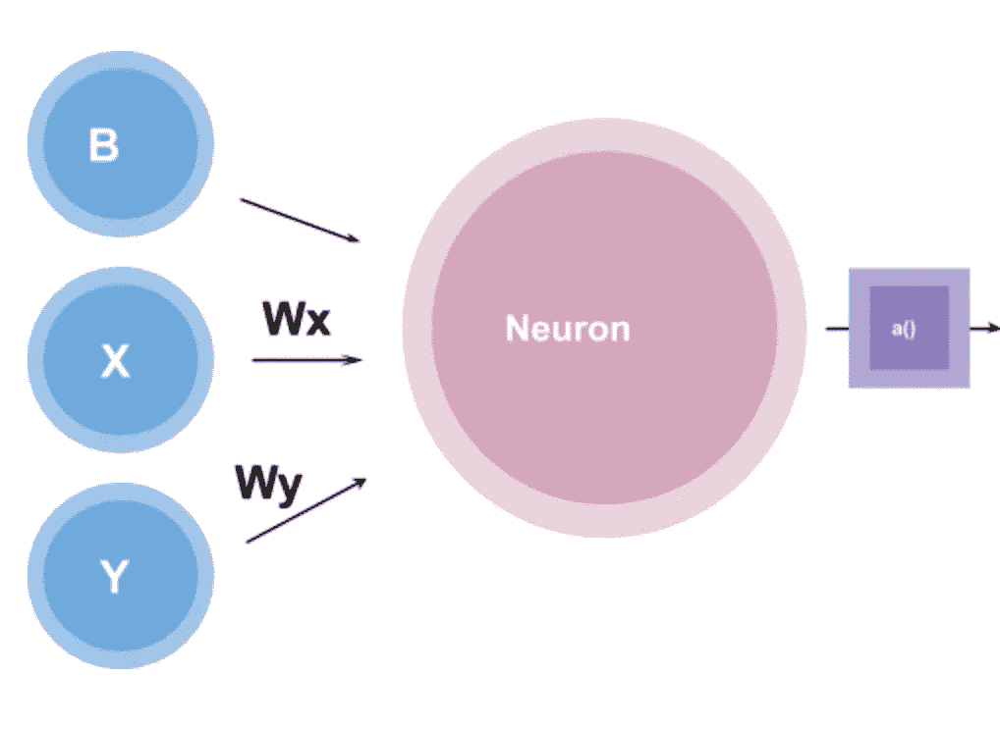

作者图片

让我们也创建一个图表，用红点和蓝点表示两种不同类别的数据。

作者图片

注意 x 轴标注在输入 **x** 之后，y 轴标注在输入 **y** 之后。

假设我们的目标是分离这些数据，以便区分蓝点和红点。我们如何使用感知器来做到这一点？

感知器可以为二元分类创建决策边界，其中决策边界是图上分隔不同数据点的空间区域。

为了更好地理解这一点，我们来玩一下函数。我们可以说，

**wx** = -0.5

**wy** = 0.5

并且 b = 0

那么感知器的功能将会是这样的，

**0.5x + 0.5y = 0**

图表看起来会像这样，

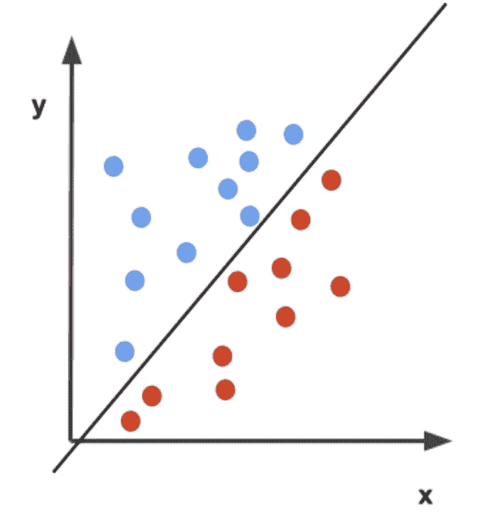

作者图片

让我们假设激活函数，在这种情况下，是一个简单的阶跃函数，它输出*0 或 1。感知器函数会将蓝点标记为 1，红点标记为 0。换句话说，*

如果 0.5x + 0.5y => 0，则为 1

如果 0.5x + 0.5y < 0，则 0。

因此，函数 0.5x + 0.5y = 0 创建了一个区分红点和蓝点的判定边界。

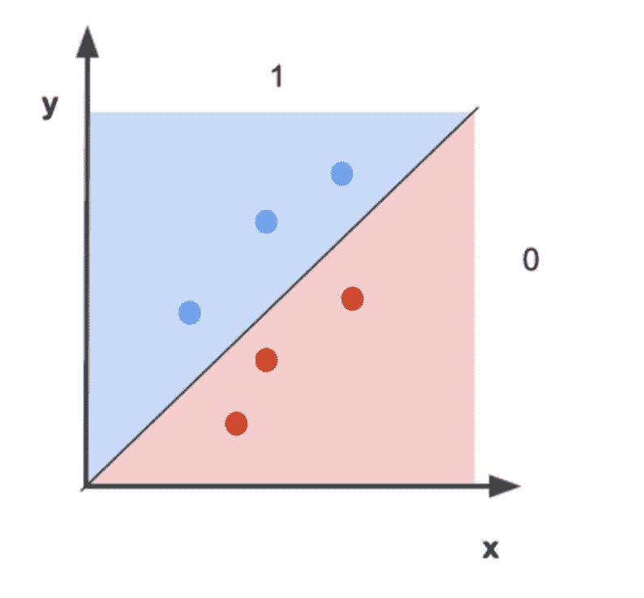

作者图片

总的来说，我们看到感知器可以使用决策边界进行基本分类。

*注意:在本例中，权重和偏差是随机选择的，用于对点进行分类，但是如果我们不知道什么权重会对数据产生良好的分离效果呢？有没有一种方法可以让感知器自己对这些点进行分类(假设函数是线性的)？答案是肯定的！有一种方法叫做* [*【感知器戏法】*](https://www.youtube.com/watch?v=-zhTROHtscQ&feature=emb_logo) *，我会让你自己去研究这个:)。*

你坚持到了文章的结尾。让我们回顾一下你所学到的！

# **关键要点**

什么是感知器，为什么使用它们？

*   感知器是一种非常简单的神经网络模型，用于二进制分类器的监督学习。

**感知器背后有什么历史？**

*   从生物神经元及其学习能力中获得灵感后，感知机于 1957 年由美国心理学家弗兰克·罗森布拉特在康奈尔航空实验室首次推出

它们是如何工作的？

*   感知器通过接受一些数字输入以及所谓的[权重和偏差](https://medium.com/fintechexplained/neural-networks-bias-and-weights-10b53e6285da)来工作。然后，它将这些输入乘以各自的权重(这就是所谓的加权和)。然后将这些乘积与偏差相加。激活函数将加权和与偏差作为输入，并返回最终输出。

# **week✨的 DL 视频**

如果你有兴趣创造自己的感知器，看看这个视频吧！

# **额外资源/引用**

*   [感知器如何学习？——感知器诡计](https://www.youtube.com/watch?v=-zhTROHtscQ&feature=emb_logo)。
*   [这个视频很好地解释了感知器模型](https://www.youtube.com/watch?v=RNYT9bECfOo)
*   如果你是从机器学习开始的，这本书真的很好，并且很好地解释了感知机的
*   [感知器的惊人深度视频](https://www.youtube.com/watch?v=aiDv1NPdXvU)
*   [维基百科一直是学习任何东西的好资源，包括感知机](https://en.wikipedia.org/wiki/Perceptron)

# 你能在哪里找到我😝

[我的 LinkedIn！](http://www.linkedin.com/in/anjalibhardwaj2700)请随时与我联系，我喜欢谈论人工智能！

[关注我的媒体页面了解更多](https://medium.com/@anjalibhardwaj2700)！