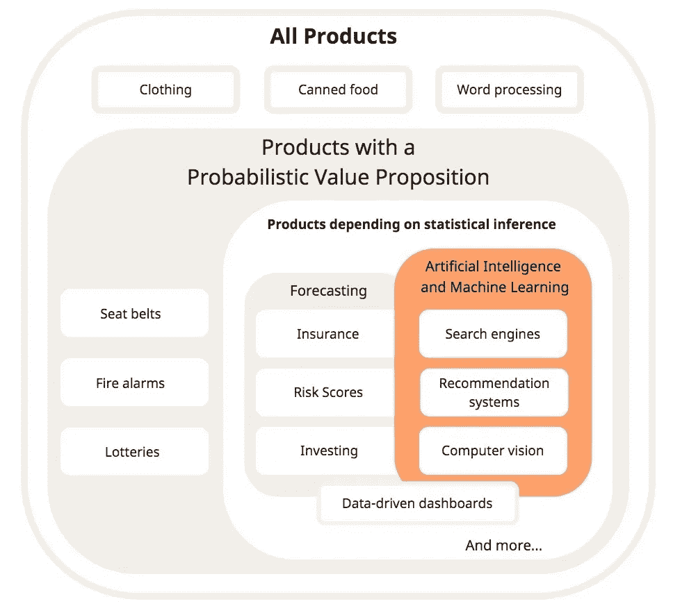

# 什么是概率价值主张？

> 原文：<https://towardsdatascience.com/what-is-a-probabilistic-value-proposition-3b4005db86c4?source=collection_archive---------76----------------------->

## 这是伟大的数据产品的秘密。

Riho Kroll 在 [Unsplash](https://unsplash.com?utm_source=medium&utm_medium=referral) 上拍摄的照片

想象一下，如果 Gmail 将 95%的电子邮件发送到正确的人的收件箱，并将另外 5%发送到不同的人的收件箱。或者，想象一下，如果 Microsoft Word 成功保存了 5 个文档中的 4 个，但是对文件进行了不正确的编码，导致文档不可读。

一个只在部分时间有效的产品——这对用户来说是疯狂和令人沮丧的。没有人会买这样的产品。除非…

想象一下，如果网飞推荐的 30 个节目中只有一个是你真正想看的，而大多数都是你已经看过的。或者想象一下，如果亚马逊的 Alexa 只能理解你问她的 10 件事情中的 8 件，通常只是回答“对不起，我不明白这个问题。”

一个只在某些时候有效的产品——在这种情况下并不疯狂。有什么不同？最后两个例子是设计成具有概率价值主张的产品特性。

概率价值主张的标志是，在任何特定的互动过程中，客户期望从产品中获得的利益可能会出现，也可能不会出现。相反，价值是通过多种互动的总和来传递的:五分之一，十分之九，百万分之一。这些交互可能发生在不同的时间段、不同的环境、极端或罕见的情况下，甚至发生在不同的客户群中。

传递概率价值的产品很少，至少与 t 恤、罐头食品和电视等更传统的产品相比是如此。然而，它们存在于计算的内部和外部。例如，安全带有一个概率价值主张。我们在每次乘车时都会系上安全带，但只有在发生事故时(理想情况下永远不会发生)，我们才会体验到安全带救命的好处。

人工智能和机器学习是基于统计学的，整个学科建立在概率正确的概念上*——经常足够有用，但不总是。从本质上讲，所有使用人工智能和机器学习的产品都有一个概率价值主张。因此，对于这个领域的创始人或从业者来说，理解其中的含义尤为重要。*

**

*所有人工智能和机器学习产品都有一个概率价值主张。(图片由作者提供)*

# *概率价值主张意味着考虑所有可能的客户体验*

*当我们设计一个具有确定性价值主张的产品时(像 Google 的电子邮件服务器和 Microsoft Word 的保存到磁盘这样的普通产品)，我们专注于通过构建新的特性和功能来最大化我们产品的优势。我们相对于客户不使用我们的产品或客户使用竞争产品的情况来定义这些优势。因此，价值主张是我们的产品为这些领域提供的所有优势的总和。*

*当我们设计具有概率价值主张的产品时，我们仍然关注使用我们产品的最大利益。但是，由于好处并不总是出现，我们还必须考虑客户在尝试使用我们的产品时可能遇到的任何与中性或不良结果相关的成本。我们最终需要设计两种用户体验:一种是提供好处的用户体验，另一种是不那么迷人的用户体验，在这种体验中，我们的产品什么都不做或者得到错误的答案。因此，概率产品的价值主张是使用产品*的所有收益的总和减去当产品具有不良或中性结果时使用该产品的相关成本。**

*安全带在发生车祸时提供了安全的好处，但也必须足够舒适，以便在其他 99.99%的时间里使用。Gmail 可以使用人工智能从我们的收件箱中过滤垃圾邮件，但也必须提供一种功能，在数据驱动的机器不可避免地出错时，将真实的电子邮件恢复到收件箱中。*

*没有人喜欢想象使用他们产品的不良后果；但是概率价值主张需要这种类型的思考。在某种程度上，收益必须大于成本。如何实现这种平衡会对商业模式产生战略影响。*

*当使用你的产品的收益明显大于成本时，以一种你的客户可以理解的方式，你的团队不再需要把你的产品的概率本质当作一个需要被压扁的 bug。以平衡的概率价值主张构建的人工智能产品明显更容易操作、扩展、监控和故障排除。*

**原载于 2020 年 5 月 25 日*[*https://www . fundamental . ai*](https://www.fundamentally.ai/post/what-is-a-probabilistic-value-proposition)*。**