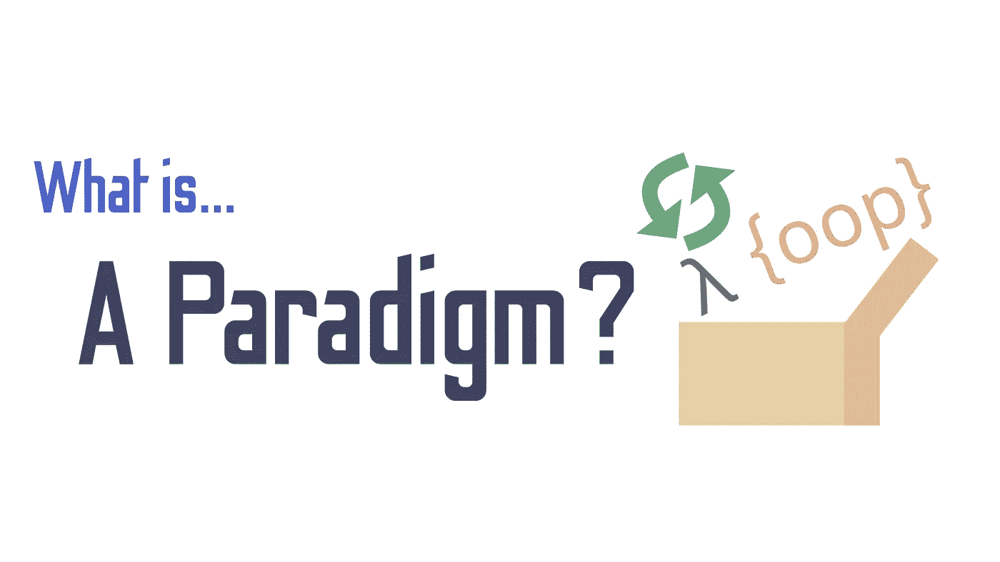

# 什么是编程范例？

> 原文：<https://towardsdatascience.com/what-is-a-programming-paradigm-1259362673c2?source=collection_archive---------10----------------------->

## 编程范例和泛型概述

(图片由作者提供)

# 介绍

自从第一种高级编程语言 plank alül 的发布，以及随之而来的 FORTRAN 和 Common Lisp 等语言的发布，编程语言一直在挑战编程对计算机程序员的意义。这通常是通过所谓的编程范例来完成的。

编程范式是编程语言的方法论所遵循的概念。范式很重要，因为它们定义了一种编程语言及其工作方式。思考范式的一个很好的方式是把它看作一套思想，编程语言可以用它在更高的层次上以机器码的形式执行任务。这些不同的方法在某些情况下可能更好，而在另一些情况下可能更差。探索范式时的一条重要经验是了解它们擅长什么。虽然大多数现代编程语言确实是通用的，可以做任何事情，但是用函数式语言开发游戏可能比用面向对象的语言更困难。

# 陈述性与命令性

关于编程范例的概念，最有趣的事情可能是范例本身是子类，就像 C++昨天刚刚出现一样。通常在编程方法中，一种语言可以分为两大类:

*   宣言的
*   必要的

## 声明式编程

声明式编程是指坐在方向盘后面的程序员在任何给定的时刻都不能有效地准确编程计算机做什么，而是描述他们想要的结果的属性，而不解释如何计算它。落入此窗口的范例有:

*   函数式编程范式。
*   逻辑编程范式。
*   数学编程范式。
*   模块化编程范例。

## 命令式编程

命令式编程本质上与声明式编程相反。首先，使用命令式编程，用户通常直接与计算机的状态进行交互，并决定如何计算事物。推广这种编程方法的范例有:

*   面向对象的编程范例。
*   过程化编程范式。

# 范例应用

重要的是要记住，语言不需要遵守这些规则。尽管 C++经常被错误地认为创造了面向对象的编程范例，但它确实在编程世界中引入了一个惊人的概念:

> 仿制药！

泛型允许编程语言从各种编程范例中挑选某些属性，并利用最适合该语言应用的属性。在引入泛型之前，大多数语言都是为了执行非常特殊的操作而创建的。例如，Simula 是第一种真正的面向对象编程语言，它是专门为运行复杂模拟而创建的。另一个很好的例子是 COBOL，它是一种主要用于商业应用的编程语言。

大多数现代编程语言都是多范例编程语言。这是因为增加了对泛型编程概念的支持，使得编程语言可以跨范例流动，并有效地改变它们的工作方式，有时这种方式非常酷。

鉴于大多数现代编程语言都是多范式的，有些人可能会想知道为什么了解所有范式如此重要。这是一个值得问的问题，因为范式之间的界限在许多语言中是如此的不相关——我想起了我最喜欢的 Julia——为什么你应该熟悉每种范式的属性，而不是只学习一种多范式语言呢？我的反驳是这样的:

> 教育。

我看了莱克斯·弗里德曼(喜欢那个家伙)和比雅尼·斯特劳斯特鲁普(C++的传奇人物)的一次很棒的访谈，比雅尼·斯特劳斯特鲁普回答了这个问题的很多细节。如果你感兴趣的话，这里有一个嵌入版本，你现在可以听听:

在采访中，他继续说，一个伟大的程序员应该知道至少五种编程语言。虽然这些不一定是低级的，但是它们应该来自不同的范例。简单的事实是，函数式编程语言可以教给你很多关于编程和计算机的东西。对于命令式语言(如 C)、面向对象语言(如 Python 和 C++ ),甚至是更奇怪的范式(如结构化编程范式)来说，这当然是正确的。

这里有一个我喜欢并且知道的语言列表，可以用它们各自的范例来教你编程:

## 功能的

*   普通 Lisp
*   计划
*   哈斯克尔
*   稀有
*   朱莉娅
*   猎人

## 面向对象

*   C++
*   Java 语言(一种计算机语言，尤用于创建网站)
*   Java Script 语言
*   计算机编程语言
*   斯卡拉

## 必要的

*   C
*   汇编(我个人使用 NASM/FASM，只使用 64 位注册表(amd64 汇编))
*   公式翻译程式语言(formula translator)

如果你想让意识超越一种特定的编程方式的界限，我正式建议你深入其中的一些选项。从长远来看，许多概念也可能会回归，这很好。没有什么比在旧代码中强化新技能或新东西更好的了。

# 语言分类

人们可以解释编程语言的所有拼图是如何组合在一起的，但更好的方法可能是应用已经掌握的知识，以便在代码中绘制不同因素的线条。正如历史上大多数高级编程概念一样，我们应该从 c 开始。

## C

c 是一种命令式编程语言。使用这种语言，人们通常会绘制指针并手动移动数据来解决编程问题。虽然这给了系统很大的控制权，但这也意味着要提防更多的东西，这意味着 C 可能不是进行快速运算的最理想的语言。

## C++

C++也是一种命令式语言，因为它本质上是一种将孩子与 C 直接联系起来的语言。C++也是面向对象编程的典范，是至今仍在使用的这种语言的最经典的例子之一。

## 普通 Lisp

Lisp 是一种固有的函数式编程语言，然而大多数形式的现代 Lisp 不再是纯函数式的。这是编程语言中反复出现的一个主题，因为对于一门语言来说，只直接擅长一件事已经没有什么意义了。

## 稀有

r 是另一种存在于多范例光谱中的语言。r 主要是一种函数式编程语言，但是当然利用了泛型和方法论的优势，这使得它可以做比大多数典型的函数式语言更难享受的事情。

## 朱莉娅

在这方面，朱莉娅当然是一个很难谈论的人。Julia 的一个独特之处是语言本身背后的方法论。然而，从纯粹的基本形式来看，Julia 是一种函数式编程语言。当然，像 R Julia 一样，它也是一种多范式语言，而且通过多重调度将单词的含义提升到了一个全新的水平。

## 锈

Rust 是多范例编程语言的另一个很好的例子。虽然 Rust 很像一个更高级的 C 语言，但它也有很多通常被认为是功能性的属性——这并不是一件坏事。

## 计算机编程语言

很可能我们都知道 Python 首先是一种面向对象的编程语言。然而，Python 是另一种完全多范式的编程语言。

# 结论

所有编程范例对教育和能力都有好处。历史上，函数式语言在科学计算领域非常引人注目。当然，拿今天科学计算最流行的语言来说，很明显它们都是多范例的。面向对象语言也有很好的应用。软件开发、游戏开发和图形编程都是面向对象编程的很好的例子。

从所有这些信息中，我们可以得出的最大结论是，软件和编程语言的未来是多范例的。不太可能有人会在短期内创建一种纯函数式或面向对象的编程语言。如果你问我，这并不是一件坏事，因为你采用的每一种编程方法都有弱点和优点，并且许多真正的优化都是执行测试，以查看哪种方法比其他方法更有效或更好。这也给每个人都应该从多种范式中了解多种语言的想法加上了一个更大的图钉。随着范型利用泛型的力量进行合并，永远不知道什么时候会遇到完全不同的编程语言的编程概念！