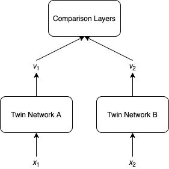
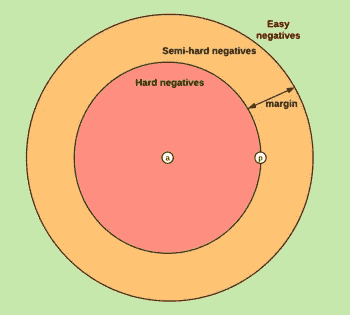

# 什么是连体神经网络？

> 原文：<https://towardsdatascience.com/what-is-a-siamese-neural-network-b0dbeb1c6db7?source=collection_archive---------33----------------------->

## 专门测量相似性的神经网络


照片由 [Unsplash](https://unsplash.com?utm_source=medium&utm_medium=referral) 上的 [Sereja Ris](https://unsplash.com/@kimtheris?utm_source=medium&utm_medium=referral) 拍摄

机器学习的许多应用都围绕着检查两个对象是否相似。例如:

*   对于面部识别，检查输入的面部图像是否与数据库中的任何图像相似
*   在问答网站上，检查新问题是否与任何存档的问题相似

如今，测量两个对象之间的相似性的最常见和最方便的方法之一如下:

1.  获取每个对象的矢量表示(也称为嵌入)。例如预训练 ResNet 的中间层的输出、句子中所有单词的预训练单词向量的平均值
2.  计算步骤(1)中两个向量之间的余弦相似度
3.  使用步骤(2)中的值来确定这两个对象是否相似

然而，这种方法通常表现不佳，因为步骤(1)中的矢量表示在我们的应用中不是专用的。如果我们想微调这些向量表示，甚至从头开始训练一个新的模型，我们可以使用连体神经网络架构。

## 网络体系结构

连体神经网络由两个相同的子网组成，也称为双网络，它们的输出端相连。这两个网络不仅具有相同的架构，而且它们还共享权重。它们并行工作，负责为输入创建矢量表示。例如，如果我们的输入是图像，我们可以使用 ResNet 作为孪生网络。我们可以将连体神经网络视为孪生网络的包装器。它们通过测量向量之间的相似性来帮助产生更好的向量表示。



在上图中， *x* ₁和 *x* ₂是我们要比较的两个对象， *v* ₁和 *v* ₂是 *x* ₁和 *x* ₂.的矢量表示比较层的架构取决于损失函数和训练数据的标签。由于我们的目标是在矢量表示中获得尽可能多的信息，比较层通常具有非常简单的架构。以下是一些常见的选择:

*   计算 *v* ₁和 *v* ₂
    的余弦相似度标签为-1 到 1 之间的实数，损失函数为均方误差。
*   串联 *v* ₁、 *v* ₂和绝对元素差异|*v*₁-*v*₂|，接着是全连接层和一个 softmax 层
    这是用于多类分类的，损失函数是交叉熵。
*   计算 *v* ₁和 *v* ₂
    之间的欧几里德距离*v*₁*v*₂‖损失函数是对比损失或三重损失。由于这两个损失不太为人所知，我们将在下一节简要解释它们。

请注意，比较层应该是对称的 w.r.t. *v* ₁和 *v* ₂.结合双胞胎网络具有相同架构和权重的事实，这使得整个连体神经网络对称 w.r.t. *x* ₁和 *x* ₂.

## 损失函数

对比损失和三重损失都是基于距离的损失函数，主要用于学习向量表示，并且通常与连体神经网络结合使用。

## 对比损失

假设我们的数据集由不同类别的对象组成。例如，ImageNet 数据集由汽车图像、狗图像等组成。然后对于每一对输入( *x* ₁， *x* ₂)，

*   如果 *x* ₁和 *x* ₂属于同一个类，我们希望它们的矢量表示相似。因此，我们希望最小化*l*=*v*₁-v₂‖。
*   另一方面，如果 *x* ₁和 *x* ₂属于不同的类，我们希望*v*₁-v₂‖比较大。我们要最小化的项是
    *L* = max(0，*m*‖*v*₁*v*₂‖)，其中 *m* 是一个超参数，称为余量。余量的想法是，当 *v* ₁和 *v* ₂相差足够大的时候， *L* 就已经是 0 了，不能再小了。因此，该模型不会浪费精力来进一步分离 *v* ₁和 *v* ₂，而是会关注其他输入对。

我们可以将这两种情况合并成一个公式:

```
*L* = *y ** ‖*v*₁ − *v*₂‖² + (1 - y) * max(0, *m* − ‖*v*₁ − *v*₂‖)²
```

其中 *y* = 1 如果 *x* ₁和 *x* ₂属于同一类，否则 *y* = 0。

## 三重损失

通过考虑输入的三元组( *xa* 、 *xp* 、 *xn* )，三元组损失将上述思想向前推进了一步。这里 *xa* 是锚对象， *xp* 是正对象(即 *xa* 和 *xp* 属于同一类)，而 *xn* 是负对象(即 *xa* 和 *xn* 属于不同类)。我们的目标是使矢量表示 *va* 更类似于 *vp* 而不是 *vn* 。精确公式由下式给出

```
*L* = max(0, *m* + ‖*va* − *vp*‖ - ‖*va* − *vn*‖)
```

其中 *m* 是超参数余量。就像对比损失的情况一样，裕量决定了‖*va**VP*和‖*va**VN*之间的差异何时变得足够大，使得模型将不再从这三个一组中调整其权重。

对于对比损失和三元组损失，我们如何从不同类别的对象中采样输入对( *x* ₁， *x* ₂)和三元组( *xa* ， *xp* ， *xn* )对模型训练过程有很大影响。理想情况下，我们希望输入对和三元组对我们的模型来说不太容易，但也不太难。

## 履行

尽管我们在上图中有孪生网络 A 和 B，但实际上只有孪生网络的单个副本通常更方便。

```
def forward(self, x1, x2):
    v1 = self.twin_network(x1)
    v2 = self.twin_network(x2)
    return self.comparison_layers(v1, v2)
```

TensorFlow 和 PyTorch 都内置了一些常见的损失函数。

## 张量流

*   [https://www . tensor flow . org/addons/API _ docs/python/TFA/loss/ContrastiveLoss](https://www.tensorflow.org/addons/api_docs/python/tfa/losses/ContrastiveLoss)

## PyTorch

*   [https://py torch . org/docs/stable/generated/torch . nn . cosineembeddingloss . html](https://pytorch.org/docs/stable/generated/torch.nn.CosineEmbeddingLoss.html#torch.nn.CosineEmbeddingLoss)
*   [https://py torch . org/docs/stable/generated/torch . nn . tripletmarginloss . html](https://pytorch.org/docs/stable/generated/torch.nn.TripletMarginLoss.html#torch.nn.TripletMarginLoss)

## 进一步阅读

*   [1]是对连体神经网络的一个很好的概述。特别是，它包含了在不同领域，如图像分析，文本挖掘，生物学，医学和健康的暹罗神经网络应用的许多参考。
*   [3]使用连体神经网络来微调由 BERT 产生的矢量表示。这是利用预训练模型的一个很好的例子。
*   三联体丢失在连体神经网络中非常普遍，并且在小批量设置中引入了它的变体。[4]在一批中为每一对锚或阳性选择“半硬”阴性，并仅在这些三元组上训练网络。下图最能说明“半硬”底片的概念:



[5]: *三种类型的否定，给定一个锚和一个肯定*

*   [2]在形成三元组时，为每个锚点选择一个批次中最难的肯定值和最难的否定值。这里最难是指最大的*va*—*VP*为正，或者最小的*va*—*VN*为负。我们参考[5]对这两种三重态损失变量的更详细解释，以及在 TensorFlow 中使用它们的 TensorFlow 附件[文档](https://www.tensorflow.org/addons/api_docs/python/tfa/losses/TripletSemiHardLoss)。

## 参考

1.  D.奇克。[连体神经网络:概述](https://link.springer.com/protocol/10.1007%2F978-1-0716-0826-5_3) (2020)，*人工神经网络*，分子生物学方法，第 2190 卷，Springer 协议，第 73–94 页
2.  A.赫尔曼斯、l .拜尔和 b .莱贝。[为人身重新鉴定三重缺失辩护](https://arxiv.org/pdf/1703.07737.pdf) (2017)，arXiv
3.  名词（noun 的缩写）赖默斯和我古雷维奇。[句子-BERT:使用连体 BERT 网络的句子嵌入](https://www.aclweb.org/anthology/D19-1410.pdf) (2019)，em NLP ijc NLP 2019
4.  F.Schroff，D. Kalenichenko 和 J. Philbin。 [FaceNet:人脸识别和聚类的统一嵌入](https://www.cv-foundation.org/openaccess/content_cvpr_2015/app/1A_089.pdf) (2015)，CVPR 2015
5.  [tensor flow 中的三元组丢失和在线三元组挖掘](https://omoindrot.github.io/triplet-loss)