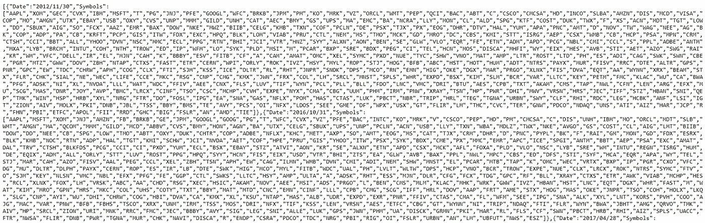

# 什么是生存偏差，如何避免？

> 原文：<https://towardsdatascience.com/what-is-a-survival-bias-and-how-to-avoid-it-14296d02c0c2?source=collection_archive---------30----------------------->


斯蒂芬·凯勒在[的照片](https://pixabay.com/photos/fantasy-clouds-woman-castle-sun-3281795/)

## 评估不同的交易策略时，你需要考虑的一个简单因素

在我以前的一篇文章中，我[建造了一个交易模拟器](https://medium.com/swlh/build-a-trading-simulator-in-python-ebe046949dd9)，并展示了一些结果。那些结果好得令人难以置信，然而我却欣喜若狂。有人对我说，我是一种叫做*的东西的受害者。*

*总的来说，生存偏见是一种逻辑错误，即专注于在某种过程或一段时间内“幸存”的事物，而忽略那些没有幸存的事物。我想介绍一个简单的方法来帮助你避免同样的错误。*

## *我的经历*

*如前所述，我建立了一个交易模拟器，并在上面测试了一个策略。测试时间从 2000 年 1 月 1 日至 2019 年 12 月 31 日。在此期间，这一策略在交易 S&P500 指数成份股时本可以产生 9438%的利润。*

*其中一条评论后来透露，我用的是目前活跃的股票。这是真的，整个模拟假设在 2000 年初，我们观察到组成 2019 年指数的相同符号。那种假设根本就是错误的！*

*相反，当遍历时间时，我应该做以下事情:*

1.  *列出 2000-1-1 年构成 S&P500 指数的符号。*
2.  *对于索引中的每次更新(一个符号被添加，另一个被删除)，我也应该更新我的符号列表。*

*在我看来，这是对抗生存偏见的唯一方法，因为你会把失败者和成功者都考虑进去。*

> *“历史是由胜利者书写的”——温斯顿·丘吉尔*

## *查找相关数据*

*在谷歌搜索了一些相关数据后，我发现我在寻找的解决方案并不简单。根据[维基百科](https://en.wikipedia.org/wiki/List_of_S%26P_500_companies)的数据，在 1963 年 1 月 1 日至 2014 年 12 月 31 日期间，S & P500 的成分发生了 1186 次变化，而这里只列出了其中的 227 次。显然这不能完全相信。*

*谷歌的另一个结果告诉我，我可以花 97 美元购买 S&P500 指数的所有变更列表。出于一点小小的好奇，这有点过分了。我有点惊讶，如此琐碎的知识不是免费分享的。*

*下一个结果很有趣:*

 *[## S&P 100/500 历史组件

### 特定日期(变更)标准普尔 500 和 S&P 100 指数中的公司/指数成分列表。这些数据…

nemozny.github.io](https://nemozny.github.io/datasets/)* 

*这位作者花了很长时间提取索引数据，结果他整理出了一个漂亮的 [**JSON 文件**](https://nemozny.github.io/datasets/sp500-historical-components.json) 。这些条目包含两个名称-值对:一个用于日期，另一个用于组成 S & P500 指数的符号。由于它很难阅读，我不打算把整个文件粘贴到这里。相反，下图显示了 JSON 文件中两个条目的内容。你看它有多长就知道了！*

**

*JSON 文件中的两个条目。你看它有多长就知道了！*

*现在我们已经对 JSON 文件有了一些了解，让我们开始一些编码工作。*

## *把它编成密码*

*如果我们仔细观察这个 JSON 文件，我们可以看到它是一个字典列表——每个条目都用一个 python 字典表示。我们可以用下面的代码加载数据:*

```
*import jsonwith open('sp500-historical-components.json') as json_file:
    data = json.load(json_file)*
```

*同样，`data`只是一个包含不同字典的列表。这个列表是无序的，让它有序可能很好。首先，让我们创建一个日期列表:*

```
*dates = []
for entry in data:
    dates.append(entry["Date"])*
```

*我的代码终端显示`dates`列表如下:*

```
*['2012/11/30', '2016/10/31', '2017/04/28', '2017/05/03', '2017/03/31', '2016/12/30', '2016/08/31', '2016/09/30', '2017/01/31', '2017/02/28', '2016/07/29', '2016/06/30', '2016/04/29', '2016/05/31', '2015/10/30', '2015/07/31', '2016/01/29', '2016/02/29', '2016/03/31', '2015/12/31', '2015/11/30', '2015/09/30', '2015/08/31', '2015/06/30', '2015/05/29', '2015/04/30', '2014/12/31', '2015/01/30', '2014/10/31', '2014/11/28', '2015/02/27', '2014/09/30', '2015/03/31', '2014/08/29', '2014/05/30', '2014/06/30', '2014/07/31', '2014/03/31', '2014/04/30', '2013/12/31', '2013/11/29', '2014/01/31', '2014/02/28', '2013/10/31', '2013/08/30', '2013/07/31', '2013/09/30', '2012/12/31', '2013/05/31', '2013/06/28', '2012/10/31', '2013/02/28', '2013/03/28', '2013/01/31', '2013/04/30', '2012/08/31', '2016/11/30', '2012/09/28', '2012/04/30', '2012/06/29', '2012/03/30', '2012/07/31', '2012/05/31', '2012/02/29', '2011/10/31', '2012/01/31', '2011/08/31', '2011/05/31', '2011/06/30', '2011/02/28', '2011/03/31', '2010/12/31', '2010/11/30', '2011/12/30', '2011/11/30', '2010/09/30', '2010/10/29', '2011/09/30', '2011/07/29', '2010/06/30', '2011/04/29', '2011/01/31', '2010/02/26', '2010/01/29', '2009/12/31', '2010/08/31', '2010/04/30', '2010/07/30', '2010/03/31', '2010/05/28', '2009/09/30', '2009/08/31', '2009/10/30', '2009/04/30', '2009/11/30', '2009/03/31', '2009/06/30', '2009/07/31', '2009/02/27', '2009/05/29', '2009/01/30', '2008/10/31', '2008/11/28', '2008/12/31', '2008/09/30', '2008/08/29', '2008/07/31', '2008/06/30', '2008/04/30', '2008/05/30', '2008/01/31', '2008/02/29', '2008/03/31']*
```

*现在我们可以肯定地看到我们的数据列表是无序的。此外，日期从 2008 年到 2017 年。由于这个列表中的日期不多(大约 100 个)，我们可以使用一种健壮的方式来调用有序数据:*

```
*datescopy = dates.copy()
datescopy.sort()indices = []
for date in datescopy:
    indices.append(dates.index(date))*
```

*这个方法创建了一个`dates`的副本，并对其进行排序。一个列表`indices`帮助我们映射有序和无序数据之间的日期。自己看:*

```
*for index in indices:
    print(data[index]["Date"])*
```

*打印出来的日期是有序的。酷！*

*假设你想回测你的交易策略。您已经创建了您的交易模拟器，并特别希望包括 2008 年 1 月 31 日至 2017 年 5 月 3 日期间 S&P500 的股票。*

*你用`data[indices[0]]["Symbols"]`初始化你的可交易符号，一旦根据`data`有了更新，你也随着时间的推移更新你的符号列表。*

*这种方法简单易行，效果很好。不幸的是，这些数据在 2017 年停止，并且不再定期更新。如果你有更好的免费数据，请在评论中告诉我。*

## *摘要*

1.  *维基百科 https://en.wikipedia.org/wiki/List_of_S%26P_500_companies S&P500 组件列表:*
2.  *数据集的链接:[https://nemozny.github.io/datasets/](https://nemozny.github.io/datasets/)*

## *资源*