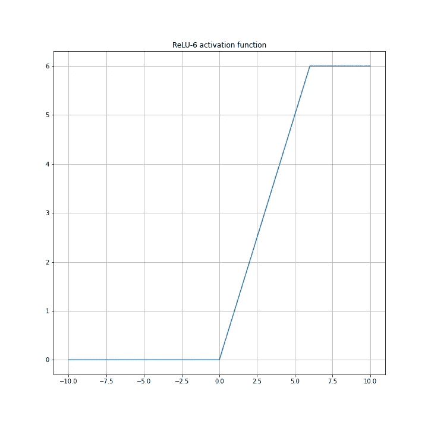

# 什么是激活功能？

> 原文：<https://towardsdatascience.com/what-is-activation-function-1464a629cdca?source=collection_archive---------20----------------------->


来源:米里亚姆·埃斯帕奇

## *神经网络最重要的部分之一*

***激活函数定义了给定一个输入或一组输入时一个神经元/节点的输出*** *。这是对生物神经元刺激的模拟。*

激活函数到下一层(浅层神经网络中:输入层和输出层，深层网络中到下一个隐层)的输出称为前向传播(信息传播)。它被认为是一个神经网络的非线性变换。

> 一个笔记本的全部代码都在这里: [GitHub](https://github.com/Christophe-pere/Activation_functions)

# 有一个常用的激活功能列表:

*   **二进制**
*   **线性**
*   **乙状结肠**
*   谭
*   **ReLU**
*   **泄漏的 ReLU (LReLU)**
*   **参数 ReLU (PReLU)**
*   **指数线性单位(eLU)**
*   **ReLU-6**
*   **Softplus**
*   **软设计**
*   **Softmax**
*   **唰**

## *二进制*

二元激活函数是最简单的。它基于二进制分类器，如果值为负，输出为 0，否则为 1。把这个激活函数看作二元分类中的一个阈值。

二元激活函数的代码是:

```
def binary_active_function(x):
    return 0 if x < 0 else 1
```

这个函数的输出是什么？

```
for i in [-5, -3, -1, 0, 2, 5]:
    print(binary_active_function(i))output:
    0
    0
    0
    1
    1
    1
```

或者视觉上:


二元激活函数

优点:

*   二元分类

缺点:

*   在多标签分类中不起作用
*   梯度计算的导数始终为 0，因此无法更新权重

## 线性激活函数

二元函数之后的下一步是用线性函数代替阶跃。输出与输入成正比。

对应的代码是:

```
def linear_active_function(a, x):
    return a*x
```

我们可以针对不同的*a*值来计算它:

```
$ x = numpy.linspace(-10, 10, 5000)
$ y_1 = [linear_active_function(1, i) for i in x] # a = 1
$ y_2 = [linear_active_function(2, i) for i in x] # a = 2
$ y_1
> [-10.0, -9.9, -9.8, -9.7, ..., 9.7, 9.8, 9.9, 10.0]
```

如果我们绘制 a = 1、2、4 和 10 的结果:


优点:

*   二元和多元分类
*   高度可解释性

缺点:

*   导数对应于" *a* "，因此在后推过程中权重和偏置的更新将是恒定的。
*   如果梯度总是相同，则效率不高。

## 乙状结肠的

Sigmoid 是使用最多的激活功能，带有 *ReLU* 和 *tanh* 。这是一个非线性激活函数，也称为*逻辑函数*。该激活函数输出在 0 和 1 之间变化。神经元的所有输出都将是正的。

相应的代码如下:

```
def sigmoid_active_function(x):
    return 1./(1+numpy.exp(-x))
```

快速计算:

```
$ x = numpy.linspace(-10, 10, 5000)
$ y = [sigmoid_active_function(i) for i in x] 
$ y
> [4.5397868702434395e-05, 4.5854103946941324e-05, ... , 0.9999532196250409, 0.9999536850759906, 0.9999541458960531]
```

如果我们画出结果:


Sigmoid 激活函数

缺点:

*   这个函数的问题是每个神经元的输出会饱和。大于 1 的值表示为 1，小于 0 的值表示为 0。
*   sigmoid 函数的最佳灵敏度在中心点(0，0.5)附近。
*   在饱和期间出现了一个大问题，算法在这个位置期间无法学习(这是*消失梯度问题*的来源，对应于梯度中没有方向)。

## 双曲正切

正切双曲函数(tanh)与 sigmoï函数的形式相似。Tanh 在 0 中是对称的，值在-1 和 1 的范围内。作为乙状结肠，它们在中心点(0，0)非常敏感，但是它们对于非常大的数(正和负)饱和。这种对称性使它们比 sigmoid 函数更好。

应用双曲正切函数的相应代码是:

```
def tanh_active_function(x):
    return 2*sigmoid_active_function(2*x)-1
```

计算 *y* 值:

```
$ x = numpy.linspace(-10, 10, 5000)
$ y = [tanh_active_function(i) for i in x] 
$ y
> [-0.9999999958776927, -0.9999999957944167, ... , 0.9999999956227836, 0.9999999957094583, 0.9999999957944166]
```

以及相应的结果:


tanh 激活函数

优点:

*   范围在-1 和 1 之间
*   梯度比 sigmoid 更强(导数更陡)

缺点:

*   像 sigmoid 一样，tanh 也有一个消失梯度问题
*   浸透

## 热卢

开发了*整流线性单元*以避免大正数的饱和。非线性允许保存和学习数据中的模式，线性部分(>0-也称为分段线性函数)使它们易于解释。

下面的函数显示了如何实现 ReLU 函数:

```
def relu_active_function(x):
    return numpy.array([0, x]).max()
```

*y* 计算:

```
$ x = numpy.linspace(-10, 10, 5000)
$ y = [relu_active_function(i) for i in x] 
$ y
> [0.0, 0.0, ... , 9.97, 9.98, 9.99]
```

结果是:


ReLU 激活功能

优点:

*   易于实施且速度非常快
*   真 0 值
*   当激活函数是线性时，优化是容易的
*   最常用于神经网络生态系统

缺点:

*   当 x = 0 时，函数不可微。这个点的梯度下降无法计算，但实际上这没有影响。线性部分对应于值为 1 的斜率，负部分等于零。
*   “垂死的 ReLU 问题”:如果输出为 0，则对应于神经元的不活跃部分。当神经元不活动时没有梯度，因此如果大部分神经元没有被激活，则可能导致模型的较差性能
*   不适用于 RNN 类算法(RNN、LSTM、GRU)

## 泄漏 ReLU

该激活功能是 ReLU 激活功能的修改，以避免“死亡问题”。该函数返回线性斜率，其中 a=0.01，这允许用梯度流保持激活神经元。

参见下面的代码:

```
def leaky_relu_active_function(x):
    return 0.01*x if x < 0 else x
```

计算 y 轴来绘制结果:

```
$ x = numpy.linspace(-10, 10, 5000)
$ y = [leaky_relu_active_function(i) for i in x] 
$ y
> [-0.1, -0.0999, ... , 9.97, 9.98, 9.99]
```

绘制结果图:


泄漏 ReLU 激活功能

优点:

*   纠正“将死的 ReLU 问题”
*   零件 y=x 的 ReLU 激活功能的相同组成部分

## 参数 ReLU

在泄漏 ReLU 之后，创建了另一个激活函数来避免“死亡 ReLU 问题”，即参数化的 ReLU。系数 a 不锁定在 0.01(泄漏 ReLU)，但可以自由估计。它是 ReLU 的推广，算法学习整流器参数。

代码:

```
def parametric_relu_active_function(a, x):
    return a*x if x < 0 else x
```

计算不同 *a* 值的结果:

```
$ x   = numpy.linspace(-10, 10, 5000)
$ y_1 = [parametric_relu_active_function(0.25, i) for i in x] 
$ y_2 = [parametric_relu_active_function(0.5, i) for i in x]
$ y_3 = [parametric_relu_active_function(0.75, i) for i in x]
$ y_4 = [parametric_relu_active_function(1, i) for i in x]
$ y_1
> [-2.5, -2.4975, ... , 9.97, 9.98, 9.99]
```

绘制 a = 0.25，0.5，0.75，1:


参数 ReLU 激活函数

如果 a = 0，参数 ReLU 相当于 ReLU 激活函数。如果 a=0.01，参数 ReLU 对应于泄漏 ReLU。

优点:

*   推广 ReLU 激活函数
*   避免“垂死的 ReLU 问题”
*   神经网络学习参数“ *a*

## 指数线性单位

eLU 是 ReLU 函数的另一种变体。函数的负部分由缓慢平滑的指数函数处理。

相应的功能:

```
def elu_active_function(a, x):
    return a*(numpy.exp(x)-1) if x < 0 else x
```

*y* 计算:

```
$ x   = numpy.linspace(-10, 10, 5000)
$ y_1 = [elu_active_function(0.1, i) for i in x] 
$ y_2 = [elu_active_function(1, i) for i in x]
$ y_3 = [elu_active_function(2, i) for i in x]
$ y_4 = [elu_active_function(5, i) for i in x]
$ y_1
> [-0.09999546000702375, -0.09999541437933579, ... , 9.97, 9.98, 9.99]
```

绘制 a = 0.1，1，2，4 的结果:


eLU 激活功能

优点:

*   ELU 慢慢变得平滑，直到其输出等于-α，而 RELU 急剧平滑。
*   ELU 是 ReLU 的有力替代者。
*   与 ReLU 不同，eLU 可以产生负输出。

缺点:

*   对于 x > 0，可以用输出范围[0，inf]吹爆激活。

## ReLU-6

ReLU 函数的另一个变体是 ReLU-6，6 是手动固定的任意参数。优点是将大正数的输出整形为 6 值。

相应的代码:

```
def relu_6_active_function(x):
    return numpy.array([0, x]).max() if x<6 else 6
```

y 计算:

```
$ y = [relu_6_active_function(i) for i in x]
```

绘制结果图:



ReLU-6 激活功能

## Softplus

softplus 激活功能是 sigmoid 和 tanh 功能的替代功能。此功能有限制(上限、下限)，但 softplus 在范围(0，+inf)内。

相应的代码:

```
def softplus_active_function(x):
    return math.log(1+numpy.exp(x))
```

*y* 计算:

```
$ y = [softplus_active_function(i) for i in x]
```

绘制结果图:


Softplus 激活功能

## 软设计

这种激活函数是 tanh 的一种变体，但在实践中并不常用。tanh 和 softsign 函数密切相关，tanh 指数收敛，而 softsign 多项式收敛。

相应的代码:

```
def softsign_active_function(x):
    return x / (1 + abs(x) )$ y = [softsign_active_function(i) for i in x]
```

绘制结果图:


软设计激活功能

## Softmax

softmax 激活函数不同于其他函数，因为它计算概率分布。输出的总和等于 1。

相应的代码:

```
def softmax_active_function(x):
    return numpy.exp(x)/numpy.sum(numpy.exp(x))
```

计算输出是不同的，因为它是考虑到指数和的概率分布，函数需要所有的 *x* 点来计算输出 *y* 。

```
$ x = [0.8, 1.2, 2.4, 4.6]
$ y = softmax_active_function(x)
$ y
> [0.01917691, 0.02860859, 0.09498386, 0.85723064]
$ numpy.sum(y)
> 1.0
```

## 嗖嗖

Swish 是较新的激活功能，由谷歌在 2017 年发布，它提高了 ReLU 在更深模型上的性能。这个函数是 sigmoid 函数的变体，因为它可以表示为:x*sigmoid(x)。

> Swish 具有在零点的单侧有界性、光滑性和非单调性，这些性质可能在 Swish 和类似激活函数的观察功效中起作用。
> [SWISH:一个自门控激活函数，Prajit Ramachandran，Barret Zoph，Quoc V. Le，2017](https://arxiv.org/pdf/1710.05941v1.pdf)

相应的代码:

```
def swish_active_function(x):
    return x/(1+numpy.exp(-x))
```

或者:

```
def swish_active_function(x):
    return x*sigmoid_active_function(x)
```

计算值:

```
$ x = numpy.linspace(-10, 10, 5000)
$ y = [swish_active_function(i) for i in x]
$ y
> [-0.0004539786870243439, -0.0004967044303692657, ..., 9.699405586525717, 9.799456604457717, 9.89950329556963]
```

绘制结果图:


Swish 激活功能

优点:

*   与 ReLU 相比，每个点都是可微的

## 结论

这里展示了一些激活函数(最流行的)及其代码和表示。希望这种视觉化可以让每个人理解神经元的输出，并决定哪种功能更适合他们处理的问题。

最后一个图对应于一个图形中的激活功能堆栈。


所有激活功能(无 softmax)

## 参考

*   [https://medium.com/r/?URL = https % 3A % 2F % 2f ml-cheat sheet . readthedocs . io % 2 fen % 2 flatest % 2 factivation _ functions . html](https://ml-cheatsheet.readthedocs.io/en/latest/activation_functions.html)
*   [https://machine learning mastery . com/rectified-linear-activation-function-for-deep-learning-neural-networks/](https://machinelearningmastery.com/rectified-linear-activation-function-for-deep-learning-neural-networks/)
*   伊恩·古德菲勒，约书亚·本吉奥和亚伦·库维尔，深度学习(2016 年)，麻省理工学院
*   [Kevin Jarrett](https://ieeexplore.ieee.org/author/37397823100) 等，[物体识别最好的多阶段架构是什么？](https://ieeexplore.ieee.org/document/5459469) (2009)，电气和电子工程师协会
*   Vinod Nair 和 Geoffrey Hinton，[整流线性单元改进受限玻尔兹曼机器](https://dl.acm.org/citation.cfm?id=3104425) (2010)，美国计算机学会
*   Xavier Glorot，Antoine Bordes，Yoshua Bengio ***，*** [深度稀疏整流器神经网络](http://proceedings.mlr.press/v15/glorot11a) (2011)，机器学习研究论文集
*   Andrew L. Maas、Awni Y. Hannun 和 Andrew Y. Ng，[整流器非线性改善神经网络声学模型](http://ai.stanford.edu/~amaas/papers/relu_hybrid_icml2013_final.pdf) (2013)，斯坦福
*   泽维尔·格洛特，约舒阿·本吉奥，[理解训练深度前馈神经网络的难度](http://proceedings.mlr.press/v9/glorot10a.html) (2010)，《机器学习研究论文集》
*   [何](https://arxiv.org/search/cs?searchtype=author&query=He%2C+K)等，[深入研究整流器:在 ImageNet 分类上超越人类水平](https://arxiv.org/abs/1502.01852) (2015).
*   [激活功能，维基百科](https://en.wikipedia.org/wiki/Activation_function)
*   [消失渐变问题，维基百科](https://en.wikipedia.org/wiki/Vanishing_gradient_problem)
*   [整流器(神经网络)，维基百科](https://en.wikipedia.org/wiki/Rectifier_(neural_networks))
*   [分段线性函数，维基](https://en.wikipedia.org/wiki/Piecewise_linear_function)
*   [https://medium . com/@丹青/a-practical-guide-to-relu-b 83 ca 804 f1 f 7](https://medium.com/@danqing/a-practical-guide-to-relu-b83ca804f1f7)
*   [温岭尚](https://arxiv.org/search/cs?searchtype=author&query=Shang%2C+W)、 [Kihyuk Sohn](https://arxiv.org/search/cs?searchtype=author&query=Sohn%2C+K) 、[迪奥戈阿尔梅达](https://arxiv.org/search/cs?searchtype=author&query=Almeida%2C+D)、 [Honglak Lee](https://arxiv.org/search/cs?searchtype=author&query=Lee%2C+H) 、[通过级联整流线性单元理解和改进卷积神经网络](https://arxiv.org/abs/1603.05201) (2016)、
*   [Softmax 函数，维基百科](https://en.wikipedia.org/wiki/Softmax_function)
*   [https://medium . com/@ himanshuxd/activation-functions-sigmoid-relu-leaky-relu-and-soft max-basics-for-neural-networks-and-deep-8d 9c 70 eed 91 e](https://medium.com/@himanshuxd/activation-functions-sigmoid-relu-leaky-relu-and-softmax-basics-for-neural-networks-and-deep-8d9c70eed91e)
*   [普拉吉特·拉玛钱德朗](https://arxiv.org/search/cs?searchtype=author&query=Ramachandran%2C+P)，[巴雷特·佐夫](https://arxiv.org/search/cs?searchtype=author&query=Zoph%2C+B)，[阔克诉勒](https://arxiv.org/search/cs?searchtype=author&query=Le%2C+Q+V)，[寻找激活函数](https://arxiv.org/abs/1710.05941) (2017)，arxiv.org