# 亚马逊 EC2 是什么，怎么用？

> 原文：<https://towardsdatascience.com/what-is-amazon-ec2-and-how-to-use-it-2f621210cf4a?source=collection_archive---------30----------------------->

## 云计算

## 使用 AWS 云上的 GPU 实例训练您的模型。


克里斯蒂娜@ wocintechchat.com 在 [Unsplash](https://unsplash.com?utm_source=medium&utm_medium=referral) 上的照片

# AWS——云计算的先锋

云计算可以被认为是将 IT 产品转变为 IT 服务。

亚马逊网络服务(AWS)是亚马逊提供的按需云计算服务和应用程序编程接口(API)。自 2006 年成立以来，AWS 经历了多年的发展，现已从全球数据中心提供超过 175 种全功能服务。

在本文中，我将介绍一下**亚马逊弹性计算云(EC2)** 的基础知识，这是一个允许用户启动实例的 web 服务，它在云中提供安全且可调整大小的计算能力。

稍后，我们将学习部署 EC2 实例，用于 ML/DL 模型培训。

# EC2 的特点

1.  EC2 实例是随需应变的，是可靠且可扩展的基础设施，能够在几分钟内增加和减少容量。

2.预先配置的 AMIs。

3.可配置的 CPU、内存存储和网络容量称为**实例类型，**在实例上运行您的应用程序或软件。

4.用于安全登录实例的公钥和私钥对。

5.**实例存储卷**用于存储当您停止或终止实例时删除的临时数据。

6.访问 Amazon Elastic Block Store(Amazon EBS)获取持久存储卷。

7.静态 IPv4 地址称为**弹性 IP 地址**用于动态云计算。

8.部署与 AWS 云逻辑隔离的**虚拟专用云(VPC)**。

9.这是一种按需服务，在实例终止之前，您将按使用情况付费。

10.当实例重新启动时，它会移动到新的主机上。请务必注意，您不能重新启动已终止的实例，但可以制作名为 images 的实例的副本，并从该映像启动新实例。

11.Amazon EC2 基础设施是可编程的，您可以使用脚本来自动化部署过程、安装和配置。

12.如果您担心 Amazon EC2 实例上的敏感和机密数据，您最好在上传之前加密数据。

# 基础设施

## 亚马逊机器映像(AMI)

为了使用 EC2 实例，我们需要使用 Amazon 机器映像创建一个虚拟机。这些虚拟计算环境被称为**实例。**

AMI 是一个模板，包含启动 EC2 实例所需的所有信息。您可以将 AMI 视为一个包含操作系统、应用服务器和应用程序的盒子。

您可以启动作为云中虚拟服务器运行的 ami 副本的实例。

用户可以访问预配置的 ami，也可以对它们进行定制。

可以从单个 AMI 启动多个实例，AMI 的硬件由实例类型决定。

## 位置

AWS EC2 实例可在全球范围内获得。这些位置具有区域、可用性区域、本地区域和波长区域。

地区是遥远的、独立的地理区域。

每个区域都有多个隔离位置的可用性区域。

这些隔离的位置具有本地区域，您可以将计算和存储等资源放置在离终端用户更近的多个位置。

波长区域向 5G 设备和终端用户部署具有超低延迟的 AWS。

## 储存；储备

AWS EC2 支持 AWS EC2 实例存储、AWS EBS 和 AWS S3。

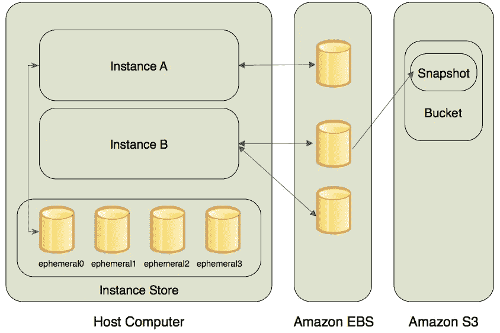

[图片来自 AWS EC2 开发者文档。](https://docs.aws.amazon.com/AWSEC2/latest/WindowsGuide/EC2Win_Infrastructure.html#Win_AppDesign)(开源)

> **AWS EC2 实例商店**

AWS EC2 实例存储是临时的块级存储。它位于主机的磁盘上。因为它是临时存储，所以当关联的实例停止或终止时，数据不会持续。因此，EC2 实例存储并不意味着长期数据存储。在这种情况下，你必须选择 EBS 或 S3。

AWS EC2 实例存储不可移植。这意味着您不能从一个实例分离并将其附加到另一个实例。

> **AWS EBS**

AWS 弹性块存储(AWS EBS)是推荐的存储选项。它是持久存储。

一个实例可以有多个 EBS 卷。

> **AWS S3**

AWS 简单存储服务(AWS S3)本质上是一个存储桶。你可以在网上的任何地方存储和检索任何数量的数据。

人们可以从 EBS 复制数据，称为快照，并将其保存在 S3。这可以在以后用于创建一个新的 EBS 卷，该卷可以连接到另一个 EC2 实例。因此，您可以从实例中分离卷，并将其附加到不同的实例。

## 根设备卷

根设备卷包含用于引导 EC2 实例的映像。当实例终止时，这个卷被删除(`DeleteOnTermination`属性是`true`)。然而，这种行为也是可以改变的。

## 网络和安全性

默认情况下，EC2 实例在启动到默认 VPC 时具有 IPv4 地址。在非默认 VPC 的情况下，应该在启动时专门分配 IPv4 地址。
当一个实例出现故障时，被替换的实例具有与原始实例不同的 IPv4 地址。如果你的应用需要一个静态 IPv4 地址，Amazon EC2 提供了*弹性 IP 地址*。

安全组可用于控制对实例的访问。可以将单个实例分配给具有特定规则的多个组。

## AWS 身份和访问管理(AWS IAM)

IAM 允许您向 AWS 帐户添加用户和组，并为每个用户分配特定的安全凭据。资源可以在同一个帐户和另一个 AWS 帐户中的用户之间共享。用户可以控制每个用户使用 AWS 资源执行任务的权限。

通过在 Amazon EC2 中使用 IAM，您可以完全控制使用 Amazon EC2 和特定 AWS 资源执行任务的用户。

# 设置您的 AWS EC2

我希望你已经在 AWS 上注册了一个帐户。如果不是这样做。现在前往 AWS 管理控制台。

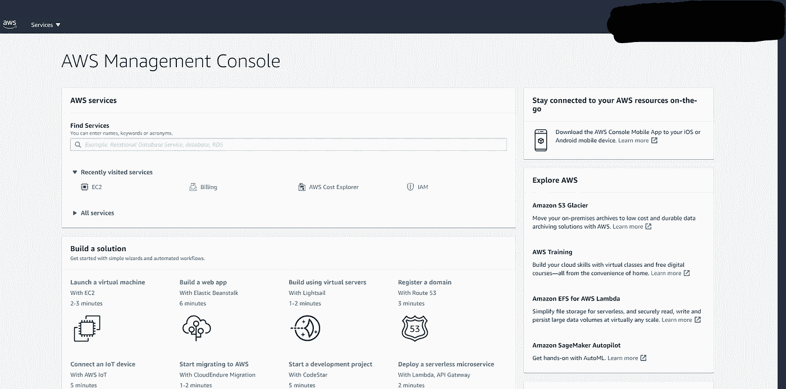

AWS 管理控制台主页。图片由作者提供。

登录 AWS 控制台后，从标有**服务**的下拉菜单中选择 EC2。

在使用任何 AWS 服务之前，我们需要检查并在必要时修改我们计划使用的特定资源的 AWS 服务限制。所以让我们来研究一下。

## GPU 限制增加请求

AWS 资源有一个默认配额，称为“*限制”*。这些限制取决于您的 AWS 帐户所在的地区。现在，我将只专门讨论 EC2 实例。

**提高 GPU 极限的步骤:**

1.我们首先需要选择适当的 AWS 区域，它支持我们选择使用的 GPU 实例。我们将使用 **p2.xlarge.** P2 是功能强大且可扩展的并行处理 GPU 实例。

2 .确保您的 AWS 区域支持该特定实例。[你可以在这里交叉核对](https://docs.aws.amazon.com/AWSEC2/latest/UserGuide/using-regions-availability-zones.html)。

3.现在您的地区已经设置好了，我们需要在[此链接](https://console.aws.amazon.com/ec2/v2/home?#Limits)查看您的 **EC2 服务限制报告**，并找到您在 **P2** 的“当前限制”。(或者转到 EC2 仪表板，点击限值，查看 P2 限值)**。**

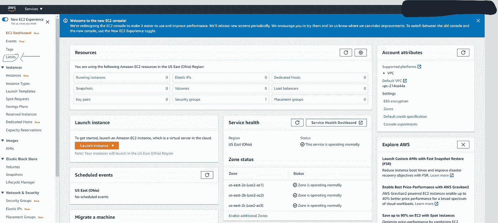

AWS EC2 仪表板。点击限制。图片由作者提供。

4.**你的上限将是 0。**这意味着什么？AWS 将用户可以运行的 p2.xlarge 实例的数量限制为 0，这实际上阻止了您启动该实例。

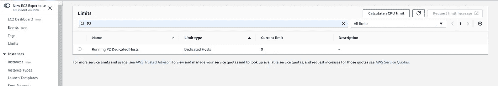

P2 资源限制 0。图片由作者提供。

5.如果 p2.xlarge 实例的限制为 0，则需要增加限制才能启动实例。

6.点击**计算 vCPU 限值**以提出限值增加请求。极限计算器用于计算您需要多少 vCPUs(虚拟中央处理器)来启动您的按需实例，在我们的例子中是 P2。

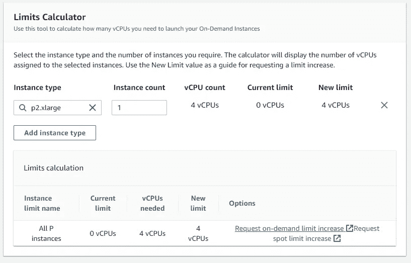

增加限制。图片由作者提供。

7.点击添加实例类型，选择 **p2.xlarge.** 确保 ***实例计数为 1*** 。验证**新限值**显示的是 **4 个 vcpu**，然后点击**请求增加限值。** *除非你启动一个实例，否则请求增加限额不会从你的卡上扣款。*这将打开以下屏幕。如果尚未选择，点击**服务限制增加**。

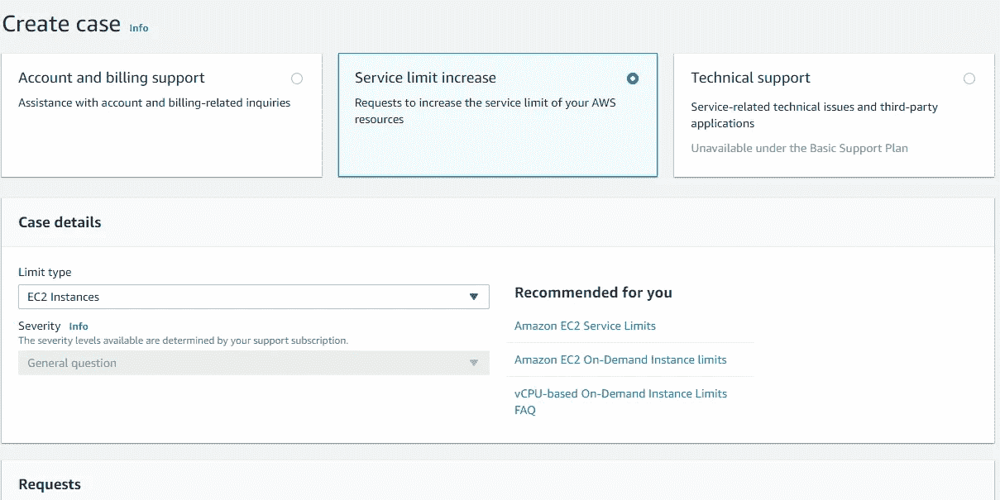

服务限制增加。图片由作者提供。

8.案例详细信息中的限制类型将是 EC2 实例。现在，在**请求下，**选择 AWS 账户的**区域，**然后选择**主实例类型**为 ***所有 P 实例。将*新的限值***设置为* ***大于 4。***

9.向下滚动填写**案例描述**您的限额增加案例，并点击**提交。您将收到一封带有相应案例 ID 的邮件。**您必须等待 AWS 批准您的限额增加请求。AWS 通常会在 48 小时内批准这些请求。

> ***注意:*** *如果您从未在 AWS 上启动过任何类型的实例，您可能会收到一封来自 AWS 支持部门的电子邮件，要求您在他们批准增加限额之前，通过创建实例来初始化您的帐户。*

# 启动我们的 EC2 GPU 实例

一旦 AWS 批准了您的 GPU 限制增加请求，您就可以开始启动实例的过程。

**启动 EC2 GPU 实例的步骤:**

1.  单击启动实例
2.  选择一个亚马逊机器映像(AMI)。我们将使用**深度学习 AMI。**
3.  选择实例类型。如前所述，我们将使用 **p2.xlarge.**
4.  新闻评论和发布。它会将您带到一个页面，您可以在其中进一步更新配置详细信息、存储卷等。现在，让我们只编辑安全组。
5.  配置安全组—将一组防火墙规则附加到您的实例，以控制传入实例的流量。只需点击 e **dit 安全组**选项并选择**创建一个新的安全组。**让我们将这个安全组命名为“ *Jupyter”。*按下**键添加规则。将**端口范围 *8888*** 和**源**的自定义 TCP 规则**设置为 ***anywhere* 。**
6.  点击**发射**。
7.  现在让我们**创建一个认证密钥对。**这样做是为了访问您的 GPU 实例。点击 c **创建新的密钥对**并点击**下载密钥对**按钮。这样会下载一个**。pem 文件**，您需要它来访问您的实例。
8.  移动下载的。pem 文件保存到您计算机上的安全位置，因为您需要该文件来通过您选择的位置访问您的实例。下载完。pem 文件，点击 l **启动实例。**
9.  单击**查看实例**按钮，转到 EC2 管理控制台，查看实例引导。

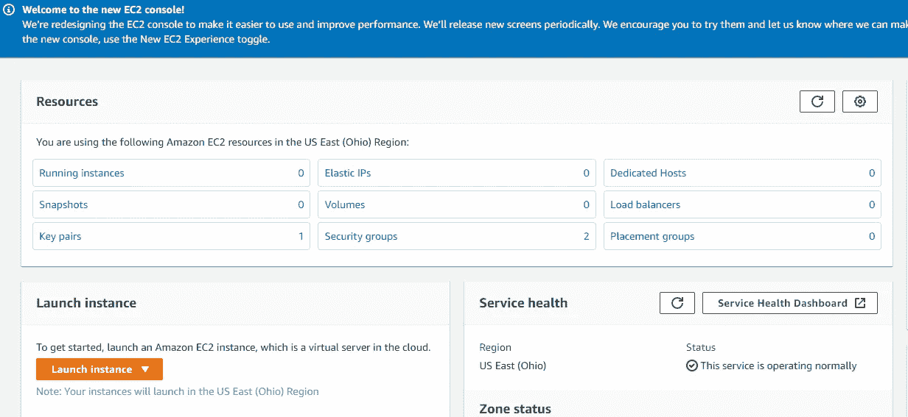

启动实例(橙色按钮)。图片由作者提供。

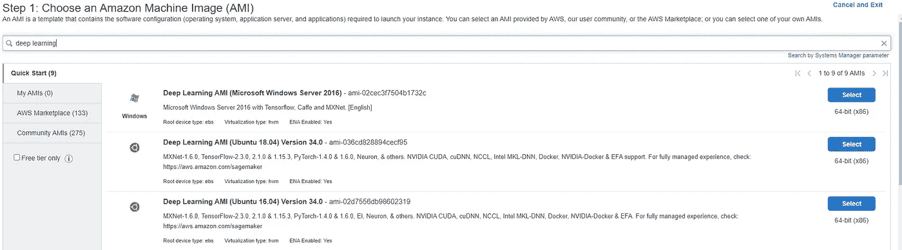

选择 AMI。深度学习 AMI。图片由作者提供。

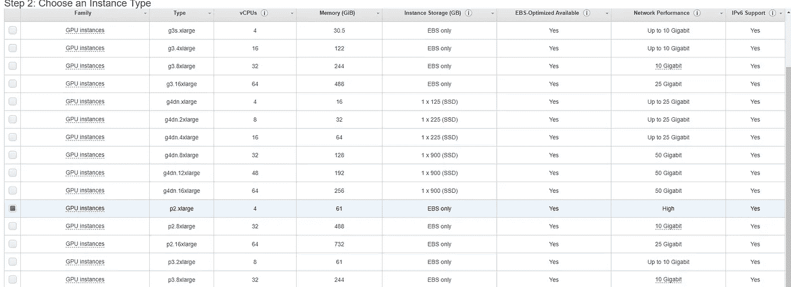

选择 GPU。p2.xlarge .作者图片。

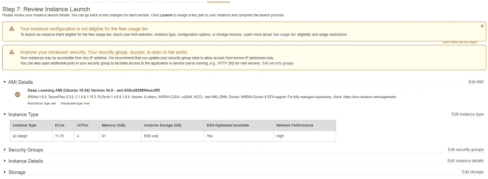

编辑安全组。图片由作者提供。

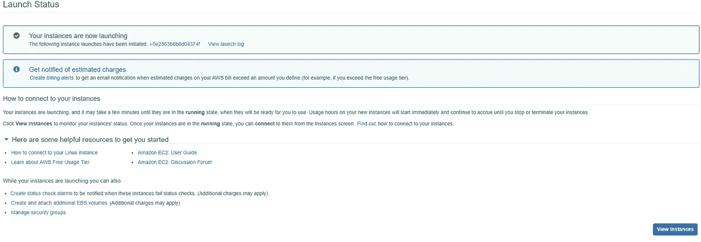

实例已启动。图片由作者提供。

> **注意:**
> 关闭任何未使用的实例或其他 AWS 资源，否则将按小时收费。AWS 对正在运行的实例收费，直到您停止实例。但是，在您“终止”(即删除)该实例之前，还会继续产生较小的存储费用。

## AWS 计费警报

没有办法将 AWS 限制在特定的预算范围内，并在达到该阈值时自动关闭。但是，您可以设置 [AWS 计费警报](http://docs.aws.amazon.com/awsaccountbilling/latest/aboutv2/free-tier-alarms.html)。

# 登录您的 AWS EC2 实例

1.  转到 EC2 仪表板，点击**运行实例的**选项。将显示您的实例。
2.  记下 IPv4 地址。
3.  从终端导航到您存储的位置。pem 文件。(例如，如果你把你的。pem 文件时，`cd ~/Desktop/`会将您移动到正确的目录。)
4.  键入`ssh -i YourKeyName.pem ubuntu@X.X.X.X`，其中:`X.X.X.X`是在 AWS 中找到的 IPv4 公共 IP，`YourKeyName.pem`是您的名称。pem 文件。
5.  在您的实例中，为了创建 Jupyter 笔记本设置的配置文件，请键入:`jupyter notebook --generate-config`。
6.  打开任何 GitHub repo 或克隆到实例终端。
7.  启动 Jupyter 笔记本`jupyter notebook --ip=0.0.0.0`
8.  现在，您的终端将以这种方式显示令牌 ID:

```
unnecessary_stuff:8888/?token=something_useful_here
```

9.通过访问`X.X.X.X:8888/?token=...`，从您的 web 浏览器访问 Jupyter 笔记本索引(其中 X.X.X.X 是您 EC2 实例的 IP 地址，以`:8888/?token=`开头的内容是您刚刚复制的内容)。万岁。给你。您的 Jupyter 笔记本已经在 EC2 实例上启动并运行。恭喜你。

10.要关闭笔记本，请按 ctrl-c 两次，要退出实例终端，请键入 exit。

# 外卖食品

您可以通过键入**conda config-set auto _ activate _ base true**在启动时激活 conda

有时您的实例可能没有所需的包，只需 **pip 安装**相同的包。

如果你有一个 requirements.txt 文件，只需输入`sudo python3 -m pip install -r requirements.tx`

不使用时停止并终止实例。您需要理解，即使实例没有被使用，AWS 也会向您收费。因此，正在运行和空闲的实例也会烧光你的口袋。这是 AWS 的一个缺点。另一方面，如果实例空闲，Google Cloud 不会向您收费。

# 结论

恭喜你。现在你知道什么是亚马逊 EC2，以及如何使用它。AWS 是最常用的云服务，因此熟悉 1 或 2 项技术是有用的。亚马逊 EC2 有更多的功能。打开 EC2 仪表板，了解更多信息。我希望您了解如何部署 GPU 实例。下一场见。干杯！

## 谢谢你。