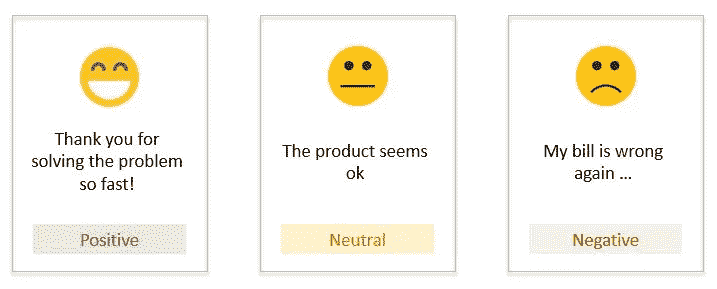
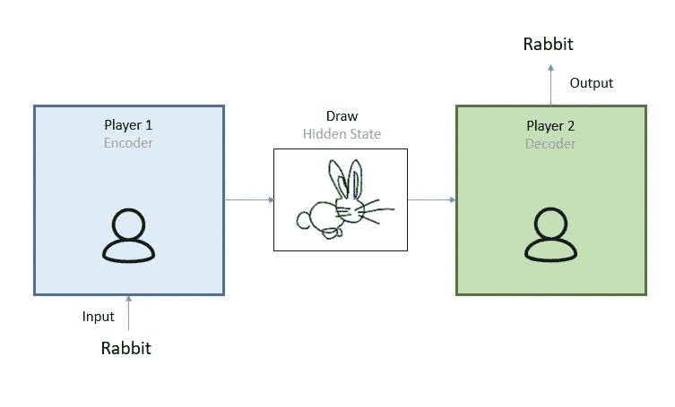
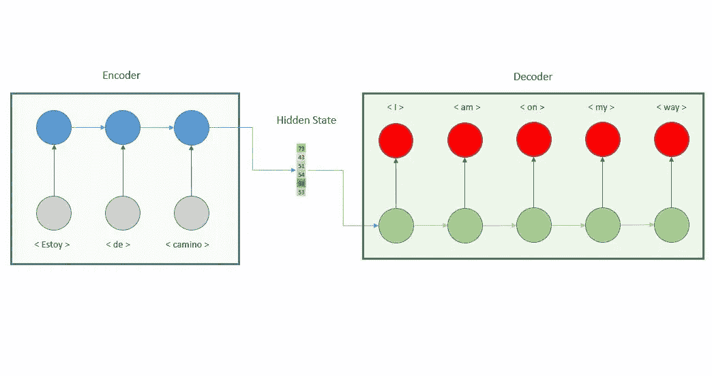
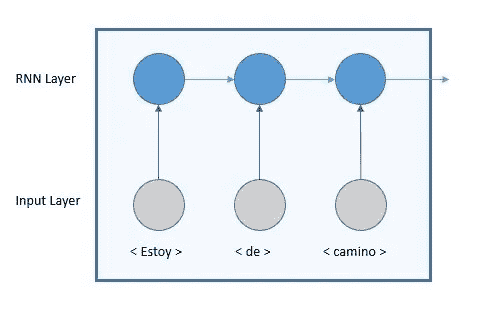
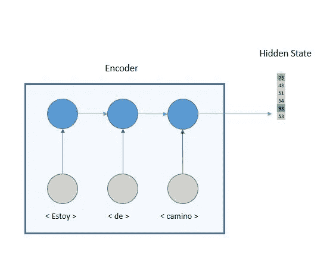
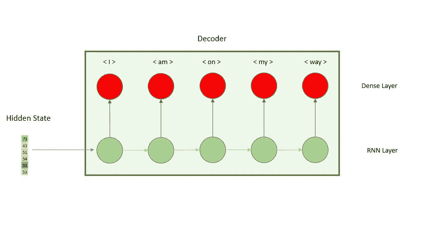

# 什么是编码器解码器模型？

> 原文：<https://towardsdatascience.com/what-is-an-encoder-decoder-model-86b3d57c5e1a?source=collection_archive---------3----------------------->

## 编码器解码器是深度学习中广泛使用的结构，通过本文，我们将了解其架构

迈克尔·泽兹奇在 [Unsplash](https://unsplash.com/s/photos/crystal-pyramid?utm_source=unsplash&utm_medium=referral&utm_content=creditCopyText) 上的照片

在本文中，我们将介绍一些情况下称为序列对序列(Seq2Seq)模型的编码器和解码器结构。为了更好地理解这个模型的结构，先前关于 RNN 的[知识是有帮助的。](https://medium.com/swlh/introduction-to-recurrent-neural-networks-rnn-c2374305a630)

# 我们什么时候使用编码器解码器模型？

## 1-图像字幕

编码器解码器模型允许机器学习模型生成描述图像的句子的过程。它接收图像作为输入，并输出一系列单词。这也适用于视频。

ML 输出:“棕榈树环绕的通往海滩的道路”，照片由 [Milo Miloezger](https://unsplash.com/@miloezger?utm_source=unsplash&utm_medium=referral&utm_content=creditCopyText) 在 [Unsplash](https://unsplash.com/s/photos/road-to-beach-palm?utm_source=unsplash&utm_medium=referral&utm_content=creditCopyText) 上拍摄

## 2-情感分析

这些模型理解输入句子的含义和情感，并输出情感得分。它的等级通常在-1(负)和 1(正)之间，其中 0 表示中性。它在呼叫中心用于分析客户情绪的演变以及他们对某些关键词或公司折扣的反应。

作者图片

## 3-翻译

这个模型阅读输入的句子，理解其中的信息和概念，然后把它翻译成第二种语言。谷歌翻译是建立在一个编码器解码器结构上的，更多细节请参见本文[。](https://arxiv.org/abs/1609.08144)

作者图片

# 什么是编码器解码器模型？

理解编码器-解码器模型概念的最佳方式是玩猜图游戏。游戏的规则非常简单，玩家 1 从列表中随机选择一个单词，并需要在一张图中勾画出其含义。团队中第二个玩家的角色是分析图画，并识别图画所描述的单词。在这个例子中，我们有三个重要的元素玩家 1(将单词转换成图画的人)、图画(兔子)和猜测图画代表的单词的人(玩家 2)。这就是我们理解一个编码器解码器模型所需要的，下面我们将建立一个比较的猜字游戏和一个将西班牙语翻译成英语的编码器解码器模型。

猜谜游戏，作者图片

如果我们将上面的图表转化为机器学习概念，我们会看到下面的图表。在接下来的章节中，我们将详细介绍每个组件。

编码器解码器模型，图片由作者提供

## 1-编码器(画师)

编码意味着将数据转换成所需的格式。在图片示例中，我们将单词(文本)转换为图片(图像)。在机器学习的背景下，我们将西班牙语中的单词序列转换成一个二维向量，这个二维向量也被称为隐藏状态。编码器由[递归神经网络(RNN)](https://medium.com/swlh/introduction-to-recurrent-neural-networks-rnn-c2374305a630) 堆叠而成。我们使用这种类型的层，因为它的结构允许模型理解序列的上下文和时间依赖性。编码器的输出，即隐藏状态，是最后一个 RNN 时间步长的状态。

编码器，图片作者

## 2-隐藏状态(草图)

编码器的输出，一个封装了输入序列全部含义的二维向量。向量的长度取决于 RNN 中细胞的数量。

编码器和隐藏状态，图片由作者提供

## 三解码器

解码意味着将编码信息转换成可理解的语言。小组中第二个玩猜字游戏的人将把图画转换成单词。在机器学习模型中，解码器的作用将是将二维向量转换成输出序列，即英语句子。它也建立了 RNN 层和一个密集层，以预测英语单词。

解码器，图片由作者提供

## 结论

这种模型的主要优点之一是输入和输出序列的长度可能不同。这为非常有趣的应用打开了大门，如视频字幕或问答。

这种简单的编码器/解码器模型的主要限制在于，对于很难实现的长输入序列，所有信息都需要在一维向量中进行总结。话虽如此，理解编码器解码器模型是 NLP 最新进展的关键，因为它是注意力模型和变压器的种子。[在下一篇文章](/how-to-build-an-encoder-decoder-translation-model-using-lstm-with-python-and-keras-a31e9d864b9b)中，我们将遵循使用编码器/解码器结构构建翻译模型的过程。然后，我们将继续探索[注意力机制](/what-is-attention-mechanism-can-i-have-your-attention-please-3333637f2eac)，以实现更高的准确性。

 [## 如何建立一个编码器解码器翻译模型使用 LSTM 与 Python 和 Keras。

### 按照这一步一步的指南来建立一个编码器和解码器模型，并创建自己的翻译模型。

towardsdatascience.com](/how-to-build-an-encoder-decoder-translation-model-using-lstm-with-python-and-keras-a31e9d864b9b)