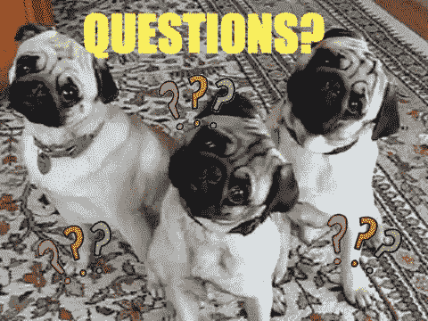

# 什么是离群值？

> 原文：<https://towardsdatascience.com/what-is-an-outlier-26888fd9870d?source=collection_archive---------46----------------------->

# 你就是！

其实不是。这不是一篇关于你的文章。

但是，正如格拉德威尔在《离群者》一书中所说的，如果你发现自己是那种离群者，你相当幸运。而且罕见。

# 什么是真正的离群值？

照片由来自 [Pexels](https://www.pexels.com/photo/eggs-in-tray-on-white-surface-1556707/?utm_content=attributionCopyText&utm_medium=referral&utm_source=pexels) 的 [Daniel Reche](https://www.pexels.com/@daniel-reche-718241?utm_content=attributionCopyText&utm_medium=referral&utm_source=pexels) 拍摄

根据 Meriam-Webster 的说法，异常值是:

> “在数值上与样本中的其他值明显不同的统计观察”

但你不是为此而来的，对吧？

让我们简单地解释一下什么时候一个数据点被认为是异常值，为什么会这样，以及你能做些什么。

# 什么时候？

有多种方法可以识别和突出异常值，但我们的目标是保持简洁，所以让我们讨论最简单的方法。你可以在这里找到其他方法[。](https://www.analyticsvidhya.com/blog/2016/01/guide-data-exploration/#three)

如果任何观测值超出第一个四分位数-1.5 倍 IQR 到第三个四分位数+ 1.5 倍 IQR 的范围，则被视为异常值。

资料来源:giphy.com

呆在这里！

我保证会很容易，所以会的。我们只需要确定这个 IQR(四分位数间距)意味着什么。

让我们假设你要见你的高中同事，9 个人。都是开车来的。为了便于解释，让我们想象一下，我们按照**升序**收集所有汽车的马力数据。

收集了 105 | 133 | 146 | 183 | 190 | 195 | 210 | 220 | 510←个值

如果你懂一点统计学，我们有所谓的四分位数。如果您不记得，请查看此处的[然后再回来。](https://en.wikipedia.org/wiki/Quartile)

**IQR** =第三个四分位数-第一个四分位数= 215–139.5 = 75.5

现在，回到我们例子中的异常值，我们需要计算 Q1-1.5 倍 IQR 和 Q3+1.5 倍 IQR。

*   Q1-1.5 x IQR = 139.5–75.5 = 64*(Q1——第一个四分位数)*
*   Q3+1.5 x IQR = 215+75.5 = 290.5*(Q3—第三个四分位数)*

我们很亲密。**留在这里**！

如开始计算前所述，任何超出区间[64；290.5]被认为是异常值。与收集的数据相比的极值。问题是，在我们的数据中是否有超出区间的值？没错， **510** 就是。(让我们假设那是你，你有一辆新的宝马 M5)。

这是从一组简单收集的数据中计算异常值的非常简单的方法。

# 为什么？

异常值可能出现在一组数据中有多种原因。有好有坏。

**数据输入错误** →您想要键入 210 而不是 510，因此该值成为异常值；

**测量错误** →你已经在一家以夸大数据闻名的服务中心测量了你的汽车的功率。510 不是真的。

**实验误差→** 你的一个同事，有 105 的那个告诉你数值是 kw 而不是马力，误会是实验误差；

**故意的** →你在考验你的同事，告诉他们一个不真实的值；

**自然→** 这就是我们的处境，你真的是一个骗子，你的 M5 力量不是实验测量 BS，你真的是一个异数。

# 什么？

现在你知道它们是什么，你如何找到它们，以及什么可能导致它们，怎样做才能利用或消除它们？

1.  如果你想吹嘘你班上的 hp 平均值有多高，**保持数值**。考虑平均值不具有代表性，因为它受到异常值的影响。你。
2.  如果你认为你的车与众不同，你是其他车的例外，**去掉你的价值。**
3.  如果你觉得有其他开着豪车的高中同事却没有出现，那就再开一次会，把你的小组当成一个不同的小组。

就这样。

资料来源:giphy.com

和往常一样，这是一种过于简单和幽默的方法来解释相当复杂的统计概念。

*如果你喜欢我的作品，可以考虑看看我的其他帖子，我尽量每周发布:*

 [## 标准偏差与标准误差

### [警告这太容易了] -包含简短的示例 R 代码

towardsdatascience.com](/standard-deviation-vs-standard-error-5210e3bc9c04)  [## 我们为什么用 0.05？

### 还是不是？

towardsdatascience.com](/why-do-we-use-0-05-8cd43a39edfa)