# 什么是注意机制？

> 原文：<https://towardsdatascience.com/what-is-attention-mechanism-can-i-have-your-attention-please-3333637f2eac?source=collection_archive---------6----------------------->

## *解决 Seq2Seq 问题技术的演变，从 RNN 到自我关注*

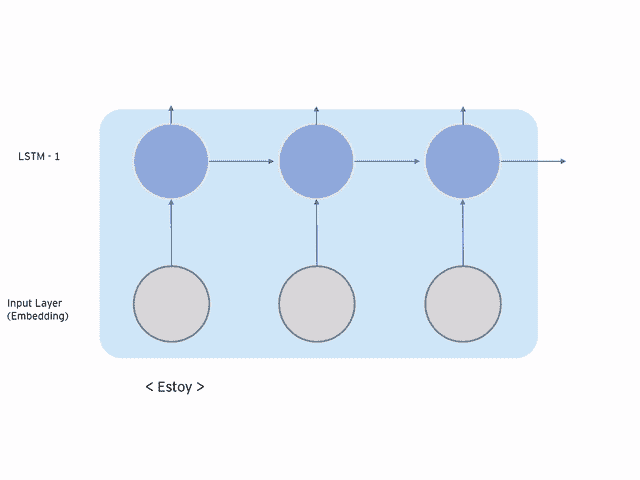

作者图片

在整篇文章中，我们将首先了解我们所使用的技术的局限性，然后介绍新的机制来克服他们所面临的问题。我们将了解以下几个部分:

*   **编码器解码器，瓶颈问题**
*   **注意机制**
*   **自我关注**

# **1 —编码器解码器，瓶颈问题**

编码器解码器架构[由 RNN](https://medium.com/swlh/introduction-to-recurrent-neural-networks-rnn-c2374305a630) 构建，广泛用于神经机器翻译(NMT)和序列到序列(Seq2Seq)预测。它的主要好处是我们可以**分离编码器和解码器，所以它们有不同的长度。**

例如，具有不同序列长度的模型是接收单词序列并输出数字的情感分析，或者输入是图像而输出是单词序列的图像字幕模型。这种架构非常强大，甚至谷歌都将其作为谷歌翻译的核心技术。

在下图中，我们可以看到一个翻译示例的模型:

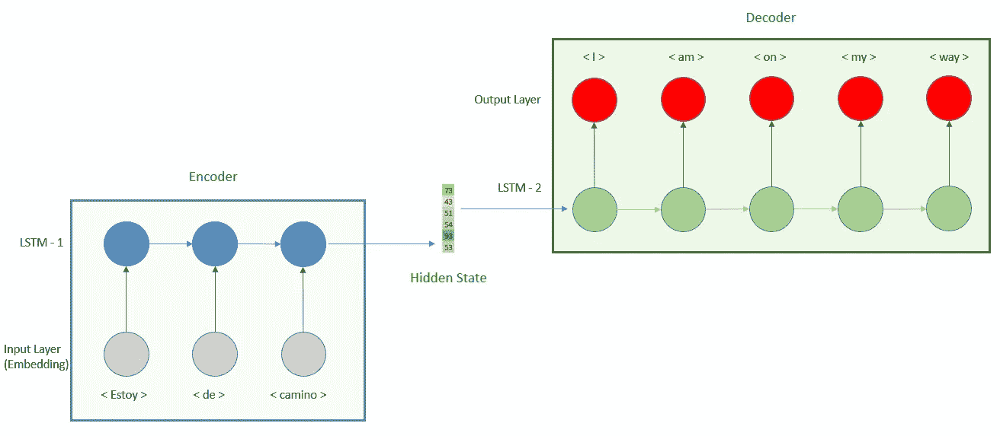

作者图片

我们用一个输入层和一个递归神经网络(RNN)更准确地说是一个长短期记忆(LSTM)构建了**编码器**(蓝色矩形)。编码器接收西班牙语句子，并且**输出单个向量**,该向量是最后一个 LSTM 时间步长的隐藏状态，整个句子的含义在该向量中被捕获。然后**解码器**接收这个隐藏状态作为输入，并返回一个单词序列，即英语翻译。

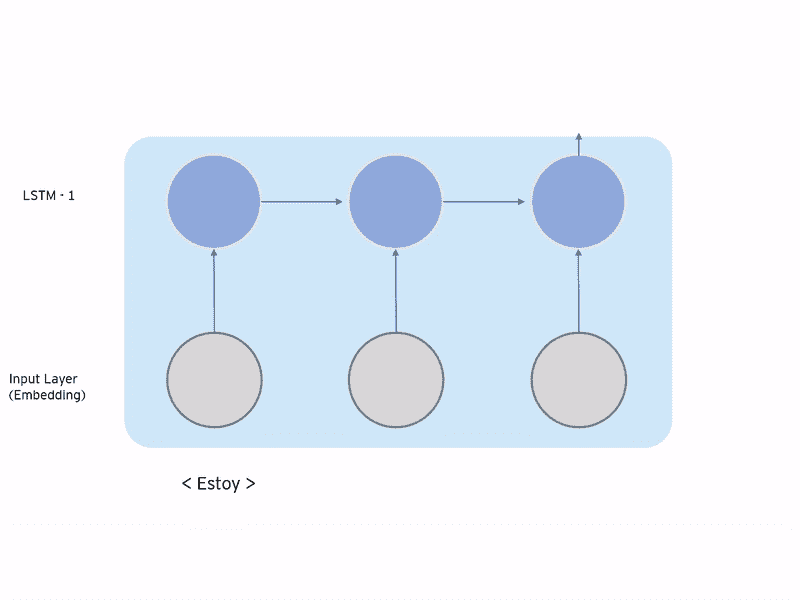

图片由作者提供:编码过程中，输出的是隐藏状态的最后一个时间步。

这种架构已经展示了它在 Seq2Seq 问题上的巨大能力，然而它也有一个重要的限制。正如我们已经说过的，所有输入句子的含义都是在一个向量中捕获的，所以**随着句子长度的增加，模型捕获这个向量中的信息就越困难。**因此，它的性能随着长句而下降，因为它倾向于忘记部分长句，**隐藏向量成为瓶颈。**

**注意机制**建立在我们刚刚分析过的编码器解码器结构之上。存在两个主要的差异，我们将在下面的章节中进行分析

# 2—隐藏状态的 St**ack**

在前面的结构中，我们只是传递了上一个时间步的隐藏状态。有了这个新的结构**,我们保持了每个时间步的所有隐藏状态。**

正如我们在下图中看到的，以前编码器的输出是一个向量，**我们现在有一个由每个隐藏状态**组成的矩阵。这解决了只有一个向量没有足够信息的问题，但它也增加了完全相反的问题，太多的信息。对于解码器想要翻译的每个单词，它不需要完整的矩阵，因为不是所有的单词都提供相关信息，所以解码器如何知道应该关注矩阵的哪一部分或对给予更多**关注？**

作者图片

当人类描述一幅图像时，我们并不把它作为一个整体来分析，而是检查图像的相关部分，并关注我们所描述的内容。一个机器学习模型是如何关注的？

完全一样的方式。注意机制的一个很好的例子可以在论文“ [*显示、出席和讲述*](https://arxiv.org/abs/1502.03044) ”中找到。这里我们有一个图像作为输入，目标是生成一个描述它的句子。在下图中，我们有一个热图，显示了模型在生成单词时更关注的地方，白色区域越多，关注越多，黑色区域越少。

当它描述鸟时，注意力集中在动物身上(白色部分)，而当它描述水时，注意力从动物转移到它的周围。

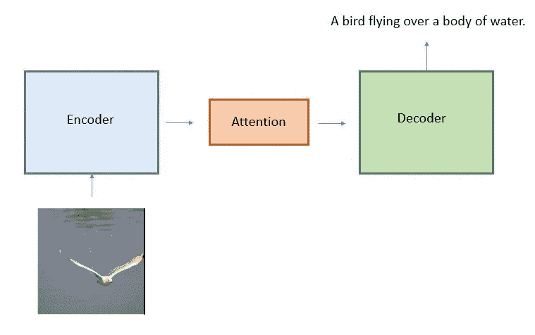

作者图片:模型架构

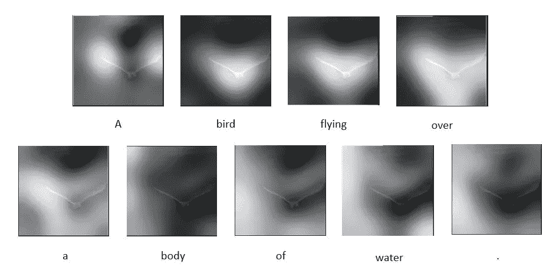

图 1:显示模型关注的地方。图片来自[“展示、参与和讲述”](https://arxiv.org/abs/1502.03044)

另一个例子可以在 Bzmitry Bahdanau 等人于 2015 年发表的论文[‘通过联合学习对齐和翻译进行神经机器翻译’](https://arxiv.org/abs/1409.0473)中找到。让我们分析下面的热图，它显示了模型在翻译句子时更关注的地方:

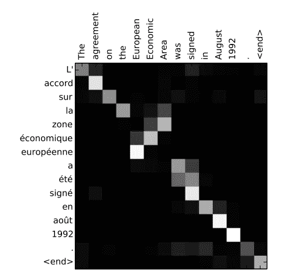

图 2:图片来自[“通过联合学习对齐和翻译的神经机器翻译”](https://arxiv.org/abs/1409.0473)

x 轴对应于英语的源句子，y 轴对应于生成的法语翻译。每个像素显示了模型转移注意力的地方，区域越白，注意力越集中，区域越暗，注意力越少(就像前面的例子)。

例如，为了生成单词“accord ”,它主要关注“agreement”。当模型将“欧洲经济区”转换为“欧洲经济区”时，我们可以看到关注机制的力量。在英语中，形容词用在名词之前，而在法语中，形容词在名词之后，所以在这种情况下，模型将注意力转移到后面出现的单词。

关键问题是，**模型如何知道关注哪里**？它计算出一个被称为**对齐分数**的分数，该分数量化了我们应该给予每个输入多少关注。**存在多种比对分数**，最流行的是加法(也称为 concat， [Bahdanau et al 2015](https://arxiv.org/abs/1409.0473) )、位置基、一般和点积( [Luong 2015](https://arxiv.org/abs/1508.04025) )。这种区别导致了更广泛的类别，如全局/软和局部/硬注意。

我们转移注意力的方式对我们的解释有影响，因此对结果也有影响，我们选择的比对分数函数也有类似的影响。

这种注意机制**在模型**中只能应用一次，它是**连接编码器和解码器**的部件，并允许比较输入和输出句子，如前一幅图像所示。它从编码器**接收隐藏状态矩阵**并根据需要注意的对齐分数进行计算，简化表示如下:

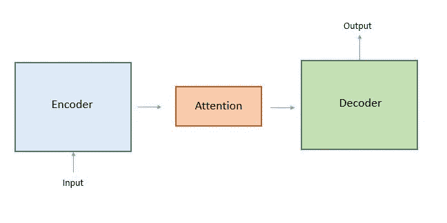

作者图片:模型架构

# **3 —自我关注**

2017 年，在谷歌团队的论文'[关注是你所需要的'](https://arxiv.org/abs/1706.03762)中，他们介绍了一种称为变压器的新型架构，这也是变压器 [(BERT)](https://arxiv.org/abs/1810.04805) 双向编码器表示的种子。

在这篇论文中，他们提出了**我们已经分析过的先前架构**的两个主要变化。首先，他们把 RNN 从照片中去掉。第二，他们增加了自我关注机制。在下一节中，我们将分析这两个决定及其含义。

## **谢谢你载了 RNN**

如果 RNN 在 NLP 任务中表现得如此出色，我们为什么要取消它呢？ **RNN 按顺序工作，**这意味着为了计算句子的第二个单词(第二时间步)，我们需要计算第一个隐藏向量(第一时间步)。然后为了计算隐藏状态，时间 t，你必须一直等待 t-1 的结果，**，所以我们不能并行化**。此外，RNN 意味着大量的计算需要大量的资源。

图片由作者提供，要处理单词“camino”我们必须首先计算“Estoy”和“de”

此外，注意力 RNN 已经改善了对较长句子的时间依赖的提取，但仍然与长序列作斗争，所以我们还没有完全解决这个问题。

**如果我们没有 RNN，模型结构是什么？**为了更好地理解这款新车型，我们来看看下图:

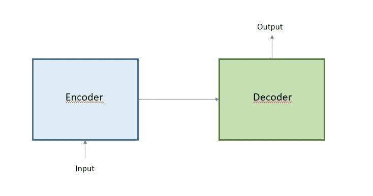

作者图片

正如我们可以看到的**我们保留了编码器解码器**、**的结构，但是我们不再有相互连接的注意力机制**。那么注意力机制是从哪里计算出来的呢？如果我们没有 RNN，编码器和解码器里面是什么？

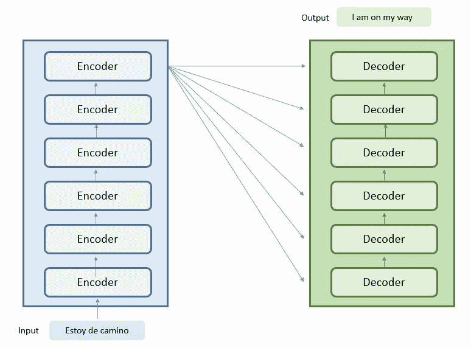

作者图片

编码组件是一堆编码器，这些编码器共享相同的内部结构。本文提出的模型由 6 个编码器构成，解码器也是如此。

让我们来探索这些组件:

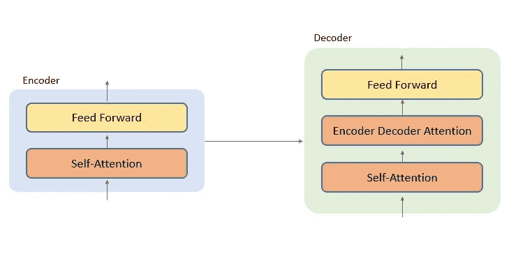

作者图片

让我们首先关注编码器，它由两层组成**自关注机制(我们将在后面探讨)和前馈网络**。每个编码器都有这两层，所以如果我们之前说我们堆叠了 6 个编码器，那么我们在编码阶段就有 6 个自关注机制。**这意味着我们并不局限于应用一次注意机制，而是可以应用我们所拥有的层数。**

解码器共享相同的层，并增加了一层称为**编码器-解码器注意**的层，我们可以将这一层视为第二节中使用的注意机制(attention mechanism)来连接编码器和解码器。

*这篇文章的目的是关注注意力机制，如果你想更好地了解变形金刚，我推荐下面这篇文章* [*。*](http://jalammar.github.io/illustrated-transformer/)

由于新的结构，模型可以并行化，所需的计算对资源的要求更低，从而大大提高了训练性能，这是深度学习中的关键任务。此外，无论句子有多长，它都可以从整个句子中提取时间依存关系。那么，这种新的突破技术是如何工作的呢？

## **自我关注**

虽然之前我们使用注意机制来连接编码器和解码器，但是这里我们使用注意机制来**计算同一个句子**的单词之间的依赖关系，输入的句子**的单词相互作用(自身)**。在下图中，我们可以看到一个翻译结果的示例，更准确地说，我们关注的是 5 号编码器:

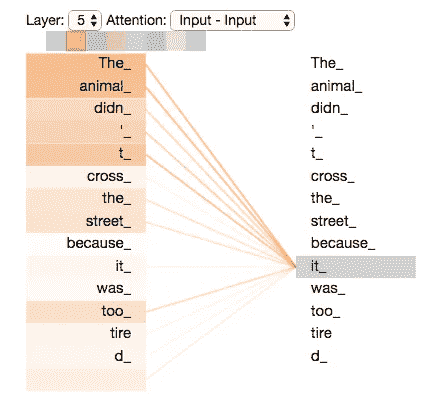

图片来自以下[链接](https://colab.research.google.com/github/tensorflow/tensor2tensor/blob/master/tensor2tensor/notebooks/hello_t2t.ipynb)

在这张图片中，我们看到同一个句子出现了两次。当模型翻译单词“it”时，它需要注意相关的单词并提取其含义，这个单词是指动物还是街道？在本例中，我们选择单词“it”(右栏)，它会突出显示更关注的单词(左栏)，在本例中是“the”和“animal”。颜色越深，模特就越关注这个特定的单词。

虽然之前我们计算了输入和输出句子之间的注意机制(图 1，图 2 ),但这里我们计算的是句子和句子本身之间的注意。

## **多头关注**

论文不断对模型进行微调，并增加了多头关注。

图片来自下面的[链接](https://colab.research.google.com/github/tensorflow/tensor2tensor/blob/master/tensor2tensor/notebooks/hello_t2t.ipynb)

从这个例子中我们知道单词“它”指的是动物，但是这个动物会发生什么呢？只有一个子空间，我们无法提取这么多的意义，这就是多头注意力的来源:

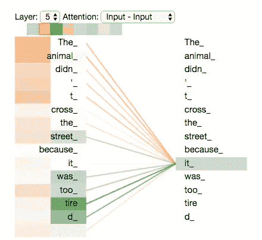

图片来自下面的[链接](https://colab.research.google.com/github/tensorflow/tensor2tensor/blob/master/tensor2tensor/notebooks/hello_t2t.ipynb)

在这张图片中，我们现在有两个头或子空间(橙色和绿色)，颜色越强，它越受关注。从第一个子空间我们知道“它”指的是动物，从第二个子空间我们知道动物“累了”。**多头是在自我注意机制中增加维度或子空间的概念，以获取更多的意义**，在本文中他们使用了 8 个头。

# **结论**

通过这篇文章，我们分析了注意机制的演变。我们从使用 RNN 和编码器解码器结构来解决 Seq2Seq 问题开始。这些模型的问题是**瓶颈**，我们期望在一个隐藏状态中提取句子的全部意思。

为了解决这个问题，**我们保留了编码器的所有隐藏状态**但是现在信息太多，所以**我们需要注意相关部分**。这里当我们引入注意机制来连接编码器和解码器时。

最后，**变形金刚忽略了 RNN** ，它主要关注自我注意机制。在这种情况下**注意**不只是用于一次连接编码器和解码器，而是**我们可以多次使用**。而且，自我注意是用来比较一个句子和它自己，而不是输入和输出。

 [## 如何建立一个编码器解码器翻译模型使用 LSTM 与 Python 和 Keras。

### 按照这一步一步的指南来建立一个编码器和解码器模型，并创建自己的翻译模型。

towardsdatascience.com](/how-to-build-an-encoder-decoder-translation-model-using-lstm-with-python-and-keras-a31e9d864b9b)  [## 我喜欢成为数据科学家的 3 个原因

### 这一切都归结于马尔科姆·格拉德威尔在他的书《局外人》中解释的“有意义的工作”的概念。

towardsdatascience.com](/3-reasons-why-i-love-to-be-a-data-scientist-90696ac0d314)