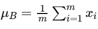
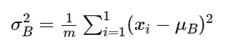
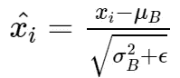
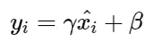

# 什么是批量正常化？

> 原文：<https://towardsdatascience.com/what-is-batch-normalization-46058b4f583?source=collection_archive---------17----------------------->

## 深度学习

## 有什么帮助？

里卡多·阿尔塞在 [Unsplash](https://unsplash.com?utm_source=medium&utm_medium=referral) 上的照片

# 批量标准化

批量规范化是由 Sergey Ioffe 和 Christian Szegedy 在 2015 年的论文[中引入的:批量规范化:通过减少内部协变量移位来加速深度网络训练](https://arxiv.org/pdf/1502.03167.pdf)。

***批量标准化缩放层输出，使平均值为 0，方差为 1。输出以这样的方式缩放，以便更快地训练网络。它还减少了由于参数初始化不佳而导致的问题。***

# 规范化背后的直觉

我们知道标准化或特征缩放可以加快学习过程。批处理规范化背后的直觉是相似的。**批量标准化对隐藏单元做同样的事情。**

为什么用批次这个词？因为它规格化了当前批次中的值。这些有时被称为**批量统计**。

> 具体来说，批量标准化通过**减去批量平均值并除以批量标准偏差**来标准化前一层的输出。

这非常类似于特征缩放，这样做是为了加速学习过程并收敛到一个解决方案。

## 内部协方差移位

在谈论批处理规范化时，您可能听过一个时髦的词，那就是**内部协方差移位**。考虑一个学习将 x 映射到 y 的函数的网络。内部协方差偏移指的是输入 x 的分布的变化。如果发生变化，我们的网络将不够有效，并且不能泛化。因此我们必须从头开始训练。

考虑这个例子来理解协方差移动。如果我们训练一个网络来检测棕色狗的图像，然后你停止将这个网络应用于彩色狗图像的数据，它将不能很好地执行，我们将不得不再次训练。输入分布的这种变化就是协方差移动。那么批处理规范化在这里有什么帮助呢？

# 批量标准化到救援

如果每一层的输入分布都相同，则网络是有效的。**批量标准化使图层输入的分布标准化，以对抗内部协方差偏移。**它控制隐藏单位的移动量。

# 如何进行批量归一化？

我们取每层的平均值，称为 **μB** 。这被称为计算为层 **x_i** 的所有值的总和除以所有 **m** 值**的平均值。**

卑鄙。图片由作者提供。

然后我们计算方差σ B 如下:
1。从每个值中减去μB，即每个值的偏差，并对偏差的平方取平方
2。对每个值的结果求和，然后除以值的数量 **m** ，得到平均值或均方差。

方差。图片由作者提供。

然后我们发现标准差是均方根偏差和ε的和。ε是小至 0.001 的恒定值。这是为了避免被零除的情况，也是为了增加方差。

**方差的增加有什么帮助？**

既然我们已经计算了平均值和标准偏差，我们可以如下进行归一化。

标准化值。图片由作者提供。

然后，归一化值乘以γ，再加上β。这些是可学习的参数，用于进一步缩放标准化值。最终批次标准化值如下:

批量标准化值。图片由作者提供。

可以在激活功能之前和之后应用批量标准化。然而，研究表明，在激活功能之前使用效果最好。

> *在 PyTorch 中，可以使用****batch norm 1d****对线性输出进行批量归一化，对于卷积层过滤后的图像，可以使用****batch norm 2d****进行 2d 输出。*

# 有什么好处？

1.  训练更快。
2.  使用更高的学习率。
3.  参数初始化更容易。
4.  通过调节输入使激活功能可行。
5.  总体效果更好。
6.  它会添加噪声，从而通过调整效果减少过拟合。因此，在应用批处理规范化时，请确保使用较少的丢失，因为丢失本身会增加噪声。

# 结论

当应用于神经网络时，批量标准化通过将输入标准化到隐藏层来产生更好的结果。有趣的是，批处理规范化是在 VGG 之后引入的，所以 VGG 可以通过批处理规范化得到改进，从而在 ImageNet 上获得更好的结果。使用更高的学习率而不消失或爆炸梯度的能力也是有希望的。注意到批处理规范化解决的问题后，我希望您现在对此有了更好的理解。

## 下一场见！谢谢你。