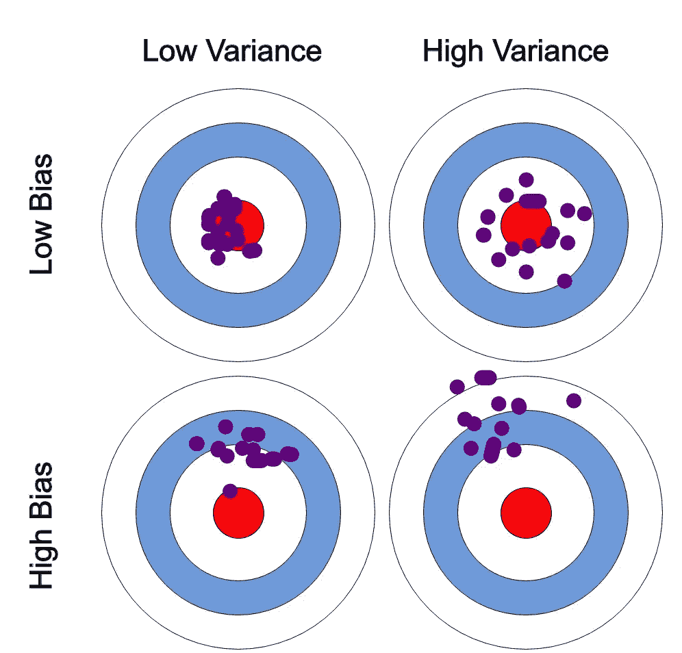

# 什么是偏差-方差权衡？

> 原文：<https://towardsdatascience.com/what-is-bias-variance-tradeoff-c8b19772e054?source=collection_archive---------50----------------------->

## 机器学习

## 避免过拟合和欠拟合的错误

阿纳斯塔塞·马拉戈斯在 [Unsplash](https://unsplash.com?utm_source=medium&utm_medium=referral) 上拍摄的照片

作为一名机器学习从业者，很重要的一点是，要很好地理解如何建立高精度的有效模型。训练模型的一个常见陷阱是过度拟合和欠拟合。

让我们来看看这些主题，这样下次你建立一个模型时，你就会确切地知道如何避免过度拟合和欠拟合的错误。

# 偏差-方差权衡

*衡量模型有效性的两个变量是偏差和方差。*

请知道我们说的是模型的有效性。如果您对模型验证有疑问，我们将在另一篇文章中讨论。

***偏差*** *是给定的点与训练集中绘制在直线上的点之间的误差或差异。*

***方差*** *是由于对训练集中微小变化的敏感性而产生的误差。*

偏差-方差。图片由作者提供。(使用 Adobe Xd 制作)

我将借助上图进一步解释偏差-方差。所以请跟我来。简而言之，我们说，误差被计算为预测值和观察值/实际值之间的差。现在，假设我们有一个非常精确的模型。这意味着误差非常小，表明**低偏差和低方差。**(如图左上圆圈所示)。

**如果方差增加**，则数据分布更广，导致精确度降低。(如图中右上方的圆圈所示)。

**如果偏差增加**，计算的误差增加。(如图中左下方圆圈所示)。

**高方差和高偏差**表示数据以高误差展开。(如图右下方圆圈所示)

这就是**偏差-方差权衡**。早些时候，我将**偏差**定义为模型捕获的数据和可用数据显示的数据之间的误差，将**方差**定义为对可用数据微小变化的敏感度误差。具有**高方差**的模型捕获数据中的随机噪声。

我们希望找到具有**低偏差和低方差的最佳拟合线。**(如图左上圆圈所示)。

**参数如何影响我们的模型？**

随着参数数量的增加，模型的复杂性不断增加。这可能导致**过度拟合，**基本上**增加方差和减少偏差。**

我们的目标是在我们的模型中提出一个点，在这个点上偏差的减少等于方差的增加。那么我们如何做到这一点呢？让我们看看模型拟合。

# 模型拟合

我们可以找到一条线来表示这些点的大致方向，但可能无法表示数据集中的每个点。这将是**最适合的模型。**

## 为什么不总是使用高阶多项式？

好问题。遗憾的是，答案是否定的。通过这样做，我们将创建一个非常适合我们的训练数据的模型，但无法概括训练集以外的数据(比如模型没有训练过的任何测试数据)。因此，我们的模型在测试数据上表现不佳，导致精确度较低。这个问题叫做**过拟合。**我们也说模型有**高方差低偏差。**

同样，我们还有另一个问题。它被称为**欠拟合。**当我们的模型既不适合训练数据，也不对新数据(比如模型没有训练过的任何测试数据)进行概括时，就会出现这种情况。当我们有**高偏差和低方差时，我们的模型是欠拟合的。**

回归线。图片来自[维基百科](https://en.wikipedia.org/wiki/Overfitting#/media/File:Overfitted_Data.png)。

> 上图显示了一条蓝线，这是一条多项式回归线。黑色的直线是线性函数的直线。虽然多项式函数是一个完美的拟合，线性函数可以更好地推广。因此，我们可以说多项式函数是**过拟合，**另一方面，直线是**最佳拟合。想象一条几乎不通过这些点的假想线。那将是不合适的。**

## 如何克服回归模型的欠拟合和过拟合？

*   **为了克服欠拟合**或高偏差，我们可以向我们的模型添加新的参数，从而增加模型的复杂性，从而降低高偏差。
*   **为了克服过度拟合**，我们可以使用降低模型复杂度和正则化等方法。
*   我们将在另一篇文章中讨论正则化。

# 结论

我希望您理解模型最小化偏差和方差的能力之间的权衡，这在实现最适合您的机器学习模型中起着重要作用。

## 下一集见。谢谢大家！