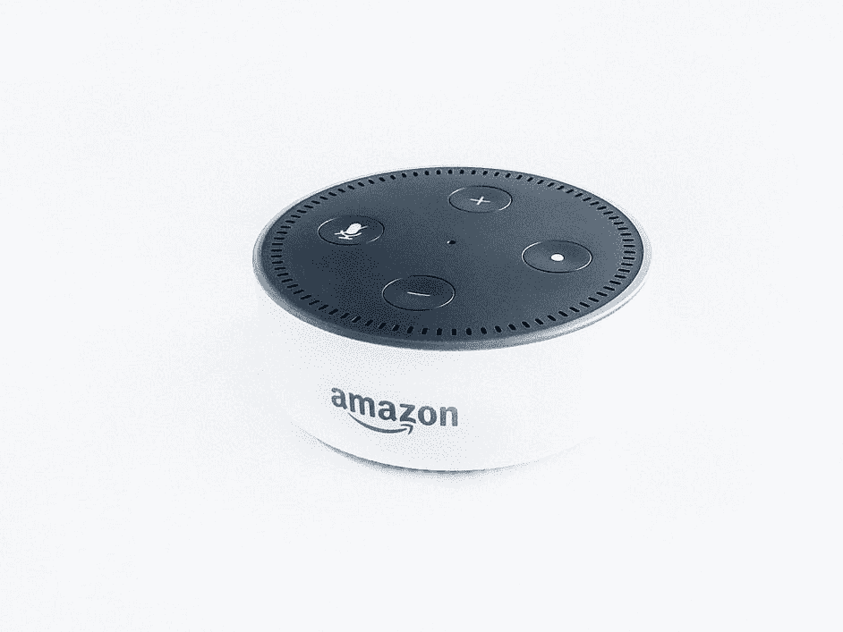
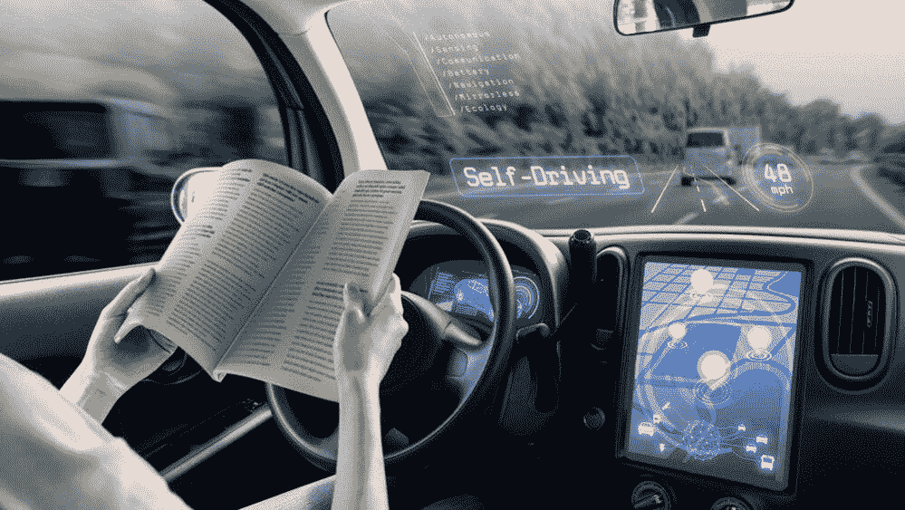

# 什么是大数据，人工智能能做什么？

> 原文：<https://towardsdatascience.com/what-is-big-data-and-what-artificial-intelligence-can-do-d3f1d14b84ce?source=collection_archive---------9----------------------->

## [探索大数据和人工智能](https://towardsdatascience.com/tagged/exploring-big-data-and-ai)

[法比奥](https://unsplash.com/@fabioha?utm_source=medium&utm_medium=referral)在 [Unsplash](https://unsplash.com?utm_source=medium&utm_medium=referral) 上的照片

从上世纪 90 年代开始，大数据这个名词就被人们提起。大数据发展迅速，正在越来越深刻地影响着我们的生活。人工智能是 1956 年在达特茅斯人工智能夏季研究项目中发现的。人工智能的概念和发展目标经历了几次心碎。但是今天，AlphaGo 可以在围棋棋盘上击败人类顶级棋手。

[AlphaGo](https://en.wikipedia.org/wiki/AlphaGo) 对战韩国职业围棋手 [Lee Sedol](https://en.wikipedia.org/wiki/Lee_Sedol) ，排名九段，围棋高手之一

人工智能正在进入从理论到现实的快速过渡，这将大大提高我们的生活质量。人工智能作为大数据的引擎，正在加速实现深度数据应用服务。在万物互联数据爆炸的海量连接时代，我们相信掌握了人工智能和大数据相关技术的公司将成为时代的浪潮。

# 大数据概念的诞生

大数据的概念并不新鲜，在 20 世纪 90 年代就被频繁提及。但是大数据这个概念最近几年又热起来了，因为在 2011 年 5 月由 EMC 牵头的以云遇上大数据为主题的 EMC world 2011 大会上又被抛出来了。同年 5 月，麦肯锡发表相关研究报告，大数据概念再度火热。那么什么是大数据呢？大数据的技术很多，方向也不一样，所以不同的人可以有不同的视角。比如海量数据计算、困难复杂的数据分析等。，这些可能就是大数据的特点。

# 什么是大数据？

那么我们来介绍一下什么是大数据。大数据有两种流行的定义。首先是 Gartner 说的。

> 大数据需要新的处理模式，以便拥有更强的决策、洞察和流程优化能力，以适应信息资产的海量、高增长率和多样化。
> 
> — Gartner

这个概念表达了一个非常重要的意义。大数据现在已经成为一种信息资产。在大数据时代，我们需要新的处理模式来处理这些信息资产。因为原有的处理模式无法在要求的时间或精度要求内处理这些数据。

另一个概念是从大数据的特点总结出来的。麦肯锡总结了大数据的四大特点，数据规模海量、数据流转快、数据类型多样、价值密度低。这就是我们通常所说的大数据的 4V 特征。IBM 后来加入了第五个特征，并由此形成了大数据的定义，也就是业界比较常见的大数据的 5V 特征。让我们一个一个来看看什么叫做 5V 特性。

## 卷

第一个 V 是数据量大，所以在大数据时代，要处理的数据量级非常大。目前，这一数量级通常用于 TB 级的数据分析和挖掘。

## 速度

第二个特点叫做处理速度快。过去处理数据需要几周、几个月甚至更长时间才能得到结果，而现在我们需要在更短的时间内得到结果，比如几分钟甚至几秒钟。

米卡·鲍梅斯特在 [Unsplash](https://unsplash.com?utm_source=medium&utm_medium=referral) 上的照片

## 多样化

第三个特征叫做多种类型的数据。之前我们能处理的数据通常是结构化的，也就是二维表。但是在大数据时代，需要处理更多样化的数据类型，有结构化、非结构化和半结构化数据。这些数据必须通过大数据技术分别处理，甚至混合处理。

## 价值

第四个特征称为低数据值密度。数据量很大，但是对我们有价值的数据并不多。这些数据淹没在浩瀚的数据海洋中，因此其数据的价值密度相对较低，这意味着我需要在数以亿计的数据中进行筛选和挖掘，但我可能只得到几十个或几百个有用的数据。

## 诚实

第五个特征是相对于第四个特征的。大实话说的是商业价值的价值高或者更真实，也就是挖掘出来的数据的价值非常高，无论是对我们的决策、洞察，还是流程优化都有直接的决定性作用。所以比较直白。

由[卢克·切瑟](https://unsplash.com/@lukechesser?utm_source=medium&utm_medium=referral)在 [Unsplash](https://unsplash.com?utm_source=medium&utm_medium=referral) 拍摄的照片

大数据的这些 5V 特征告诉我们，今天的大数据不仅仅是指数据，而是指数据加上一系列的处理技术。我们需要在很短的时间内，从大量的数据中找到并挖掘出对我们工作有价值的那部分数据，以便我们做出决策或为工作进行优化。整个过程叫做大数据。

# 什么是人工智能？

人工智能是一门研究和发展模拟人类智能延伸和扩展的理论、方法、技术和应用系统的新技术学科。人工智能研究的目标是让机器执行一些需要智能人类才能完成的复杂任务。也就是说，我们希望机器可以代替我们解决一些复杂的任务，不仅仅是重复的机械活动，而是一些需要人类智慧参与的活动。

在 [Unsplash](https://unsplash.com?utm_source=medium&utm_medium=referral) 上由 [Franck V.](https://unsplash.com/@franckinjapan?utm_source=medium&utm_medium=referral) 拍摄的照片

所以我们来看看人工智能能做什么。

## 图像识别

图像识别现在广泛应用于我们的生活中。例如，一个人的身份可以基于照片或当用相机捕捉到一个人的面部时进行识别。在中国许多城市的火车站，你可以刷身份证，机器用摄像头采集你的面部图像，然后识别和验证你的身份。一些楼宇门禁使用图像识别进行识别，你不再需要门禁卡或钥匙。其他应用包括高级人机交互、视频监控、图像自动索引和视频数据库等。

[procylink 访客管理系统](https://unsplash.com/@proxyclick?utm_source=medium&utm_medium=referral)在 [Unsplash](https://unsplash.com?utm_source=medium&utm_medium=referral) 上拍照

## 语音识别

语音识别为我们与计算机交互提供了一种更快、更方便的方式。当我们对电脑说话时，它可以知道我们在说什么，并与我们互动。这种方法和我们以前在键盘上打字完全不同。这种与计算机交互的方式可以给我们带来许多扩展的应用。像 Siri，Google Assistant，Alexa 这样的虚拟助手可以根据命令或问题为个人执行任务或服务。

## 自动驾驶汽车

自动驾驶或自动驾驶汽车在人工智能领域也非常受欢迎。谷歌的 Waymo 已经开始了名为“Waymo One”的商业自动驾驶汽车服务。中国互联网公司也在北京四环成功测试了自动驾驶。现在也有一些高级汽车带有自动驾驶的模块。

[自动驾驶汽车](https://www.ericsson.com/en/blog/2020/1/self-driving-car-passenger-experience)

随着 5G 技术的出现，我会相信这项技术会彻底改变我们未来的出行方式。C-V2X，即蜂窝 V2X(车辆对一切)，是一种使用相同 5G 网络的通信技术。它允许车辆之间进行无线通信，还可以与其他交通基础设施(如交通灯、路边等)进行通信。在下面的文章中，你可能会对 5G 有更多的了解。

 [## 关于 5G 你需要知道的一切

### 本主题介绍 5G 网络知识，帮助您了解 5G 技术发展和未来业务…

medium.com](https://medium.com/swlh/all-you-need-to-know-about-5g-4c3fc6ad7124) 

## 消费金融

想象一下，如果我们在一个网站上输入一笔我们想投资的钱，就像我们身边有一个财务规划师一样，人工智能会立即告诉我们哪种投资回报最高。人工智能在金融领域取得了一些重大进展。

由[莎伦·麦卡琴](https://unsplash.com/@sharonmccutcheon?utm_source=medium&utm_medium=referral)在 [Unsplash](https://unsplash.com?utm_source=medium&utm_medium=referral) 上拍摄的照片

# 结论

大数据和人工智能是当今计算机科学的两个重要分支。近年来，大数据和人工智能领域的研究从未停止。大数据与人工智能有着千丝万缕的联系。第一，大数据技术的发展依赖于人工智能，因为它使用了很多人工智能的理论和方法。其次，人工智能的发展也必须依靠大数据技术，它需要成吨的数据做支撑。技术创新才刚刚开始，还有更多的新技术需要我们不断学习。

如果你想了解大数据的发展和趋势，了解更多人工智能及其应用，也可以阅读以下文章:

 [## 大数据及其应用的发展与趋势

### 关于大数据的发展和趋势及其在电信行业和其他领域的应用

towardsdatascience.com](/the-development-and-trend-of-big-data-and-its-applications-5dd8c52e1df6)  [## 人工智能的基本概念及其应用

### 机器学习，深度学习，强弱人工智能，神经网络简介:BP 和…

medium.com](https://medium.com/towards-artificial-intelligence/basic-concepts-of-artificial-intelligence-and-its-applications-294fb84bfc5e)  [## 人工智能的三大领域及其工业应用

### 人工智能是一门研究和发展理论、方法、技术和方法的新技术学科

towardsdatascience.com](/three-major-fields-of-artificial-intelligence-and-their-industrial-applications-8f67bf0c2b46)