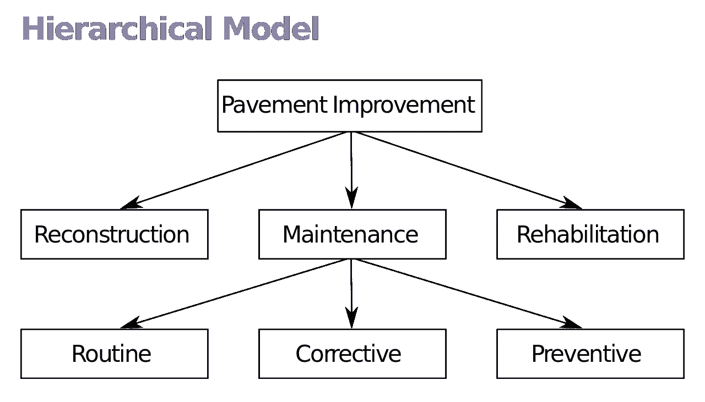
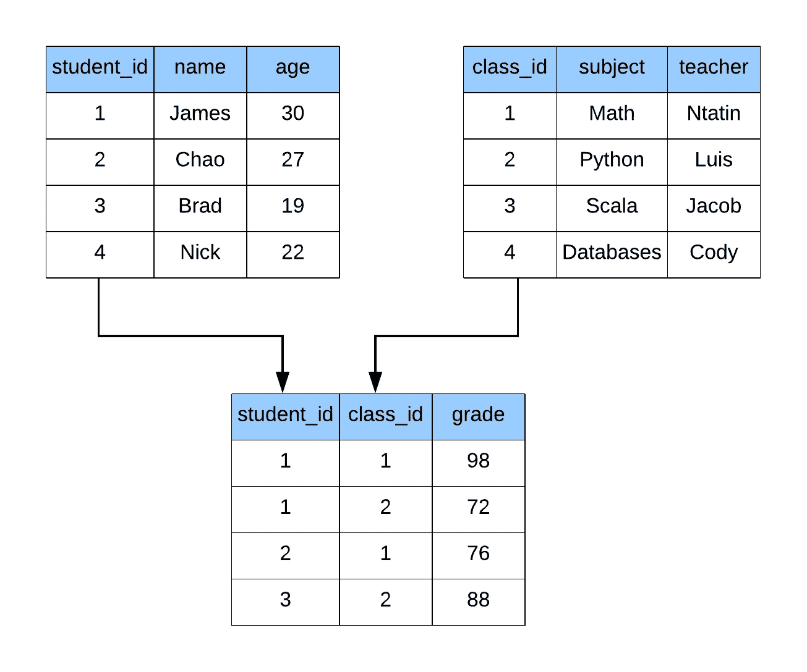
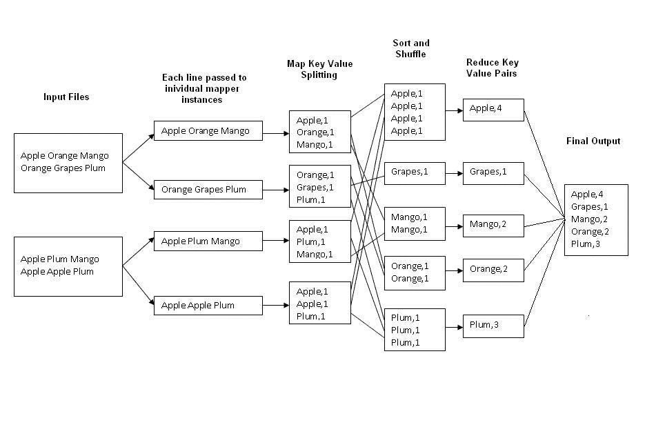
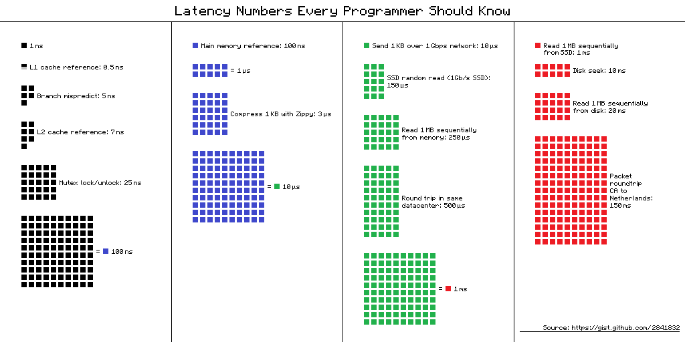
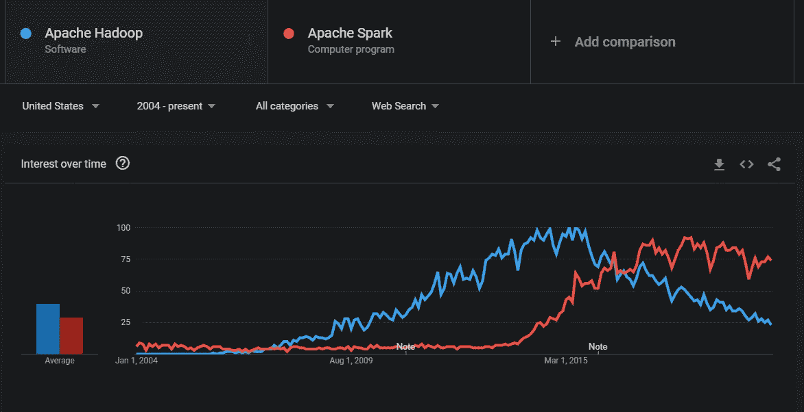
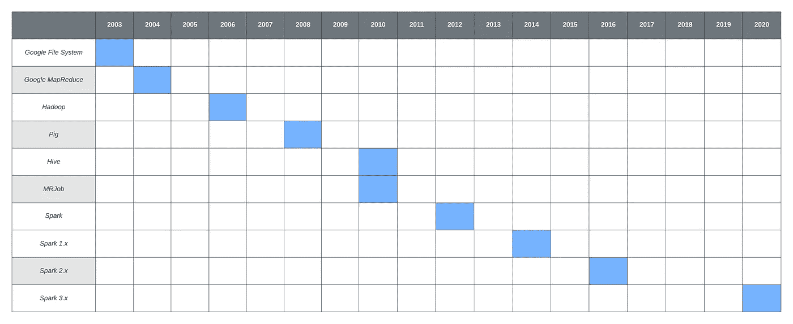

# 什么是“大数据”——了解历史

> 原文：<https://towardsdatascience.com/what-is-big-data-understanding-the-history-32078f3b53ce?source=collection_archive---------13----------------------->

一次历史之旅，我们是如何走到这一步的，我们释放了哪些能力，以及我们下一步要去哪里？

Glen Beck(背景)和 Betty Snyder(前景)在 328 号楼为 ENIAC 做节目。(美国陆军照片，加州。1947-1955)由**美国陆军照片**， **n.d .公共领域。**

# 这一切是如何开始的(1940 年代)

很久以前，1945 年 12 月，第一台电子通用数字计算机完成。它被称为 ENIAC(电子数字积分器和计算机)。它标志着一个时代的开始，在这个时代中，我们为多类问题生产计算机，而不是为每个特定的用例定制。

为了比较性能，ENIAC 在单核上的最高时钟频率约为 5 kHz，而 iPhone (Apple A13)的最新芯片在 6 核上的最高时钟频率为 2.66 GHz。这大致相当于每秒多完成大约 400 万次循环，此外还提高了一次循环中可以完成的工作量。

从历史上看，我们已经经历了在最新的硬件进步上扩展以释放新的软件工程能力的周期。已经出现了一种增加灵活性的模式，同时也要求工程师承担更多的责任。不可避免地，人们希望在提供相同灵活性的同时，减轻工程师的额外负担。这种灵活性是通过实现最佳实践来实现的，当我们理解在特定抽象中工作的模式时，这些最佳实践会被梳理出来。

# 数据的演变(20 世纪 60 年代至 90 年代)

历史上，服务器成本高昂，存储、内存和计算能力有限，无法解决我们想要解决的问题，也不需要程序员付出大量努力，例如内存管理。相比之下，今天，我们有了自动垃圾收集的语言来为我们处理这个问题。这就是为什么 C、C++和 FORTRAN 被如此广泛地使用，并继续被用于高性能用例，在这些用例中，我们试图从系统中获得尽可能多的效率和价值。即使在今天，Python 中的大多数数据分析和机器学习框架都调用 C 来确保性能，并且只为程序员公开一个 API。

为了从组织数据的系统中获取尽可能多的价值，像 IBM 这样的公司在存储、检索和处理数据的特定模型上投入了大量资金。从这项工作中，我们得到了在大型机大金属时代非常流行的分层数据模型。通过创建标准模型，他们减少了启动项目所需的脑力劳动，并增加了项目间可以共享的知识。

路面改善的分级模型示例，分为三个类别，每个类别可能有自己的类别。所有结构必须向下，并且不能连接回父类别。这就形成了一个一对多的关系，称为树。**层次模型**由**美国交通部**， **n.d .公共领域。**

大型机解决了当时的问题，但过于昂贵，因此只有银行等最大的企业能够有效地利用它们。它们在遍历树状结构时非常有效，但是它们强加了非常严格的一对多关系，这对于程序员来说可能很难表达，并且使得他们的应用程序很难更改。

后来，创建了关系模型，它为我们今天的大多数数据库提供了动力。在关系模型中，数据被表示为元组(表)的集合，它们之间有关系。典型的关系是一个外键，它表示两个表中的数据应该相互关联。没有学生，你就没有分数，没有老师，你就没有课堂。

显示表如何通过 id 连接的关系图。

由于应用于数据的结构，我们可以定义一种标准语言来以这种形式与数据交互。关系模型的最初发明者还创建了它的结构化查询语言(SQL)，这是今天访问数据的事实上的标准。这是因为 SQL 易于阅读，同时也非常强大。当系统具有递归和窗口功能时，SQL 甚至是完全的。图灵完备性粗略地解释为只要有足够的时间，这种语言可以解决任何计算问题。这是 SQL 的一个极好的理论属性，但并不总是意味着它是每项工作的最佳工具。这就是为什么我们使用 SQL 访问和检索数据，但利用 Python 和其他语言对数据进行高级分析。

Oracle 在 1979 年发布了第一个关系数据库产品。这些系统被称为关系数据库管理系统(RDBMS)。从那以后，几十种商业和开放源码的 RDBMS 已经大张旗鼓地发布了。这些对开源的最初贡献已经导致 Apache Software Foundation 成为“大数据”领域工具的事实上的地方，其许可在利用库的核心源代码时支持商业活动。

这些系统非常适合利用[规范化数据结构](https://en.wikipedia.org/wiki/Database_normalization)管理和访问数据；然而，随着数据量的增长，它们的性能在负载压力下开始下降。我们可以利用一些优化来减轻系统的压力，比如索引、读取副本等等。关于优化 RDBMS 性能的主题可能还会有更多的博客文章和书籍，但已经超出了本文的讨论范围。

# 互联世界及其所有数据(20 世纪 90 年代)

在电脑成为每个家庭的必需品，手机进入每个人的口袋之前，通信和围绕通信的数据要少得多。几乎你去的每个网站都有跟踪功能，可以更好地了解用户体验，并向他们的客户提供个性化的结果。

数据收集的爆炸式增长源于自动化收集的能力，而在过去，用户必须以调查、电话等形式提供反馈。今天，我们被我们的活动所追踪，我们的行动比我们的想法更响亮。网飞不再让你对电影进行排名或评分，因为他们发现信号并没有推动生态系统的利用。

# 谷歌的搜索索引和对 MapReduce 的需求(21 世纪初)

谷歌是第一批涉足需要复杂技术的大规模数据收集的公司之一；然而，在 90 年代后期，他们没有像现在这样作为世界上最赚钱的公司之一的庞大预算。谷歌的竞争优势是它的数据，以及他们如何有效地利用这些数据。让我们来看看他们作为一个企业最早的挣扎之一。

谷歌的工程领导有一个难以解决的问题，他们负担不起传统公司所依赖的昂贵得多的企业级硬件。然而，与此同时，他们的计算需求与其他组织相同，甚至更多。谷歌已经建立了一个科学怪人系统来跟上他们的业务以及整个网络的增长需求。他们的服务器中的部件是消费级的，容易出现故障，运行在其上的代码对于这些故障事件也不可伸缩或不健壮。

Jeff Dean 和 Sanjay Ghemawat 是当时的工程领导。他们勤奋地重写谷歌代码库的各个方面，以更好地应对失败。他们遇到的最大问题之一是，在作业运行时硬件会出现故障，需要重启。当他们在代码库中不断解决这些问题时，他们注意到一个一致的模式正在被遵循，他们可以将它抽象出来并围绕它创建一个框架。这种抽象后来被称为 MapReduce。

MapReduce 是一个编程模型，定义在两个步骤的过程中，即 map 阶段和 Reduce 阶段。映射是函数在元素方面的应用，而归约是聚合。这个框架提供了一个简单的接口，在这个接口中，工作可以以一种智能的方式在一个集群上的不同工作者之间进行划分。如果我们花一些时间不太深入地思考这个问题，我们会意识到，如果我们可以拆分我们的工作，那么我们也可以针对单个故障恢复我们的工作，而不必重做整套工作。此外，这转化为一个更加可扩展和健壮的系统。有许多方法可以提高 MapReduce 系统的性能，随着时间的推移，我们将通过从这个概念构建的抽象层进行改进。

" [WordCountFlow](https://en.wikipedia.org/wiki/File:WordCountFlow.JPG) "，由 Magnai17，在 [CC BY-SA 4.0](https://creativecommons.org/licenses/by-sa/4.0/) 下授权。

通过利用 MapReduce 框架，Google 使用廉价且易于构建和维护的商用服务器有效地扩展了其基础设施。他们可以在代码中自动解决故障，甚至进一步提醒他们服务器可能需要维修或更换部件。这一努力为他们省去了大量的麻烦，因为网络图变得如此之大，以至于没有一台计算机，更不用说超级计算机，能够处理如此大的规模。

杰夫和桑杰仍然在谷歌工作，并在许多塑造数据格局的技术进步上进行合作。詹姆斯·萨默斯在《纽约客》上写了一篇关于谷歌拐点的精彩[文章](https://www.newyorker.com/magazine/2018/12/10/the-friendship-that-made-google-huge)。

# MapReduce 作为开源实现 Hadoop 简介(2000 年代中期)

Google 倾向于把它的工具放在内部，因为他们是专门为他们的内部系统构建的，但是 Google 也以学术论文的形式分享它的知识。“ [MapReduce:大型集群上的简化数据处理](https://research.google/pubs/pub62/)”一文概述了 MapReduce 编程模型，并在附录中提供了一个字数统计算法的示例实现。我们看到，编写 MapReduce 作业的代码量比用 Python 脚本做同样的事情要多得多；然而，Python 脚本将仅在单线程上运行，并且吞吐量有限，而 MapReduce 作业将根据我们的需要扩展服务器数量，以便在合理的时间框架内完成结果。

我们用复杂性换取了扩展能力，第一个支持 MapReduce 的系统非常笨重。当谷歌、脸书、雅虎和其他科技巨头这样的初创公司努力让组织中的每个人都可以访问其庞大的数据量时，我们吸取了许多教训。我们吸取了许多经验教训，并开发了各种工具来解决这些问题。本文的其余部分将重点讨论我们学到了什么，以及如何将其应用到“大数据”领域的后续工具中。

2000 年代中期，Doug Cutting 和 Mike Cafarella 阅读了谷歌关于 MapReduce 的论文，以及另一篇关于谷歌分布式文件系统的论文。他们正在开发 Nutch，一个分布式网络爬虫，并且意识到他们在扩展他们的系统时遇到了同样的问题。Doug 当时正在寻找全职工作，并最终参加了雅虎的面试，他们接受了建立一个开源系统来实现大规模索引的想法，因为他们当时落后于 Google。雅虎聘请 Cutting 继续从事 Nutch 的工作，Nutch 将衍生出一个分布式文件系统和一个计算框架，这两者都是 Hadoop 的核心组件。它们被称为 Hadoop 分布式文件系统(HDFS)和 Hadoop MapReduce。随着 Hadoop 进入炒作周期，这将成为一个令人困惑的术语，因为两者都被简称为 Hadoop。

MapReduce 依赖于分布式文件系统，因为它需要对整个硬件堆栈的故障具有弹性。Jeff Dean 在“[云计算系统的兴起](https://research.google/pubs/pub44922/)”中描述了这一点，他在描述 2006 年一个典型的谷歌集群的失败事件时说，“可靠性必须来自软件”。

*   约 1 次网络重新布线(在 2 天内关闭约 5%的机器)
*   大约 20 次机架故障(一个机架中的 40 到 80 台机器瞬间消失，1 到 6 个小时才能恢复)
*   约 5 个机架出现故障(一个机架内有 40–80 台机器，50%的数据包丢失)
*   约 8 次网络维护(4 次可能会导致约 30 分钟的随机连接丢失)
*   约 12 个路由器重新加载(几分钟内移除 DNS 和外部 VIP)
*   ~3 个路由器故障(必须立即拉动流量一小时)
*   大约几十个 30 秒的小信号，用于 DNS 大约 1000 个单独的机器故障
*   ~成千上万的硬盘故障使磁盘变慢，内存变坏，机器配置错误，机器易损坏等。

许多其他考虑因素对于提高整个堆栈的性能至关重要，例如通过尽可能少地移动数据来最小化网络延迟。为了实现这一目标，我们将计算带到了每台服务器中带有大型磁盘的存储中，而不是在传统的 NFS 或 SAN 存储解决方案中保持存储独立。将计算引入存储时，我们不想让群集中的某个特定节点因计算而负担过重，因为它拥有数据。我们还希望确保，如果一个节点出现故障，我们仍将拥有数据的副本，并能够有效地分割工作。如果我们更进一步，看看 Google 列出的故障事件类型，我们还需要为节点故障和机架故障做准备。这意味着我们的存储解决方案还需要机架感知能力，以及跨机架分布的多个数据副本。

[每个程序员都应该知道的延迟数字](https://gist.github.com/hellerbarde/2843375)作者 **P .斯塔克**。

如果这一切看起来很复杂，那是因为它确实很复杂！此外，第一代 MapReduce Hadoop MapReduce 也同样涉及其中，需要深入了解 MapReduce 流程和框架内性能优化的基础知识。MapReduce 的一个重大挑战是将一些重要的东西定义为一组 MapReduce 进程。没有一个表达系统来创造复杂的逻辑。相反，Hadoop MapReduce 专注于为构建可扩展计算提供最底层的块，但没有有效地协调它们。Hadoop MapReduce 的另一个警告是，它完全是磁盘驱动的，没有任何东西存储在内存中。在 MapReduce 出现的时候，内存是非常昂贵的，如果你用完了内存，那么作业会不断失败，因为它不适合任何机器。所有这些考虑意味着 Hadoop MapReduce 很慢，很难编写，但是非常稳定和可伸缩。

提出了几种解决这些挑战的方案，如 Pig(脚本)、Hive (SQL)和 MRJob(配置)。这些都有效地归结为 Hadoop MapReduce 之上的包装器，以支持迭代算法、更少的样板文件和略好的代码抽象。这些工具允许不太懂技术的人利用“大数据”生态系统，即使他们不是具有丰富 Java 经验的高级软件工程师，但仍有许多不足之处。

# 减少责任，同时通过抽象提高灵活性(2010 年代早期)

随着 21 世纪初亚马逊网络服务(AWS)云的出现和越来越多的采用，人们开始考虑如何在 AWS 上运行 Hadoop 工作负载。这是他们梦寐以求的分析工作负载，通常以突发方式运行一小段时间，其余时间服务器只是在数据中心等待。

然而，当时 Hadoop MapReduce 严重依赖于 HDFS 文件系统。不可能利用云带来的可扩展存储解决方案，这种解决方案会使集群退役。我们如何将这些工作负载迁移到云中，同时通过扩展到我们的弹性工作负载来降低成本，从而获得云的优势？如果我们稍微放宽了无内存利用率的限制，让我们能够将一些数据保存在内存中以降低延迟，会怎么样呢？我们怎么能允许像机器学习中使用的迭代过程呢？

这些想法是 Spark 问世的核心，最初于 2014 年发布。最初的[论文](https://amplab.cs.berkeley.edu/wp-content/uploads/2011/06/Spark-Cluster-Computing-with-Working-Sets.pdf)发表于 2010 年。他们看到，通过允许利用少量内存，性能提高了 10 倍，这也大大降低了编程的复杂性。

Spark 的 1.x 版本并不是横向扩展和高效处理数据的终极解决方案。它仍然受到复杂编程模型的困扰，这需要大量的知识来编写高效的代码。它提供了极大的灵活性，消除了不必要的责任。这是一个很棒的第二代工具，从那以后，Spark 的受欢迎程度急剧增长。它最初超越了 Hadoop，并随着新需求的出现而继续发展。

比较 Hadoop 和 Spark 的 Google 趋势

# 改善体验(2010 年代中期)

到 2016 年，Spark 已经足够成熟，意识到他们的编程模型正在成为采用的瓶颈。更多没有软件工程经验的人承担了从数据中创造价值的任务。一个新领域数据科学的发展正在兴起，它专注于以科学的方式从数据中提取价值，而不仅仅是用传统的商业智能工具报告数据。

熊猫作为任何人都可以用来处理数据的工具而出名。它为用户提供了一个简单的 API，由两个适马的 Wes McKinney 创建，以使定量研究人员的生活更容易。他们一遍又一遍地构建相同的代码来分析数据。两个适马开源了这个库，它已经成为人们学习如何以编程方式与数据交互的标准。

致力于 Spark 的团队意识到，他们的许多用户最初都是在 Pandas 中进行探索，然后在他们巩固了自己的想法后转移到 Spark。工具的这种隔离使得工作流不一致，并导致大量的代码重写工作来适应 Spark 中的 MapReduce 模型。Spark 通过添加 DataFrame API 做出了回应，该 API 模仿了 Pandas API，这意味着他们的用户可以利用相同的工作流，但让它在 Spark 的 MapReduce 引擎上运行，即使在分析的探索阶段也允许横向扩展功能。

除了 Spark 的编程用法之外，他们的一些用户还希望利用 SQL 来访问数据。如上所述，近 50 年来，SQL 一直是访问数据的标准。Spark 团队在这一点上做出了一个非常棒的决定，他们决定启用 Spark SQL，但是使用他们为 DataFrame API 编写的相同的底层优化引擎。通过统一优化引擎，他们编写的任何改进不仅会影响他们的 SQL 接口，还会影响他们的编程接口。这个引擎被称为 Catalyst 优化器，它的工作方式与传统 RDBMS 中的查询计划优化器几乎相同。所有这些工作在 Spark 2.0 中达到高潮，极大地提高了可用性。

[催化剂优化器](https://databricks.com/glossary/catalyst-optimizer)由 [**数据块**](https://databricks.com/glossary/catalyst-optimizer) 完成。

# 以同样的灵活性减少责任(2020 年)

Spark 最近在 2020 年 6 月发布了最新的 [3.0 版本](https://databricks.com/blog/2020/06/18/introducing-apache-spark-3-0-now-available-in-databricks-runtime-7-0.html)，将一切都向前推进了一步，但他们没有专注于新功能，而是专注于提高性能、可靠性和可用性。

为了提高性能，Spark 增加了自适应查询执行和动态分区修剪，即使在 RDBMS 领域，这也是相对较新的改进。这些性能增强可以带来巨大的收益。在 TPC-DS 基准测试中，102 个查询中有 60 个的动态分区修剪性能提高了 2 到 18 倍。这意味着，随着公司利用 Spark、降低基础设施成本、缩短价值实现时间以及更加关注结果，所需的计算量将会更少。这些性能增强对用户是透明的，不需要重写代码。

为了提高可靠性，该团队已经关闭了 2.x 和 3.0 分支之间的大量错误(3，400 个)，提供了更好的 Python 错误处理以简化 Python API 的使用，等等。这些改进再次提高了灵活性，而没有改变 Spark 的责任模型。

为了提高可用性，Spark 为流用例提供了一个新的 UI，提供了对小批量统计数据和管道整体状态的更好的可见性。在许多用例中，很难理解系统何时会出现延迟，以及如何有效地响应这些变化，例如向外扩展新节点或潜在的向内扩展以降低成本。

Spark 3.0 通过减少最终用户的责任，同时保持同等水平的灵活性，继续改善生态系统。这使我们能够解决更多的挑战，并大幅加强我们的运营，使我们专注于增值工作。

“大数据”领域工具的发布历史。我们可以看到，直到最近，大约每两年在抽象方面都会有进展。随着 MapReduce 框架的成熟，最近的趋势一直集中在云的采用和通过用户可用的技术栈变得更高效。

# 当前的挑战和未来会怎样？

在本文中，我们将重点放在 Hadoop 和 Spark 上，以构建生态系统随时间的演变并规划其历史。“大数据”领域有数百种工具，每一种都有其使用案例和旨在应对的挑战。如果您在分布式框架中查看类似 SQL 的数据接口，您将体验 Hive、Presto 和 Impala 的历史，它们解决了该领域中的不同挑战。如果您对数据序列化感兴趣，比如非常传统且效率极低的 CSV，为了减少存储并缩短计算时间，您可以研究 Avro、Parquet、ORC 和 Arrow。可能会有 1000 篇博客文章讲述他们的历史，让我们了解我们今天在哪里以及我们是如何走到这一步的。

自 2010 年“大数据”炒作周期开始以来，我们在技术上取得了如此大的进步。我们现在有了亚马逊、微软和谷歌等云提供商，实现了以前只能梦想的能力。云侧重于弹性扩展您的工作负载以满足您的需求的理念。作为交换，您需要支付高于数据中心成本的额外费用，并减少维护数据中心基础架构的运营、监管和技术方面的需求。如果我们看一下分析用例，就会发现硬件的利用率无处不在，这是云的完美目标用例。

对于这些“大数据”工作负载，云提供商使其解决方案的扩展、缩减和扩展变得异常简单。有 EMR(亚马逊)、Azure Databricks(微软)和 Dataproc(谷歌)，这些提供商都支持云中的短期工作负载。他们已经将存储分别隔离到他们的对象存储解决方案 S3、Azure 数据湖存储和谷歌云存储，从而实现了计算与存储的分离。如果您需要加速分析，您可以在一个完全隔离的集群中这样做，而不会影响任何其他人正在运行的作业。由于不同的工作负载有不同的性能限制，本地集群的调优曾经是一个难以置信的挑战。有了这些抽象，我们的团队可以专注于他们的目标，而不是基础设施。

此外，我们不仅想减少我们对基础设施的心理负担，还想减少我们的代码。在当今世界，我们有实时和批量用例。历史上，我们必须维护两个独立的代码库来支持这些用例之间的差异。原来 batch 只是 streaming 的一个[特例，那么把我们对它的工作方式融合在一起难道没有意义吗？Flink、Spark 和 Beam 都在努力以某种方式解决这个问题，要么是作为一等公民(Beam)，要么是通过修改他们的 API 来让最终用户感觉更舒服(Flink/Spark)。](https://www.ververica.com/blog/batch-is-a-special-case-of-streaming)

这些进步的核心是需要对我们世界上最大规模的数据集进行极其复杂的分析。我们需要根据我们的数据来促进机器学习和人工智能(ML/AI)用例。要做到这一点，我们不仅需要非常高效地处理我们的数据，还需要在不妨碍最终用户的情况下处理数据。ML/AI 工具的民主化在过去二十年中一直在发生，scikit-learn、Keras、Tensorflow、PyTorch、MXNet 和许多更多的库除了深度学习用例之外还支持传统的统计建模。“大数据”领域的工具旨在从这些工具中吸取经验教训，并将它们直接集成到其生态系统中。

# 那么到底什么是“大数据”呢？

大数据是指当您有一个纵向扩展不经济的用例，并且需要转而寻求横向扩展解决方案时。不同的公司有不同的要求，每个公司都有自己独特的需求和限制。一些用例在历史上需要纵向扩展方法，但是随着我们改进了在 MapReduce 等横向扩展编程模型中工作的抽象，我们已经能够将它们重新转换为横向扩展解决方案。

几家公司通过将尽可能多的内存放入一台机器来扩大规模。一些公司在 24 TB 内存的虚拟机(VM)上运行 SAP 工作负载；其他人只能负担得起使用更传统的裸机扩展到 1.5 TB。然而，这只能让我们更快地访问数据。当我们需要对数据进行非平凡的计算时，比如机器学习或人工智能用例，该怎么办？我们只能在单台机器上保留这么多内核；例如，SAP 使用案例的 24 TB 内存虚拟机有 384 个内核。大多数“大数据”群集都有数千个可用的 CPU，并且比购买这样一个专为这些 SAP 使用案例构建的大型虚拟机更具成本效益。

如果您有超过 100 GB 的数据，那么您通常会在单节点系统上遇到一些问题。您可能会花费不合理的时间和/或精力来优化代码、索引或其他功能，以便在单个节点上运行作业。从这里开始，看看 Spark 或 Dask 等集群解决方案是有意义的，但需要在基础设施上进行大量投资才能有效工作。Amazon、Microsoft 和 Google 等云提供商一直致力于提供扩展这些集群解决方案的能力，同时减少终端客户管理基础架构所需的工作量。

随着我们技术能力的进步，单节点工作负载和集群工作负载之间的差异将开始逐渐消失。与 1945 年的 ENIAC 相比，这些功能将使我们明天能够实现更高的效率，就像我们今天所经历的一样。