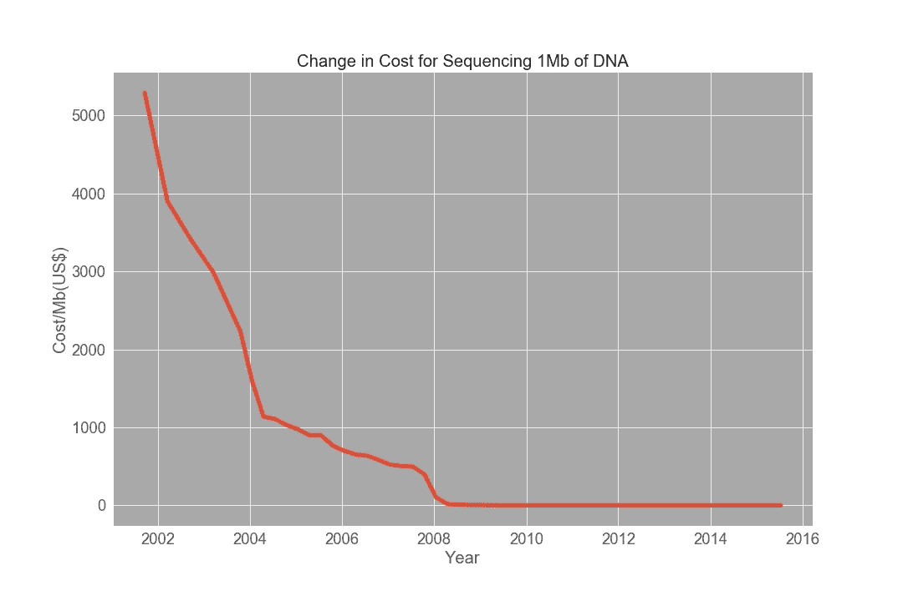

# 生物信息学？计算生物学？

> 原文：<https://towardsdatascience.com/what-is-bioinformatics-79c3e3ef8563?source=collection_archive---------43----------------------->

## 怎么这么热闹？

这似乎是一个直截了当的问题，但如果真的是这样，我就不会写文章了。快速[谷歌搜索](https://www.google.com/search?rlz=1C1CHBF_enIN859IN859&sxsrf=ALeKk02kL-fGWadyudNNvfWyWTV_Hc38eA%3A1605576632121&ei=uCezX_OEB_TC3LUP79CfiAk&q=bioinformatics&oq=bioinformatics&gs_lcp=CgZwc3ktYWIQAzIECCMQJzIECCMQJzIECCMQJzIECAAQQzIECAAQQzIECAAQQzIECAAQQzIECAAQQzICCAAyAggAOgQIABBHOgcIIxCxAhAnOgYIABAHEB5Q6BlYox9gtSJoAHACeAGAAZsCiAGDB5IBBTAuNC4xmAEAoAEBqgEHZ3dzLXdpesgBCMABAQ&sclient=psy-ab&ved=0ahUKEwjzwMSGt4jtAhV0IbcAHW_oB5EQ4dUDCA0&uact=5)和[维基百科](https://en.wikipedia.org/wiki/Bioinformatics)会呈现出以下定义，“一个跨学科领域，开发理解生物数据的方法和软件工具，特别是当数据集庞大而复杂时”。我们来解剖一下这个说法！

照片由[micha Parzuchowski](https://unsplash.com/@mparzuchowski?utm_source=unsplash&utm_medium=referral&utm_content=creditCopyText)在 [Unsplash](https://unsplash.com/s/photos/medicine?utm_source=unsplash&utm_medium=referral&utm_content=creditCopyText) 拍摄

维基百科用来描述它的前三个词是“跨学科领域”。想出三个可能有帮助的广泛领域；生物学、计算机科学和数据科学。但是这三个领域中的学科到底是什么呢？当谈到生物学领域的应用时，当前领域包括从分子生物学、遗传学、基因组学、蛋白质组学和代谢组学到分类学、进化论、药理学、生物医学和健康科学的所有内容。这不是一个详尽的列表。说到计算机科学，有明显的像软件工程，数据库管理，信息工程，[自然语言处理(NLP)](/your-guide-to-natural-language-processing-nlp-48ea2511f6e1) ，图像处理。

在数据科学领域，所有这些都变得混乱，我们可以进行混合和匹配！不过，共同的主题是使用机器学习或任何其他类型的人工智能来根据经验回答生物学问题。例如，将遗传学与自然语言处理相结合使我们能够对遗传数据进行经验分析，从而获得其他方式无法发掘的见解和知识。当人类基因组计划在 20 年前启动时，许多人认为一旦我们能够对基因组进行测序，我们就能够治愈所有的遗传疾病。但这仅仅是开始。大自然不会就这样把它的秘密泄露给我们的，对吗？基因测序产生了大量嘈杂、杂乱和肮脏的数据集。输入 NLP。使用 NLP 的遗传分析可以容易地检测基因组的不同区域，例如重复位点、编码和非编码位点、同源区域等等。自从人类基因组计划以来，DNA 测序的成本已经大幅下降。据估计，2001 年花费了 9500 万美元对一个完整的人类基因组进行测序，相比之下，今天大约花费了 950 万美元，这要归功于下一代测序，这使得测序更加容易，从而产生了更多的数据。

由作者创建。数据收集自[国家人类基因组研究所](https://www.genome.gov/about-genomics/fact-sheets/Sequencing-Human-Genome-cost)

另一个潜力巨大的领域是将神经网络与蛋白质组学和药理学结合起来。生物制药行业最近才意识到如何利用数据科学的力量进行蛋白质建模。有成千上万的有机分子可以与我们的生理和新陈代谢相互作用。然而，其中 98%并不是提高我们生活水平的理想选择。然而，这仍然给我们留下了数以千计的其他有机分子，剩下的 2%，确实可以用来治疗我们的许多疾病和病症，或者事实上，增强我们的体质。但是识别这些潜在的候选人是不可能的部分。进入神经网络。

其他更具体的使用案例包括分析高通量实验产生的大型数据集，模拟进化和系统生物学，模拟流行病学研究，如新冠肺炎的传播，设计合成细胞，基于核酸的信息存储系统，等等。

生物信息学的一个特别令人兴奋的领域是它在精确和个性化医学中的应用。医生正在越来越多地了解基因对一个人的生理和代谢的影响，更重要的是，药物如何与它们的确切表型相互作用。

使用患者的个人基因构成，并将其与成千上万其他患者的数据库进行比较，医生可以对治疗和治疗选择做出更明智的决定。一些药物对患者可能比其他药物更有效，而同样的药物对其他患者可能具有比预期效果更多的副作用。所有这些理论上都可以进行评估，因为医院可以访问成千上万具有相似基因型并接受过相似药物治疗的其他患者的数据库，以便预测当前患者体内的效果。与相关性和不确定性相比，医学科学将更加稳健、经验性和因果性。

另一个目前正在大步前进的研究领域是在放射图像上应用图像分析。几年前，像[卷积神经网络(CNN)](/a-comprehensive-guide-to-convolutional-neural-networks-the-eli5-way-3bd2b1164a53) 这样的算法只用于计算机视觉。最近，CNN 已被用于对 MRI 和 fMRI 扫描等放射学报告进行分类。通过这种实现，聚类和分类算法迅速得到改进。以前，这些算法检测良性和恶性肿瘤的能力只有受过训练的放射科医生的一半。然后他们提高到和一个训练有素的放射学家一样好。现在他们甚至比训练有素的放射科医生还要优秀。当你把生物学、计算机科学和数据科学结合起来时，可能性真的是无穷无尽的。

该术语通常作为“计算生物学”的同义词使用。虽然这两者确实有很多相互重叠的地方，但是将它们区分开来的细微差别是，计算生物学稍微更多地涉及生物学中已经可用的计算工具的*使用*，而生物信息学稍微更多地涉及这些工具的*开发*，而不是它们的使用。然而，这两个学科之间的重叠掩盖了它们的差异。所以实际上来说，这并没有太大的区别。

与 20 年前相比，今天的生物实验产生了大量数据。有了像 [NCBI](https://www.ncbi.nlm.nih.gov/) 这样的开源数据库，来自世界不同地方的科学家可以共享他们的数据并轻松合作。我们现在已经跨越了“Excel 壁垒”。除了他们的领域知识之外，精通统计、数据和编程的生物信息学研究人员比以前更受欢迎。pandas、Numpy、matplotlib、RShiny 等工具更加有效和高效，尤其是随着机器学习的复兴。以前，生物信息学家更像是可以管理数据库和运行一些算法的计算机科学家。但是现代生物信息学家确定了*研究人员应该问什么*问题，*如何*寻找正确答案，以及*如何处理这些研究产生的大量数据。这些科学家融入每一个研究团队，使他们成为创新的核心。生物学已经迎来了人工智能和大数据的时代，并由此创造了一批新的科学家；生物信息学家，或计算生物学家。*

 [## 下一场革命的基石——deep mind 的 AlphaFold 2

### 人工智能是如何解决 50 年来蛋白质折叠和建模的大挑战的

towardsdatascience.com](/the-cornerstone-to-the-next-revolution-deepminds-alphafold-2-2768f8d38326)  [## 疫苗是如何制造的

### 理解临床试验和药物开发的图解方法

medium.com](https://medium.com/science-and-philosophy/how-a-vaccine-is-produced-4f2935e4a357) 

> 附言:更多关于数据科学、编程以及生物学家如何在数据革命中导航的简明扼要的文章，请关注我的[博客](https://sukanta-saha.medium.com/)。
> 
> 感谢您的阅读！