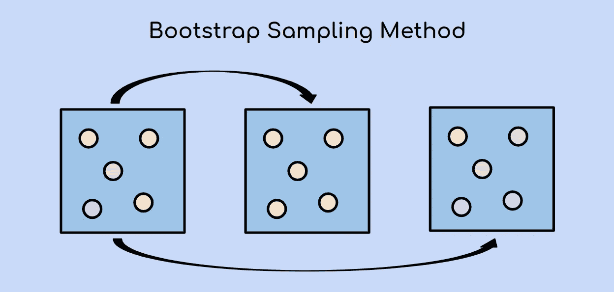
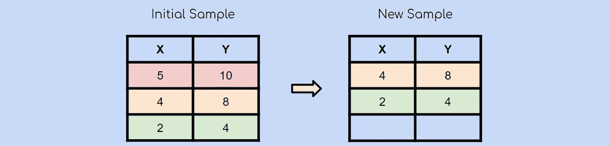
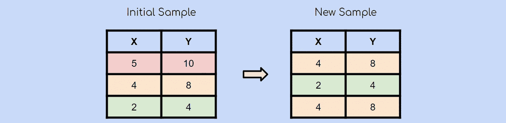

# 什么是机器学习中的 Bootstrap 采样，为什么它很重要？

> 原文：<https://towardsdatascience.com/what-is-bootstrap-sampling-in-machine-learning-and-why-is-it-important-a5bb90cbd89a?source=collection_archive---------5----------------------->

## 揭开基本机器学习概念的神秘面纱

作者创建的图像

如果你喜欢这个，请查看我的免费数据科学资源**，每周都有新的资料！**

*Bootstrap 采样方法是一个非常简单的概念，是 AdaBoost 和 XGBoost 等一些更高级的机器学习算法的构建模块。然而，当我开始我的数据科学之旅时，我不太明白它的意义。所以我的目标是解释什么是 bootstrap 方法，以及为什么知道它很重要！*

# *什么是 Bootstrap 抽样方法？*

*从技术上讲，bootstrap 抽样法是一种使用带替换的随机抽样的重抽样方法。*

*如果这听起来令人困惑，请不要担心，让我用图表来解释一下:*

**

*假设你有一个有 3 个观察值的初始样本。使用 bootstrap 抽样方法，您也将创建一个包含 3 个观察值的新样本。每个观察都有均等的机会被选中(1/3)。在这种情况下，第二个观察值是随机选择的，将是我们新样本中的第一个观察值。*

**

*在随机选择了另一个观察点后，你选择了绿色的观察点。*

**

*最后，再次随机选择黄色观察值。记住，自举采样使用随机采样**与替换**。这意味着已经选择的观察结果很有可能再次被选择。*

*而这就是 bootstrap 抽样的精髓！*

# *自助抽样的重要性*

*很好，现在你明白什么是 bootstrap 抽样了，你也知道这个概念有多简单，但是现在你可能想知道是什么让它如此有用。*

## *1.它是许多现代机器学习算法的基础*

*随着你对机器学习了解的越来越多，你几乎肯定会遇到术语“ **bootstrap aggregating** ”，也称为“ **bagging** ”。Bagging 是许多 **ensemble** 机器学习算法中使用的一种技术，如 random forests、AdaBoost、gradient boost 和 XGBoost。*

*[*查看我关于集成学习、打包和提升的文章。*](https://medium.com/@terenceshin/ensemble-learning-bagging-and-boosting-explained-in-3-minutes-2e6d2240ae21?source=friends_link&sk=2ac65b31bd3f4494bac383cda3678224)*

## *2.它可以用来估计总体的参数*

*有时，在估计总体参数(即平均值、标准误差)时，您可能有一个样本不足以假设抽样分布为正态分布。此外，在某些情况下，可能很难计算出估计的标准误差。在这两种情况下，bootstrap 抽样都可以用来解决这些问题。*

*本质上，在样本代表总体的假设下，进行自助抽样是为了提供有关样本统计量的抽样分布的估计。*

**这一点统计的比较多一点，如果不了解，也不用担心。你必须明白的是，bootstrap 采样是“bagging”的基础，这是许多机器学习模型使用的一种技术。**

# *感谢阅读！*

*如果你想学习更多的机器学习基础知识，并了解我的最新内容，你可以在这里[做](https://docs.google.com/document/d/1UV6pvCi9du37cYAcKNtuj-2rkCfbt7kBJieYhSRuwHw/edit#heading=h.8dxlgh60ooti)。*

*如果你想继续学习，请点击这里查看我的关于整体学习、打包和提升[的文章。](https://medium.com/@terenceshin/ensemble-learning-bagging-and-boosting-explained-in-3-minutes-2e6d2240ae21?source=friends_link&sk=2ac65b31bd3f4494bac383cda3678224)*

## *特伦斯·申*

*   **每周查看* [*我的免费数据科学资源*](https://docs.google.com/document/d/1UV6pvCi9du37cYAcKNtuj-2rkCfbt7kBJieYhSRuwHw/edit#heading=h.m63uwvt9w358) *的新资料！**
*   **如果你喜欢这个，* [*在 Medium 上关注我*](https://medium.com/@terenceshin) *了解更多**
*   **我们连线上*[*LinkedIn*](https://www.linkedin.com/in/terenceshin/)*