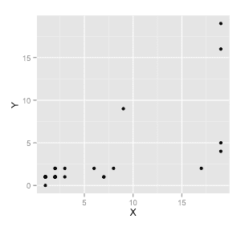
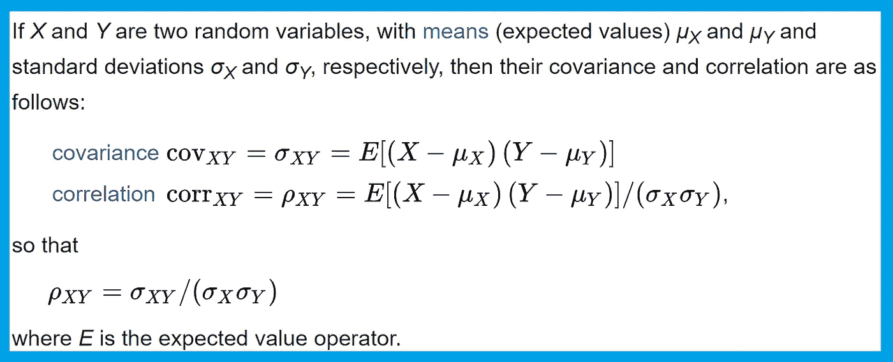
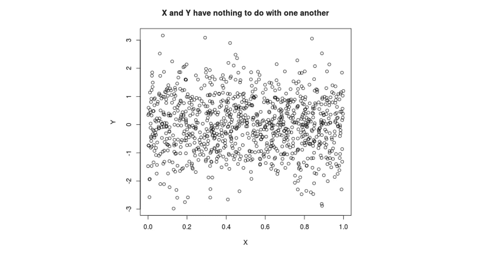
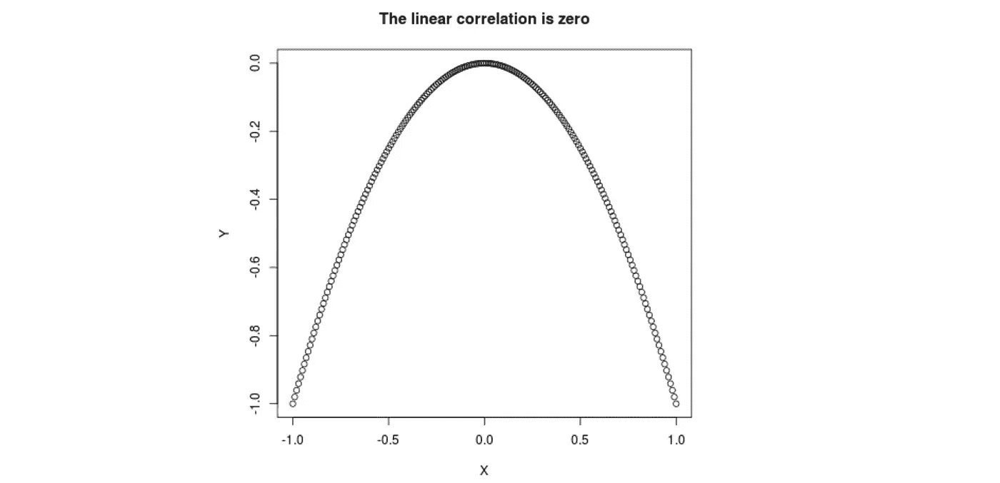
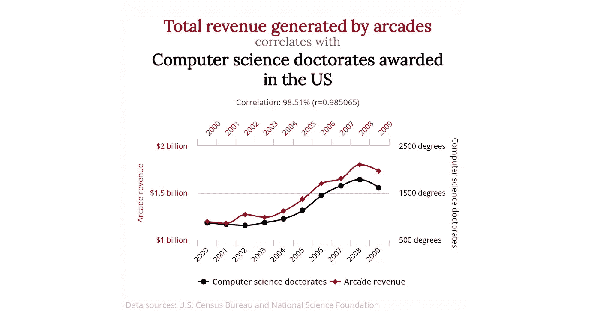

# 什么是相关性？

> 原文：<https://towardsdatascience.com/what-is-correlation-975ea899aaed?source=collection_archive---------11----------------------->

## 不是因果关系。

[实验](http://bit.ly/quaesita_experiment)让你说因果。没有它们，你所拥有的只是相关性。什么是相关性？

这不是因果关系。(!！！！！)

当然，你可能已经听到我们统计学家对你大喊大叫了。但是什么是*关联呢？当一个[数据集](http://bit.ly/quaesita_hist)中的变量看起来像以某种方式一起移动时。*

**

*如果两个变量 X 和 Y 以某种方式一起运动，那么它们就是相关的。*

*比如*“X 较高时，Y 趋向于***(这叫*正相关)或者*“X 较高时，Y 趋向于* ***低****(这叫 ***负*** 相关)。*****

****

**谢谢维基百科。**

**如果你正在寻找([人口](http://bit.ly/quaesita_vocab))相关性的公式，你的朋友维基百科有你需要的一切。但是如果你想要的话，为什么不直接去呢？你为什么在这里？啊，你想要直观的解释？酷毙了。这里有一座小山:**

****

**在左边，身高和(从左到右)距离是正相关的。当一个上升时，另一个也上升。右边，身高和距离是负相关的。**

**当大多数人听到相关性这个词时，他们往往会想到*完美的* ***线性相关性*** :在上面的小山上向右水平移动一步(X)，在同一斜坡上的任何地方都会得到相同的高度变化(Y)。只要你从左到右向上(正相关)，就不会有奇怪的锯齿/弯曲位。**

**记住**向上是积极的**只有当你从左向右走的时候，就像你读英语一样。如果你从右边接近山丘，统计学家不知道该拿你怎么办。我想统计学家试图告诉你的是永远不要从右边加息。那只会让我们困惑。**

**但是如果你适当地徒步旅行，那么“向上”是“积极的”**

# **不完全线性相关**

**现实中这个山头并不完美，所以高度和距离的相关量级会小于 100%。(根据我们是上涨还是下跌，你会在前面弹出一个+/-符号，所以相关性在-1 和 1 之间。那是因为它的公式，从上面的维基百科粘贴过来， ***除以标准差*** ，从而 ***去掉了每个变量的离差的大小*** 。如果没有这个分母，无论你用英寸还是厘米来测量身高，你都很难看出这种关系的强度是一样的。每当你在[统计](http://bit.ly/quaesita_statistics)中看到 ***缩放/标准化*** 时，它通常会帮助你比较用不同单位测量的苹果和橘子。)**

# **不相关变量**

**零相关看起来像什么？你想到的是一团内部没有可辨别图案的乱云吗？类似于:**

****

**当然，那行得通。你知道我怎么知道 X 和 Y 真的没有任何关系吗？因为我创造了他们。如果你想模拟两个不相关变量的相似曲线，试着在 R online 中运行这个基本代码片段[:](https://bit.ly/tryRui)**

```
**X <- runif(100) # 100 regular random numbers between 0 and 1
Y <- rnorm(100) # Another 100 random numbers from bell curve
plot(X, Y, main = "X and Y have nothing to do with one another")**
```

**但是还有另一种方法。关系越不线性，你的相关性就越接近于零。事实上，如果你把这座山作为一个整体来看(不仅仅是一次一个坡度)，你会发现一个零相关，即使高度和距离之间有一个明确的关系(咄，这是一座山)。**

****

```
**X <- seq(-1, 1, 0.01) # Go from -1 to 1 in increments of 0.01
Y <- -X^2 # Secret formula for the ideal hill
plot(X, Y, main = "The linear correlation is zero")
print(cor(X, Y)) # Check the correlation is zero**
```

# **相关性不是因果关系**

**线性相关的存在意味着数据以某种线性方式一起移动。并不意味着 X *导致* Y(或者反过来)。他们可能都在移动，完全是因为别的原因。**

**想要证据吗？想象一下你和我投资了同一支股票。姑且称之为 Zoom 吧，因为我觉得很搞笑的是，疫情投资者本打算收购 ZM(视频通讯公司)，却意外地买了 ZOOM(中国小盘股)，导致错误的 ZOOM 价格上涨了 900%，而真正的 ZM 甚至没有翻倍。**拭去欢笑与泪水** 无论如何——为了纪念这部喜剧——想象一下你和我在 ZOOM 上投资了一小笔钱。**

**因为我们都持有 ZOOM，所以你的股票投资组合价值(X)与我的股票投资组合价值(Y)相关。如果变焦上升，我们都获利。这并不意味着我的投资组合的价值*导致*你的投资组合的价值。我不能以惩罚你的方式抛售我所有的股票——如果我的投资组合价值突然变为零，因为我卖掉了所有的东西去买一堆纸杯蛋糕，这并不意味着你的现在一文不值。**

**正是因为这个原因，许多决策者一败涂地。看到两个相关的变量，他们投入资源影响事物 1，试图推动事物 2…结果并不是他们所期望的。没有[实验](http://bit.ly/quaesita_experiment)，他们没有理由首先假设事物 1 驱动事物 2。**

> **相关性不是因果关系。**

**可爱的术语“*”指的是两个相关变量之间没有直接因果关系的情况。它们的相关性可能是由于巧合，也可能是由于第三个变量(通常是看不见的，也称为“潜在的”)的影响。永远不要从表面上看相关性——在数据中，事情往往不像它们看起来的那样。***

******

***为了寻找虚假相关性的乐趣，请访问这个主要例子的网站[。](http://www.tylervigen.com/spurious-correlations)***

***总结一下，要说前因后果，需要一个(实！)[实验](http://bit.ly/quaesita_experiment)。没有实验，你所拥有的只是相关性，对于许多基于因果推理的决策来说，这是没有帮助的。***

# ***P.S .什么是回归？***

***它是把线穿过东西。把它想成，*“哦，嘿！这些事情是相关的，所以让我们用一个来预测另一个…”****

**什么是回归？它是把线穿过东西。我来告诉你一切。**

# **感谢阅读！一整个 AI 课程怎么样？**

**如果你在这里玩得开心，并且你正在寻找一个为初学者和专家设计的有趣的完整的应用人工智能课程，这里有一个我为你制作的娱乐课程:**

**在这里欣赏整个课程播放列表:[bit.ly/machinefriend](http://bit.ly/machinefriend)**

# **与凯西·科兹尔科夫联系**

**让我们做朋友吧！你可以在 [Twitter](https://twitter.com/quaesita) 、 [YouTube](https://www.youtube.com/channel/UCbOX--VOebPe-MMRkatFRxw) 、 [Substack](http://decision.substack.com) 和 [LinkedIn](https://www.linkedin.com/in/kozyrkov/) 上找到我。有兴趣让我在你的活动上发言吗？用[这个表格](http://bit.ly/makecassietalk)联系。**