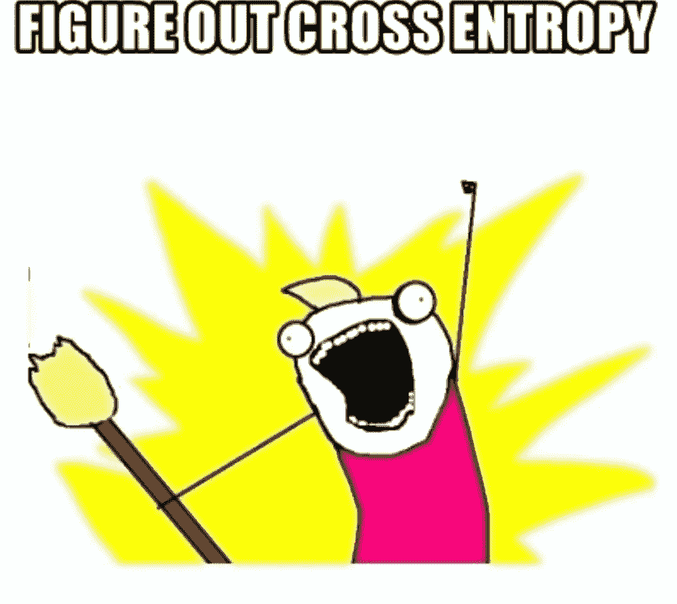
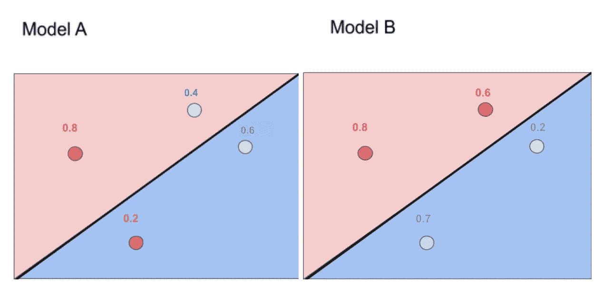
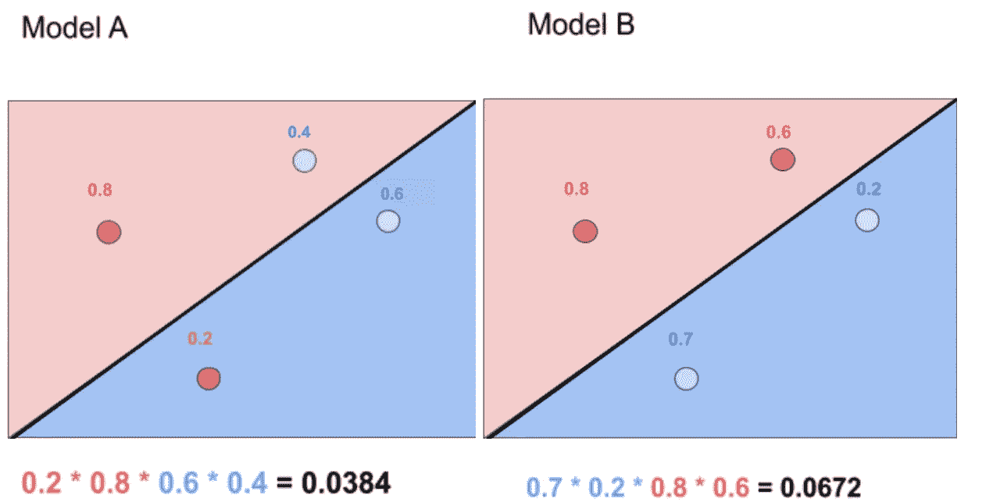
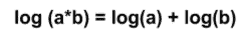
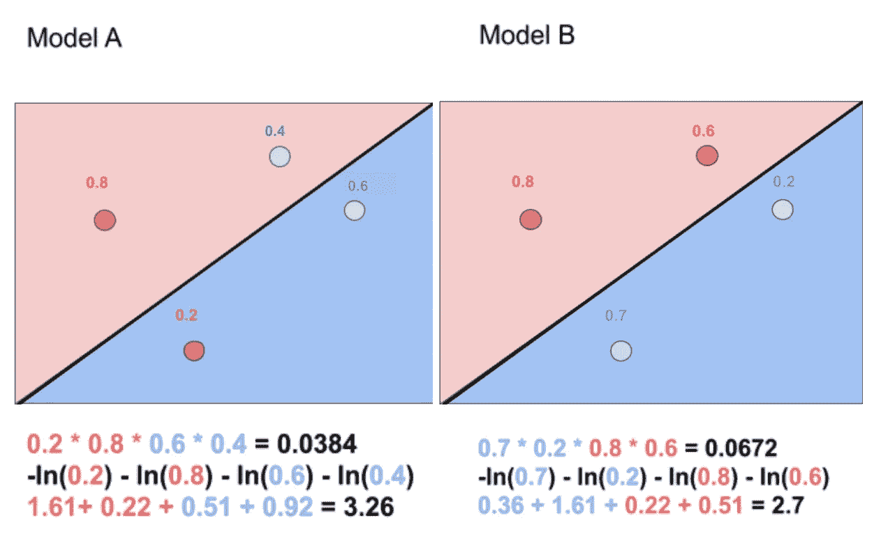
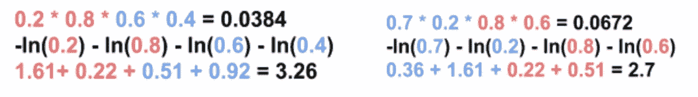
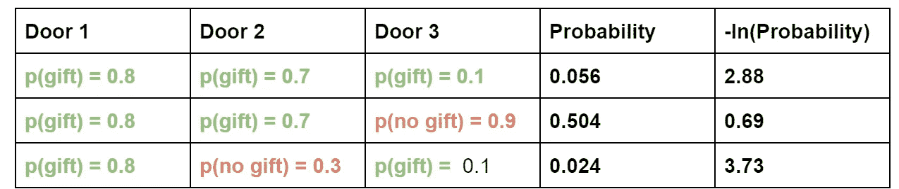
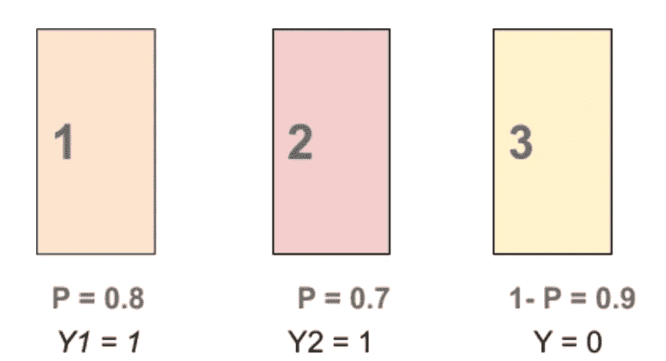
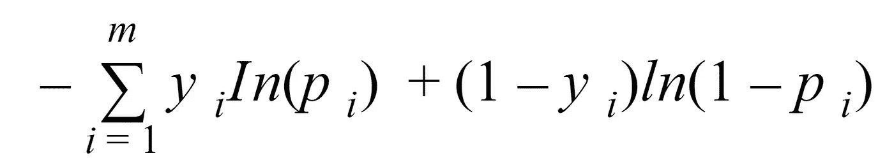
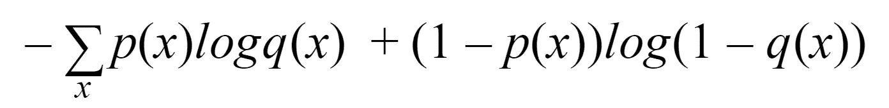

# 什么是交叉熵？

> 原文：<https://towardsdatascience.com/what-is-cross-entropy-3bdb04c13616?source=collection_archive---------2----------------------->

## 交叉熵的简要说明:什么是交叉熵，它是如何工作的，以及示例代码



从 [ImgFlip](https://imgflip.com/memegenerator) 生成的图像

> *交叉熵是分类问题中常用的损失函数。*

几周前，我做了一个相当重大的决定。夜深了，我躺在床上想着一天是怎么过的。因为我一直是一个分析自己选择的人，所以我问了自己两个非常重要的问题。

1.  我应该在睡觉前停止吃薯条吗？它们相当不健康…
2.  我是否按照自己想要的方式度过时间？

在考虑了这些想法之后，我意识到这两个问题的答案都是否定的。不，我不应该在睡觉前停止吃薯条。不，我没有用我想要的方式度过我的时间。因此，几周前，我决定尽我所能学习关于深度学习这一新兴领域的一切。我还选择写下我所学到的一切(所以如果你对旅程感兴趣，一定要[跟随我](https://medium.com/@anjalibhardwaj2700))。这些文章的灵感来自 Udacity 的一门课程，名为[用 PyTorch 进行深度学习](https://www.udacity.com/course/deep-learning-pytorch--ud188)。我强烈建议你去看看。

如果你是从我的上一篇文章来到这里的，你已经知道我们正在努力寻找数据分类的最佳方法。为了对数据进行最佳分类，我们希望最大化模型的概率，最小化其误差函数。这两件事是反向相关的。交叉熵基于概率和误差来衡量分类模型的性能，其中某个事物的可能性越大，交叉熵就越低。让我们更深入地研究这个问题。

# 交叉熵 101

交叉熵是一个[损失函数](https://machinelearningmastery.com/loss-and-loss-functions-for-training-deep-learning-neural-networks/)，可以用来量化两个概率分布之间的差异。这可以通过一个例子得到最好的解释。

假设，我们有两个模型，A 和 B，我们想找出哪个模型更好，



作者图片

> *注意:数据点附近的数字代表该点是该颜色的概率。例如，模型 A 中图形顶部的蓝点是蓝色的概率是 0.4。*

凭直觉，我们知道模型 B 更好，因为红点在红色分布上，蓝点在蓝色分布上。但是我们如何让一个模型预测这个呢？

一种方法是将模型 A 中每个点的概率相乘。这将给出模型的总概率，正如我们从概率中的[一般乘法法则所知。我们可以对模型 B 做类似的事情，](https://www.khanacademy.org/math/ap-statistics/probability-ap/probability-multiplication-rule/a/general-multiplication-rule#:~:text=When%20we%20calculate%20probabilities%20involving,probability%20of%20the%20second%20event.)



作者图片

从上图可以看出，最有可能的模型是模型 B，因为概率更高。太酷了！我们可以用概率来找出哪个模型更好。

除了……这个模型有些问题。正如你可能已经猜到的，如果我们有许多数据点，这将导致结果概率非常小。此外，如果我们改变了一个数据点，那么结果概率就会发生巨大变化。

简而言之，使用产品并不是最好的主意。那么我们该如何解决这个问题呢？一种方法是用求和来代替。如果您记得您的[日志规则](https://www.rapidtables.com/math/algebra/Logarithm.html)，有一种方法可以将乘积与总和联系起来，



作者图片

让我们把这个规则应用到我们的概率上，



作者图片

现在，这几乎看起来不错，但让我们通过使对数为负值来消除负值，让我们也计算一下总数。



作者图片

对概率使用负对数就是所谓的交叉熵，其中高数值意味着坏模型，低数值意味着好模型。

当我们计算每个数据点的对数时，我们实际上得到每个点的误差函数。例如，模型 A 中点 0.2 的误差函数为-ln(0.2)，等于 1.61。请注意，被错误分类的点具有较大的值，因此具有较大的误差。

所以让我们多理解一点交叉熵。交叉熵真正想说的是，如果你有事件和概率，基于概率事件发生的可能性有多大？如果可能性很大，我们就有一个小的交叉熵，如果可能性不大，我们就有一个大的交叉熵。我们将在一个例子后看到更多

例如，如果我们假设三扇门后有一份礼物，我们有一张如下所示的桌子，



作者图片

> 注意:有更多的可能性

这里我们可以看到，如果交叉熵很大，那么事件发生的概率就很低，反之亦然。

让我们更深入地看看这个例子。假设，我们取第一种情况，门 1 是 p(gift) = 0.8，门 2 是 p(gift) =0.7，门 3 是 p(gift)=0.1，



作者图片

请注意，我们将第三扇门描述为 1-p，这意味着 1 减去有礼物的概率。这样会给我们没有礼物的概率。另外，注意 y 描述了门后有多少礼物。

所以交叉熵可以用下面的公式来描述，



作者图片

> 注意:这是描述负对数的另一种方式。

这个公式计算了上述情况的熵。它计算负对数，也就是交叉熵。

这个函数的有用之处在于它也可以写成这种形式，



作者图片

> 注意:这个公式只针对二元交叉熵。如果你对多类交叉熵感兴趣，看看这个视频吧！

该函数允许两个函数，p(x)和 q(x)。我们可以把 p(x)描述为期望概率，q(x)描述为实际概率。

因此，交叉熵公式描述了预测分布与真实分布的接近程度。

## 结论

总的来说，正如我们所看到的，交叉熵只是一种度量模型概率的方法。交叉熵是有用的，因为它可以描述模型的可能性以及每个数据点的误差函数。它还可以用来描述与真实结果相比的预测结果。所以希望你开始看到这是多么强大！

## 一些代码

让我们看看如何用 python 来编写代码！

```
import numpy as np# This function takes as input two lists Y, P,
# and returns the float corresponding to their cross-entropy.def cross_entropy(Y, P):
    Y = np.float_(Y)
    P = np.float_(P)
    return -np.sum(Y * np.log(P) + (1 - Y) * np.log(1 - P))
```

*这段代码直接取自 Udacity 课程，* [*深度学习用 PyTorch。*](https://classroom.udacity.com/courses/ud188/lessons/b4ca7aaa-b346-43b1-ae7d-20d27b2eab65/concepts/760235e0-a3ec-4e56-8cdb-56d762886690)

这个简单的代码接受两个输入并返回交叉熵。

# 关键要点

**什么是交叉熵？**
交叉熵是一个[损失函数](https://machinelearningmastery.com/loss-and-loss-functions-for-training-deep-learning-neural-networks/)，用于量化两个概率分布之间的差异。

# Week✨的 DL 视频

这个人工智能可以把你的脸变成迪斯尼人物！

# 额外资源/引用

[这是一个关于交叉熵的很好的形式。](https://stackoverflow.com/questions/41990250/what-is-cross-entropy)

关于交叉熵的完美的[备忘单](https://ml-cheatsheet.readthedocs.io/en/latest/loss_functions.html)

# 你能在哪里找到我😝

[我的 LinkedIn！请随时与我联系，我喜欢谈论人工智能！](http://www.linkedin.com/in/anjalibhardwaj2700)

[关注我的中页了解更多](https://medium.com/@anjalibhardwaj2700)！