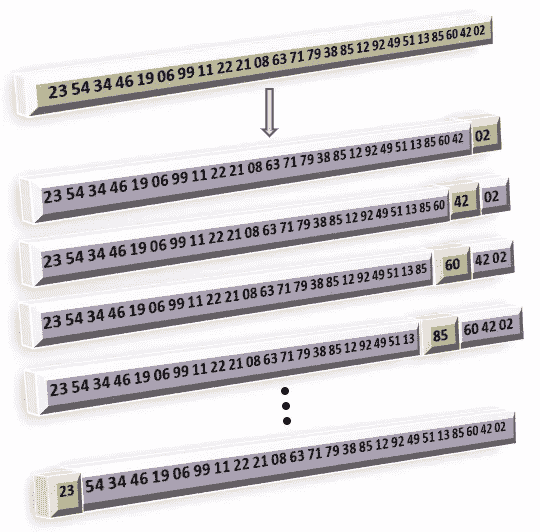
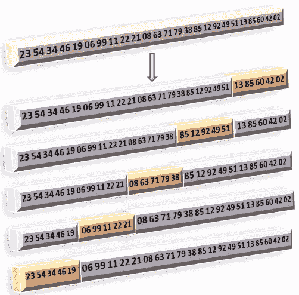

# 什么是交叉验证？

> 原文：<https://towardsdatascience.com/what-is-cross-validation-622d5a962231?source=collection_archive---------20----------------------->

## 此外，什么是 LOOCV 和 k 倍交叉验证技术？

Ashkan Forouzani 在 [Unsplash](https://unsplash.com?utm_source=medium&utm_medium=referral) 上的照片

现代统计学和机器学习最重要的一个方面是 ***重采样，这是从训练集中重复抽取样本(子集)并在每个样本上重新调整特定模型的过程，以便获得拟合的可变性等信息。***

我们使用重采样的原因之一是，我们可以分析模型在同一数据集的许多样本上拟合的结果。这使我们能够获得一些额外的知识，而这些知识是通过仅仅一次拟合模型所不能获得的。使用这种方法的另一个原因是通过多次迭代来评估测试误差，以便更好地判断模型性能。

一种这样的重采样方法是 ***交叉验证。***

## 交叉验证

***通常用于在几个数据训练样本上拟合机器学习模型时分析测试误差(模型评估)。然后，它进一步帮助我们根据模型的复杂性选择合适的模型(模型选择)。***

如果我们在训练完一个模型后就有现成的测试数据，事情会简单得多。然而，这在现实世界中很难实现。因此，数据科学家使用重采样技术从原始数据集制作他们自己的测试数据。

这样做的一种方式是通过*从拟合过程中获得*训练数据的一部分或子集，然后根据获得的数据估计模型的性能。这种方法被称为*验证集方法。*

在该方法中，原始数据集被随机分为训练集和*验证集(保留集)。*该模型适用于训练集，然后用于预测验证集的结果。最终的评估是在验证集上完成的，在这种情况下，它就像一个测试数据集。

观察值分为训练集和验证集。图片由 [Sangeet Aggarwal](https://medium.com/u/db3258338f2f?source=post_page-----622d5a962231--------------------------------) 提供

上图描述了如何将观察分为训练集和验证集的示例。验证集是随机抽取的，其大小取决于用户的选择。例如，我可以将验证集选择为原始集的 40%，或者任何其他分数或百分比值。选择时通常要考虑要分割的数据的大小。

在实践中，可能需要迭代地(重复地)进行这种划分，以便在不同的样本上拟合相同的模型，并在不同的验证集上对其进行评估。然而，减少训练集的大小并不总是可取的，因为已知当在更少的观察值上训练时，统计方法表现更差。这需要一种特殊类型的交叉验证技术→ *留一交叉验证(LOOCV)* 。

## 留一法交叉验证(LOOCV)

*LOOCV 是交叉验证的例子，其中只有一个观察结果被提出来验证。*

留一交叉验证。**绿色:**原始数据。**紫色:**训练集。**橙色:**单一验证点。图片由 [Sangeet Aggarwal](https://medium.com/u/db3258338f2f?source=post_page-----622d5a962231--------------------------------)

对每个保留的观察值评估模型。然后，通过取所有单个评估的平均值来计算最终结果。

这种技术解决了使用小训练集的缺点，如在一般验证集方法中所见，因为模型适合于几乎所有的训练样本(n-1 个观察)。然而，LOOCV 有两个问题。

1.  使用 LOOCV 在计算上可能是昂贵的，尤其是如果数据量很大，并且如果模型仅需要花费大量时间来完成一次学习。这是因为我们在整个训练集上迭代拟合模型。
2.  LOOCV 的另一个问题是，它可能会受到高方差或过度拟合的影响，因为我们向模型提供了几乎所有要学习的训练数据，而只提供了一个要评估的观察值。

这些问题可以通过使用另一种被称为 k-Fold 交叉验证的验证技术来解决。

## k 倍交叉验证

*这种方法包括将数据随机分成 k 个大致相等的折叠或组。然后，这些折叠中的每一个都被视为 k 次不同迭代中的验证集。*

假设 k 的值是 5，那么 k 倍 CV 可以形象化如下。

k=5 的 k 倍交叉验证。图片由 [Sangeet Aggarwal](https://medium.com/u/db3258338f2f?source=post_page-----622d5a962231--------------------------------) 提供

如图所示，选择 5 个折叠或组作为验证集，而其余数据用于训练模型。

这种方法解决了 LOOCV 的缺点，因为它只需要第*k-**部分数据进行验证，从而允许模型在大量观察值上进行训练。与 LOOCV 相比，它还减少了计算开销，因为迭代次数现在从 *n* (其中 k < < n)减少到 *k* 。*

> *LOOCV 是 k 倍交叉验证的一个特例，其中 k 等于数据的大小(n)。*

*在 LOOCV 上使用 k 倍交叉验证是[偏差-方差权衡](/bias-variance-tradeoff-7ca56ba182a?source=---------5------------------)的一个例子。它减少了 LOOCV 显示的方差，并通过提供一个相当大的验证集引入了一些偏差。*

*这个帖子到此为止。我希望你在学习交叉验证的过程中过得愉快。欲知详情，敬请关注。*