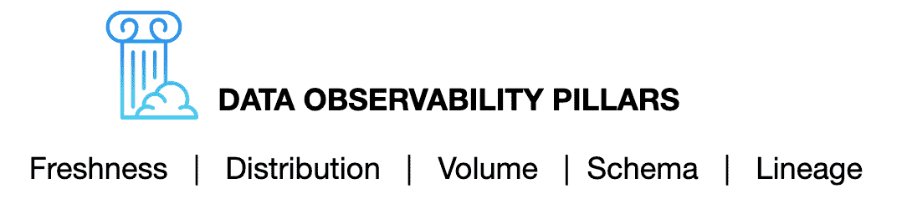

# 什么是数据可观测性？

> 原文：<https://towardsdatascience.com/what-is-data-observability-40b337971e3e?source=collection_archive---------7----------------------->

## 提示:这不仅仅是 DevOps 的数据。

**图片由**[happy _ contributors提供](https://www.shutterstock.com/g/Lavrova%2BEkaterina)

*可观察性不再仅仅是软件工程的专利。随着数据停机时间的增加和数据堆栈的日益复杂，可观察性也成为数据团队的一个关键问题。*

[开发运营](https://en.wikipedia.org/wiki/DevOps)(亲切地称为 DevOps)团队已经成为大多数工程组织不可或缺的组成部分。DevOps 团队消除了软件开发人员和 IT 之间的孤岛，促进了软件无缝可靠地发布到生产环境中。

随着组织的发展，支持它们的底层技术体系变得越来越复杂(想想:[从整体架构转向微服务架构](https://martinfowler.com/articles/break-monolith-into-microservices.html))，DevOps 团队保持对其系统健康状况的持续关注是非常重要的。

作为整个行业向分布式系统转变的结果，可观测性工程已经成为一门快速发展的工程学科。在其核心，可观测性工程被分解成三大支柱**:**

*   ****指标**是指一段时间内测量的数据的数字表示。**
*   ****日志**，在给定时间戳发生的事件的记录，也提供关于特定事件何时发生的有价值的上下文。**
*   ****痕迹**表示分布式环境中因果相关的事件。**

**(关于这些更详细的描述，我强烈推荐阅读 Cindy Sridharan 的标志性帖子，[监控和可观察性](https://medium.com/@copyconstruct/monitoring-and-observability-8417d1952e1c))。**

**总的来说，这三个支柱为 DevOps 团队提供了有价值的洞察力来预测未来的行为，反过来，信任他们的系统来满足 SLA。抽象到你的底线，可靠的软件意味着可靠的产品，这导致了快乐的用户。**

> **然而，即使有最好的可观察性解决方案，如果您的数据不可靠，再多花哨的工具或工程术语也无法让客户满意。**

# **数据停机时间的增加**

**作为 Gainsight 的客户成功运营副总裁，我负责领导一个团队，为我们的首席执行官编写每周报告，概述客户数据和分析。一次又一次，我们提交了一份报告，几分钟后才被告知我们的数据有问题。不管我们的管道有多强大，也不管我们检查 SQL 多少次:我们的数据就是不可靠。**

**不幸的是，这个问题并不是 Gainsight 独有的。在与 100 多位数据领导者谈论他们最大的痛点后，我了解到 [**数据宕机**](/the-rise-of-data-downtime-841650cedfd5) 高居榜首。随着数据系统变得越来越复杂，数据停机时间(数据不完整、错误、丢失或不准确的时间段)只会成倍增加，从而支持无止境的源和消费者生态系统。**

**对于数据工程师和开发人员来说，数据宕机意味着时间和资源的浪费；对于数据消费者来说，这会削弱他们对决策的信心。和我一样，我交谈过的领导不能相信他们的数据，这是一个严重的问题。**

# **简介:数据可观察性**

**团队经常临时处理数据质量和沿袭问题，而不是制定一个整体的方法来解决数据停机问题。就像 DevOps 将可观察性应用于软件一样，我认为现在是我们利用同样的数据勤奋的时候了。**

**[**数据可观察性**](/good-pipelines-bad-data-e55d9ba17920?source=friends_link&sk=5fbd36df9f58e28098d35659df93f8b4) ，组织全面了解其系统中数据运行状况的能力，通过将 DevOps 可观察性的最佳实践应用于数据管道来消除数据停机。与 DevOps 类似，Data Observability 使用自动化监控、警报和分类来识别和评估数据质量和可发现性问题，从而实现更健康的渠道、更高效的团队和更满意的客户。**

**为了简单起见，我将数据可观察性分解成它自己的五个支柱:新鲜度、分布、容量、模式和血统。这些组件共同提供了对数据质量和可靠性的宝贵见解。**

****

*   ****Freshness** : Freshness 试图了解你的数据表有多新，以及你的表更新的频率。决策时，新鲜感尤为重要；毕竟，陈旧的数据基本上等同于浪费时间和金钱。**
*   ****分布**:分布，换句话说，是数据可能值的函数，告诉你数据是否在可接受的范围内。数据分布使您能够根据对数据的预期来判断表是否可信。**
*   ****卷:**卷是指你的数据表的完整性，并提供关于你的数据源的健康状况的见解。如果 2 亿行突然变成 500 万行，你应该知道。**
*   ****模式**:数据组织的变化，换句话说，模式的变化，通常表示数据损坏。监控谁在何时对这些表进行了更改是了解数据生态系统健康状况的基础。**
*   ****血统**:当数据断裂时，第一个问题永远是“哪里？”数据谱系通过告诉您哪些上游来源和下游来源受到了影响，以及哪些团队正在生成数据和谁正在访问数据来提供答案。Good lineage 还收集关于数据的信息(也称为元数据),这些信息涉及与特定数据表相关联的治理、业务和技术指导原则，作为所有消费者的单一真实来源。**

# **在您的公司释放数据可观察性**

**多亏了 DevOps，我们有了一个简单的镜头来看待可观测性作为应用数据的重要性。数据可观察性的五大支柱通过在数据停机事件出现时立即将其呈现出来，为实现真正的端到端可靠性提供了必要的整体框架。**

> **与传统的 DevOps 可观察性工具一样，最好的数据可观察性解决方案不仅要监控这些支柱，还要从一开始就防止坏数据进入它们。**

**我们认为，一个出色的数据可观察性解决方案具有以下特征:**

*   **它**快速无缝地连接到您现有的堆栈**，并且不需要修改您的管道、编写新代码或使用特定的编程语言。这允许快速实现价值和最大化测试覆盖率，而不必进行大量投资。**
*   **它**监控您的静态数据**，并且不需要从当前存储的位置提取数据。这使得该解决方案具有高性能、可扩展性和成本效益。它还确保您满足最高级别的安全性和合规性要求。**
*   **它**需要最小的配置**并且实际上没有阈值设置。它使用 ML 模型来自动学习您的环境和数据。它使用异常检测技术让你知道什么时候有东西坏了。它不仅考虑单个指标，还考虑数据的整体视图以及任何特定问题的潜在影响，从而最大限度地减少误报。您不需要花费资源来配置和维护嘈杂的规则。**
*   **它**不需要事先映射**需要监控什么以及以什么方式监控。它帮助您识别关键资源、关键依赖项和关键不变量，这样您就可以轻松获得广泛的可观察性。**
*   **It **提供丰富的上下文**，支持快速分类和故障排除，以及与受数据可靠性问题影响的利益相关方进行有效沟通。它不会停留在“今天表 Y 中的字段 X 的值小于 Z”上**
*   **它**通过公开有关数据资产的丰富信息，从一开始就防止问题发生**,以便负责任地主动做出更改和修改。**

**此外，当问题出现时，这些工具会在其他人之前提醒您的团队。是的，甚至是你的首席执行官。**

*****如果你想了解更多，联系*** [***巴尔摩西***](https://www.linkedin.com/in/barrmoses/) ***或者访问 montecarlodata.com*****

***有兴趣加入数据可靠性运动吗？把手伸向* [*蒙特卡洛团队*](https://www.montecarlodata.com/request-a-demo/) *！***

********