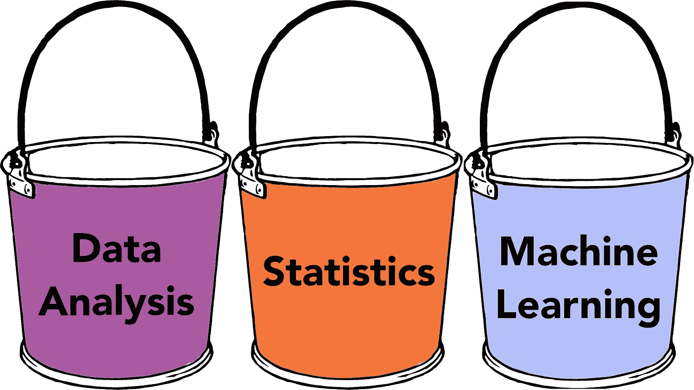
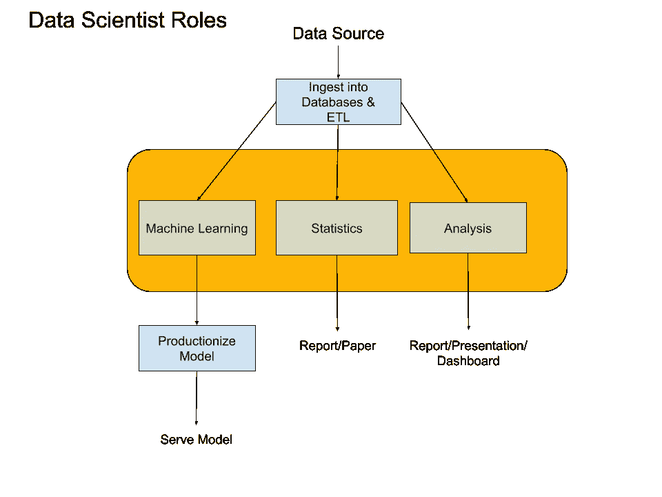
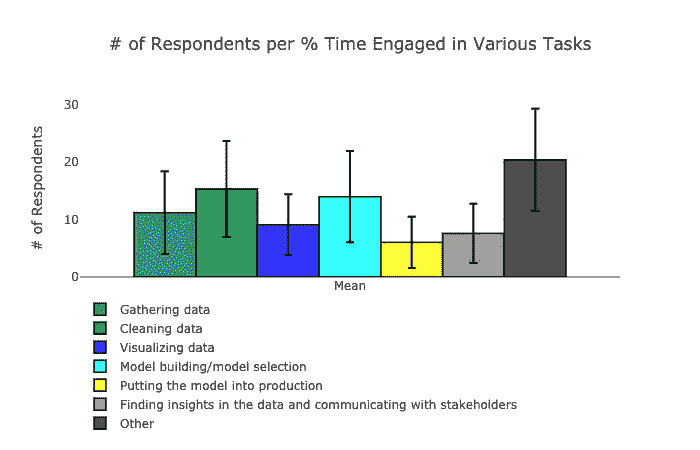
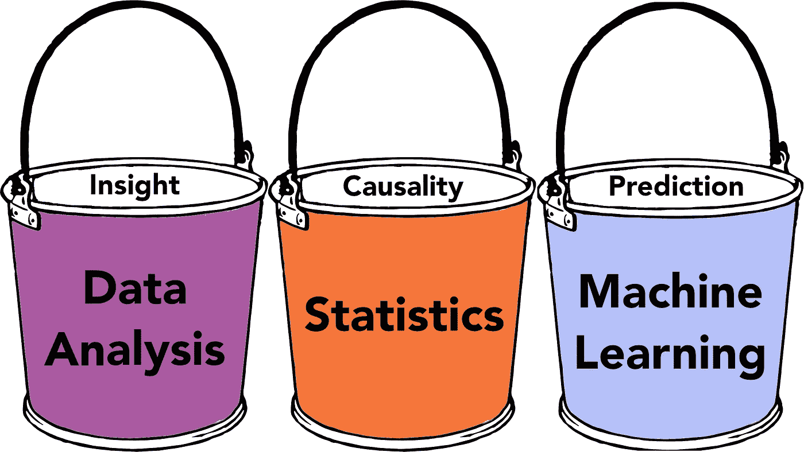

# 什么是数据科学？

> 原文：<https://towardsdatascience.com/what-is-data-science-8c8fbaef1d37?source=collection_archive---------13----------------------->

## 每个数据科学项目都有以下三个目标之一

*什么是数据科学？*是一个简单的问题，但答案往往令人困惑。我经常听到人们说数据科学只不过是穿上奇装异服的统计学。数据科学被戏称为 Mac 电脑上的 T2 统计学。一位数据科学家被称为[，一位住在加州的数据分析师](https://www.dataplusscience.com/DataScientist.html)。😂

对理解的追求。资料来源:pixabay.com

虽然这些说法很幽默，但数据科学包含什么却一点都不明显。这些年来，有许多数据科学[文氏图](https://www.kdnuggets.com/2016/10/battle-data-science-venn-diagrams.html)和许多定义。然而，在我的研究中，我发现的那些要么令人费解，要么缺少三个核心数据科学功能中的一个。

在本文中，您将了解数据科学的三个主要部分。您还将了解一种新兴的数据科学项目。最后，您将看到对数据科学很重要的另外两个领域，但不是核心的一部分。

一个数据科学项目有三个目标之一——要么*提供洞察力*，*建立因果关系*，要么*做出预测*。这三个目标与*数据分析*、*统计*和*机器学习*的领域相关联。

来源:杰夫·黑尔改编自 pixabay.com。来自 https://venngage.com/blog/color-blind-friendly-palette/的色盲友好调色板

*   *分析*用于从现有数据中提取和传达见解。
*   *统计*用于建立因果关系。
*   *机器学习*以预测为目标。

## 数据科学的定义

这是我的定义，涵盖了所有三个领域:

> 数据科学是利用数据做出更好的决策，通过分析洞察、统计因果关系和机器学习进行预测。

有可能仅仅是一名数据分析师、统计学家或机器学习工程师。然而，一个*数据科学家*是一个能做到这三点的人。👍

在起草这篇文章后，我看到见解深刻、雄辩的 [Cassie Kozyrkov](https://medium.com/u/2fccb851bb5e?source=post_page-----8c8fbaef1d37--------------------------------) 也得出了[类似的结论](https://medium.com/hackernoon/what-on-earth-is-data-science-eb1237d8cb37)——她将数据科学定义为“使数据有用的学科”，然后将其分为统计学、机器学习和数据挖掘/分析。她类似的崩溃让我相信，通过关注这三个核心方面来帮助人们理解什么是数据科学是有价值的。🎉

此外，我谦卑地提醒我，几乎任何中途体面的想法，我有过，凯西可能多年前。😀

# 数据科学背景

这是我对数据如何在组织中流动的描述。核心数据科学角色在 peach 中突出显示。

杰夫·黑尔制图

我们先来看数据分析。

# 数据分析📊

数据分析的目标是在现有数据中发现真知灼见。

**例题分析问题:** *是什么原因导致了上个月的销量下降？*

问问题的人可能希望你带来相关的研究，以节省他们的时间。向 [Cassie Kozyrkov](https://medium.com/u/2fccb851bb5e?source=post_page-----8c8fbaef1d37--------------------------------) 致敬，他在本文中很好地解释了这个想法。

或者，提问者可能想让你回答他们的问题并构思一个故事。然后你会用这些数据来证明你的论点，解释为什么销售额会下降。

数据分析师的工作需要诚实地探索问题。你需要有效的假设，但是你必须跟随证据的方向，并根据你的发现产生新的假设。

数据分析需要批判性思维和理性诚实。

使用不当的数据分析是混淆。是[如何用统计数据撒谎](https://www.amazon.com/How-Lie-Statistics-Darrell-Huff/dp/0393310728)。它声称美国在新冠肺炎方面做得很好，并用一张显示死亡人数占病例比例的图表来支持这一说法。🤦‍♂ ️A 更相关的指标是死亡人数占人口的比例。你可以在下面看到大型发达国家的图表。

来源:数据中的我们的世界:[https://ourworldindata . org/grapher/daily-covid-deaths-per-million-7-day-average？时间=2020-07-07..&国家=加拿大~ DEU ~意大利~ JPN ~韩国~ KOR ~美国~ESP](https://ourworldindata.org/grapher/daily-covid-deaths-per-million-7-day-average?time=2020-07-07..&country=CAN~DEU~ITA~JPN~KOR~GBR~USA~ESP)

在数据分析中，你可能会涉足因果关系的领域，但你应该小心做出因果关系的断言。你不是在创造实验和使用推论统计学。

股市谈头整天做分析，经常用因果关系的语言。他们的解释似是而非，但一般都经不起检验。

*   *今天股市为什么上涨？交易员喜欢这些就业数字。*
*   *为什么会下跌？交易员对糟糕的就业报告不予理会。*

你应该持怀疑态度。这些因果陈述不是不可证实的。

资料来源:pixabay.com

做数据分析的时候，报告和演示往往是一次性的事情。如果您发现自己重复呈现相同的指标和图表。建立一个仪表板可能是一个好主意，它将自动获取数据，并向利益相关者显示这些指标和可视化。

最常见的数据分析技术工具依次是 SQL、Excel、Tableau。其次是用 Python 和 R 编程。点击查看我对数据分析师职位技术的分析[。](/most-in-demand-tech-skills-for-data-analysts-26d4ea4450f8)

在这三个领域中，掌握数据分析通常需要最少的培训时间。您需要了解如何查询数据、使用描述性统计数据以及显示数据。你不一定需要编程技能或高级统计。然而，编程技能对于自动化分析通常是有用的。😀

现在让我们看看数据科学的第二个核心领域:统计学。

沿着小路走。资料来源:pixabay.com

# 统计数字🔢

统计学是科学方法的关键部分。这就是我们如何利用收集到的数据，运用概率和数学的严谨性来提出因果关系。

**示例统计问题:**我们网站的哪个版本会带来更多销售额？

假设你想提高你网站的转化率。当然，你已经在用户体验和网站设计中使用了最佳实践。😀现在你有两个不同的网站设计要测试。

您希望根据随机控制实验从总体样本中推断出总体。如果你想从 frequentest 统计数据中进行 A/B 测试，你需要预先确定要收集多少数据，以及确定显著性的临界值。不准作弊！统计学就是严谨。☝️

或者，要回答这个问题，你可以使用贝叶斯统计的多臂土匪测试。这两种方法都试图从人口的随机样本中得出推论。参见[这篇博文](https://cxl.com/blog/bandit-tests/)了解更多关于这个话题的信息。

做统计时，你关心的是效应大小、p 值、置信区间或可信区间。你被中心极限定理打倒了。你知道统计分布和常见的统计测试，如卡方检验，方差分析，线性回归和逻辑回归。你可以用 ARIMA 或霍尔特-温特斯指数平滑法来处理时间序列。

您可以使用 R、Python(可能使用 pandas 或 NumPy 和 statsmodels 或 scipy)或 SAS 作为您的工具。

统计通常涉及将数据与一些现象的潜在理论分布相匹配。[这里有一篇关于数据科学与统计学历史的精彩文章](https://www.tandfonline.com/doi/full/10.1080/10618600.2017.1384734)。

根据你的研究问题，你可能需要深厚的领域专业知识，或者你的团队中有这样的人。👍

现在让我们来看看机器学习，这个让数据科学流行起来的酷小子。

在理解的道路上走得更远。资料来源:pixabay.com

# 机器学习🖥

机器学习的关键特征是预测占主导地位。

**示例机器学习问题:**下个月客户流失会是什么？

当进行机器学习时，你不太关心统计分布的假设，你关心的是什么有效。你可能不关心哪些变量导致了结果。

线性回归的方差齐性假设被违反了吗？如果你只关心模型对结果变量的预测有多好，那么“谁关心，我的模型预测得好”，就是一个合理的回答。机器学习的人是实用主义者。

然而，许多机器学习问题与统计学有相当多的重叠。

*   有时候，可解释性是关键——例如银行贷款决策。当你需要解释为什么有人被拒绝贷款时，可解释性的统计要求就很重要。在这种情况下，你关心的是预测的有效性和可解释性。👍
*   机器学习与统计学共享一些算法，如线性和逻辑回归。
*   像统计学家一样，机器学习研究人员希望最简单的模型能够很好地工作。这为训练和推理节省了时间和金钱。

除了机器学习更关注预测之外，它与统计学也有一些根本的区别。

*   从事机器学习的人应该比严格从事统计的人更擅长编程。
*   在机器学习中，你训练你的模型，并根据他们以前没有见过的数据评估你的模型类型和超参数。这种坚持测试集通常在传统统计学中找不到。
*   机器学习旨在利用更大的数据和更强的处理能力。当处理能力变得便宜，数据变得丰富时，它的复杂算法变得有用。

现在让我们深入研究深度学习——一个正在发生惊人突破的机器学习算法家族。☀️

## 深度学习🧠

[深度学习](https://en.wikipedia.org/wiki/Deep_learning)，又称人工神经网络，需要多层隐藏节点。随着模型以优化损失函数为目标被训练，节点的权重被迭代更新。

深度学习正在吃掉越来越多的过去用更传统的机器学习算法解决的问题。

如果预测变量和结果变量之间的关系很复杂，深度学习通常是首选的工具。例如，[图像分类](https://en.wikipedia.org/wiki/ImageNet)就是深度学习擅长的一个领域。[自然语言处理](https://medium.com/dair-ai/deep-learning-for-nlp-an-overview-of-recent-trends-d0d8f40a776d) (NLP)是深度学习被用于多种人工智能突破的另一个领域。

尽管洞察力、因果关系和预测是数据科学家通常处理的任务类型，但他们已经开始将深度学习用于第四项任务: ***创造*。**

通过使用[生成性对抗网络](https://en.wikipedia.org/wiki/Generative_adversarial_network) (GANs)，创造性的突破正在发生。这个领域对人类未来的重要性是巨大的。查看最新的 [GPT-3](https://thenextweb.com/neural/2020/07/23/openais-new-gpt-3-language-explained-in-under-3-minutes-syndication/) NLP 模型，看看有什么可能。😲

大多数数据科学家都没有使用深度学习进行创作，尽管它的流行程度正在增加。在未来，创造可能会成为数据科学家角色的核心组成部分。

您已经看到了数据科学家如何使用数据分析、统计和机器学习。现在，让我们简单地看一下对数据科学很重要，但不是核心的两个领域。

## 数据工程

数据收集、存储和准备对于数据科学至关重要。你可能听说过一个统计数据，数据科学家 80%的工作是数据清理。然而，这个数字似乎是类似于电话游戏的结果。📞点击这里查看挖掘源头的伟大研究[。](https://blog.ldodds.com/2020/01/31/do-data-scientists-spend-80-of-their-time-cleaning-data-turns-out-no/))

下面的图表来自 Kaggle 2018 年开发者调查，显示了受访者如何报告他们的时间。该调查收到了来自世界各地的近 24，000 份回复。请注意，它包括数据科学家以外的职业和大量学生。

来源:Kaggle 的保罗·蒂莫西·穆尼的[分析](https://www.kaggle.com/paultimothymooney/2018-kaggle-machine-learning-data-science-survey)

值得一提的是，收集和清理数据平均花费了受访者 25%以上的时间。那不是无关紧要，但也不是 80%。😉

最近几年，数据工程师作为一个独立的职位出现了。许多组织现在都有专门的数据工程师来构建管道，以注入、转换和存储数据供其他人使用。然而，在小型组织中，数据工程和机器学习可能由同一个人来完成。

所有这些都是说，许多数据科学家也做一些数据收集和清理工作——这只是不是他们的核心职能。

接下来，让我们将注意力转移到机器学习模型离开数据科学家后会发生什么。🚀

## 机器学习工程

机器学习工程师问“我们可以用这些模型建造什么，我们如何做到这一点？”——[迦凯撒](https://medium.com/u/ae1782e046c3?source=post_page-----8c8fbaef1d37--------------------------------) [这里](/moving-from-data-science-to-machine-learning-engineering-68916173eaf3)。

机器学习工程师生产模型。机器学习工程师必须确保模型不断更新，并且能够可靠地做出大规模快速、高质量的预测。在这里可以看到我关于机器学习工程师热门技术技能的文章[。](/the-most-in-demand-tech-skills-for-machine-learning-engineers-7498754887d4)

数据工程和机器学习工程对数据科学很重要，但不在其主要领域。

隧道尽头的光明。资料来源:pixabay.com

# 概述

数据科学项目的主要目标是洞察、因果关系或预测。

来源:杰夫·黑尔改编自 pixabay.com。色盲友好调色板来自[https://venngage.com/blog/color-blind-friendly-palette/](https://venngage.com/blog/color-blind-friendly-palette/)

做好数据科学需要有编码、伦理、沟通、数学、批判性思维的基础。它还要求理解问题的背景。虽然这个技能集很大，但数据科学家不是独角兽。🦄

数据科学家需要了解分析、统计和机器学习过程。理解数据工程和机器学习工程也很有价值。然而，你不需要在所有事情上都是专家。队友就是干这个的。😀

最重要的是，数据科学家在不断学习。我建议你专注于自己的学习之旅，并接受谦逊，因为你会觉得总有更多东西要学。总比不知所措的感觉好。😂

走出树林了！来源:pixabay.com

# 包装

我希望你喜欢这篇文章，并发现它是有帮助的。如果你有，请在你最喜欢的社交媒体上分享，这样其他人也可以找到它。😀

我撰写关于 [Python](https://memorablepython.com) 、 [SQL](https://memorablesql.com) 、 [Docker](https://memorabledocker.com) 以及其他技术主题的文章。如果你对这些感兴趣，请注册我的[邮件列表，那里有很棒的数据科学资源](https://dataawesome.com)，点击这里阅读更多帮助你提高技能的内容。👍

资料来源:pixabay.com

祝数据科学快乐！😀