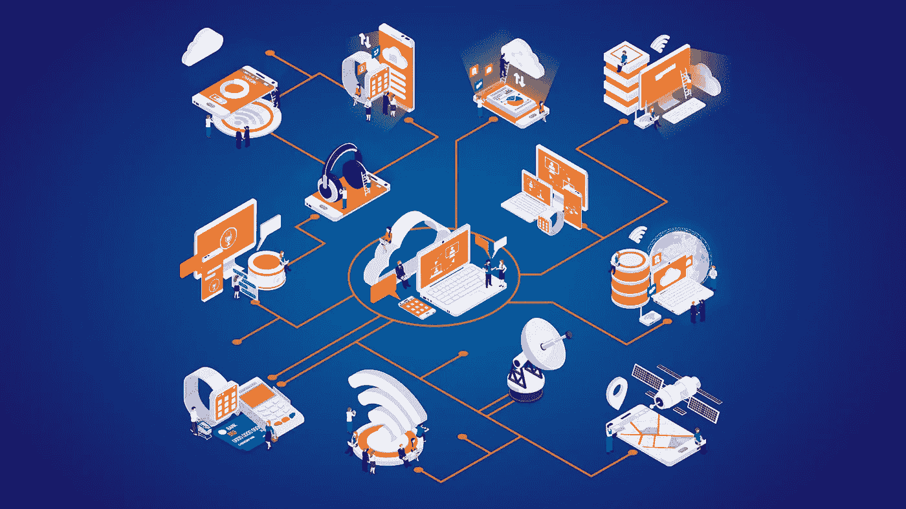
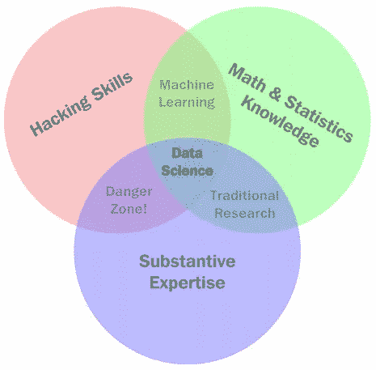
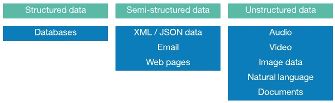
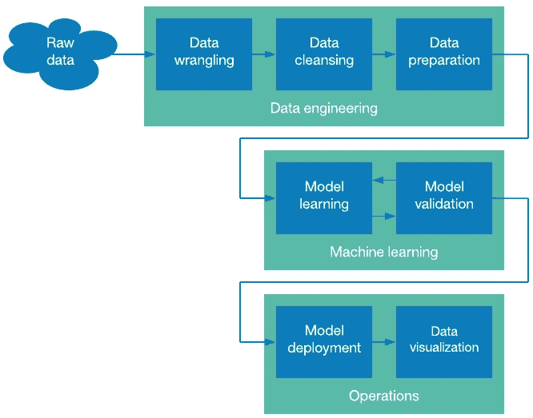

# 什么是数据科学？

> 原文：<https://towardsdatascience.com/what-is-data-science-a-legacy-business-guide-in-big-data-analytics-1d99fb2cb048?source=collection_archive---------50----------------------->

## 大数据分析中的传统业务指南

作者图片

每一秒钟都会产生大量的新数据。这些数据来自跟踪你的移动的智能手机，跟踪你的每一次点击和按键的网络浏览器，甚至是不断捕捉你——消费者——数据的智能冰箱。

这样做是为了让生产你的产品的公司能够更好地了解你的使用情况，并改进他们的服务/产品。这是它的简短版本。

在本指南中，我们将深入了解:

*   数据科学的世界及其构成
*   一些基本的数据科学术语
*   数据科学如何工作
*   数据科学如何转化为大数据分析
*   案例研究:西南航空公司通过大数据分析节省超过 1 亿美元
*   传统企业需要什么来开始数据科学和大数据分析

# 什么是数据科学？

数据科学是通过组织和分析大型数据集来获取有价值的信息(如可操作的见解)的实践。数据科学是一个复杂的领域，涉及行业专家知识以及数学、统计和编程专业知识。

数据科学维恩图

*   **黑客技能:**黑客技能是指计算机编程知识，编写程序，提出复杂算法，并使用计算机语言将那些概念物化为现实的能力。
*   **数学&统计知识:**数学和统计知识让数据科学家能够将他们的问题概念和算法建立在现有原则的基础上，并针对不同的现实场景调整他们的程序。
*   领域专业知识:现实世界的场景几乎总是特定于某个行业或市场，这也是为什么需要领域专业知识的原因。

数据科学将所有这些能力结合在一起，以创建一个全新的信息流，通过自动化数据挖掘过程，使用计算机编程来访问数百千兆字节的数据，使用数学来理解算法和数据模型，使用领域专业知识来透视并使用所得信息。

# 基础数据科学术语:单词的含义

下面是一些重要词汇的定义，它们将帮助你理解前面解释的许多主题。

# 1.结构数据

有组织的数据是指按行和列(分别代表观察值和特征)分类和组织的信息。

# 2.非结构化数据

无组织数据是指原始数据集，包括音频文件、图片、原始/无格式文本等。

作者图片

# 3.人工智能和机器学习

人工智能是大数据分析和数据科学领域的核心元素。由于大数据涉及无法手动处理(收集、清理和分析)的超大型数据集，数据科学家使用人工学习，特别是机器学习来训练机器(如云人工智能)以极高的精度为他们处理数据。

机器学习是人工智能(AI)的一个子领域，它已经独立发展成为一个非常大的领域。简单来说，机器学习是指训练计算机基于模型和算法进行学习和行为的过程。当它发现新信息时，它可以调整自己的行为，并在没有任何人为干预的情况下做出准确的预测。

# 4.数据挖掘技术

数据挖掘是指在计算机的帮助下分析大型数据集，以找到变量之间的关系并获得洞察力。

# 5.大数据

与机器学习类似，大数据是一个复杂的术语，经常被误解和误用。区分大数据和一般数据集的一个简单方法是提出以下问题:

“我的家用电脑或笔记本电脑能自己处理和分析这些信息吗？”

如果答案是“不，它可能会崩溃”，那么该信息可能属于大数据类别。

# 6.商业智能(BI)

商业智能(BI)是指将以业务为中心的指标添加到计算机算法和模型中，以便找到与自己公司相关的见解和数据。

# 工作原理:数据科学的 5 个步骤

现在，您对什么是数据科学有了基本的了解，您可能会认为它只是伪装的数据分析，因为您已经在分析您的数据，所以您参与了数据科学。

这种假设是错误的，也是一种常见的误解。虽然数据分析和数据科学之间有相似之处，但后者的范围要大得多。更重要的是，数据科学遵循非常严格的流程。

那么数据科学到底是什么？数据科学可以定义为这 7 个步骤的**顶点:**数据争论、数据清理、数据准备、模型学习、模型验证、模型部署和数据可视化。

作者图片

**但是，**这不是数据科学的工程师指南，**这是业务主管指南**，所以在这篇文章中，我们将看一些更容易理解的东西——oz denir 的数据科学的 5 个步骤。

在他的书《数据科学原理》中，Sinan Ozdenir 概述了数据科学的五个步骤，以一种易于理解的方式总结了这一过程。

# 1.问一个有趣的问题

作为一名企业主，你学习数据科学的第一步应该是头脑风暴会议，甚至在查看你的数据之前就提出问题。在对数据进行任何操作之前，您想要这样做的主要原因是，这样您就不会限制自己…

通常情况下，数据不是限制，而是分析。然而，许多企业家(甚至是数据分析师)却犯了相反的想法。有趣的问题没有答案，因为公司认为回答这个问题的数据可能不存在，所以他们甚至不去尝试。

不要落入这个陷阱。

# 2.获取数据

第二步当然是获取数据(数据挖掘)。根据您的需求，您可能需要查看私有数据或公共领域的数据—获取数据的过程对两者来说是不同的。您将获得的数据类型也将决定所需的时间和精力。已经打包在数据库中的数据是理想的，但是很有可能，你将不得不自己收集数据。别担心，有很多工具可以用来做这件事。

# 3.探索数据

在收集和清理(组织)数据之后，就可以开始研究了。探索旨在帮助您理解数据、变量之间的关系以及数据集中的各种模式。如果你在做测试或预测，你将在这一步形成你的假设，并用随机数据分析来测试它。

# 4.数据建模

数据建模是一个非常宽泛的术语，涉及数据科学的大多数核心实践，包括创建算法和训练机器学习模型。完成早期分析后，您可以开始对数据进行建模，并且您拥有足够的数据集信息，可以使用统计模型和机器学习模型。

# 5.交流和可视化结果

数据可视化可能看起来是数据科学中最容易的一步，但实际上非常困难，可以说是最关键的一步。在交流和可视化结果时，重要的是要考虑到许多心理、艺术和原则，这些因素会改变决策者对数据的理解方式。

# 数据科学如何转化为大数据分析

大数据分析是数据科学的一个子领域，专注于使用智能计算机软件来处理海量数据，通常是通过云计算。尽管这两个术语的定义非常相似，但普通企业对大数据分析更感兴趣的一个主要原因是:易用性。

要开始研究数据科学，您需要雇佣一个数据科学家团队，简而言之，他们将获取、探索、建模和交流数据。然而，数据科学家非常抢手，因此薪水很高。谷歌云平台建议公司内部数据科学部门有以下角色:

*   数据分析师
*   数据工程师
*   数据科学家
*   统计员
*   应用 ML 工程师
*   伦理学家
*   社会科学家
*   研究员
*   分析经理
*   决策者(技术主管)

因此，企业转而将大数据分析作为 SaaS(服务即软件)。有一些第三方软件，企业可以用它们现有的软件团队来分析数据。为了使集成更加简单，许多公司更喜欢使用他们的云服务提供商进行大数据分析，而不是第三方供应商。例如，谷歌云平台(GCP)具有内置的大数据和机器学习能力，以及数十种支持服务，可以在一个地方管理你的数据。

# 案例研究:西南航空公司通过大数据分析节省超过 1 亿美元

直到 2015 年，西南航空公司还没有一个足够强大和准确的系统来规划其每周数百个定期航班。结果，该公司在燃料和机场费用上损失了数十亿美元，因为其庞大的机队闲置在停机坪上等待清关。

这种等待时间可以通过更好地计划和安排行程来避免。因此，在 2015 年底，西南航空公司成为第一家使用大数据系统解决这一问题的美国国内航空公司。该公司开始使用[通用电气的飞行效率服务(FES)](https://www.ge.com/news/reports/big-data-industrial-internet-can-help-southwest-save-100-million-fuel) 部门，这是一个大数据数据分析系统，能够绘制出数百次航班。

如果没有数据科学和强大的大数据系统，就不可能考虑空气湿度和每条线路的燃料负载等变量，也不可能准确预测如此多的旅行。

# 包扎

总而言之，数据科学是一个非常强大的新兴分析领域，可以帮助企业从大量未使用的数据中发掘有价值的见解。然而，由于数据科学是一个耗时的过程，需要数据科学家，许多公司宁愿坚持基于云的大数据分析软件。

像[谷歌云](https://www.d3vtech.com/google-cloud)这样的公司有一个完整的生态系统，致力于利用数据获得洞察力。使用您自己的云供应商的专用服务是开始使用[大数据分析](https://www.d3vtech.com/services/big-data-analytics)的最快和最简单的方法之一。

*原载于*[*https://www.d3vtech.com*](https://www.d3vtech.com/insights/what-is-data-science-a-legacy-business-guide-in-big-data-analytics)*。*