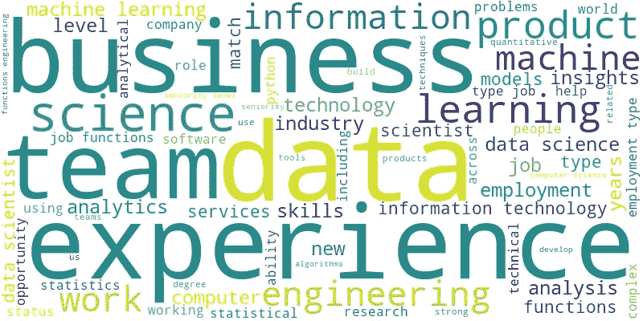
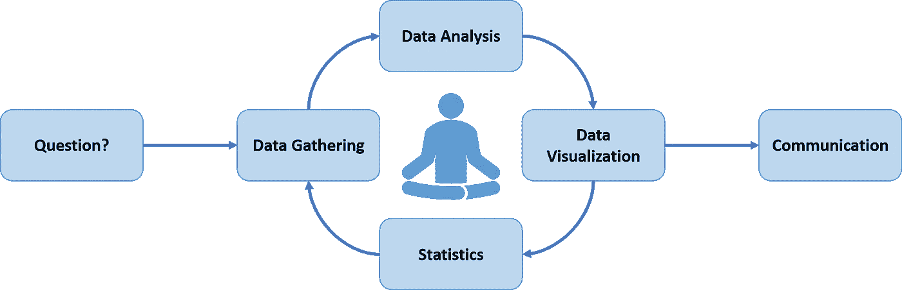
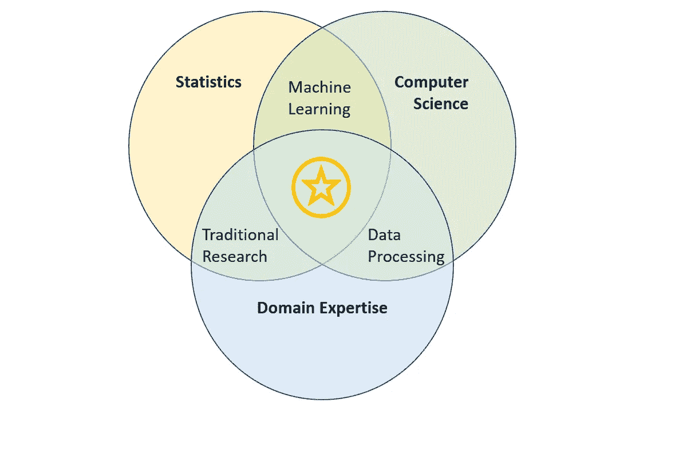

# 什么是数据科学，数据科学家需要知道什么？

> 原文：<https://towardsdatascience.com/what-is-data-science-and-what-does-a-data-scientist-need-to-know-e20ead10aa3a?source=collection_archive---------59----------------------->

## 不，不仅仅是机器学习和人工智能

随着围绕这个话题的所有讨论，许多人都在考虑从事数据科学方面的职业。但是这个领域的基本技能是什么呢？不幸的是，没有一个明显的答案，因为科学家拥有的知识数据分布在多个传统学科中。在本文中，我用我所知道的最好的方法来解决这个问题——使用 ***数据科学*** 。我的目标是讨论对数据科学成功至关重要的**技术**和**非技术技能**。*在我发言的* [*小组讨论会*](https://www.youtube.com/watch?v=b5-V8VCG4A0) *上也分享了这份材料。*

数据科学职位发布描述中突出术语的词云

*我已经把这个分析的代码* [*贴在这里*](https://github.com/kevinclee26/data_science_wordcloud)*——它可以用于任何职位。请分享你的发现！*

## 数据科学工作流程

幸运的是，我知道在哪里可以找到数据——回答这个问题所需的数据可以在公开的招聘信息中找到。通过计算机编程，我从一个热门的求职网站上收集了 1000 多个“数据科学家”的帖子，这个过程通常被称为“网络搜集”。按照数据科学工作流程，接下来的步骤是分析、可视化和交流。结果相当不错。

数据科学工作流程

## 云这个词说明了什么:

*   首先哇！许多公司都在寻找合适的人选
*   它是**产品**、**科学**、**信息技术**、**统计**和**工程**的交集
*   这是一个技术**技能**的角色，需要**计算机科学**、**统计学**、**机器学习**，重要的是**经验**
*   是**团队**的**分析功能**识别关于**业务问题**的**见解**
*   最后，有一种特定的编程语言一直被提及— **Python**

## 数据科学的影响

信息技术的快速发展推动了数据科学的兴起。数据的可用性使企业能够利用新的方法来获得业务洞察力。购买历史、搜索、点击、喜欢、评论、推文以及越来越多的健康数据都通过数据处理管道输入，并产生分析、模型和算法。数据科学家负责将数据转化为可用的信息。他们的分析已经成为各种规模和行业的企业和公司的重要工具。它回答了如下问题:

*   业务拓展的机会在哪里？
*   公司如何提高运营效率？
*   需要解决的潜在风险是什么？

## 数据科学的三大支柱—技术技能

数据科学被认为是一个跨学科领域，它使用一种科学的方法从数据中提取信息。有三大支柱:**统计学**、**计算机科学**、**领域专长**。他们每个人都为帮助数据科学家实现他们的目标做出了巨大贡献。在现实中，从业者在所有支柱方面往往不是同样强大，但在一个或多个方面的优势往往可以弥补其他方面的优势。

*   统计学——与其他科学和研究领域不同，数据科学是一门基于**数学**和**统计学**概念的科学，它建立在拥有**论文**和**实验**的基础上。更高级的分析还需要对**概率**和**分布**的深入了解，这用于分析事件的**相对频率**和**可能性**。此外，像机器学习这样的工具和方法需要熟悉处理向量空间的线性代数和研究变化的微积分
*   计算机科学——计算机编程让数据科学家能够使用各种工具，用于**争论**和**处理**数据。它允许快速执行计算。因为每个问题都是独一无二的，所以数据科学家需要精通软件，以便根据他们的特定需求定制和应用分析解决方案。掌握**循环**、**函数**、 **if-else** ，以及线下**并行计算**逻辑，显著提高完成任务的能力
*   领域专长——你需要对你正在工作的行业有一个扎实的了解，了解用于跟踪 T4 业务表现的 T2 指标，以及公司试图解决的业务问题

三大支柱的核心是数据科学家:

数据科学文氏图

## 所需的非技术技能

*   **创造力**—你的角色是在数据中建立关系和模式的模型，这并不总是显而易见的(重要的永远不会)。数据科学家从不同的角度探索数据，以克服障碍，并发明可视化来讲述简洁的故事
*   **勇气**——和任何科学领域一样，通往答案的道路需要严格的实验来检验结果，然后才能得出结论
*   **求知欲**——随着新工具的出现，你所在的领域发展非常迅速，你需要学习更多知识才能跟上竞争的步伐
*   **沟通** —你需要清晰流畅地将技术发现翻译给团队，即使这些发现是非技术性的，这样他们就可以从数据分析中受益

## 摘要

随着信息技术的不断发展，收集的数据比以往任何时候都多。我相信隐藏在数据海洋中的洞见将会改变并极大地改善人们的生活。我们需要更多的数据科学家来管理和分析数据。在本文中，我们谈到了数据科学家的技能和特征。我希望能鼓励你更深入地了解这条职业道路。

> “跳进来吧，水是热的。”